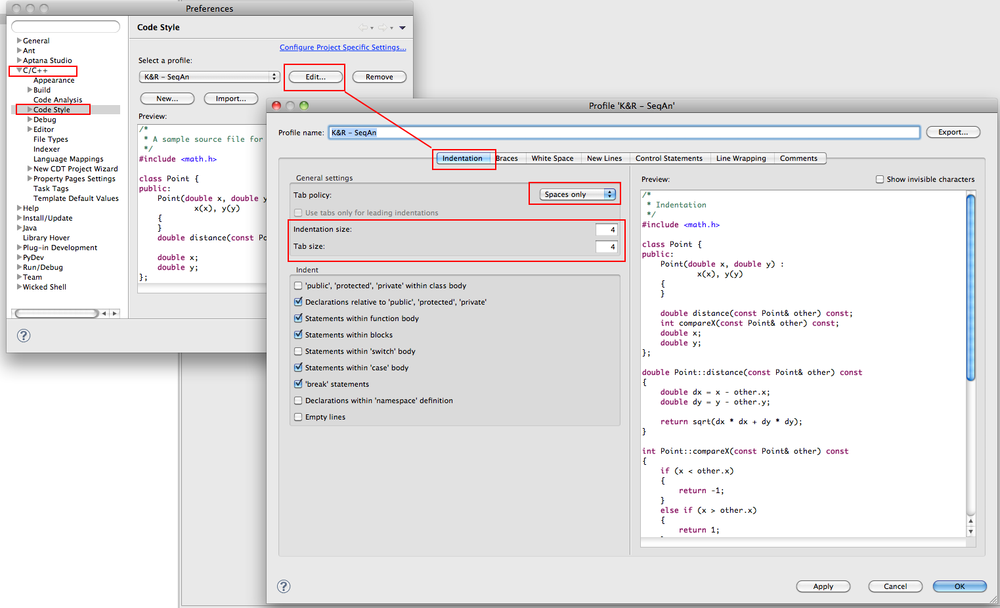
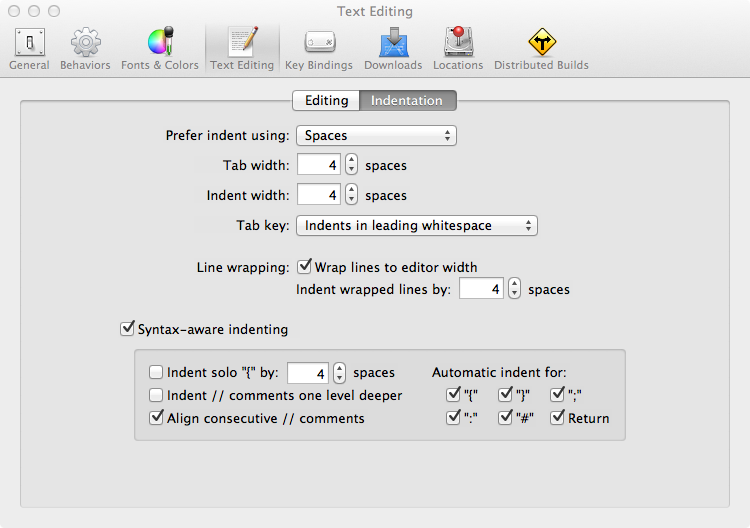

.. sidebar:: ToC

   .. contents::

.. _how-to-setup-your-editor:

Setup Your Editor
-----------------

This page describes how to adjust your editor to the :ref:`SeqAn C++ Style <style-guide-cpp>`.

Eclipse CDT
~~~~~~~~~~~

*  Open preference page of Eclipse:

   *  [Windows/Linux] Menu -> Windows -> Preferences
   *  [Mac OS] Menu -> Eclipse -> Preferences (Cmd-Key + ,)

*  Within the *Preferences* select 'C/C++' and next select 'Code Style'.
*  Note: If you have not prepared your own code style scheme, than select on of the existing built-in schemes and extend it according to the new SeqAn style guides.
*  Push 'Edit' and select the tab 'Indention' in the appeared *Profile* window.
*  Under the group 'Tab policy' select 'Spaces only' in the drop down menu.
*  Set 'Indentation size' to 4.
* Set 'Tab size' to 4.
*  Rename the profile to your preferred name, e.g. *K&R - SeqAn*, if the changes you have made rely on the *K&R [built-in]* profile.
*  Press 'OK'

The new profile appears in the drop down menu and is selected
automatically to be active.

Visual Studio
~~~~~~~~~~~~~

.. figure:: editor_setup_VS_space_indentation.png

*  Open 'Tools' in the Visual Studio Menu and click on 'Options'
*  Click on 'Text Editor', then select 'C/C++' and open the 'Tabs' settings
*  Set both 'Tab size' and 'Indent size' to 4 and make sure 'Insert spaces' is selected below.

XCode
~~~~~

Xcode 3
^^^^^^^

.. figure:: indentation_settings_xcode3.png

*  Open Xcode->Preferences... in the Xcode menu.
*  Open the indentation settings.
*  Choose Indentation in the top scroll panel (scroll right).
*  Choose to insert spaces instead of tabs.
*  Uncheck "Tab key inserts tag, not spaces".
*  Set tab and indent width to 4.

Xcode 4
^^^^^^^

*  Open Xcode->Preferences... in the Xcode menu.
*  Open the indentation settings.
*  Choose Text Editiing in the top panel.
*  Choose to insert spaces instead of tabs.
*  Uncheck "Tab key inserts tag, not spaces".
*  Under "Prefer indent using:" choose "Spaces".
*  Set tab and indent width to 4.

Vim
~~~

Append the following to your ``~/.vimrc``.

::

    set nosmartindent " smartindent (filetype indenting instead)
    \set autoindent    " autoindent (should be overwrote by cindent or filetype indent)
    set cindent       " do c-style indenting
    set softtabstop=4 " unify
    set shiftwidth=4  " unify
    set tabstop=4     " unify
    set copyindent    " but above all -- follow the conventions laid before us
    set expandtab     " we do not want to type tabs

