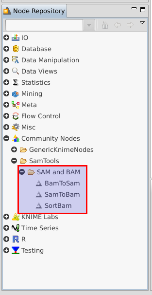
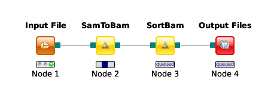

.. sidebar:: ToC

   .. contents::

.. _how-to-generate-knime-nodes-for-external-tools:

.. |br| raw:: html

    

Generating KNIME Nodes for External Tools
-----------------------------------------

Prerequisites
~~~~~~~~~~~~~

| **KNIME SDK**
|   You can download it from the `KNIME Download Site <http://www.knime.org/downloads/overview>`_.
   We will use Version 2.8.
   (We assume that you have installed it to ``$HOME/eclipse_knime_2.8.0``).
| **git**
|   For Downloading the latest samtools and GenericKnimeNodes.
| **Apache Ant**
|   The Generic KNIME Plugins project uses `Apache Ant <http://ant.apache.org/>`_ as the build system.
   On Linux and Mac, you should be able to install it through your package manager.
   For Windows, see the `Apache Ant Downloads <http://ant.apache.org/bindownload.cgi>`_ (note that samtools does not work on Windows so you will not be able to follow through with this tutorial on Windows).

Running Example
~~~~~~~~~~~~~~~

We will adapt some functions from the `samtools <http://samtools.sf.net>`_ package to KNIME:

| **BamToSam**
|   This tool will execute ``samtools view -o ${OUT} ${IN}``.
| **SamToBam**
|   This tool will execute ``samtools view -Sb -o ${OUT} ${IN}``.
| **SortBam**
|   This tool will execute ``samtools sort -f -o ${OUT} ${IN}``.

.. hint::

    The ``-f`` flag is required for the integration of samtools without a  wrapper, since it would append ``.bam`` to ``${OUT}`` for getting the output name.
    However, only the current trunk version from the `samtools GitHub project <https://github.com/samtools/samtools>`_ supports this flag.

Preparation: Building samtools and Downloading GenericKnimeNodes
~~~~~~~~~~~~~~~~~~~~~~~~~~~~~~~~~~~~~~~~~~~~~~~~~~~~~~~~~~~~~~~~

As mentioned above, we have to build the current trunk version of samtools for the sort\_bam tool to work.
The following shell commands download the current samtools trunk from GitHub and build samtools.
We will work in a new directory *knime\_samtools* (we will assume that the directory is directly in your *$HOME* for the rest of the tutorial.

.. code-block:: console

    knime_samtools # git clone https://github.com/samtools/samtools
    ...
    knime_samtools # cd samtools
    samtools # make
    ...
    samtools # ls -l samtools
    -rwxr-xr-x 1 user group 1952339 May  7 16:36 samtools
    samtools # cd ..
    knime_samtools #

Then, we need to download GenericKnimeNodes:

.. code-block:: console

    knime_samtools # git clone git://github.com/genericworkflownodes/GenericKnimeNodes.git

Preparation: Installing KNIME File Handling
~~~~~~~~~~~~~~~~~~~~~~~~~~~~~~~~~~~~~~~~~~~

We need to install support for file handling nodes in KNIME.
For this, open the window for installing Eclipse plugins; in the program's main menu: ``Help > Install New Software...``.

Here, enter ``http://www.knime.org/update/2.8/`` into the ``Work with:`` field, enter ``file`` into the search box, and finally select ``KNIME File Handling Nodes`` in the list.
Then, click ``Next`` and follow through with the installation of the plugin. When done, Eclipse must be restarted.

.. figure:: GwnInstallFileHandlingNodes.png

Overview
~~~~~~~~

KNIME nodes are shipped as Eclipse plugins.
The **GenericKnimeNodes** (GWN) package provides the infrastructure to automatically generate such nodes from the description of their command line.
The description of the command line is kept in XML files called Common Tool Descriptor (CTD) files.
The input of the GWN package is a directory tree with the following structure:

::

    plugin_dir
      │
      ├── plugin.properties
      │
      ├── descriptors (place your ctd files and mime.types here)
      │
      ├── payload (place your binaries here)
      │
      ├── icons (the icons to be used must be here)
      │
      ├── DESCRIPTION (A short description of the project)
      │
      ├── LICENSE (Licensing information of the project)
      │
      └── COPYRIGHT (Copyright information of the project)

| **plugin.properties**
|   File with the plugin configuration.
| **descriptors**
|   Directory with the CTD files and a *mime.types* file.
   This *mime.types* file contains a mapping between MIME types and file extensions.
   There is one CTD file called *${app_name}.ctd*.
| **payload**
|   ZIP archives with the binaries are located here.
   This directory has to be present even if the directory is empty.
   Also, you need a file *binaries.ini* in this directory which can be empty or contain environment variable definitions as *name=value* lines.
| **icons**
|   Some icons:
   A file *category.png* (15x15 px) for categories in the KNIME tool tree.
   A file *splash.png* (50x50 px) with an icon to display in the KNIME splash screen.
   One for each app, called *${app_name}.png*.
| **DESCRIPTION**
|   A text file with your project's description.
| **LICENSE**
|   A file with the license of the project.
| **COPYRIGHT**
|   A file with copyright information for the project.

|br|

The GWN project provides tools to convert such a plugin directory into an Eclipse plugin.
This plugin can then be launched together with KNIME.
The following picture illustrates the process.

.. figure:: PluginWorkflow.png

Obtaining the Demo Workflow Plugin Directory
~~~~~~~~~~~~~~~~~~~~~~~~~~~~~~~~~~~~~~~~~~~~

Please download the file :download:`workflow_plugin_dir.zip <workflow_plugin_dir.zip>` and look around in the archive.
Also have a look into ``binaries_*_*.zip`` files in *payload*.
The structure of this ZIP file is explained below in :ref:`Anatomy of a Plugin Directory <how-to-generate-knime-nodes-for-external-tools-anatomy-of-a-plugin-directory>`.

Creating an Exclipse Plugin from the Plugin Directory
~~~~~~~~~~~~~~~~~~~~~~~~~~~~~~~~~~~~~~~~~~~~~~~~~~~~~

The next step is to use GKN to create an Eclipse plugin from the workflow plugin directory.
For this, change to the directory GenericKnimeNodes that we cloned using git earlier.
We then execute ant and pass the variables *knime.sdk* with the path to the KNIME SDK that you downloaded earlier and *plugin.dir* with the path of our plugin directory.

.. code-block:: console

    knime_samtools # cd GenericKnimeNodes
    GenericKnimeNodes # ant -Dknime.sdk=${HOME}/eclipse_knime_2.8.0 \
                          -Dplugin.dir=$HOME/knime_samtools/workflow_plugin_dir

This generates an Eclipse plugin with wrapper classes for our nodes.
The generated files are within the *generated\_plugin* directory of the directory *GenericKnimeNodes*.

Importing the Generated Projects into Eclipse
~~~~~~~~~~~~~~~~~~~~~~~~~~~~~~~~~~~~~~~~~~~~~

In the main menu ``File > Import...``. In the ``Import`` window, select ``General > Existing Project Into Workspace``

.. figure:: GwnImport1.png

In the next dialog, click ``Browse...`` next to ``Select root directory``.

.. figure:: GwnImport2.png

Then, select the directory of your "GenericWorkflowNodes" checkout.
The final dialog should then look as follows.

Clicking finish will import (1) the GKN classes themselves and (2) your generated plugin's classes.

.. figure:: GwnImport3.png

Now, the packages of the GKN classes and your plugin show up in the left ``Package Explorer`` pane of Eclipse.

.. figure:: GwnImportDone.png

.. hint::

    **Information:** Synchronizing ``ant`` build result with Eclipse.

    Since the code generation happens outside of Eclipse, there are often problems caused by Eclipse not recognizing updates in generated *.java* files.
    After each call to ``ant``, you should clean all built files in all projects by selecting the menu entries ``Project > Clean...``, selecting ``Clean all projects``, and then clicking ``OK``.

    Then, select all projects in the ``Package Explorer``, right-click and select ``Refresh``.

Launching Eclipse with our Nodes
~~~~~~~~~~~~~~~~~~~~~~~~~~~~~~~~

Finally, we have to launch KNIME with our plugin. We have to create a run configuration for this. Select ``Run > Run Configurations...``.

In the ``Run Configurations`` window, select ``Eclipse Application`` on the left, then create the small ``New launch configuration`` icon on the top left (both marked in the following screenshot).
Now, set the ``Name`` field to "KNIME", select ``Run an application`` and select ``org.knime.product.KNIME_APPLICATION`` in the drop down menu.
Finally, click ``Run``.

.. figure:: GwnRunConfiguration.png

Your tool will show up in the tool selector in ``community/SAM and BAM``.

Here is an example KNIME workflow with the nodes that we just created.

.. _how-to-generate-knime-nodes-for-external-tools-anatomy-of-a-plugin-directory:

Anatomy of a Plugin Directory
~~~~~~~~~~~~~~~~~~~~~~~~~~~~~

You can download a ZIP archive of the resulting project :download:`from the attached file workflow\_plugin\_dir.zip <workflow_plugin_dir.zip>`.
We will ignore the contents of *icons*, *DESCRIPTION*, *LICENSE*, and *COPYRIGHT* here.
You can see all relevant details by inspecting the ZIP archive.

The file plugin.properties
^^^^^^^^^^^^^^^^^^^^^^^^^^

The content of the file plugin.properties is as follows:

::

    # the package of the plugin
    pluginPackage=net.sf.samtools

    # the name of the plugin
    pluginName=SamTools

    # the version of the plugin
    pluginVersion=0.1.17

    # the path (starting from KNIMEs Community Nodes node)
    nodeRepositoyRoot=community

    executor=com.genericworkflownodes.knime.execution.impl.LocalToolExecutor
    commandGenerator=com.genericworkflownodes.knime.execution.impl.CLICommandGenerator

When creating your own plugin directory, you only have to update the
first three properties:

| **pluginPackage**
|   A Java package path to use for the Eclipse package.
| **pluginName**
|   A CamelCase name of the plugin.
| **pluginVersion**
|   Version of the Eclipse plugin.

|br|

The file descriptors/mime.types
^^^^^^^^^^^^^^^^^^^^^^^^^^^^^^^

The contents of the file is as shown below.
Each line contains the definition of a `MIME type <http://en.wikipedia.org/wiki/Internet_media_type>`_.
The name of the mime type is followed (separated by a space) by the file extensions associated with the file type.
There may be no ambiguous mappings, i.e. giving the extension for both *application/x-fasta* and *application/x-fastq*.

::

    application/x-fasta fa fasta
    application/x-fastq fq fastq
    application/x-sam sam
    application/x-bam bam

The file descriptors/samtools\_sort\_bam.ctd
^^^^^^^^^^^^^^^^^^^^^^^^^^^^^^^^^^^^^^^^^^^^

This file descripes the SortBam tool for sorting BAM files.
We do not describe the files *descriptors/samtools\_sam\_to\_bam.ctd* and *descriptors/samtools\_bam\_to\_sam.ctd* in the same detail as you can interpolate from here.

.. code-block:: xml

    <?xml version="1.0" encoding="UTF-8"?>
    <tool name="SortBam" version="0.1.17" category="SAM and BAM"
          docurl="http://samtools.sourceforge.net/samtools.shtml">
        <executableName>samtools</executableName>
        <description><![CDATA[SAMtools BAM Sorting.]]></description>
        <manual><![CDATA[samtools sort]]></manual>
        <docurl>Direct links in docs</docurl>
        <cli>
            <clielement optionIdentifier="sort" isList="false" />
            <clielement optionIdentifier="-f" isList="false" />

            <!-- Following clielements are arguments. You should consider
                 providing a help text to ease understanding. -->
            <clielement optionIdentifier="" isList="false">
                <mapping referenceName="bam_to_sam.argument-0" />
            </clielement>
            <clielement optionIdentifier="" isList="false">
                <mapping referenceName="bam_to_sam.argument-1" />
            </clielement>

            <clielement optionIdentifier="" isList="false">
                <mapping referenceName="bam_to_sam.argument-2" />
            </clielement>
        </cli>
        <PARAMETERS version="1.4"
                    xsi:noNamespaceSchemaLocation="http://open-ms.sourceforge.net/schemas/Param_1_4.xsd"
                    xmlns:xsi="http://www.w3.org/2001/XMLSchema-instance">
            <NODE name="bam_to_sam" description="SAMtools BAM to SAM conversion">
                <ITEM name="argument-0" value="" type="input-file" required="true"
                      description="Input BAM file." supported_formats="*.bam" />
                <ITEM name="argument-1" value="" type="output-file" required="true"
                      description="Output BAM file." supported_formats="*.bam" />
                <ITEM name="argument-2" value="" type="string" required="true"
                      description="Sort by query name (-n) instead of position (default)" restrictions=",-n" />
            </NODE>
        </PARAMETERS>
    </tool>

Here is a description of the tags and the attributes:

| **/tool**
|    The root tag.
| **/tool@name**
|    The CamelCase name of the tool as shown in KNIME and part of the class name.
| **/tool@version**
|    The version of the tool.
| **/toll@category**
|    The path to the tool's category.
| **/tool/executableName**
|    The name of the executable in the payload ZIP's *bin* dir.
| **/tool/description**
|    Description of the tool.
| **/tool/manual**
|    Long description for the tool.
| **/tool/docurl**
|    URL to the tool's documentation.
| **/tool/cli**
|    Container for the ``<clielement>`` tags.
    These tags describe the command line options and arguments of the tool.
    The command line options and arguments can be mapped to parameters which are configurable through the UI.
    The parameters are stored in **tool/PARAMETERS**
| **/tool/cli/clielement**
|    There is one entry for each command line argument and option.
| **/tool/cli/clielement@optionIdentifier**
|    The identifier of the option on the command line.
    For example, for the ``-l`` option of ``ls``, this is ``-l``.
| **/tool/cli/clielement@isList**
|    Whether or not the parameter is a list and multiple values are possible.
    One of ``true`` and ``false``.
| **/tool/cli/clielement/mapping**
|    Provides the mapping between a CLI element and a PARAMETER.
| **/tool/cli/clielement/mapping@referenceName**
|    The path of the parameter.
    The parameters ``<ITEM>`` s in **tool/PARAMETERS** are stored in nested ``<NODE>`` tags and this gives the path to the specific parameter.
| **/tool/PARAMETERS**
|    Container for the ``<NODE>`` and ``<ITEM>`` tags.
    The ``<PARAMETERS>`` tag is in a diferent namespace and provides its own XSI.
| **/tool/PARAMETERS@version**
|    Format version of the ``<PARAMETERS>`` section.
| **/tool/PARAMETERS/.../NODE**
|    A node in the parameter tree.
    You can use such nodes to organize the parameters in a hierarchical fashion.
| **/tool/PARAMETERS/.../NODE@advanced**
|    Boolean that marks an option as advanced.
| **/tool/PARAMETERS/.../NODE@name**
|    Name of the parameter section.
| **/tool/PARAMETERS/.../NODE@description**
|    Documentation of the parameter section.
| **/tool/PARAMETERS/.../ITEM**
|    Description of one command line option or argument.
| **/tool/PARAMETERS/.../ITEM@name**
|    Name of the option.
| **/tool/PARAMETERS/.../ITEM@value**
|    Default value of the option.
    When a default value is given, it is passed to the program, regardless of whether the user touched the default value or not.
| **/tool/PARAMETERS/.../ITEM@type**
|    Type of the parameter.
    Can be one of ``string``, ``int``, ``double``, ``input-file``, ``output-path``, ``input-prefix``, or ``output-prefix``.
    Booleans are encoded as ``string`` with the ``restrictions`` attribute set to ``"true,false"``.
| **/tool/PARAMETERS/.../ITEM@required**
|    Boolean that states whether the parameter is required or not.
| **/tool/PARAMETERS/.../ITEM@description**
|    Documentation for the user.
| **/tool/PARAMETERS/.../ITEM@supported_formats**
|    A list of supported file formats.
    Example: ``"*.bam,*.sam"``.
| **/tool/PARAMETERS/.../ITEM@restrictions**
|    In case of ``int`` or ``double`` types, the restrictions have the form ``min:``, ``:max``, ``min:max`` and give the smallest and/or largest number a value can have.
    In the case of ``string`` types, restrictions gives the list of allowed values, e.g. ``one,two,three``.
    If the type is ``string`` and the restriction field equals ``"true,false"``, then the parameter is a boolean and set in case ``true`` is selected in the GUI.
    A good example for this would be the ``-l`` flag of the ``ls`` program.

|br|

.. hint::

    If a ``<clielement>`` does provides an empty <tt>optionIdentifier</tt> then it is a positional argument without a flag (examples for parameters with flags are ``-n 1``, ``--number 1``).

    If a ``<clielement>`` does not provide a ``<mapping>`` then it is passed regardless of whether has been configured or not.

The ``samtools_sort_bam`` tool from above does not provide any configurable options but only two arguments.
These are by convention called ``argument-0`` and ``argument-1`` but could have any name.

Also, we always call the program with ``view -f`` as the first two command line arguments since we do not provide a mapping for these arguments.

The directory payload
^^^^^^^^^^^^^^^^^^^^^

The directory ``payload`` contains ZIP files with the executable tool binaries.
There is one ZIP file for each platform (Linux, Windows, and Mac Os X) and each architecture (32 bit and 64 bit).
The names of the files are ``binaries_${plat}_${arch}.zip`` where ``${plat}`` is one of ``lnx``, ``win``, or ``mac``, and ``${arch}`` is one of ``32`` and ``64``.

Each ZIP file contains a directory ``/bin`` which is used as the search path for the binary given by ``<executableName>``.
Also, it provides an INI file ``/binaries.ini`` which can be used to define environment variables to set before executing any tools.

The ZIP file can also provide other files in directories such as ``/share``.

Generating KNIME Nodes for SeqAn Apps
~~~~~~~~~~~~~~~~~~~~~~~~~~~~~~~~~~~~~

You can generate a workflow plugin directory for the SeqAn apps using the ``prepare_workflow_plugin`` target.
Then, you can generate the Knime Nodes/Eclipse plugins as described above using ant.

.. code-block:: console

    ~ # svn co http://svn.seqan.de/seqan/trunk seqan-trunk
    ~ # mkdir -p seqan-trunk-build/release
    ~ # seqan-trunk-build/release
    release # cmake ../../seqan-trunk
    release # make prepare_workflow_plugin
    release # cd ~/knime_samtools/GenericKnimeNodes
    GenericKnimeNodes # ant -Dknime.sdk=${HOME}/eclipse_knime_2.8.0 \
                          -Dplugin.dir=$HOME/seqan-trunk-build/release/workflow_plugin_dir

