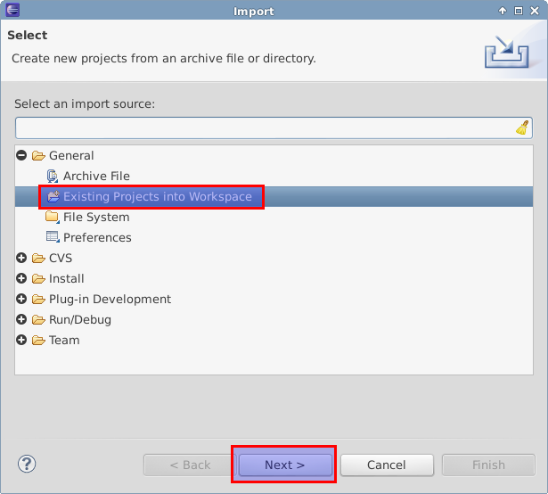
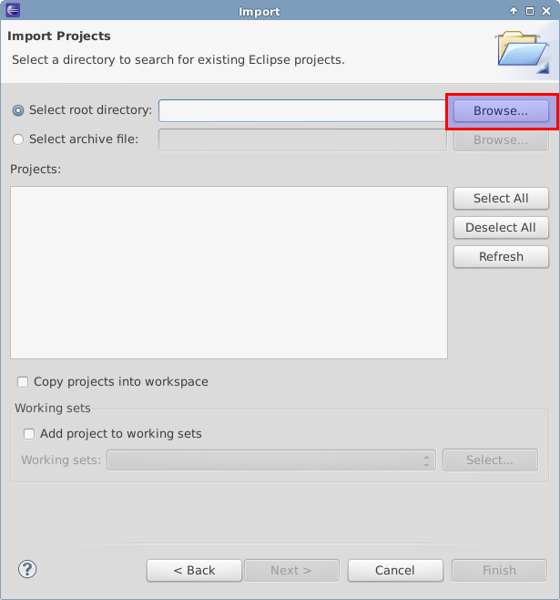

.. sidebar:: ToC

   .. contents::

.. _how-to-generate-seqan-knime-nodes:

Generating SeqAn KNIME Nodes
============================

Learning Objective
  You will learn how to import applications written in SeqAn into the KNIME Eclipse plugin.
  After completing this tutorial, you will be able to use self made applications in KNIME workflows.

Difficulty
  Very basic

Duration
  1 h

Prerequisites
  KNIME SDK
    You can download it from the `KNIME Download Site <http://www.knime.org/downloads/overview>`_ (at the end of the page).
    We will use Version 2.8.
    (We assume that you have installed it to *$HOME/eclipse_knime_2.8.* but it could be anywhere).
  git
    For Downloading the latest GenericKnimeNodes.
  Apache Ant
   The Generic KNIME Plugins project uses `Apache Ant <http://ant.apache.org/>`_ as the build system.
   On Linux and Mac, you should be able to install it through your package manager.
   For Windows, see the `Apache Ant Downloads <http://ant.apache.org/bindownload.cgi>`_.

We will generate a simple SeqAn KNIME node from a SeqAn app that reads a fastq file from disk and just writes it back.
We start by installing the necessary software.
Afterwards, we explain which steps are required in order to prepare a SeqAn app to be used in KNIME, and finally, we show how to import the app into KNIME.
The following section provides some more information on the plugin structure and where the necessary information is stored.
Note that this tutorial is mainly written for MacOS and Linux users, but Windows users should also be able to follow through.

Preparation: Downloading GenericKnimeNodes
-------------------------------------------

We will work in a new directory *knime_node* (we will assume that the directory is directly in your *$HOME* for the rest of the tutorial).

.. code-block:: console

   knime_node # git clone git://github.com/genericworkflownodes/GenericKnimeNodes.git

Preparation: Installing KNIME File Handling
-------------------------------------------

We need to install support for file handling nodes in KNIME.
For this, open the window for installing Eclipse plugins; in the program's main menu: ``Help > Install New Software...``.

Here, enter ``http://www.knime.org/update/2.8/`` into the ``Work with:`` field, enter ``file`` into the search box, and finally select ``KNIME File Handling Nodes`` in the list.
Then, click ``Next`` and follow through with the installation of the plugin.
When done, Eclipse must be restarted.

.. figure:: GwnInstallFileHandlingNodes.png

Generating KNIME Nodes for SeqAn Apps
-------------------------------------

You can generate a workflow plugin directory for the SeqAn apps using the ``prepare_workflow_plugin`` target.

In order for your application to turn into a KNIME node, you have to add the line:

.. code-block:: cmake

    set (SEQAN_CTD_EXECUTABLES ${SEQAN_CTD_EXECUTABLES} <my_app> CACHE INTERNAL "")

to the end of the *CMakeList.txt* file of your application.

The following example will demonstrate the creation of a SeqAn app and its registration as a KNIME node.

.. code-block:: console

   ~ # svn co http://svn.seqan.de/seqan/trunk seqan-trunk
   ~ # cd seqan-trunk
   ~ # ./util/bin/skel.py app knime_node sandbox/my_sandbox

Now open the file *seqan-trunk/sandbox/my_sandbox/apps/knime_node/knime_node.cpp* and replace its content with the one found in *seqan-trunk/core/demos/knime_node.cpp*.
The code implements the reading of a read file and its storage somewhere on the disk.

In order to register the app ``knime_node``, you simply add the line

.. code-block:: cmake

    set (SEQAN_CTD_EXECUTABLES ${SEQAN_CTD_EXECUTABLES} knime_node CACHE INTERNAL "")

to *seqan-trunk/sandbox/my_sandbox/apps/knime_node/CMakeList.txt*.

Then, you can generate the Knime Nodes/Eclipse plugin.
First, change to the directory GenericKnimeNodes that we cloned using git earlier.
We then execute ant and pass the variables ``knime.sdk`` with the path to the KNIME SDK that you downloaded earlier and ``plugin.dir`` with the path of our plugin directory.

.. code-block:: console

   ~ # mkdir -p seqan-trunk-build/release
   ~ # seqan-trunk-build/release
   ~ # cd seqan-trunk-build/release
   release # cmake ../../seqan-trunk
   release # make prepare_workflow_plugin
   release # cd ~/knime_node/GenericKnimeNodes
   GenericKnimeNodes # ant -Dknime.sdk=${HOME}/eclipse_knime_2.8.0 \
                         -Dplugin.dir=${HOME}/seqan-trunk-build/release/workflow_plugin_dir

The generated files are within the *generated_plugin* directory of the directory *GenericKnimeNodes*.

If you ran into problems, you may copy the file :download:`my_sandbox.zip <my_sandbox.zip>`, which contains a fully functional sandbox with the ``knime_node`` app and the adjusted *CMakeList.txt* file.
You still have to call *ant* though.

Importing the Generated Projects into Eclipse
---------------------------------------------

In the main menu, go to ``File > Import...``.
In the ``Import`` window, select ``General > Existing Project Into Workspace``.



In the next dialog, click ``Browse...`` next to ``Select root directory``.



Then, select the directory of your "GenericWorkflowNodes" checkout.
The final dialog should then look as follows.

Clicking finish will import (1) the GKN classes themselves and (2) your generated plugin's classes.

.. figure:: GwnImport3.png

Now, the packages of the GKN classes and your plugin show up in the left ``Package Explorer`` pane of Eclipse.

.. figure:: GwnImportDone.png

.. tip::

    Synchronizing ``ant`` build result with Eclipse.

    Since the code generation happens outside of Eclipse, there are often problems caused by Eclipse not recognizing updates in generated ''.java'' files.
    After each call to ``ant``, you should clean all built files in all projects by selecting the menu entries ``Project > Clean...``, selecting ``Clean all projects``, and then clicking ``OK``.

    Then, select all projects in the ``Package Explorer``, right-click and select ``Refresh``.

.. tip::

    You might get a warning with in one of the KNIME files.
    In order to remove it you need to download the KNIME's test environment, but you can just ignore the error in our case.

Launching Eclipse with our Nodes
--------------------------------

Finally, we have to launch KNIME with our plugin.
We have to create a run configuration for this.
Select ``Run > Run Configurations...``.

In the ``Run Configurations`` window, select ``Eclipse Application`` on the left, then click the small ``New launch configuration`` icon on the top left (both marked in the following screenshot).
Now, set the ``Name`` field to "KNIME", select ``Run an application`` and select ``org.knime.product.KNIME_APPLICATION`` in the drop down menu.
Finally, click ``Run``.

.. figure:: GwnRunConfiguration.png

Your tool will show up in the tool selector in ``Community Nodes``.

.. important::

   Sometimes KNIME complains about the Java version you are using.
   In that case, you can use Java 1.6. as shown in :ref:`how-to-choose-the-jre-version`.

.. important::

   If you are running a MacOS you might need to add *-Xms40m -Xmx512M -XX:MaxPermSize=256m -Xdock:icon=../Resources/Eclipse.icns -XstartOnFirstThread -Dorg.eclipse.swt.internal.carbon.smallFonts -server* to the ``VM argument`` box of your ``Run Configuration``.

You should now be able to use the created node in a KNIME workflow.
The following sections provide additional information about the structure of the plugin and where the crucial information is stored.

Plugin Overview
---------------

KNIME nodes are shipped as Eclipse plugins.
The **GenericKnimeNodes** (GWN) package provides the infrastructure to automatically generate such nodes from the description of their command line.
The description of the command line is kept in XML files called Common Tool Descriptor (CTD) files.
The input of the GWN package is a directory tree with the following structure.

::

    plugin_dir
      │
      ├── plugin.properties
      │
      ├── descriptors (place your ctd files and mime.types here)
      │
      ├── payload (place your binaries here)
      │
      ├── icons (the icons to be used must be here)
      │
      ├── DESCRIPTION (A short description of the project)
      │
      ├── LICENSE (Licensing information of the project)
      │
      └── COPYRIGHT (Copyright information of the project)

plugin.properties
 File with the plugin configuration.

descriptors
 Directory with the CTD files and a ``mime.types`` file.
 This ``mime.types`` file contains a mapping between MIME types and file extensions.
 There is one CTD file called ``${app_name}.ctd``.

payload
 ZIP archives with the binaries are located here.
 This directory has to be present even if the directory is empty.
 Also, you need a file ``binaries.ini`` in this directory which can be empty or contain environment variable definitions as ``name=value`` lines.

icons
 Some icons:
 A file ``category.png`` (15x15 px) for categories in the KNIME tool tree.
 A file ''splash.png' (50x50 px) with an icon to display in the KNIME splash screen.
 One for each app, called ``${app_name}.png``

DESCRIPTION
 A text file with your project's description.

LICENSE
 A file with the license of the project.

COPYRIGHT
 A file with copyright information for the project.

The GWN project provides tools to convert such a plugin directory into an Eclipse plugin.
This plugin can then be launched together with KNIME.
The following picture illustrates the process.

.. figure:: PluginWorkflow.png

Anatomy of a Plugin Directory
-----------------------------

You can download a ZIP archive of the resulting project :download:`from the attached file workflow_plugin_dir.zip <workflow_plugin_dir.zip>`.
We will ignore the contents of ``icons``, ``DESCRIPTION``, ``LICENSE``, and ``COPYRIGHT`` here.
You can see all relevant details by inspecting the ZIP archive.

The file plugin.properties
^^^^^^^^^^^^^^^^^^^^^^^^^^

The content of the file plugin.properties is as follows:

.. code-block:: ini

    # the package of the plugin
    pluginPackage=de.seqan

    # the name of the plugin
    pluginName=SeqAn

    # the version of the plugin
    pluginVersion=1.5.0.201309051220

    # the path (starting from KNIMEs Community Nodes node)
    nodeRepositoyRoot=community

    executor=com.genericworkflownodes.knime.execution.impl.LocalToolExecutor
    commandGenerator=com.genericworkflownodes.knime.execution.impl.CLICommandGenerator

When creating your own plugin directory, you only have to update the first three properties:

pluginPackage
 A Java package path to use for the Eclipse package.

pluginName
 A CamelCase name of the plugin.

pluginVersion
 Version of the Eclipse plugin.

The file descriptors/mime.types
^^^^^^^^^^^^^^^^^^^^^^^^^^^^^^^

The contents of the file is as shown below.
Each line contains the definition of a `MIME type <http://en.wikipedia.org/wiki/Internet_media_type>`_.
The name of the mime type is followed (separated by a space) by the file extensions associated with the file type.
There may be no ambiguous mappings, i.e. giving the extension for both ``application/x-fasta`` and ``application/x-fastq``.

::

    application/x-fasta fa fasta
    application/x-fastq fq fastq
    application/x-sam sam
    application/x-bam bam

The file descriptors/samtools_sort_bam.ctd
^^^^^^^^^^^^^^^^^^^^^^^^^^^^^^^^^^^^^^^^^^^^

This file descripes the SortBam tool for sorting BAM files.
We do not describe the files ``descriptors/samtools_sam_to_bam.ctd`` and ``descriptors/samtools_bam_to_sam.ctd`` in the same detail as you can interpolate from here.

.. code-block:: xml

   <?xml version="1.0" encoding="UTF-8"?>
   <tool name="KnimeNode" version="0.1" docurl="http://www.seqan.de" category="" >
           <executableName>knime_node</executableName>
           <description>This is a very simple KNIME node providing an input and output port.</description>
           <manual>This is a very simple KNIME node providing an input and output port. The code should be modified such that the node does something useful
   </manual>
           <cli>
                   <clielement optionIdentifier="--write-ctd-file-ext" isList="false">
                           <mapping referenceName="knime_node.write-ctd-file-ext" />
                   </clielement>
                   <clielement optionIdentifier="--arg-1-file-ext" isList="false">
                           <mapping referenceName="knime_node.arg-1-file-ext" />
                   </clielement>
                   <clielement optionIdentifier="--outputFile" isList="false">
                           <mapping referenceName="knime_node.outputFile" />
                   </clielement>
                   <clielement optionIdentifier="--outputFile-file-ext" isList="false">
                           <mapping referenceName="knime_node.outputFile-file-ext" />
                   </clielement>
                   <clielement optionIdentifier="--quiet" isList="false">
                           <mapping referenceName="knime_node.quiet" />
                   </clielement>
                   <clielement optionIdentifier="--verbose" isList="false">
                           <mapping referenceName="knime_node.verbose" />
                   </clielement>
                   <clielement optionIdentifier="--very-verbose" isList="false">
                           <mapping referenceName="knime_node.very-verbose" />
                   </clielement>
                   <!-- Following clielements are arguments. You should consider providing a help text to ease understanding. -->
                   <clielement optionIdentifier="" isList="false">
                           <mapping referenceName="knime_node.argument-0" />
                   </clielement>
           </cli>
           <PARAMETERS version="1.6.2" xsi:noNamespaceSchemaLocation="http://open-ms.sourceforge.net/schemas/Param_1_6_2.xsd" xmlns:xsi="http://www.w3.org/2001/XMLSchema-instance">
                   <NODE name="knime_node" description="This is a very simple KNIME node providing an input and output port.">
                           <ITEM name="write-ctd-file-ext" value="" type="string" description="Override file extension for --write-ctd" required="false" advanced="true" tags="file-ext-override,gkn-ignore" />
                           <ITEM name="arg-1-file-ext" value="" type="string" description="Override file extension for argument 1" restrictions="fastq,fq" required="false" advanced="true" tags="file-ext-override" />
                           <ITEM name="outputFile" value="result.fastq" type="output-file" description="Name of the multi-FASTA output." supported_formats="*.fastq,*.fq" required="false" advanced="false" />
                           <ITEM name="outputFile-file-ext" value="" type="string" description="Override file extension for --outputFile" restrictions="fastq,fq" required="false" advanced="true" tags="file-ext-override,gkn-ignore" />
                           <ITEM name="quiet" value="false" type="string" description="Set verbosity to a minimum." restrictions="true,false" required="false" advanced="false" />
                           <ITEM name="verbose" value="false" type="string" description="Enable verbose output." restrictions="true,false" required="false" advanced="false" />
                           <ITEM name="very-verbose" value="false" type="string" description="Enable very verbose output." restrictions="true,false" required="false" advanced="false" />
                           <ITEM name="argument-0" value="" type="input-file" description="" supported_formats="*.fastq,*.fq" required="true" advanced="false" />
                   </NODE>
           </PARAMETERS>
   </tool>

Here is a description of the tags and the attributes:

``/tool``
  The root tag.
``/tool@name``
  The CamelCase name of the tool as shown in KNIME and part of the class name.
``/tool@version``
  The version of the tool.
/toll@category``
  The path to the tool's category.
``/tool/executableName``
  The name of the executable in the payload ZIP's ``bin`` dir.
``/tool/description``
  Description of the tool.
``/tool/manual``
  Long description for the tool.
``/tool/docurl``
  URL to the tool's documentation.
``/tool/cli``
  Container for the ``<clielement>`` tags.
  These tags describe the command line options and arguments of the tool.
  The command line options and arguments can be mapped to parameters which are configurable through the UI.
  The parameters are stored in ``/tool/PARAMETERS``
``/tool/cli/clielement``
  There is one entry for each command line argument and option.
``/tool/cli/clielement@optionIdentifier``
  The identifier of the option on the command line.
  For example, for the ``-l``` option of ``ls``, this is ``-l``.
``/tool/cli/clielement@isList``
  Whether or not the parameter is a list and multiple values are possible.
  One of ``true`` and ``false``.
``/tool/cli/clielement/mapping``
  Provides the mapping between a CLI element and a PARAMETER.
``/tool/cli/clielement/mapping@referenceName``
  The path of the parameter.
  The parameters ``<ITEM>``\ s in ``/tool/PARAMETERS`` are stored in nested ``<NODE>`` tags and this gives the path to the specific parameter.
``/tool/PARAMETERS``
  Container for the ``<NODE>`` and ``<ITEM>`` tags.
  The ``<PARAMETERS>`` tag is in a diferent namespace and provides its own XSI.
``/tool/PARAMETERS@version``
  Format version of the ``<PARAMETERS>`` section.
``/tool/PARAMETERS/.../NODE``
  A node in the parameter tree.
  You can use such nodes to organize the parameters in a hierarchical fashion.
``/tool/PARAMETERS/.../NODE@advanced``
  Boolean that marks an option as advanced.
``/tool/PARAMETERS/.../NODE@name``
  Name of the parameter section.
``/tool/PARAMETERS/.../NODE@description``
  Documentation of the parameter section.
``/tool/PARAMETERS/.../ITEM``
  Description of one command line option or argument.
``/tool/PARAMETERS/.../ITEM@name``
  Name of the option.
``/tool/PARAMETERS/.../ITEM@value``
  Default value of the option.
  When a default value is given, it is passed to the program, regardless of whether the user touched the default value or not.
``/tool/PARAMETERS/.../ITEM@type``
  Type of the parameter.
  Can be one of ``string``, ``int``, ``double``, ``input-file``, ``output-path``, ``input-prefix``, or ``output-prefix``.
  Booleans are encoded as ``string`` with the ``restrictions`` attribute set to ``"true,false"``.
``/tool/PARAMETERS/.../ITEM@required``
  Boolean that states whether the parameter is required or not.
``/tool/PARAMETERS/.../ITEM@description``
  Documentation for the user.
``/tool/PARAMETERS/.../ITEM@supported_formats``
  A list of supported file formats.
  Example: ``"*.bam,*.sam"``.
``/tool/PARAMETERS/.../ITEM@restrictions``
  In case of ``int`` or ``double`` types, the restrictions have the form ``min:``, ``:max``, ``min:max`` and give the smallest and/or largest number a value can have.
  In the case of ``string`` types, restrictions gives the list of allowed values, e.g. ``one,two,three``.
  If the type is ``string`` and the restriction field equals ``"true,false"``, then the parameter is a boolean and set in case ``true`` is selected in the GUI.
  A good example for this would be the ``-l`` flag of the ``ls`` program.

.. tip::

    If a ``<clielement>`` does provides an empty ``optionIdentifier`` then it is a positional argument without a flag (examples for parameters with flags are ``-n 1``, ``--number 1``).

    If a ``<clielement>`` does not provide a ``<mapping>`` then it is passed regardless of whether has been configured or not.

The ``samtools_sort_bam`` tool from above does not provide any configurable options but only two arguments.
These are by convention called ``argument-0`` and ``argument-1`` but could have any name.

Also, we always call the program with ``view -f`` as the first two command line arguments since we do not provide a mapping for these arguments.

The directory payload
^^^^^^^^^^^^^^^^^^^^^

The directory ``payload`` contains ZIP files with the executable tool binaries.
There is one ZIP file for each platform (Linux, Windows, and Mac Os X) and each architecture (32 bit and 64 bit).
The names of the files are ``binaries_${plat}_${arch}.zip`` where ``${plat}`` is one of ``lnx``, ``win``, or ``mac``, and ``${arch}`` is one of ``32`` and ``64``.

Each ZIP file contains a directory ``/bin`` which is used as the search path for the binary given by ``<executableName>``.
Also, it provides an INI file ``/binaries.ini`` which can be used to define environment variables to set before executing any tools.

The ZIP file can also provide other files in directories such as ``/share``.
