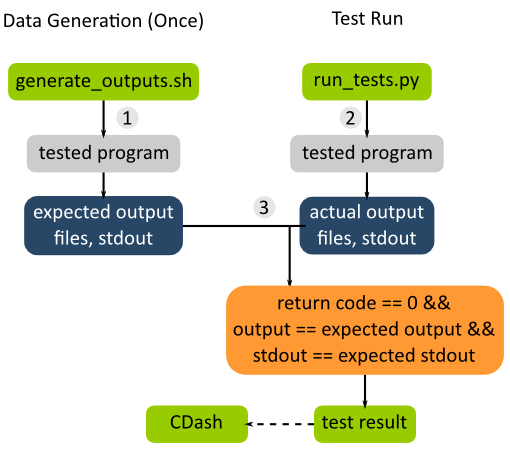

.. sidebar:: ToC

    .. contents::

.. _infra-manage-write-app-tests:

Writing App Tests
=================

This HowTo describes the basics of writing your own app tests.

.. caution::

    SeqAn does not accept new apps into the repository so this document is less relevant for the future.

Overview
--------

SeqAn application tests allow the simple testing of apps: the application is run several times, each with a different set of parameters and/or input files.
The output to STDOUT and STDERR is captured.
The captured output and all files written by the application are then compared against "gold standard" output files that were previously generated.

The general data flow for app tests is as follows (a simple working example are the app tests for the app **pair_align**).

There are two major steps involved: (A) Test data generation and (B) actually running the tests.

Test Data Generation
^^^^^^^^^^^^^^^^^^^^

This is done once when preparing the test.

The program is run with different parameters (in the case of pair_align with different algorithms, scores, alphabets etc) and input files (for pair_align, e.g. for proteins and DNA sequences). The output files and the output to stdout (logs) are collected. The output and logs are then stored as files in the SVN repository and serve as the reference for future comparisons.

The expected output files are mostly generated by running a "sane" version of the program and then being checked for problems.
Since there are a lot, they are usually generated by shell files, the *generate_outputs.sh* files.
These files also serve as documentation which settings were used for which output files.
Generally, they mirror the structure of the app test Python script (described below).

To reiterate, the shell script is usually only executed once when the tests are created.
The output needs to be regenerated only when the program output changes and this change is **deliberate**.
They are *not* regenerated on each test run.

Note that the path to the binary that is used to generate the output should be stored in a shell variable at the top of the file.
This allows for easily changing this.
These shell scripts should also be well-documented.
See the *generate_outputs.sh* file of pair_align or tree_recon for simple and mostly clean examples.

Running Tests
^^^^^^^^^^^^^

The app tests are then run in the nightly CMake builds and their results are submitted to CDash.
There are two steps involved here: (1) Executing the programs and (2) comparing their result with the expected ones.
There is a Python test driver program (called *run_tests.py* by convention) for each collection of app tests.

These programs us the Python module *seqan.app_tests* for running and usually mirror the corresponding *generate_outputs.sh* file.

Creating App Tests
------------------

We will create app tests for a small app that converts its argument to upper case and prints it to stdout.

Setup App "upcase"
^^^^^^^^^^^^^^^^^^

First, create the app using *skel.py*.

.. code-block:: console

   $ ./util/bin/skel.py app upcase .

Then, edit *upcase.cpp* to look as follows:

.. code-block:: cpp

   #include <iostream>
   #include <cstring>

   using namespace seqan;

   int main(int argc, char const ** argv)
   {
       if (argc <= 1)
       {
           std::cerr << "No arguments given!" << std::endl;
           return 1;
       }

       for (int i = 1; i < argc; ++i)
       {
           for (char const * ptr = &argv[i][0]; *ptr != '\0'; ++ptr)
               std::cout << static_cast<char>(toupper(*ptr));
           std::cout << std::endl;
       }

       return 0;
   }

Then, go to your build directory (here: *build/Debug*), build the app, and make sure it works correctly.

.. code-block:: console

   $ cd build/Debug
   $ cmake .
   $ cd apps/upcase
   $ make
   $ ./upcase This is a test
   THIS
   IS
   A
   TEST

Creating App Tests
^^^^^^^^^^^^^^^^^^

You can use the *skel.py* program to create the app tests.

.. code-block:: console

   $ cd ../../../../../..
   $ ./util/bin/skel.py app_tests apps/upcase/

As suggested by the output of *skel.py*, add the following to your *apps/upcase/CMakeLists.txt*:

.. code-block:: cmake

   # Add app tests if Python interpreter could be found.
   if(PYTHONINTERP_FOUND)
     add_test(NAME app_test_upcase COMMAND ${PYTHON_EXECUTABLE}
       ${CMAKE_CURRENT_SOURCE_DIR}/tests/run_tests.py ${CMAKE_SOURCE_DIR}
       ${CMAKE_BINARY_DIR})
   endif(PYTHONINTERP_FOUND)

Now, open the file *apps/upcase/tests/generate_outputs.sh* and modify it as follows.

.. code-block:: bash

   #!/bin/sh
   #
   # Output generation script for upcase

   UPCASE=../../../../../build/Debug/apps/upcase/upcase

   # ============================================================
   # Generate Output
   # ============================================================

   ${UPCASE} simple example > simple.stdout
   ${UPCASE} 'another()/' 'examplE!' > other.stdout

We now run the program two times with different arguments and stored the output in files *simple.stdout* and *other.stdout*.
These files are kept in the directory *apps/upcase/tests* and can now go into version control.

.. code-block:: console

   $ cd apps/upcase/tests
   $ ./generate_outputs.sh
   $ head -1000 simple.stdout other.stdout
   ===> simple.stdout <===
   SIMPLE
   EXAMPLE

   ===> other.stdout <===
   ANOTHER()/
   EXAMPLE!

Now, we have the expected test output files.
We now have to modify the test driver script *run_tests.py*.
Open the file *apps/upcase/tests/run_tests.py*.
This file is a Python script that runs the programs, collects their output and compares the expected output prepared above with the actual one.
It should look like the following:

.. code-block:: python

   #!/usr/bin/env python2
   """Execute the tests for upcase.

   The golden test outputs are generated by the script generate_outputs.sh.

   You have to give the root paths to the source and the binaries as arguments to
   the program.  These are the paths to the directory that contains the 'projects'
   directory.

   Usage:  run_tests.py SOURCE_ROOT_PATH BINARY_ROOT_PATH
   """
   import logging
   import os.path
   import sys

   # Automagically add util/py_lib to PYTHONPATH environment variable.
   path = os.path.abspath(os.path.join(os.path.dirname(<u>file</u>), '..', '..',
                                       '..', '..', 'util', 'py_lib'))
   sys.path.insert(0, path)

   import seqan.app_tests as app_tests

   def main(source_base, binary_base):
       """Main entry point of the script."""

       print 'Executing test for upcase'
       print '========================='
       print

       ph = app_tests.TestPathHelper(
           source_base, binary_base,
           'apps/upcase/tests')  # tests dir

       # ============================================================
       # Auto-detect the binary path.
       # ============================================================

       path_to_program = app_tests.autolocateBinary(
         binary_base, 'apps/upcase', 'upcase')

       # ============================================================
       # Built TestConf list.
       # ============================================================

       # Build list with TestConf objects, analogously to how the output
       # was generated in generate_outputs.sh.
       conf_list = []

       # ============================================================
       # First Section.
       # ============================================================

       # App TestConf objects to conf_list, just like this for each
       # test you want to run.
       conf = app_tests.TestConf(
           program=path_to_program,
           redir_stdout=ph.outFile('STDOUT_FILE'),
           args=['ARGS', 'MUST', 'BE', 'STRINGS', str(1), str(99),
                 ph.inFile('INPUT_FILE1'),
                 ph.inFile('INPUT_FILE2')],
           to_diff=[(ph.inFile('STDOUT_FILE'),
                     ph.outFile('STDOUT_FILE')),
                    (ph.inFile('INPUT_FILE1'),
                     ph.outFile('INPUT_FILE1'))])
       conf_list.append(conf)

       # ============================================================
       # Execute the tests.
       # ============================================================
       failures = 0
       for conf in conf_list:
           res = app_tests.runTest(conf)
           # Output to the user.
           print ' '.join(['upcase'] + conf.args),
           if res:
                print 'OK'
           else:
               failures += 1
               print 'FAILED'

       print '=============================='
       print '     total tests: %d' % len(conf_list)
       print '    failed tests: %d' % failures
       print 'successful tests: %d' % (len(conf_list) - failures)
       print '=============================='

       # Compute and return return code.
       return failures != 0

   if <u>name</u> == '<u>main</u>':
       sys.exit(app_tests.main(main))

Here, we now mirror the *generate_outputs.sh* file by replacing the
section *First Section* with the following:

.. code-block:: python

   # ============================================================
   # Run Program upcase.
   # ============================================================

   # Simple Example.
   conf = app_tests.TestConf(
       program=path_to_program,
       redir_stdout=ph.outFile('simple.stdout'),
       args=['simple', 'example'],
       to_diff=[(ph.inFile('simple.stdout'),
                 ph.outFile('simple.stdout'))])
   conf_list.append(conf)

   # Another Example.
   conf = app_tests.TestConf(
       program=path_to_program,
       redir_stdout=ph.outFile('other.stdout'),
       args=['another()/', 'examplE!'],
       to_diff=[(ph.inFile('other.stdout'),
                 ph.outFile('other.stdout'))])
   conf_list.append(conf)

Finally, we can run the program using ctest.

.. code-block:: console

   $ cd ../../../../..
   $ cd build/Debug/apps/upcase
   $ ctest .

If everything goes well, the output will be as follows:

.. code-block:: console

   $ ctest .
   Test project ${PATH_TO_CHECKOUT}/build/Debug/apps/upcase
       Start 1: app_test_upcase
   1/1 Test #1: app_test_upcase ..................   Passed    0.04 sec

   100% tests passed, 0 tests failed out of 1

   Total Test time (real) =   0.05 sec

In the case of failures, the output could be as follows.

.. code-block:: console

   $ ctest .
   Test project /home/holtgrew/Development/seqan-trunk/build/Debug/apps/upcase
       Start 1: app_test_upcase
   1/1 Test #1: app_test_upcase ..................***Failed    0.02 sec

   0% tests passed, 1 tests failed out of 1

   Total Test time (real) =   0.03 sec

   The following tests FAILED:
         1 - app_test_upcase (Failed)
   Errors while running CTest

The ``ctest`` command has many options.
A useful one for debugging is ``--output-on-failure`` which will print the test result if the test does not succeed.
For example, the output could be as follows:

.. code-block:: console

   $ ctest . --output-on-failure
   Test project /home/holtgrew/Development/seqan-src/build/Debug/apps/upcase
       Start 1: app_test_upcase
   1/1 Test #1: app_test_upcase ..................***Failed    0.02 sec
   Traceback (most recent call last):
     File "/home/holtgrew/Development/seqan-trunk/apps/upcase/tests/run_tests.py", line 16, in <module>
       import seqan.app_tests as app_tests
   ImportError: No module named seqan.app_tests

   0% tests passed, 1 tests failed out of 1

   Total Test time (real) =   0.03 sec

   The following tests FAILED:
         1 - app_test_upcase (Failed)
   Errors while running CTest

This is a common error that tells us that we have to appropriately set the environment variable *PYTHONPATH* so the module *seqan.app_tests* is available from within Python.

You have to add ``util/py_lib`` to your PYTHONPATH.
On Linux/Mac Os X, you can do this as follows (on Windows you have to set the environment variable, e.g. following `this guide <http://vlaurie.com/computers2/Articles/environment.htm>`_).

.. code-block:: console

   $ export PYTHONPATH=${PYTHONPATH}:PATH_TO_SEQAN/util/py_lib

Now, you test should run through:

.. code-block:: console

   $ ctest . --output-on-failure
   ...

