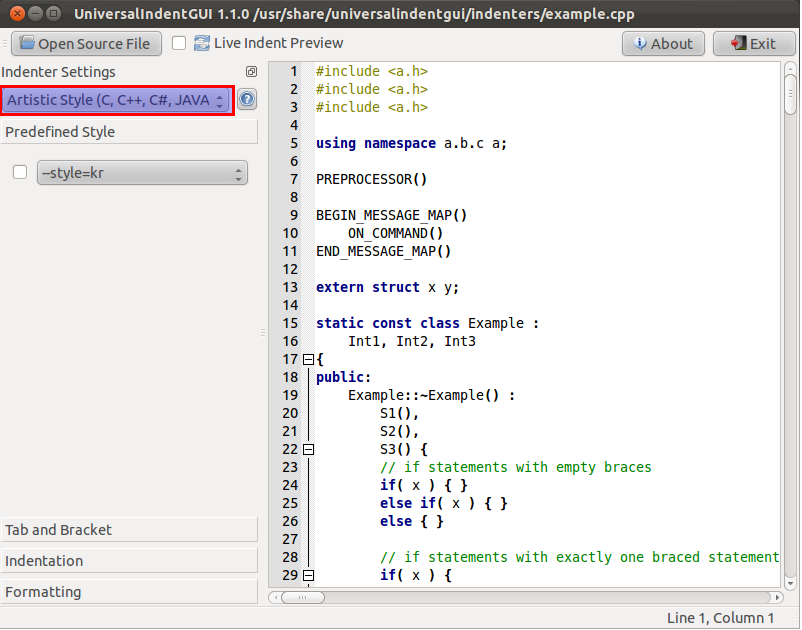
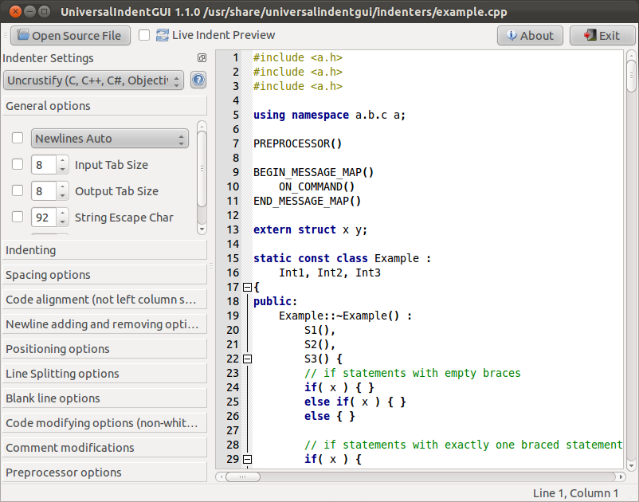
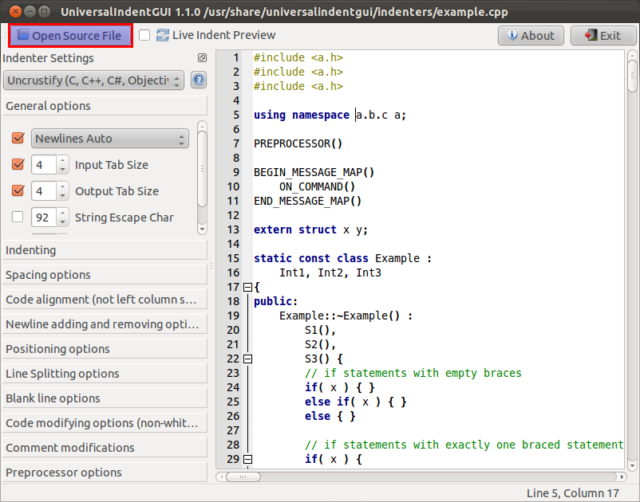
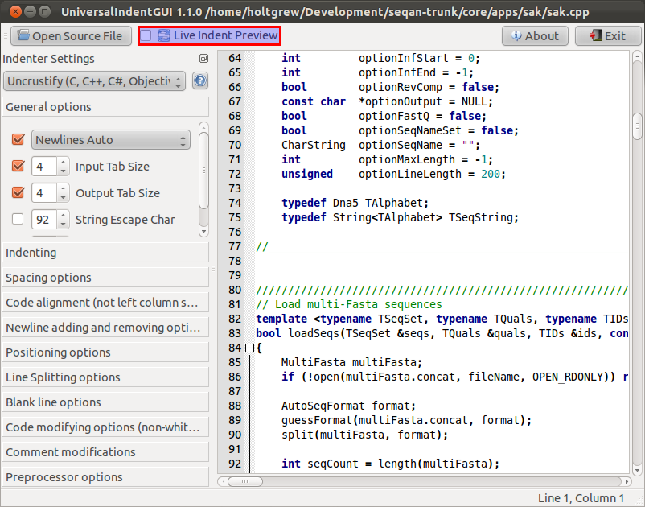
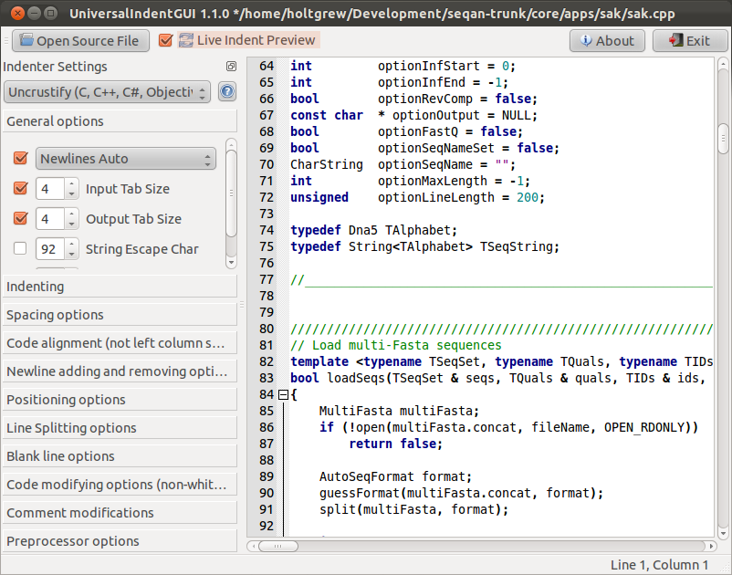

.. sidebar:: ToC

    .. contents::

.. _infra-misc-fix-whitespace-automatically:

Fixing Whitespace Automatically
===============================

This page describes how to use `Universal Indent GUI <http://universalindent.sourceforge.net/>`_ and `Uncrustify <http://uncrustify.sourceforge.net/>`_ to automatically fix whitespace such that code resembles the :ref:`infra-contribute-style-cpp` more closely.

* Uncrustify is a command line program that is given a style definition and a source file and reformats the source file according to the configuration.
* Universal Indent GUI is a graphical front-end to Uncrustify with life preview that allows to manipulate the configuration and immediately see the results.

Installing Universal Indent GUI
-------------------------------

This one is pretty easy. On Ubuntu and other Linux systems, you can use the package management system to install the GUI and the reformatting programs.
The `Universal Indent GUI download page <http://sourceforge.net/projects/universalindent/files/uigui/>`_ has binaries for Mac Os X and Windows.

Preview with Universal Indent GUI
---------------------------------

When started, the program will present you with a window like the following.

First, we set the indenter to Uncrustify.

Then, we load SeqAn's *uncrustify.cfg* which is located in *${CHECKOUT}/misc*. We can do so by selecting `Indenter > Load Indenter Config File` in the program menu.

Then, we load a file from the SeqAn repository, for example *apps/sak/sak.cpp*.

Now, we can toy around with the reformatter by checking `Live Indent Preview`.

The settings on the left panel allow us to tweak the style to our liking.
Any changes can be stored by selecting `Indenter > Load Indenter Config File` in the program menu.
The source can also be stored, using `File > Save Source File` and `File > Save Source File As...`.

Using The Command Line
----------------------

Uncrustify can also be used via the command line.
This is best done after a rough visual verification that the uncrustify.cfg yields works for your sources using the Universal Indenter UI.

Work on a single file:

.. code-block:: console

    # uncrustify -c ${CHECKOUT}/misc/uncrustify.cfg --replace -f path/to/file.cpp

Batch work:

.. code-block:: console

   # find path/to -name '*.cpp' > list.txt
   # uncrustify -c ${CHECKOUT}/misc/uncrustify.cfg --replace -F list.txt

Automatically fix whitespaces in Xcode
--------------------------------------

Uncrustify can also be used directly from Xcode.
With Xcode 4 Apple introduced so called "Behaviors" that can be executed using for instance keyboard shortcuts.
To use Uncrustify you can add a new behavior in the Xcode Preferences (tab Behaviors) and select "*Run*".
Here you add the attached ruby script.

.. figure:: Xcode - Behavior.png

.. note::
   The script does **not** uncrustify the currently opened source file but all source files that were changed in your current branch.
   Xcode does not provide the information which source file is currently opened.
