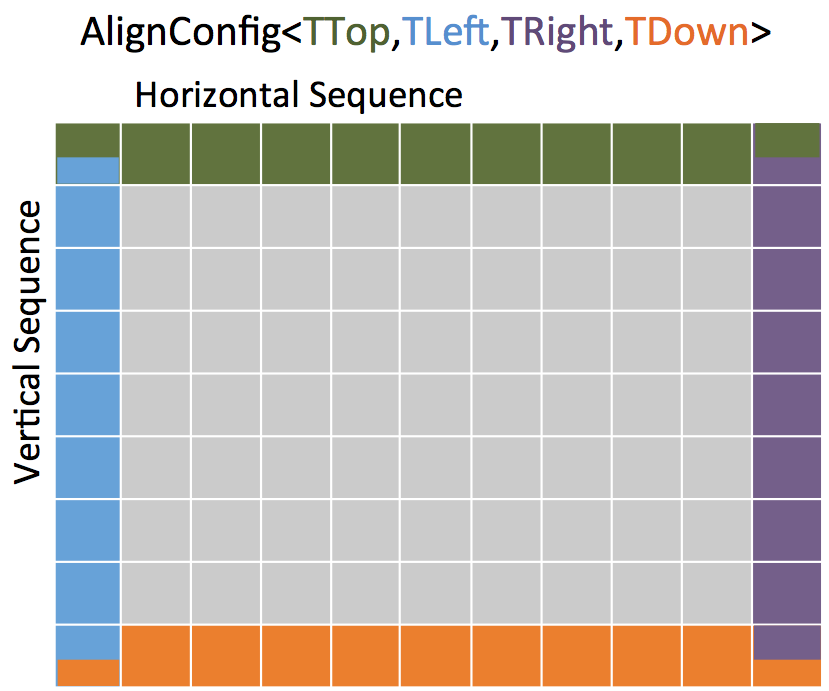
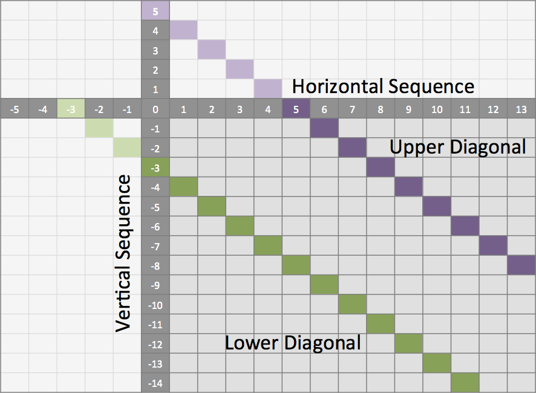

.. sidebar:: ToC

    .. contents::

.. _tutorial-algorithms-alignment-pairwise-sequence-alignment:

Pairwise Sequence Alignment
===========================

Learning Objective
  You will learn how to compute global and local alignments, how you can use different scoring schemes, and how you can customize the alignments to fulfill your needs.

Difficulty
  Average

Duration
  1h

Prerequisites
  :ref:`tutorial-getting-started-first-steps-in-seqan`, :ref:`tutorial-datastructures-sequences`, :ref:`tutorial-datastructures-alignment-scoringschemes`, :ref:`tutorial-datastructures-graphs`

Alignments are one of the most basic and important ways to measure similarity between two or more sequences.
In general, a pairwise sequence alignment is an optimization problem which determines the best transcript of how one sequence was derived from the other.
In order to give an optimal solution to this problem, all possible alignments between two sequences are computed using a **Dynamic Programming** approach.
:dox:`Score Scoring schemes` allow the comparison of the alignments such that the one with the best score can be picked.
Despite of the common strategy to compute an alignment, there are different variations of the standard DP algorithm laid out for special purposes.

We will first introduce you to the global alignments.
Subsequent, you will learn how to compute local alignments.
Finally, we will demonstrate how you can reduce the search space using a band.

Global Alignments
-----------------

In this section, we want to compute a global alignment using the Needleman-Wunsch algorithm.
We will use the Levenshtein distance as our scoring scheme.

A program always starts with including the headers that contain the components (data structures and algorithms) we want to use.
To gain access to the alignment algorithms we need to include the ``<seqan/align.h>`` header file.
We tell the program that it has to use the ``seqan`` namespace and write the ``main`` function with an empty body.

A good programming practice is to define all types that shall be used by the function at the beginning of the function body.
In our case, we define a ``TSequence`` type for our input sequences and an :dox:`Align` object (``TAlign``) type to store the alignment.
For more information on the Align datastructure, please read the tutorial :ref:`tutorial-datastructures-alignment-alignment-gaps`.

.. includefrags:: demos/tutorial/pairwise_sequence_alignment/alignment_global_standard.cpp
   :fragment: main

After we defined the types, we can define the variables and objects.
First, we create two input sequences ``seq1 = "CDFGHC"`` and ``seq2 = "CDEFGAHC"``.
We then define an 'align' object where we want to put the sequences into, we resize it to manage two :dox:`Gaps` objects, and then assign the sequences to it.

.. includefrags:: demos/tutorial/pairwise_sequence_alignment/alignment_global_standard.cpp
   :fragment: init

Now, we can compute our first alignment.
To do so, we simply call the function :dox:`globalAlignment` and give as input parameters the ``align`` object and the scoring scheme representing the Levenshtein distance.
The globalAlignment function returns the score of the best alignment, which we store in the ``score`` variable.
Afterwards, we print the computed score and the corresponding alignment.

.. includefrags:: demos/tutorial/pairwise_sequence_alignment/alignment_global_standard.cpp
   :fragment: alignment

The output is as follows:

.. includefrags:: demos/tutorial/pairwise_sequence_alignment/alignment_global_standard.cpp.stdout

Assignment 1
^^^^^^^^^^^^

.. container:: assignment

   Type
     Review

   Objective

     Compute two global alignments between the DNA sequences ``"AAATGACGGATTG"``.
     ``"AGTCGGATCTACTG"`` using the Gotoh algorithm :cite:`gotoh1982improved`, implementing the Affine Gap model, with the following scoring parameters: ``match = 4``, ``mismatch = -2``, ``gapOpen = -4`` and ``gapExtend = -2``.
     Store the alignments in two Align objects and print them together with the scores.

   Hints
     .. container:: foldable

        The Gotoh algorithm uses the Affine Gap function. In SeqAn you can switch between Linear, Affine and Dynamic gap functions by customizing your scoring scheme with one of the three tags ``LinearGaps()``, ``AffineGaps()`` or ``DynamicGaps()`` and relative penalty values ``gapOpen`` and ``gapExtend``. When a single gap value is provided the Linear Gap model is selected as default while the Affine Gap model is chosen as standard when two different gap costs are set. If the Dynamic Gap model :cite:`Urgese2014` is required the relative tag must be supplied.
        Have a look on the :ref:`tutorial-datastructures-alignment-scoringschemes` section if you are not sure about the correct ordering.

   Solution
     .. container:: foldable

        First we have to define the body of our program.
        This includes the definition of the library headers that we want to use.
        In this case it is the `iostream` from the STL and the `<seqan/align.h>`
        header file defining all algorithms and data structures we want to use.
        After we added the namespace and opened the `main` body we define our types we want to use in this function.
        We use an :dox:`String` with the :dox:`Dna` alphabet, since we know that we work with DNA sequences.
        The second type is our :dox:`Align` object storing the alignment later on.

        .. includefrags:: demos/tutorial/pairwise_sequence_alignment/alignment_global_assignment1.cpp
           :fragment: main

        In the next step we initialize our objects.
        This includes the both input sequences ``seq1`` and ``seq2`` and ``align``.
        We resize the underlying set of ``align`` that manages the separate :dox:`Gaps` data structures.
        Finally, we assign the input sequences as sources to the corresponding row of ``align``.

        .. includefrags:: demos/tutorial/pairwise_sequence_alignment/alignment_global_assignment1.cpp
           :fragment: init

        Now we compute the alignment using a scoring scheme with affine gap costs.
        The first parameter corresponds to the ``match`` value, the second to the ``mismatch`` value, the third to the ``gap extend`` value and the last one to the ``gap open`` value.
        We store the computed score of the best alignment in the equally named variable ``score``.
        In the end we print the score and the alignment using print methods provided by the ``iostream`` module of the STL.

        .. includefrags:: demos/tutorial/pairwise_sequence_alignment/alignment_global_assignment1.cpp
           :fragment: alignment

        Congratulation!
        You have computed an alignment using affine gap costs.
        Here the result of the program:

        .. includefrags:: demos/tutorial/pairwise_sequence_alignment/alignment_global_assignment1.cpp.stdout

Overlap Alignments
------------------

In contrast to the global alignment, an overlap alignment does not penalize gaps at the beginning and at the end of the sequences.
This is referred to as **free end-gaps**.
It basically means that overlap alignments can be shifted such that the end of the one sequence matches the beginning of the other sequence, while the respective other ends are gapped.

We use the :dox:`AlignConfig` object to tell the algorithm which gaps are free.
The :dox:`AlignConfig` object takes four explicitly defined bool arguments.
The first argument stands for ``initial gaps`` in the vertical sequence of the alignment matrix (first row) and the second argument stands for ``initial gaps`` in the horizontal sequence (first column).
The third parameter stands for ``end`` gaps in the horizontal sequence (last column) and the fourth parameter stands for ``end gaps`` in the vertical sequence (last row).
Per default the arguments of AlignConfig are set to ``false`` indicating a standard global alignment as you have seen above.
In an overlap alignment all arguments are set to ``true``.
This means the first row and first column are initialized with zeros and the maximal score is searched in the last column and in the last row.

Just let us compute an overlap alignment to see how it works.
We will also make use of the :dox:`AlignmentGraph Alignment Graph` to store the alignment this time.
We start again with including the necessary headers and defining all types that we need.
We define the ``TStringSet`` type to store our input sequences in a StringSet and we define the ``TDepStringSet`` which is an :dox:`DependentStringSet` used internally by the AlignmentGraph.

.. includefrags:: demos/tutorial/pairwise_sequence_alignment/alignment_global_overlap.cpp
   :fragment: main

Before we can initialize the AlignmentGraph we append the input sequences to the StringSet ``strings``.
Then we simply pass ``strings`` as an argument to the constructor of the AlignmentGraph ``alignG``.

.. includefrags:: demos/tutorial/pairwise_sequence_alignment/alignment_global_overlap.cpp
   :fragment: init

Now we are ready to compute the alignment.
This time we change two things when calling the ``globalAlignment`` function.
First, we use an :dox:`AlignmentGraph` to store the computed alignment and second we use the :dox:`AlignConfig` object to compute the overlap alignment. The gap model tag can be provided as last argument.

.. includefrags:: demos/tutorial/pairwise_sequence_alignment/alignment_global_overlap.cpp
   :fragment: alignment

The output is as follows.

.. includefrags:: demos/tutorial/pairwise_sequence_alignment/alignment_global_overlap.cpp.stdout

Assignment 2
^^^^^^^^^^^^

.. container:: assignment

   Type
     Review

   Objective
     Compute a semi-global alignment between the sequences ``AAATGACGGATTG`` and ``TGGGA`` using the costs 1, -1, -1 for match, mismatch and gap, respectively.
     Use an AlignmentGraph to store the alignment.
     Print the score and the resulting alignment to the standard output.

   Hint
     .. container:: foldable

        A semi-global alignment is a special form of an overlap alignment often used when aligning short sequences against a long sequence.
        Here we only allow free end-gaps at the beginning and the end of the shorter sequence.

   Solution
     .. container:: foldable

        First we have to define the body of our program.
        This includes the definition of the library headers that we want to use.
        In this case we include the ``iostream`` header from the STL and the ``<seqan/align.h>`` header, which defines all algorithms and data structures we want to use.
        After we added the namespace and opened the ``main`` function body we define our types we want to use in this function.
        We use an :dox:`String` with the :dox:`Dna` alphabet, since we know that we work with DNA sequences.
        We use an additional :dox:`StringSet` to store the input sequences.
        In this scenario we use an :dox:`AlignmentGraph` to store the alignment.
        Remember, that the AlignmentGraph uses an :dox:`DependentStringSet` to map the vertices to the correct input sequences.

        .. includefrags:: demos/tutorial/pairwise_sequence_alignment/alignment_global_assignment2.cpp
           :fragment: main

        In the next step we initialize our input StringSet ``strings`` and pass it as argument to the constructor of the AlignmentGraph ``alignG``.

        .. includefrags:: demos/tutorial/pairwise_sequence_alignment/alignment_global_assignment2.cpp
           :fragment: init

        Now we compute the alignment using the Levenshtein distance and a AlignConfig object to set the correct free end-gaps.
        In this example we put the shorter sequence on the vertical axis of our alignment matrix.
        Hence, we have to use free end-gaps in the first and last row, which corresponds to the first and the last parameter in the AlignConfig object.
        If you add the shorter sequence at first to ``strings``, then you simply have to flip the ``bool`` values of the AlignConfig object.

        .. includefrags:: demos/tutorial/pairwise_sequence_alignment/alignment_global_assignment2.cpp
           :fragment: alignment

        Here the result of the program.

        .. includefrags:: demos/tutorial/pairwise_sequence_alignment/alignment_global_assignment2.cpp.stdout

Specialized Alignments
----------------------

SeqAn offers specialized algorithms that can be selected using a tag.
Note that often these specializations are restricted in some manner.
The following list shows different alignment tags for specialized alignment algorithms and the restrictions of the algorithms.

Hirschberg
  The Hirschberg algorithm computes an alignment between two sequences in linear space.
  The algorithm can only be used with an Align object (or Gaps).
  It uses only linear gap costs and does no overlap alignments.

MyersBitVector
  The MyersBitVector is a fast alignment specialization using bit parallelism.
  It only works with the Levenshtein distance and outputs no alignments.

MyersHirschberg
  The MyersHirschberg is an combination of the rapid MyersBitVector and the space efficient Hirschberg algorithm, which additionally enables the computation of an alignment.
  It only works with the Levenshtein distance and for Align objects.

.. tip::
   In SeqAn you can omit the computation of the traceback to get only the score by using the function :dox:`globalAlignmentScore`.
   This way you can use the alignment algorithms for verification purposes, etc.

In the following example, we want to compute a global alignment of two sequences using the Hirschberg algorithm.
We are setting the ``match`` score to ``1``, and ``mismatch`` as well as ``gap`` penalty to ``-1``.
We print the alignment and the score.

First the necessary includes and typedefs:

.. includefrags:: demos/tutorial/pairwise_sequence_alignment/alignment_global_specialised.cpp
   :fragment: main

In addition to the previous examined examples we tell the globalAlignment function to use the desired Hirschberg algorithm by explicitly passing the tag ``Hirschberg`` as last parameter.
The resulting alignment and score are then printed.

.. includefrags:: demos/tutorial/pairwise_sequence_alignment/alignment_global_specialised.cpp
   :fragment: alignment

The output is as follows.

.. includefrags:: demos/tutorial/pairwise_sequence_alignment/alignment_global_specialised.cpp.stdout

Assignment 3
^^^^^^^^^^^^

.. container:: assignment

   Type
     Application

   Objective
     Write a program that computes a global alignment between the :dox:`Rna` sequences ``AAGUGACUUAUUG`` and ``AGUCGGAUCUACUG`` using the Myers-Hirschberg variant. You should use the Align data structure to store the alignment.
     Print the score and the alignment. Additionally, output for each row of the Align object the view positions of the gaps.

   Hint
     You can use an iterator to iterate over a row.
     Use the metafunction :dox:`Align#Row` to get the type of the row used by the Align object.
     Use the function :dox:`Gaps#isGap` to check whether the current value of the iterator is a gap or not.
     The gaps are already in the view space.

   Solution
     .. container:: foldable

        As usual, first the necessary includes and typedefs.
        Our sequence type is ``String<Rna>``.
        ``TAlign`` and ``TRow`` are defined as in the previous example program.
        The type ``Iterator<TRow>::Type`` will be used to iterate over the rows of the alignment.

        .. includefrags:: demos/tutorial/pairwise_sequence_alignment/alignment_global_assignment3.cpp
           :fragment: main

        In the next step we initialize our Align object ``align`` with the corresponding source files.

        .. includefrags:: demos/tutorial/pairwise_sequence_alignment/alignment_global_assignment3.cpp
           :fragment: init

        Now we compute the alignment using Myers-Hirschberg algorithm by specifying the correct tag at the end of the function.

        .. includefrags:: demos/tutorial/pairwise_sequence_alignment/alignment_global_assignment3.cpp
           :fragment: alignment

        Finally, we iterate over both gap structures and print the view positions of the gaps within the sequences.

        .. includefrags:: demos/tutorial/pairwise_sequence_alignment/alignment_global_assignment3.cpp
           :fragment: view

        The output of the program is as follows.

        .. includefrags:: demos/tutorial/pairwise_sequence_alignment/alignment_global_assignment3.cpp.stdout

Local Alignments
----------------

Now let's look at local pairwise alignments.

SeqAn offers the classical Smith-Waterman algorithm that computes the best local alignment with respect to a given scoring scheme, and the Waterman-Eggert algorithm, which computes not only the best but also suboptimal local alignments.

We are going to demonstrate the usage of both in the following example where first the best local alignment of two character strings and then all local alignments of two DNA sequences with a score greater than or equal to 4 are computed.

.. includefrags:: demos/tutorial/pairwise_sequence_alignment/alignment_local.cpp
   :fragment: main

Let's start with initializing the :dox:`Align` object to contain the two sequences.

.. includefrags:: demos/tutorial/pairwise_sequence_alignment/alignment_local.cpp
   :fragment: init1

Now the best alignment given the scoring parameters is computed using the Dynamic Gap model by the function :dox:`localAlignment`.
The returned score value is printed directly, and the alignment itself in the next line.
The functions :dox:`Gaps#clippedBeginPosition` and :dox:`Gaps#clippedEndPosition` can be used to retrieve the begin and end position of the matching subsequences within the original sequences.

.. includefrags:: demos/tutorial/pairwise_sequence_alignment/alignment_local.cpp
   :fragment: ali1

Next, several local alignments of the two given DNA sequences are going to be computed. First, the :dox:`Align` object is created.

.. includefrags:: demos/tutorial/pairwise_sequence_alignment/alignment_local.cpp
   :fragment: init2

A :dox:`LocalAlignmentEnumerator` object needs to be initialized on the :dox:`Align` object.
In addition to the Align object and the scoring scheme, we now also pass the ``finder`` and a minimal score value, 4 in this case, to the localAlignment function.
The ``WatermanEggert`` tag specifies the desired Waterman-Eggert algorithm.
While the score of the local alignment satisfies the minimal score cutoff, the alignments are printed with their scores and the subsequence begin and end positions.

.. includefrags:: demos/tutorial/pairwise_sequence_alignment/alignment_local.cpp
   :fragment: ali2

Here is the output of our example program. The first part outputs one alignment. The second part outputs two alignments:

.. includefrags:: demos/tutorial/pairwise_sequence_alignment/alignment_local.cpp.stdout

Assignment 4
^^^^^^^^^^^^

.. container:: assignment

   Type
     Review

   Objective
     Write a program which computes the 3 best local alignments of the two :dox:`AminoAcid` sequences "``PNCFDAKQRTASRPL``" and "``CFDKQKNNRTATRDTA``" using the following scoring parameters: ``match = 3``, ``mismatch = -2``, ``gap open = -5``, ``gap extension = -1``.

   Hint
     Use an extra variable to enumerate the k best alignments.

   Solution
     .. container:: foldable

        The usual includes.

        .. includefrags:: demos/tutorial/pairwise_sequence_alignment/alignment_local_assignment1.cpp
           :fragment: main

        The initialization of the :dox:`Align` object.

        .. includefrags:: demos/tutorial/pairwise_sequence_alignment/alignment_local_assignment1.cpp
           :fragment: init

        Computing the three best alignments with the desired scoring parameters:

        .. includefrags:: demos/tutorial/pairwise_sequence_alignment/alignment_local_assignment1.cpp
           :fragment: ali

        The resulting output is as follows.

        .. includefrags:: demos/tutorial/pairwise_sequence_alignment/alignment_local_assignment1.cpp.stdout

Banded Alignments
-----------------

Often it is quite useful to reduce the search space in which the optimal alignment can be found, e.g., if the sequences are very similar, or if only a certain number of errors is allowed.
To do so you can define a band, whose intersection with the alignment matrix defines the search space.
To define a band we have to pass two additional parameters to the alignment function.
The first one specifies the position where the lower diagonal of the band crosses the vertical axis.
The second one specifies the position where the upper diagonal of the band crosses the horizontal axis.
You can imagine the matrix as the fourth quadrant of the Cartesian coordinate system.
Then the main diagonal of an alignment matrix is described by the function ``f(x) = -x``, all diagonals that crosses the vertical axis below this point are specified with negative values while all diagonals that crosses the horizontal axis are specified with positive values (see image).
A given band is valid as long as the relation ``lower diagonal <= upper diagonal`` holds.
In case of equality, the alignment is equivalent to the hamming distance problem, where only substitutions are considered.

.. important::

    The alignment algorithms return ``MinValue<ScoreValue>::VALUE`` if a correct alignment cannot be computed due to invalid compositions of the band and the specified alignment preferences.
    Assume, you compute a global alignment and the given band does not cover the last cell of the alignment matrix.
    In this case it is not possible to compute a correct alignment, hence ``MinValue<ScoreValue>::VALUE`` is returned, while no further alignment information are computed.

Let's compute a banded alignment.
The first step is to write the ``main`` function body including the type definitions and the initializations.

.. includefrags:: demos/tutorial/pairwise_sequence_alignment/alignment_banded.cpp
   :fragment: main

After we initialized everything, we will compute the banded alignment.
We pass the values ``-2`` for the lower diagonal and ``2`` for the upper diagonal.

.. includefrags:: demos/tutorial/pairwise_sequence_alignment/alignment_banded.cpp
   :fragment: alignment

And here is the output:

.. includefrags:: demos/tutorial/pairwise_sequence_alignment/alignment_banded.cpp.stdout

Assignment 5
^^^^^^^^^^^^

.. container:: assignment

   Type
     Transfer

   Objective
     Write an approximate pattern matching algorithm using alignment algorithms.
     Report the positions of all hits where the pattern matches the text with at most ``2`` errors.
     Output the number of total edits used to match the pattern and print the corresponding cigar string of the alignment without leading and trailing gaps in the pattern.
     Text: "``MISSISSIPPIANDMISSOURI``" Pattern: "``SISSI``"

   Hint
    * The first step would be to verify at which positions in the text the pattern matches with at most 2 errors.
    * Use the :dox:`SegmentableConcept#infix` function to return a subsequence of a string.
    * A CIGAR string is a different representation of an alignment.
      It consists of a number followed by an operation.
      The number indicates how many operations are executed.
      Operations can be **M** for match or mismatch, **I** for insertion and **D** for deletion.
      Here is an example:

      ::

          ref: AC--GTCATTT
          r01: ACGTCTCA---
          Cigar of r01: 2M2I4M3D

    Solution (Step 1)
      .. container:: foldable

         .. includefrags:: demos/tutorial/pairwise_sequence_alignment/assignment5_step1.cpp
            :fragment: main

    Solution (Step 2)
      .. container:: foldable

         .. includefrags:: demos/tutorial/pairwise_sequence_alignment/assignment5_step2.cpp
            :fragment: main

    Solution (Step 3)
      .. container:: foldable

         .. includefrags:: demos/tutorial/pairwise_sequence_alignment/assignment5_step3.cpp
            :fragment: main

    Solution (Step 4)
      .. container:: foldable

         .. includefrags:: demos/tutorial/pairwise_sequence_alignment/assignment5_step4.cpp
            :fragment: main

    Solution (Step 5)
      .. container:: foldable

         .. includefrags:: demos/tutorial/pairwise_sequence_alignment/assignment5_step5.cpp
            :fragment: main

    Solution (Step 6)
      .. container:: foldable

         .. includefrags:: demos/tutorial/pairwise_sequence_alignment/assignment5_step6.cpp
            :fragment: main

    Complete Solution (and more explanations)
      .. container:: foldable

         Write the `main` body of the program with type definition and initialization of the used data structures.

         .. includefrags:: demos/tutorial/pairwise_sequence_alignment/assignment5.cpp
            :fragment: main

         In the first part of the algorithm we implement an alignment based verification process to identify positions in the `subject sequence` at which we can find our pattern with at most `2` errors.
         We slide the `5*5` alignment matrix position by position over the `subject sequence` and use the `MeyersBitVector` to verify the hits.
         If the score is greater or equal than `-2`, then we have found a hit.
         We store the begin position of the hit in `locations`.

         .. includefrags:: demos/tutorial/pairwise_sequence_alignment/assignment5.cpp
            :fragment: verification

         In the second part of the algorithm we iterate over all reported locations.
         This time we compute a semi-global alignment since we won't penalize gaps at the beginning and at the end of our pattern.
         We also compute a band allowing at most `2` errors in either direction.
         Don't forget to clear the gaps in each iteration, otherwise we might encounter wrong alignments.

         .. includefrags:: demos/tutorial/pairwise_sequence_alignment/assignment5.cpp
            :fragment: alignment

         In the next part we determine the cigar string for the matched pattern.
         We have to remove leading and trailing gaps in the `gapsPattern` object using the functions :dox:`Gaps#setClippedBeginPosition` and :dox:`Gaps#setClippedEndPosition`.
         We also need to set the clipped begin position for the `gapsText` object such that both Gaps begin at the same position.

         .. includefrags:: demos/tutorial/pairwise_sequence_alignment/assignment5.cpp
            :fragment: cigar

         First, we identify insertions using the functions :dox:`GapsIterator#isGap` and :dox:`GapsIterator#countGaps`.

         .. includefrags:: demos/tutorial/pairwise_sequence_alignment/assignment5.cpp
            :fragment: cigarInsertion

         We do the same to identify deletions.

         .. includefrags:: demos/tutorial/pairwise_sequence_alignment/assignment5.cpp
            :fragment: cigarDeletion

         If there is neither an insertion nor a deletion, then there must be a match or a mismatch. As long as we encounter matches and mismatches we move forward in the Gaps structures.
         Finally we print out the position of the hit, its total number of edits and the corresponding cigar string.

         .. includefrags:: demos/tutorial/pairwise_sequence_alignment/assignment5.cpp
            :fragment: cigarMatchAndMismatch

         Here is the output of this program.

         .. includefrags:: demos/tutorial/pairwise_sequence_alignment/assignment5.cpp.stdout
