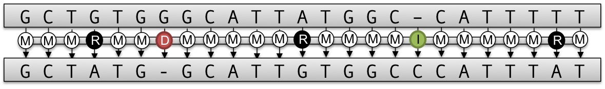

.. _tutorial-algorithms-alignment:

DP Alignment
============

..  toctree::
    :hidden:
    :titlesonly:

    PairwiseSequenceAlignment
    MultipleSequenceAlignment

In bioinformatics, we often search for similarities between sequences.
You might know the problem already from the pattern matching section.
However, when we want to put a sequence in its evolutionary context, a simple pattern matching algorithm will not suffice, as it rather looks for small identical parts with some errors.
But, if we have two sequences at hand, we don't actually know which patterns we are looking for.

To solve this problem, one computes a global pairwise sequence alignment to obtain an optimal transcript, that describes how these two sequences are related to each other.
The transcript describes the edit operations (match, substitution, insertion and deletion) necessary to translate the one sequence into the other, as can be seen in the picture above.

The alignment problem is solved with a dynamic programming (DP) algorithm which runs in :math:`\mathcal{O}(n^2)` time and space.
Besides the global alignment approach many, many more variations of this DP based algorithm have been developed over time.
SeqAn unified all of these approaches into a single DP core implementation which can be extended pretty easily and thus with all possible configurations is a very versatile and powerful tool to compute many desired alignment variants.

In the :ref:`pairwise sequence alignment tutorial <tutorial-algorithms-alignment-pairwise-sequence-alignment>` you will learn more about the different alignment algorithms that are implemented and how to compute them.

A more complex problem then the pairwise sequence alignment is the multiple sequence alignment, where the optimal alignment between many sequences is sought.
Solving the problem exactly would be infeasible, since the combinations would explode. In fact the runtime is :math:`\mathcal{O}(n^k)`, where :math:`k` is the number of sequences.
Instead, one rather builds up a multiple sequence alignment by progressively computing pairwise alignments.
The :ref:`multiple sequence alignment tutorial <tutorial-algorithms-alignment-multiple-sequence-alignment>` teaches you how to compute a multiple sequence alignment in SeqAn.
