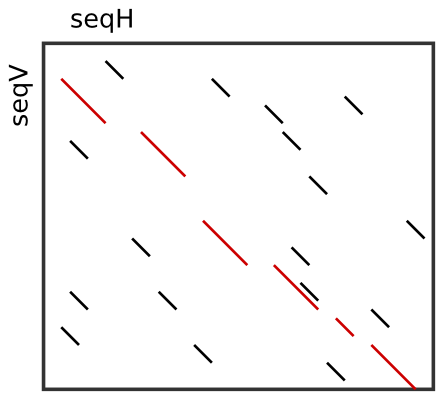

.. sidebar:: ToC

    .. contents::

.. _tutorial-algorithms-seed-extension:

Seed Extension
==============

Learning Objective
  You will learn how to do seed-and-extend with SeqAn, how to do local and global chaining of seeds.
  Finally, you will learn how to create a banded alignment around a seed chain.

Difficulty
  Average

Duration
  2 h

Prerequisites
  :ref:`tutorial-datastructures-sequences`, :ref:`tutorial-datastructures-seeds`

Overview
--------

Many efficient heuristics to find high scoring, but inexact, local alignments between two sequences start with small exact (or at least highly similar) segments, so called **seeds**, and extend or combine them to get larger highly similar regions.
Probably the most prominent tool of this kind is BLAST :cite:`Altschul1990`, but there are many other examples like FASTA :cite:`Pearson1990` or LAGAN :cite:`Brudno2003`.

SeqAn's header file for all data structures and functions related to two-dimensional seeds is ``<seqan/seeds.h>``.

Seed Extension
--------------

Seeds are often created quickly using a *k*-mer index: When a *k*-mer of a given length is found in both sequences, we can use it as a seed.
However, the match can be longer than just *k* characters. To get longer matches, we use **seed extension**.

In the most simple case we simply look for matching characters in both sequences to the left and right end of the seed.
This is called **match extension** and available through the :dox:`Seed#extendSeed` function using the ``MatchExtend`` tag. Below example shows how to extend seeds to the right end.

.. includefrags:: demos/tutorial/seed_and_extend/example1.cpp
   :fragment: example

.. includefrags:: demos/tutorial/seed_and_extend/example1.cpp.stdout

Assignment 1
""""""""""""

.. container:: assignment

   Type
     Review

   Objective
     Change the example from above to extend the seed to both sides.

   Solution
     .. container:: foldable

        .. includefrags:: demos/tutorial/seed_and_extend/solution1.cpp

A more complex case is the standard bioinformatics approach of **x-drop extension**.

In the ungapped case, we extend the seed by comparing the *i*-th character to the left/right of the seed of the horizontal sequence (subject sequence) with the *j*-th character to the left/right of the seed in the vertical sequence (query sequence).
Matches and mismatches are assigned with scores (usually matches are assigned with positive scores and mismatches are assigned with negative scores).
The scores are summed up.
When one or more mismatches occur, the running total will drop.
When the sum drops more than a value *x*, the extension is stopped.

This approach is also available in the gapped case in the SeqAn library.
Here, creating gaps is also possible but also assigned negative scores.

.. includefrags:: demos/tutorial/seed_and_extend/example2.cpp
   :fragment: example

.. includefrags:: demos/tutorial/seed_and_extend/example2.cpp.stdout

Assignment 2
""""""""""""

.. container:: assignment

   Type
     Review

   Objective
     Change the example from above to use gapped instead of ungapped x-drop extension.

   Solution
     .. container:: foldable

        .. includefrags:: demos/tutorial/seed_and_extend/solution2.cpp

After extending a seed, we might wish to actually get the resulting alignment.
When using gapped x-drop extension, we need to perform a banded global alignment of the two sequence infixes that correspond to the seed.
This is shown in the following example:

.. includefrags:: demos/tutorial/seed_and_extend/example3.cpp
   :fragment: example

.. includefrags:: demos/tutorial/seed_and_extend/example3.cpp.stdout

Assignment 3
""""""""""""

.. container:: assignment

   Type
     Review

   Objective
     Change the example from above to a gap open score of ``-2`` and a gap extension score of ``-2``.

   Solution
     .. container:: foldable

	Note that we do not have to explicitely call Gotoh's algorithm in ``globalAlignment()``.
	The fact that the gap extension score is different from the gap opening score is enough.

        .. includefrags:: demos/tutorial/seed_and_extend/solution3.cpp

Local Chaining using Seed Sets
------------------------------

Usually, we quickly determine a large number of seeds.
When a seed is found, we want to find a "close" seed that we found previously and combine it to form a longer seed.
This combination is called **local chaining**. This approach has been pioneered in the CHAOS and BLAT programs.

SeqAn provides the :dox:`SeedSet` class as a data structure to efficiently store seeds and combine new seeds with existing ones.
The following example creates a :dox:`SeedSet` object ``seeds``, adds four seeds to it and then prints its contents.

.. includefrags:: demos/tutorial/seed_and_extend/example4.cpp
   :fragment: example

The output of the program above can be seen below.

.. includefrags:: demos/tutorial/seed_and_extend/example4.cpp.stdout

Note that we have used the ``Single()`` tag for adding the seeds.
This forces the seeds to be added independent of the current seed set contents.

By using different overloads of the :dox:`SeedSet#addSeed`, we can use various local chaining strategies when adding seed ``A``.

``Merge``
  If there is a seed ``B`` that overlaps with ``A`` and the difference in diagonals is smaller than a given threshold then ``A`` can be merged with ``B``.

``SimpleChain``
  If there is a seed ``B`` whose distance in both sequences is smaller than a given threshold then ``A`` can be chained to ``B``.

``Chaos``
  Following the strategy of CHAOS :cite:`Brudno2003b`, if ``A`` is within a certain distance to ``B`` in both sequences and the distance in diagonals is smaller than a given threshold then ``A`` can be chained to ``B``.

The :dox:`SeedSet#addSeed` function returns a boolean value indicating success in finding a suitable partner for chaining.
A call using the ``Single`` strategy always yields ``true``.

The following example shows how to use the ``SimpleChain`` strategy.

.. includefrags:: demos/tutorial/seed_and_extend/example5.cpp
   :fragment: example

As we can see, the seed ``TSeed(4, 2, 3)`` has been chained to ``TSeed(0, 0, 2)``.

.. includefrags:: demos/tutorial/seed_and_extend/example5.cpp.stdout

Assignment 4
""""""""""""

.. container:: assignment

   Type
     Review

   Objective
     Change the example above to use the ``Chaos`` strategy instead of the ``SimpleChain``.

   Solution
     .. container:: foldable

        .. includefrags:: demos/tutorial/seed_and_extend/solution4.cpp

Global Chaining
---------------

After one has determined a set of candidate seeds, a lot of these seeds will conflict.
The image to the right shows an example.
Some conflicting seeds might be spurious matches or come from duplication events.

Often, we need to find a linear ordering of the seeds such that each seed starts after all of its predecessor end in both sequences.
This can be done efficiently using dynamic sparse programming (in time :math:`\mathcal{O}(n log n)` where :math:`n` is the number of seeds) as described in :cite:`Gusfield1997`.
The red seeds in the image to the right show such a valid chain.

This functionality is available in SeqAn using the :dox:`chainSeedsGlobally` function.
The function gets a sequence container of :dox:`Seed` objects for the result as its first parameter and a :dox:`SeedSet` as its second parameter.
A subset of the seeds from the :dox:`SeedSet` are then selected and stored in the result sequence.

The following shows a simple example.

.. includefrags:: demos/tutorial/seed_and_extend/example6.cpp
   :fragment: example

Assignment 5
""""""""""""

.. container:: assignment

   Type
     Review

   Objective
      Change the example from above to use a different chain of seeds.
      The seeds should be ``TSeed(1, 1, 3)``, ``TSeed(6, 9, 2)``, ``TSeed(10, 13, 3)``, and ``TSeed(20, 22, 5)``.

   Solution
     .. container:: foldable

        .. includefrags:: demos/tutorial/seed_and_extend/solution5.cpp

Banded Chain Alignment
----------------------

After obtaining such a valid seed chain, we would like to obtain an alignment along the chain.
For this, we can use the so-called banded chain alignment algorithm :cite:`Brudno2003`.
Around seeds, we can use banded DP alignment and the spaces between seeds can be aligned using standard DP programming alignment.

In SeqAn you can compute the banded chain alignment by calling the function :dox:`bandedChainAlignment`.
This function gets the structure in which the alignment should be stored as the first parameter.
This corresponds to the interface of the :dox:`globalAlignment` and allows the same input types.
Additionally, this function requires a non-empty, non-decreasing monotonic chain of seeds which is used as the rough global map for computing the global alignment.
The third required parameter is the :dox:`Score`.

Note, that there are a number of optional parameters that can be specified.
These include a second :dox:`Score` which, if specified, is used to evaluate the regions between two consecutive seeds differently than the regions around the seeds itself (for which then the first specified score is taken.).
As for the global alignment you can use the :dox:`AlignConfig` to specify the behavior for initial and end gaps.
The last optional parameter is the band extension.
This parameter specifies to which size the bands around the anchors should be extended.
The default value is 15 and conforms the default value in the LAGAN-algorithm :cite:`Brudno2003`.

.. important::

    At the moment the specified value for the band extension must be at least one.

.. includefrags:: demos/tutorial/seed_and_extend/example7.cpp
   :fragment: example

The output of the example above.

.. includefrags:: demos/tutorial/seed_and_extend/example7.cpp.stdout

Assignment 6
""""""""""""

.. container:: assignment

   Type
     Review

   Objective
     Change the example form above to use two different scoring schemes.
     The scoring scheme for the seeds should use the Levenshtein distance and the score for the gap regions should be an affine score with the following values: match = 2, mismatch = -1, gap open = -2, gap extend = -1.

     Furthermore, we are looking for a semi-global alignment here the initial and end gaps in the query sequence are free.

   Solution
     .. container:: foldable

        .. includefrags:: demos/tutorial/seed_and_extend/solution6.cpp

.. TODO: LAGAN demo should be refered to from here when it's done.
