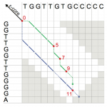
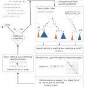

.. We create this roles for putting the "Introduction: etc. headings
    on this page without them displaying in the ToC.  This would break
    rendering the ToC correctly on readthedocs style.  The rubric
    headings are formatted using CSS.

.. role:: rubric-heading1
    :class: rubric-heading1
.. role:: rubric-heading2
    :class: rubric-heading2

.. _tutorial-algorithms:

Algorithms
==========

.. toctree::
    :hidden:
    :titlesonly:

    PatternMatching/index
    Alignment/index
    ConsensusAlignment
    Realignment
    SeedExtension
    GraphAlgorithms

SeqAn contains many efficient implementations of core bioinformatics algorithms. This starts with the standard dynamic programming based alignment algorithms with all its subtypes.
Global alignment, local alignment, banded and unbanded, for proteins or DNA, using seeds or not, needing a traceback or not. Check out nearly 200 combinations of this module which incidentally will soon be fully multithreaded and SIMD accelerated.

A depiction of the extension phase of the Stellar algorithm.

A depiction of the error correcting algorithm in the Fiona algorithm.

SeqAn contains algorithms for read mapping based on q-gram or string indices, multiple alignment algorithms, filter algorithms for string search as well es error correction methods.

The algorithms are usually generic in the sense that they can be configured via template arguments and usually work for many, if not arbitrary  alphabets. SeqAn applications are usually short, very maintainable combinations of those core algorithmic components. Being well defined, the SeqAn components are quite amenable to optimisation and acceleration using multicore computing, vectorisation or accelerators.

On the right you will find several tutorials about SeqAn's algorithms. Under :ref:`tutorial-algorithms-pattern-matching` you will find tutorials for online or indexed pattern search.
Under :ref:`tutorial-algorithms-alignment` you will find tutorials for all versions of DP based alignments (pairwise and multiple) and as special cases consensus alignment under :ref:`tutorial-algorithms-consensus-alignment` and realignment algorithms under :ref:`tutorial-algorithms-realignment`.

Under :ref:`tutorial-algorithms-seed-extension` you will find tutorials for SeqAn's seed module and various extension algorithms. And finally you can find under :ref:`tutorial-algorithms-graph-algorithms` algorithms that work on SeqAn's graph type.

