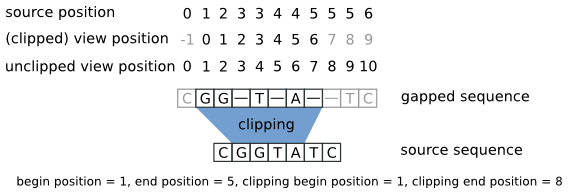

.. sidebar:: ToC

    .. contents::

.. _tutorial-datastructures-alignment-alignment-gaps:

Alignment Representation (Gaps)
=================================

Learning Objective
  This tutorial introduces you to the gaps data structures that can be used to represent an alignment in SeqAn.
  You will learn basic techniques to create and modify such data structures and how to access certain information from these data structures.

Difficulty
  Basic

Duration
  15 min

Prerequisites
  :ref:`tutorial-getting-started-first-steps-in-seqan`, :ref:`tutorial-datastructures-sequences`

------------------------------------------

The :dox:`Align` data structure is simply a set of multiple :dox:`Gaps` data structures.
A Gaps data structure is a container storing gap information for a given source sequence.
The gap information is put on top of the source sequence (coordinates of the gapped sequence refer to the **gap space**) without directly applying them to the source (coordinates of the ungapped sequence refer to the **source space**).
This way operating with gaps sustains very flexible.

Gaps data structures
^^^^^^^^^^^^^^^^^^^^^^^^^

There are two specializations available for the Gaps data structures:
:dox:`ArrayGaps Array Gaps` and :dox:`AnchorGaps Anchor Gaps`.
They differ in the way they implement the gap space.

.. note::
   In general, using :dox:`ArrayGaps Array Gaps` is sufficient for most applications.
   This specialization is also the default one if nothing else is specified.
   It simply uses an array which stores the counts of gaps and characters in an alternating order.
   Thus, it is quite efficient to extend existing gaps while it is more expensive to search within the gapped sequence or insert new gaps.
   Alternatively, one should prefer :dox:`AnchorGaps Anchor Gaps` if many conversions between coordinates of the gap and the source space are needed as binary search can be conducted to search for specific positions.

Constructing an alignment
^^^^^^^^^^^^^^^^^^^^^^^^^

Now, let's start by constructing our first alignment.
Before we can make use of any of the mentioned data structures, we need to tell the program where to find the definitions.
This can be achieved by including the header file ``<seqan/align.h>`` which contains the necessary data structures and functions associated with the alignments.
The next steps would be to implement the main function of our program and to define the types that we want to use.

.. includefrags:: demos/tutorial/alignment/align.cpp
   :fragment: main

We first define the type of the input sequences (``TSequence``).
Then we can define the type of our actual Align object we want to use.
In an Align object, the gapped sequences are arranged in rows.
You can use the Metafunction :dox:`Align#Row` to get the correct type of the used Gaps objects.
In the following we use the term ``row`` to explicitly refer to a single gapped sequence in the Align object.
We will use the term ``gapped sequence`` to describe functionalities that are related to the Gaps data structure independent of the Align object.

.. includefrags:: demos/tutorial/alignment/align.cpp
   :fragment: typedefs

After defining the types, we can continue to actually construct our own Align object.
Therefore, we need to resize the alignment object in order to reserve space for the sequences we want to add.
In our case, we assume a pairwise alignment, hence we reserve space for 2 sequences.
With the function :dox:`Align#row`, we get access to the gapped sequence at a specific row in the alignment object.
This is similar to the :dox:`RandomAccessContainerConcept#value` function used in :dox:`StringSet String Sets`.
Now, we can assign the source to the corresponding gapped sequence.

.. includefrags:: demos/tutorial/alignment/align.cpp
   :fragment: init

.. includefrags:: demos/tutorial/alignment/align.cpp.stdout
   :fragment: output_init

.. note::

   The second string ``CDEFGAHGC`` of the alignment is cropped in the output to
   ``CDEFGA``, such that they are of equal length. Note that the string itself
   is not modified, i.e. not shortened.

After assigning the sources to the gapped sequences, we need to add some gaps to make it look like a real alignment.
You can use the functions :dox:`Gaps#insertGap insertGap()` and :dox:`Gaps#removeGap removeGap()` to insert and delete one gap or :dox:`Gaps#insertGaps insertGaps()` and :dox:`Gaps#removeGaps removeGaps()` to insert and delete multiple gaps in a gapped sequence.

.. includefrags:: demos/tutorial/alignment/align.cpp
   :fragment: manipulation

.. includefrags:: demos/tutorial/alignment/align.cpp.stdout
   :fragment: output_manipulation

Congratulations!
You have created your first alignment.
Note that we used a reference declaration ``TRow &`` for the variables ``row1`` and ``row2``.
Without the reference, we would only modify copies of rows and the changes would not effect our ``align`` object.

Gap Space vs. Source Space
^^^^^^^^^^^^^^^^^^^^^^^^^^

In the next steps, we want to dig a little deeper to get a feeling for the gap space and the source space.
As mentioned above, the gaps are not inserted into the source but put on top of it in a separate space, the gap space.
When inserting gaps, the gap space is modified and all coordinates right of the inserted gap are shifted to the right by the size of the gap.
At the same time, the coordinates of the source remain unchanged.
Using the function :dox:`Gaps#toSourcePosition toSourcePosition()`, we can determine which position of the current gapped sequence (gap space) corresponds to the position in the source space.

.. includefrags:: demos/tutorial/alignment/align.cpp
   :fragment: printingSourcePos

.. includefrags:: demos/tutorial/alignment/align.cpp.stdout
   :fragment: output_source_positions

If the position in the gap space is actually a gap, then :dox:`Gaps#toSourcePosition toSourcePosition()` returns the source position of the next character to the right that is not a gap.
Vice versa, we can determine where our current source position maps into the gap space using the function :dox:`Gaps#toViewPosition toViewPosition()`.

.. includefrags:: demos/tutorial/alignment/align.cpp
   :fragment: printingViewPos

.. includefrags:: demos/tutorial/alignment/align.cpp.stdout
   :fragment: output_view_positions

In the first alignment, it seems that the end of the second row is cropped off to match the size of the first one.
This effect takes place only in the visualization but is not explicitly applied to the gapped sequence.
The second alignment is the one we manually constructed.
Here, you can see that the second row is expanded to its full size while it matches the size of the first row.
However, it is possible to explicitly crop off the ends of a gapped sequence by using the functions :dox:`Gaps#setClippedBeginPosition setClippedBeginPosition()` and :dox:`Gaps#setClippedEndPosition setClippedEndPosition()`.
These functions shrink the gap space and can be understood as defining an infix of the gapped sequence.
After the clipping, the relative view position changes according to the clipping and so does the mapping of the source positions to the gap space.
The mapping of the view positions to the source space does not change.

.. includefrags:: demos/tutorial/alignment/align.cpp
   :fragment: clipping

.. includefrags:: demos/tutorial/alignment/align.cpp.stdout
   :fragment: output_clipping

Here the output of the clipping procedure.

.. includefrags:: demos/tutorial/alignment/align.cpp
   :fragment: clipping_positions

.. includefrags:: demos/tutorial/alignment/align.cpp.stdout
   :fragment: output_clipping_positions

.. note::
   It is important to understand the nature of the clipping information.
   It virtually shrinks the gap space not physically.
   That means the information before/after the begin/end of the clipping still exists and the physical gap space remains unchanged.
   To the outer world it seems the alignment is cropped off irreparably.
   But you can expand the alignment again by resetting the clipping information.

Iterating over Gapped Sequences
^^^^^^^^^^^^^^^^^^^^^^^^^^^^^^^

In the last part of this section, we are going to iterate over a :dox:`Gaps` object.
This can be quite useful if one needs to parse the alignment rows to access position specific information.
First, we have to define the type of the ``Iterator``, which can be easily done by using the metafunction :dox:`ContainerConcept#Iterator`.
Remember that we iterate over an ``TRow`` object.
Then we have to construct the iterators ``it`` which points to the begin of ``row1`` using the :dox:`ContainerConcept#begin begin()` function and ``itEnd`` which points behind the last value of ``row1`` using the :dox:`ContainerConcept#end end()` function.
If you need to refresh the **Iterator Concept** you can read the iterator section :ref:`tutorial-datastructures-sequences-strings-and-segments-iterators`.
While we iterate over the gapped sequence, we can ask if the current value, at which the iterator ``it`` points to, is a gap or not by using the function :dox:`Gaps#isGap isGap()`.
Use :dox:`AlphabetWithGapsConcept#gapValue` to print the correct gap symbol.

.. includefrags:: demos/tutorial/alignment/align.cpp
   :fragment: iteratingRowClipped

.. includefrags:: demos/tutorial/alignment/align.cpp.stdout
   :fragment: output_iteratingRowClipped

We will now reset the clipping of ``row1`` using :dox:`Gaps#clearClipping` and iterate again over it to see its effect.

.. includefrags:: demos/tutorial/alignment/align.cpp
   :fragment: iteratingRowClipped2

.. includefrags:: demos/tutorial/alignment/align.cpp
   :fragment: return

.. includefrags:: demos/tutorial/alignment/align.cpp.stdout
   :fragment: output_iteratingRowClipped2

Here you can see how resetting the clipping positions brings back our complete row.

Assignment 1
^^^^^^^^^^^^^^^^^^^^^^^^^^^^^^^

.. container:: assignment

   Type
     Review

   Objective
     Construct an alignment using the Align data structure for the sequences ``"ACGTCACCTC"`` and ``"ACGGGCCTATC"``.
     Insert two gaps at the second position and insert one gap at the fifth position of the first sequence.
     Insert one gap at the ninth position of the second sequence.
     Iterate over the rows of your Align object and print the total count of gaps that exist within the alignment.

   Hints
     .. container :: foldable

        You can use the function :dox:`Gaps#countGaps` to count the number of consecutive gaps starting from the current position of the iterator.

        The resulting alignment should look like:
         .. code-block:: console

            AC--GTC-ACCTC

            ACGGGCCTA--TC

   Solution
       .. container:: foldable

          .. includefrags :: demos/tutorial/alignment/align_assignment1.cpp
             :fragment: solution

          .. includefrags :: demos/tutorial/alignment/align_assignment1.cpp.stdout
