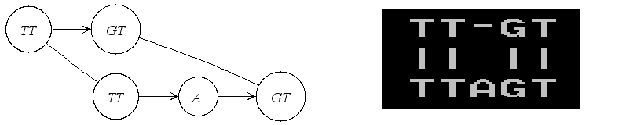

.. sidebar:: ToC

    .. contents::

.. _tutorial-datastructures-alignment-alignment-graph:

Alignment Representation (Graph)
==================================

Learning Objective
  This tutorial introduces you to the graph data structures that can be used to represent an alignment in SeqAn.
  You will learn basic techniques to create and modify such data structures and how to access certain information from these data structures.

Difficulty
  Basic

Duration
  15 min

Prerequisites
  :ref:`tutorial-getting-started-first-steps-in-seqan`, :ref:`tutorial-datastructures-sequences`

------------------------------------------

Another very useful representation of alignments is given by the :dox:`AlignmentGraph Alignment Graph`.
It is a graph in which each vertex corresponds to a sequence segment, and each edge indicates an ungapped alignment between the connected vertices, or more precisely between the sequences stored in those vertices.
Here is an example of such a graph:

In the following we will actually construct this example step by step.
First we include the ``iostream`` header from the STL and the ``<seqan/align.h>`` header to include all necessary functions and data structures we want to use.
We use the namespace ``seqan`` and write the ``main`` function with an empty body.

.. includefrags:: demos/tutorial/alignment/graph.cpp
   :fragment: main

At the begin of the function we define our types we want to use later on.
We define ``TSequence`` as the type of our input strings.
Since we work with a :dox:`Dna` alphabet we define ``TSequence`` as a :dox:`String` over a Dna alphabet.
For the AlignmentGraph we need two StringSets.
The ``TStringSet`` is used to actually store the input sequences and the ``TDepStringSet`` is internally used by the AlignmentGraph.
That is the AlignmentGraph does not copy the sources into its data structure but rather stores a reference to each of the given input strings as it does not modify the input sequences.
The :dox:`DependentStringSet Dependent StringSet` facilitates this behavior.
In the end we define the actual AlignmentGraph type.

.. includefrags:: demos/tutorial/alignment/graph.cpp
   :fragment: typedef

We first create our two input sequences ``TTGT`` and ``TTAGT`` append them to the StringSet ``strings`` using the :dox:`StringConcept#appendValue` function and pass the initialized ``strings`` object as a parameter to the constructor of the AlignmentGraph ``alignG``.

.. includefrags:: demos/tutorial/alignment/graph.cpp
   :fragment: init

Before adding vertices to the graph ``align`` prints the empty adjacency and edge
list.

.. includefrags:: demos/tutorial/alignment/graph.cpp.stdout
   :fragment: output_init

Before we construct the alignment we print the unmodified AlignmentGraph.
Then we add some alignment information to the graph.
In order to add an ungapped alignment segment we have to add an edge connecting two vertices of different input sequences.
To do so we can use the function :dox:`Graph#addEdge` and specify the two vertices that should be connected.
Since we do not have any vertices yet, we create them on the fly using the function :dox:`Graph#addVertex addVertex()`.
The function addVertex gets as second parameter the id which points to the the correct input sequence within the ``strings`` object.
We can use the function :dox:`StringSet#positionToId positionToId()` to receive the id that corresponds to a certain position within the underlying Dependent StringSet of the AlignmentGraph.

We can access the Dependent StringSet using the function :dox:`Align#stringSet stringSet()`.
The third parameter of addVertex specifies the begin position of the segment within the respective input sequence and the fourth parameter specifies its length.
Now, we add an edge between the two vertices of each input sequence which covers the first two positions.
In the next step we have to add a gap.
We can do this simply by just adding a vertex that covers the inserted string.
Finally we have to add the second edge to represent the last ungapped sequence and then we print the constructed alignment.

Note that we use :dox:`AlignmentGraph#findVertex findVertex()` to find the the
last two inserted vertices. The syntax is the same as :dox:`Graph#addVertex
addVertex()`, but omits the length parameter.

.. includefrags:: demos/tutorial/alignment/graph.cpp
   :fragment: construct

Now ``align`` prints the desired alignment.

.. includefrags:: demos/tutorial/alignment/graph.cpp.stdout
   :fragment: output_construct

The general usage of graphs is explained in the :ref:`tutorial-datastructures-graphs` tutorial.

Assignment 1
^^^^^^^^^^^^

.. container:: assignment

   Type
     Review

   Objective
     Construct a multiple sequence alignment using the Alignment Graph data structure.
     Use the three sequences ``GARFIELDTHECAT``, ``GARFIELDTHEBIGCAT`` and ``THEBIGCAT`` and align them such that you obtain the maximal number of matches.

   Hints
     .. container :: foldable

        ``TSequence`` should be ``String<char>`` instead of ``String<Dna>``.

        The function :dox:`AlignmentGraph#findVertex` returns the vertex of an AlignmentGraph that covers the given position in the given sequence.

   Solution
     .. container :: foldable

        .. includefrags :: demos/tutorial/alignment/graph_assignment1.cpp
           :fragment: main

        .. includefrags :: demos/tutorial/alignment/graph_assignment1.cpp.stdout
