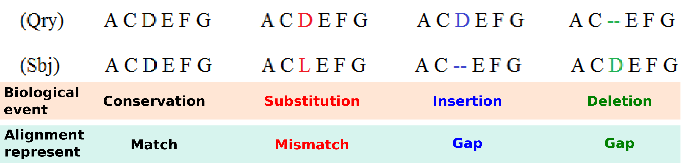
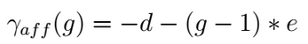

.. sidebar:: ToC

    .. contents::

.. _tutorial-datastructures-alignment-scoringschemes:

Scoring Schemes
===============

Learning Objective
  This tutorial introduces you to the scoring systems that can be used in SeqAn to quantify the sequence similarity.
  You will learn basic techniques to create and modify standard and custom scoring systems capable to satisfy the requirements of a wide range of applications.

Difficulty
  Basic

Duration
  45 min

Prerequisites
  :ref:`tutorial-getting-started-first-steps-in-seqan`, :ref:`tutorial-datastructures-sequences`, :ref:`tutorial-datastructures-alignment-alignment-gaps`

The alignment procedures are usually based on the sequences similarity computation described by an alignment scoring system that gives countable information used to determine which sequences are related and which are not.

Four main biological events must be considered during the sequence alignment:
Conservation, substitution, insertion and deletion.
We could have a Conservation when the two compared letters are the same and a Match is detected, a Substitution when we detect a Mismatch where a letter is aligned with another, and Insertion or Deletion when in one of the two aligned sequences a letter is aligned with a Gap.
Matches, mismatches and gaps detected during the alignment do not guarantee to be the most representative biological truth since their dispositions is dependent of the chosen scoring schemes and the selected alignment algorithm. In order to improve the correlation between computed sequence alignment and biological similarity, specific combinations of scoring schemes and alignment algorithms have been developed during the years and are usually adopted for the alignment of different types of biological sequences. For example, as we will see in the following, the small RNA sequences are usually aligned with a Global Alignment algorithm implementing a Simple Score scheme, differently from the protein sequences that are mostly aligned with the Local Alignment algorithm that uses a Substitution Matrix Score scheme.

Given an alignment structure that store the two sequences and a scoring scheme, the score of the alignment can be computed as the sum of the scores for aligned character pairs plus the sum of the scores for all gaps.

With refer to the alignment procedure a Scoring Scheme can be defined as the set of rules used to assess the possible biological events that must be considered during the alignment procedure.

In SeqAn are available several :dox:`Score scoring schemes` to evaluate matches and mismatches, while three different gap models can be applied to consider insertions and deletions events.
We will first introduce you to the scoring schemes used to evaluate match and mismatch. Subsequently, you will learn how to chose the gap model to be implemented in the chosen scoring scheme.

Match/Mismatch Evaluation
-------------------------

:dox:`SimpleScore Simple Score`
^^^^^^^^^^^^^^^^^^^^^^^^^^^^^^^

The simplest example of Scoring Scheme, usually applied to score the similarity among nucleotide sequences, is the Levenshtein distance model that assigns a score of 0 and -1 respectively if a match or a mismatch occurs, whereas a penalty value equal to -1 in case of gaps representing insertions or deletions (this scoring scheme is the default for :dox:`SimpleScore`).
Alternatively, also the Hamming distance model can be used for some simple tasks that do not require the gap evaluations.

Now, let's start by constructing our first scoring function for the global alignment algorithm called with the function :dox:`globalAlignment`.
As first step we need to include the header file ``<seqan/align.h>`` which contains the necessary data structures and functions associated with the alignments.
The next steps would be to implement the main function of our program and to define the types that we want to use.

.. includefrags:: demos/tutorial/alignment/scoring_scheme_simple.cpp
   :fragment: main

We first define the type of the input sequences (``TSequence``) and an :dox:`Align` object (``TAlign``) type to store the alignment.
For more information on the Align datastructure, please read the tutorial :ref:`tutorial-datastructures-alignment-alignment-gaps`.
After defining the types, we can continue to construct our own Align object.
First, we create two input sequences ``seq1 = "TELKDD"`` and ``seq2 = "LKTEL"``, then we define the scoring values for match, mismatch, gap.
As last we create the 'align' object and resize it to manage two :dox:`Gaps` objects, at this point we filled it with the sequences to be aligned.

.. includefrags:: demos/tutorial/alignment/scoring_scheme_simple.cpp
   :fragment: init

Now, we can compute the global alignment that makes use of the simple scoring function.
To do so, we simply call the function :dox:`globalAlignment` and give as input parameters the ``align`` object and the scoring scheme representing the Levenshtein distance.
The globalAlignment function fills the ``align`` object with the best computed alignment and returns the maximum score which we store in the ``score`` variable.
Afterwards, we print the computed score and the corresponding alignment.

.. includefrags:: demos/tutorial/alignment/scoring_scheme_simple.cpp
   :fragment: alignment

Congratulations!
You have created your global alignment implementing the simple scoring function, the output is as follows:

.. includefrags:: demos/tutorial/alignment/scoring_scheme_simple.cpp.stdout

However, in the evaluation of protein similarity or for advanced nucleotide alignments a more complex scoring model is generally applied.
It is based on the usage of a Substitution Matrix, proven to better describe from a biological point of view, events such as matches and mismatches.

Substitutional Matrices Score
^^^^^^^^^^^^^^^^^^^^^^^^^^^^^

Substitutional Matrices are built on the basis of the probability that a particular amino acid or nucleotide is replaced with another during the evolution process.
They assign to each pair a value that indicates their degree of similarities, obtained thanks to statistical methods reflecting the frequency of a particular substitution in homologous protein or RNA families. A positive value in the Substitutional Matrix means that the two letters share identical or similar properties.

These scoring schemes store a score value for each pair of characters. This value can be accessed using :dox:`Score#score`.
Examples for this kind of scoring scheme are :dox:`Pam120` and :dox:`Blosum62`.
Anyway the class :dox:`MatrixScore` can be used to store arbitrary scoring matrices for the creation of custom scoring systems, as shown in the example proposed in the :ref:`how-to-recipes-work-with-custom-score-matrices`.

Blosum matrix, is one of the most used Substitutional Matrix implemented by considering multiple alignments of evolutionarily divergent proteins, while Ribosum is the RNA counterpart computed using ribosomal sequences.

In the following example it is proposed the construction of a scoring function for a global alignment algorithm that uses the Blosum62 matrix to score the matched and mismatched letters.
As first we include the header file ``<seqan/align.h>`` which contains the necessary data structures and functions associated with the alignments, then we implement the main function of our program and define the types that we want to use.

.. includefrags:: demos/tutorial/alignment/scoring_scheme_matrix.cpp
   :fragment: main

The input sequences type ``TSequence`` and the :dox:`Align` object of type ``TAlign`` are defined and the two input sequences ``seq1 = "TELKDD"`` and ``seq2 = "LKTEL"`` together with the gap penalty are assigned. In this case we define only the gap value since the Blosum matrix will be used to score matches and mismatches.
Then the sequences are associated with the alignment object.

.. includefrags:: demos/tutorial/alignment/scoring_scheme_matrix.cpp
   :fragment: init

Now, we compute the global alignment function, providing as second parameter the tag referred to the Blosum62 matrix together with the gap costs.
To do so, we simply call the function :dox:`globalAlignment` and give as input parameters the ``align`` object and the Blosum62 scoring scheme.
The globalAlignment function returns the score of the best alignment, which we store in the ``score`` variable that is then printed together with the corresponding alignment.

.. includefrags:: demos/tutorial/alignment/scoring_scheme_matrix.cpp
   :fragment: alignment

The output of a global alignment implementing the Blosum62 scoring function is as follows:

.. includefrags:: demos/tutorial/alignment/scoring_scheme_matrix.cpp.stdout

.. note::
   As can be noted the output of this scoring scheme is completely different with respect to the output generated with the simple scoring scheme confirming that the scoring scheme choice is one of the most important step to achieve high quality alignments.

Gap Evaluation
--------------

In the previous sections we proposed two simple code examples useful to highlight the differences between two scoring schemes capable to evaluate match and mismatch events. In this section we will see the three gap models, implemented in the SeqAn library, to evaluate the insertion and deletion events.

Linear Gap Model
^^^^^^^^^^^^^^^^

The easiest is the Linear gap model that considers, for the alignment score computation, the gap length (g) giving the possibility to evaluate with different scores gaps of different sizes;

This gap model is chosen as standard when only a gap value is provided in the scoring function or when the two provided gaps have the same value. For instance, this gap model as been adopted during the alignment computation of the two proposed examples.

Affine Gap Model
^^^^^^^^^^^^^^^^

It has been proven that the first amino acid or nucleotide inserted/deleted (identified as gap open) found during the alignment operations is more significant, from a biological point of view, than the subsequent ones (called gap extension), making the so called Affine Gap model a viable solution for the alignment of biomolecules :cite:`cartwright2006logarithmic`.
Affine gap model that attribute different costs to the gap open (d) and the gap extension (e) events, is able to assign an higher penalty to the gap presence with respect to its relative length (g).

The Affine Gap model implemented in the DP alignment algorithms is however quite expensive both in terms of computational time as well as in terms of memory requirements with respect to other less demanding solutions such as the Linear Gap model application.

Dynamic Gap Model
^^^^^^^^^^^^^^^^^

In SeqAn is provided an optimised version of the Affine Gap model called Dynamic Gap Selector (DGS) designed by Urgese et al. :cite:`Urgese2014`. This new gap model can be used to reduce the computational time and the memory requirement while keeping the alignment scores close to those computed with the Affine Gap model.
The usage of Dynamic Gap model in the Global alignment computation of long strings can give results slightly different from those computed using Affine Gap model since the alignment matrix became bigger and different alignment paths can be chosen during the alignment procedure. Score variation are rare when Dynamic Gap model is used in the Local alignments.

Example Affine vs Dynamic
^^^^^^^^^^^^^^^^^^^^^^^^^

.. tip::

   The order of the different costs in the scoring scheme is ``match``, ``mismatch``, ``gapExtend`` and ``gapOpen``.
   The gap model selection can be done providing one of the three specific tags (``LinearGaps()``, ``AffineGaps()`` or ``DynamicGaps()``) as last parameter in the scoring function creation. If you want to use Linear Gap costs you could also omit the last parameter ``gapOpen`` and the scoring scheme would automatically choose the Linear Gap cost function.
   The Affine Gap model is chosen as standard when the gap costs are different and the gap model tag is not provided. If the Dynamic Gap model is required the relative tag must be supplied.

In the following we propose an example where two different scoring functions have been created to show how to call a global alignment algorithm that uses the Blosum62 plus the ``AffineGaps()`` and ``DynamicGaps()`` specializations.
The inclusion of the header and the type definition is identical to the previous examples.

.. includefrags:: demos/tutorial/alignment/scoring_scheme_affine_dgs.cpp
   :fragment: main

The input sequences type and the :dox:`Align` object of type ``TAlign`` are then create and initialized. As can be noted we define two different gap values, one for the gap extension and one for the gap open. Even in this example the Blosum62 will be used to score match and substitutions events.

.. includefrags:: demos/tutorial/alignment/scoring_scheme_affine_dgs.cpp
   :fragment: init

Now, we can compute the global alignment function providing as second parameter the tag referred to the Blosum62 matrix filled with the two different gap costs. Moreover, the tag for the gap model selection is provided.
To do so, we simply call the function :dox:`globalAlignment` and give as input parameters the ``align`` object, the Blosum62 scoring scheme and the ``AffineGaps()`` or ``DynamicGaps()`` tag.
The globalAlignment function output is then printed.

.. includefrags:: demos/tutorial/alignment/scoring_scheme_affine_dgs.cpp
   :fragment: alignment

The output of a global alignment implementing the Blosum62 with the two gap models is as follows:

.. includefrags:: demos/tutorial/alignment/scoring_scheme_affine_dgs.cpp.stdout

.. tip::

  The functions :dox:`SimpleScore#scoreMatch` and :dox:`SimpleScore#scoreMismatch` access values for match and mismatch.
  The function :dox:`SimpleScore#scoreGap`, or :dox:`SimpleScore#scoreGapExtend` and :dox:`SimpleScore#scoreGapOpen` access values for gaps.
