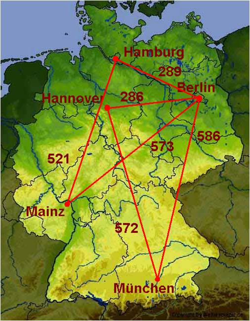

.. sidebar:: ToC

    .. contents::

.. _tutorial-datastructures-graphs:

Graphs
======

Learning Objective
  This tutorial shows how to use graphs in SeqAn and their functionality.

Difficulty
  Average

Duration
  1 h

Prerequisites
  :ref:`tutorial-datastructures-sequences`, :ref:`tutorial-datastructures-alignment`, :ref:`tutorial-algorithms-alignment-pairwise-sequence-alignment`

Overview
--------

A graph in computer science is an ordered pair :math:`G = (V, E)` of a set of vertices V and a set of edges E.
SeqAn provides different :dox:`Graph types of graphs` and the most well-known graph algorithms as well as some specialized alignment graph algorithms.
In this part of the tutorial, we demonstrate how to construct a graph in SeqAn and show the usage of some algorithms.
Alignment graphs are described in the tutorial :ref:`tutorial-datastructures-alignment`.

Let us follow a simple example.
We have given the following network of five cities and in this network we want to compute the shortest path from Hannover to any other city.

In the section `Graph Basics`_, we will create the network and write the graph to a `.dot` file.
The section `Property Maps`_ assigns city names to the vertices and `Graph Iterators`_ demonstrates the usage of a vertex iterator.

After having worked through these sections you should be familiar with the general usage of graphs in SeqAn. You are then prepared to proceed with :ref:`tutorial-algorithms-graph-algorithms`, where we will compute the shortest path by calling a single function.

Graph Basics
------------

The general header file for all types of graphs is ``<seqan/graph_types.h>``.
It comprises the :dox:`Graph` class, its specializations, every function for basic graph operations and different iterators.
Later, for computing the shortest path we will also need ``<seqan/graph_algorithms.h>`` which includes the implementations of most of SeqAn's graph algorithms.

.. includefrags:: demos/tutorial/graph/graph_dijkstra.cpp
   :fragment: includes

We want to model the network of cities as an undirected graph and label the edges with distances.
Before we start creating edges and vertices, we need some typedefs to specify the graph type.

SeqAn offers different specializations of the class :dox:`Graph`: :dox:`UndirectedGraph Undirected Graph`, :dox:`DirectedGraph`, :dox:`Tree`, :dox:`WordGraph Word Graph`, :dox:`Automaton`, :dox:`HmmGraph`, and :dox:`AlignmentGraph Alignment Graph`.
For our example, an undirected graph will be sufficient, so we define our own graph type ``TGraph`` with the specialization :dox:`UndirectedGraph Undirected Graph` of the class :dox:`Graph`.
Luckily, this specialization has an optional cargo template argument, which attaches any kind of object to the edges of the graph.
This enables us to store the distances between the cities, our edge labels, using the cargo type ``TCargo`` defined as ``unsigned int``.
Using the cargo argument, we have to provide a distance when adding an edge.
And when we remove an edge we also remove the distance.

.. includefrags:: demos/tutorial/graph/graph_dijkstra.cpp
   :fragment: main-typedefs

Each vertex and each edge in a graph is identified by a so-called descriptor.
The type of the descriptors is returned by the metafunction :dox:`VertexDescriptor`.
In our example, we define a type ``TVertexDescriptor`` by calling :dox:`VertexDescriptor` on our graph type.
Analogously, there is the metafunction :dox:`Graph#EdgeDescriptor` for edge descriptors.

We can now create the graph ``g`` of our type ``TGraph``.

.. includefrags:: demos/tutorial/graph/graph_dijkstra.cpp
   :fragment: create-g

For our example, we add five vertices for the five cities, and six edges connecting the cities.

Vertices can be added to ``g`` by a call to the function :dox:`Graph#addVertex`.
The function returns the descriptor of the created vertex.
These descriptors are needed to add the edges afterwards.

.. includefrags:: demos/tutorial/graph/graph_dijkstra.cpp
   :fragment: create-vertices

The function :dox:`Graph#addEdge` adds an edge to the graph.
The arguments of this function are the graph to which the edge is added, the vertices that it connects, and the cargo (which is in our case the distance between the two cities).

.. includefrags:: demos/tutorial/graph/graph_dijkstra.cpp
   :fragment: create-edges

Once we have created the graph we may want to have a look at it.
SeqAn offers the possibility to write a graph to a dot file.
With a tool like `Graphviz <http://www.graphviz.org/>`_ you can then visualize the graph.

The only thing that we have to do is to call the function :dox:`Graph#write` on a file stream with the tag ``DotDrawing()`` and pass over our graph ``g``.

.. includefrags:: demos/tutorial/graph/graph_dijkstra.cpp
   :fragment: main-graph-io

After executing this example, there should be a file ``graph.dot`` in your directory.

Alternatively, you can use the standard output to print the graph to the screen:

.. includefrags:: demos/tutorial/graph/graph_dijkstra.cpp
   :fragment: alternatively-graph-io

Assignment 1
^^^^^^^^^^^^

.. container:: assignment

   Type
     Review

   Objective
     Copy the code from above and adjust it such that a road trip from Berlin via Hamburg and Hannover to Munich is simulated.

   Hints
     Use directed Edges

   Solution
     Click **more...** to see the solution.

     .. container:: foldable

		.. includefrags:: demos/tutorial/graph/solution_1.cpp

		The output is the following:

		.. includefrags:: demos/tutorial/graph/solution_1.cpp.stdout

.. _tutorial-datastructures-graphs-assignment-2:

Assignment 2
^^^^^^^^^^^^

.. container:: assignment

   Type
     Application

   Objective
      Write a program which creates a directed graph with the following edges:

      **(1,0), (0,4), (2,1), (4,1), (5,1), (6,2), (3,2), (2,3), (7,3), (5,4), (6,5), (5,6), (7,6), (7,7)**

      Use the function :dox:`Graph#addEdges` instead of adding each edge separately.
      Output the graph to the screen.

   Solution
     Click **more...** to see the solution.

     .. container:: foldable

		We first have to include the corresponding header file for graphs.
		Instead of ``<seqan/graph_types.h>``, we can also include ``<seqan/graph_algorithms.h>`` as it already includes ``<seqan/graph_types.h>``.

		.. includefrags:: demos/tutorial/graph/graph_algo_scc.cpp
		   :fragment: includes

		This time we define a :dox:`DirectedGraph` without cargo at the edges.

		.. includefrags:: demos/tutorial/graph/graph_algo_scc.cpp
		   :fragment: typedefs

		The function :dox:`Graph#addEdges` takes as parameters an array of vertex descriptors and the number of edges.
		The array of vertex descriptors is sorted in the way predecessor1, successor1, predecessor2, successor2, ...

		.. includefrags:: demos/tutorial/graph/graph_algo_scc.cpp
		   :fragment: main-graph-construction

		The screen output of the graph consists of an adjacency list for the vertices and an edge list:

		.. includefrags:: demos/tutorial/graph/graph_algo_scc.cpp.stdout
		   :fragment: main-graph-construction

.. _tutorial-datastructures-graphs-assignment-3:

Assignment 3
^^^^^^^^^^^^

.. container:: assignment

   Type
     Transfer

   Objective
     Write a program which defines an HMM for DNA sequences:

     * Define an **exon**, **splice**, and **intron** state.
     * Sequences always start in the exon state.
       The probability to stay in an exon or intron state is **0.9**.
       There is exactly one switch from exon to intron.
       Between the switch from exon to intron state, the HMM generates exactly one letter in the splice state.
       The sequence ends in the intron state with a probability of **0.1**.
     * Consider to use the type :dox:`LogProb` for the transition probabilities.
     * Output the HMM to the screen.
     * Use the follwing emission probabilities.

       +------------------+------+------+------+------+
       |                  | A    | C    | G    | T    |
       +==================+======+======+======+======+
       | **exon state**   | 0.25 | 0.25 | 0.25 | 0.25 |
       +------------------+------+------+------+------+
       | **splice state** | 0.05 | 0.0  | 0.95 | 0.0  |
       +------------------+------+------+------+------+
       | **intron state** | 0.4  | 0.1  | 0.1  | 0.4  |
       +------------------+------+------+------+------+

   Solution
     .. container:: foldable

	The program starts with the inclusion of ``<seqan/graph_algorithms.h>``.
	In this example you could include ``<seqan/graph_types.h>`` instead of the algorithms header file.
	However, it is likely that if you define a graph, you will call a graph algorithm as well.

	.. includefrags:: demos/tutorial/graph/graph_hmm.cpp
	   :fragment: includes

	Next, we define our types.
	The most interesting type here is ``THmm``.
	It is a :dox:`Graph` with the specialization :dox:`HmmGraph`.
	The specialization takes itself three template arguments: the alphabet of the sequence that the HMM generates, the type of the transitions, and again a specialization.
	In our case, we define the transitions to be the logarithm of the probilities (:dox:`LogProb`) and hereby simplify multiplications to summations.
	For the specialization we explicitly use the ``Default`` tag. The default tag can always be omitted but it shows the possibility of further specialization.

	.. includefrags:: demos/tutorial/graph/graph_hmm.cpp
	   :fragment: typedefs

	After that, we define some variables, especially one of our type ``THmm``.

	.. includefrags:: demos/tutorial/graph/graph_hmm.cpp
	   :fragment: variables

	Now we can start with defining the states.
	States are represented by the vertices of the HMM-specialized graph.

	The initial and terminating states of an HMM in SeqAn are always silent, i.e. they do not generate characters.
	That is why we have to define an extra begin state and tell the program that this is the initial state of the HMM.
	The latter is done by calling the function :dox:`HmmGraph#assignBeginState`.

	.. includefrags:: demos/tutorial/graph/graph_hmm.cpp
	   :fragment: begin-state

	For our three main states we also add a vertex to the HMM with :dox:`Graph#addVertex`.
	Additionally, we assign the emission probabilities for all possible characters of our alphabet using :dox:`HmmGraph#emissionProbability`.

	.. includefrags:: demos/tutorial/graph/graph_hmm.cpp
	   :fragment: main-states-emissions

	Finally, we need to define the end state and call :dox:`HmmGraph#assignEndState`.

	.. includefrags:: demos/tutorial/graph/graph_hmm.cpp
	   :fragment: end-state

	For the HMM, only the transition probabilities are still missing.
	A transition is represented by an edge of our HMM graph type.
	The cargo on these edges correspond to the transition probabilities.

	Since the sequences always start with an exon, we set the transition probability from the begin state to the exon state to 1.0 calling the already well-known function :dox:`Graph#addEdge`.
	And also the other transitions can be defined in the same way.

	.. includefrags:: demos/tutorial/graph/graph_hmm.cpp
	   :fragment: transitions

	To check the HMM we can simply output it to the screen:

	.. includefrags:: demos/tutorial/graph/graph_hmm.cpp
	   :fragment: print-model

	This should yield the following:

	.. includefrags:: demos/tutorial/graph/graph_hmm.cpp.stdout
	   :fragment: print-model

Property Maps
-------------

So far, the vertices in our graph can only be distinguished by their vertex descriptor.
We will now see how to associate the city names with the vertices.

SeqAn uses :dox:`PropertyMapConcept Property Maps` to attach auxiliary information to the vertices and edges of a graph.
The cargo parameter that we used above associated distances to the edges.
In most scenarios you should use an external property map to attach information to a graph.
Be aware that the word external is a hint that the information is stored independently of the graph and functions like :dox:`Graph#removeVertex` do not affect the property map.
Property maps are simply :dox:`String Strings` of a property type and are indexed via the already well-known vertex and edge descriptors.

Lets see how we can define a vertex property map for the city names.
Our property type is a :dox:`String` of a city name, more explicitly a char string. The vertex property map should hold several names so we define a String of Strings.
Now, we only have to create and :dox:`Graph#resizeVertexMap resize` this map so that it can hold information on all vertices.

.. includefrags:: demos/tutorial/graph/graph_dijkstra.cpp
   :fragment: definition-property-map

Next, we can enter the city names for each vertex.
Note that this is completely independent from our graph object ``g``.

.. includefrags:: demos/tutorial/graph/graph_dijkstra.cpp
   :fragment: enter-properties

If we now want to output all vertices including their associated information we can iterate through the graph and use the iterators value to access the information in the property map.

Graph Iterators
---------------

Let us have a quick look at iterators for graph types.
SeqAn provides six different specializations for graph iterators: :dox:`VertexIterator Vertex Iterator`, :dox:`AdjacencyIterator Adjacency Iterator`, :dox:`DfsPreorderIterator Dfs Preorder Iterator`, and :dox:`BfsIterator Bfs Iterator` for traversing vertices, and :dox:`EdgeIterator Edge Iterator` and :dox:`OutEdgeIterator Out-edge Iterator` for traversing edges.
Except for the :dox:`VertexIterator Vertex Iterator` and the :dox:`EdgeIterator Edge Iterator` who only depend on the graph, all other graph iterators depend additionally on a specified edge or vertex.

To output all vertices of our graph in an arbitrary order, we can define an iterator of the specialization :dox:`VertexIterator Vertex Iterator` and determine its type with the metafunction :dox:`ContainerConcept#Iterator`.
The functions :dox:`RootedIteratorConcept#atEnd` and :dox:`InputIteratorConcept#goNext` also work for graph iterators as for all other iterators in SeqAn.

The :dox:`IteratorAssociatedTypesConcept#value` of any type of vertex iterator is the vertex descriptor.
To print out all city names we have to call the function :dox:`PropertyMapConcept#getProperty` on our property map ``cityNames`` with the corresponding vertex descriptor that is returned by the value function.

.. includefrags:: demos/tutorial/graph/graph_dijkstra.cpp
   :fragment: iterate-and-output-properties

The output of this piece of code should look as follows:

.. includefrags:: demos/tutorial/graph/graph_dijkstra.cpp.stdout
   :fragment: iterate-and-output-properties

Assignment 4
^^^^^^^^^^^^

.. container:: assignment

   Type
     Application

   Objective
     Add a vertex map to the program from assignment 2:

     #. The map shall assign a lower-case letter to each of the seven vertices.
        Find a way to assign the properties to all vertices at once in a single function call (*without* using the function :dox:`PropertyMapConcept#assignProperty` for each vertex separately).
     #. Show that the graph is not connected by iterating through the graph in depth-first-search ordering.
        Output the properties of the reached vertices.

   Hint
     .. container:: foldable

        * Use an array and the function :dox:`Graph#assignVertexMap` to assign all properties at once.
        * Use the :dox:`DfsPreorderIterator DFS Iterator` for depth-first-search ordering.

   Solution
     .. container:: foldable

        Our aim is to assign all properties at once to the vertices.
        Therefore, we create an array containing all the properties, the letters `'a'` through `'h'`.

        The function :dox:`Graph#assignVertexMap` does not only resize the vertex map (as :dox:`Graph#resizeVertexMap` does) but also initializes it.
        If we specify the optional parameter ``prop``, the values from the array ``prop`` are assigned to the items in the property map.

        .. includefrags:: demos/tutorial/graph/graph_algo_scc.cpp
            :fragment: vertex-map

        To iterate through the graph in depth-first-search ordering we have to define an :dox:`ContainerConcept#Iterator` with the specialization :dox:`DfsPreorderIterator`.

        The vertex descriptor of the first vertex is ``0`` and we choose this vertex as a starting point for the depth-first-search through our graph ``g`` with the iterator ``dfsIt``:

        .. includefrags:: demos/tutorial/graph/graph_algo_scc.cpp
            :fragment: iterate-dfs

        For the chosen starting point, only two other vertices can be reached:

        .. includefrags:: demos/tutorial/graph/graph_algo_scc.cpp.stdout
            :fragment: iterate-dfs
