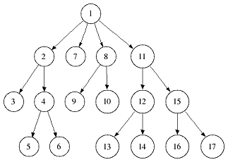
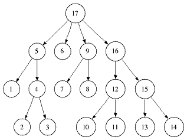

.. sidebar:: ToC

    .. contents::

.. _tutorial-datastructures-indices-index-iterators:

Index Iterators
===============

Learning Objective
  You will know the different kinds of index indices and how to use them for searching.

Difficulty
  Average

Duration
  1.5 h

Prerequisites
  :ref:`tutorial-datastructures-sequences`

Virtual String Tree Iterator
----------------------------

SeqAn provides a common interface, called the Virtual String Tree Iterator (:dox:`VSTreeIterator VSTree Iterator`), which lets you traverse the :dox:`IndexSa`, :dox:`IndexEsa`, :dox:`IndexWotd` and :dox:`IndexDfi` as a suffix tree (:ref:`tutorial-datastructures-indices` definition), the :dox:`IndexQGram` as a suffix trie, and the :dox:`FMIndex` as a prefix trie.
In the first part of this tutorial we will concentrate on the :dox:`TopDownIterator TopDown Iterator` which is one of the two index iterator specializations (besides the :dox:`BottomUpIterator BottomUp Iterator`).
The second part will then deal with the DFS.

Top-Down Iteration
------------------

For index based pattern search or algorithms traversing only the upper parts of the suffix tree the :dox:`TopDownIterator TopDown Iterator` or :dox:`TopDownHistoryIterator TopDown History Iterator` is the best solution.
Both provide the functions :dox:`TopDownIterator#goDown` and :dox:`TopDownIterator#goRight` to go down to the first child node or go to the next sibling.
The :dox:`TopDownHistoryIterator TopDown History Iterator` additionally provides :dox:`TopDownHistoryIterator#goUp` to go back to the parent node.
The child nodes in :dox:`IndexEsa` indices are lexicographically sorted from first to last.
For :dox:`IndexWotd` and :dox:`IndexDfi` indices this holds for all children except the first.

In the next example we want to use the :dox:`TopDownIterator TopDown Iterator` to efficiently search a text for exact matches of a pattern.
We therefore want to use :dox:`TopDownIterator#goDown` which has an overload to go down an edge beginning with a specific character.

.. important::

   The following examples show how to iterate :dox:`IndexSa`, :dox:`IndexEsa`, :dox:`IndexWotd` or :dox:`IndexDfi`, i.e. :dox:`Index` specializations representing suffix trees.
   The result of the iteration will look different on :dox:`Index` specializations representing tries, e.g. :dox:`FMIndex` or :dox:`IndexQGram`.
   Indeed, the topology of an :dox:`Index` changes depending on the chosen tree or trie specialization.
   Note that any suffix tree edge can be labeled by more than one character, whereas any trie edge is always labeled by exactly one character.

First we create an index of the text ``"How much wood would a woodchuck chuck?"``

.. includefrags:: demos/tutorial/index_iterators/index_search.cpp
   :fragment: initialization

Afterwards we create the :dox:`TopDownIterator TopDown Iterator` using the metafunction Iterator, which expects two arguments, the type of the container to be iterated and a specialization tag (see the VSTree Iterator hierarchy and the :ref:`tutorial-datastructures-sequences-strings-and-segments-iterators` Tutorial for more details).

.. includefrags:: demos/tutorial/index_iterators/index_search.cpp
   :fragment: iterator

The main search can then be implemented using the functions :dox:`VSTreeIterator#repLength` and :dox:`VSTreeIterator#representative`.
Since :dox:`TopDownIterator#goDown` might cover more than one character (when traversing trees) it is necessary to compare parts of the pattern against the representative of the iterator.
The search can now be implemented as follows.
The algorithm descends the suffix tree along edges beginning with the corresponding pattern character.
In each step the ``unseen`` edge characters have to be verified.

.. includefrags:: demos/tutorial/index_iterators/index_search.cpp
   :fragment: iteration

If all pattern characters could successfully be compared we end in the topmost node who's leaves point to text positions starting with the pattern.
Thus, the suffixes represented by this node are the occurrences of our pattern and can be retrieved with :dox:`VSTreeIterator#getOccurrences`.

.. includefrags:: demos/tutorial/index_iterators/index_search.cpp
   :fragment: output

Program output:

.. includefrags:: demos/tutorial/index_iterators/index_search.cpp.stdout

Alternatively, we could have used :dox:`TopDownIterator#goDown` to go down the path of the entire pattern instead of a single characters:

.. includefrags:: demos/tutorial/index_iterators/index_search2.cpp
   :fragment: output

.. includefrags:: demos/tutorial/index_iterators/index_search2.cpp.stdout

.. tip::

   When implementing recursive algorithms such as an approximate search using backtracking, we recommend the use of the :dox:`TopDownIterator` without history.
   By passing the iterator by value, the history is stored implicitly on the call stack.

Assignment 1
^^^^^^^^^^^^

.. container:: assignment

   Type
     Review

   Objective
     Copy the code into a demo program and replace the text with a string set containing the strings ``"How much"``,``"wood would"`` and ``" a woodchuck chuck?"``.

   Solution
     .. container:: foldable

        .. includefrags:: demos/tutorial/index_iterators/iterator_solution1.cpp

	The difference is the format of the positions of the found occurrences.
        Here, we need a :dox:`Pair` to indicate the string within the :dox:`StringSet` and a position within the string.

Assignment 2
^^^^^^^^^^^^

.. container:: assignment

   Type
     Review

   Objective
     Write a program that traverses the nodes of the suffix tree of ``"mississippi"`` in the order shown here:

     .. image:: preOrder.png
	:align: center
	:width: 300px

     At each node print the text of the edges from the root to the node.
     You may only use the functions :dox:`TopDownIterator#goDown`, :dox:`TopDownIterator#goRight`, :dox:`TopDownHistoryIterator#goUp` and :dox:`VSTreeIterator#isRoot` to navigate and :dox:`VSTreeIterator#representative` which returns the string that represents the node the iterator points to.

   Hint
     * Use a :dox:`TopDownHistoryIterator TopDown History Iterator`.
     * The code skeleton could look like this:

       .. includefrags:: demos/tutorial/index_iterators/iterator_assignment2.cpp

   Solution
     .. container:: foldable

         One iteration step of a preorder DFS can be described as follows:

            - if possible, go down one node
            - if not:

                - if possible, go to the next sibling
                - if not:

                    - go up until it is possible to go to a next sibling
                    - stop the whole iteration after reaching the root node

         Thus, the DFS walk can be implemented in the following way:

            .. includefrags:: demos/tutorial/index_iterators/iterator_solution2.cpp

Assignment 3
^^^^^^^^^^^^

.. container:: assignment

   Type
     Review

   Objective
     Modify the program to efficiently skip nodes with representatives longer than 3.
     Move the whole program into a template function whose argument specifies the index type and call this function twice, once for the :dox:`IndexEsa` and once for the :dox:`IndexWotd` index.

   Solution
     .. container:: foldable

	We modify the DFS traversal to skip the descent if we walk into a node whose representative is longer than 3.
	We then proceed to the right and up as long as the representative is longer than 3.

	.. includefrags:: demos/tutorial/index_iterators/iterator_solution3.cpp
	   :fragment: iteration

	.. includefrags:: demos/tutorial/index_iterators/iterator_solution3.cpp.stdout

Bidirectional Top-Down Iteration
--------------------------------

The :dox:`FMIndex` supports bidirectional iteration, i.e. a pattern can be extended to the left or right in an arbitrary order.
This is done by maintaining iterators on two separate indices, one on the original and one on the reversed text and keeping both iterators synchronized at all times.
The interface is similar to what you learned in the previous section.
All methods are extended by an additional tag specifying which iterator you want to use.
Going down the original iterator using the *Fwd* tag extends the pattern to the left (since the FMIndex is traversed as a prefix trie).
Using the *Rev* tag accesses the reversed text iterator and extends the pattern to the right.

Creating the index and iterator is very similar to unidirectional indices.
The FMIndex is wrapped in a BidirectionalIndex tag:

.. includefrags:: demos/tutorial/index_iterators/index_bidirectional_search.cpp
   :fragment: Create

All methods for traversing the virtual trie are extended by the direction tag *Fwd* or *Rev*.
If none is used, it will access the iterator on the original text by default (same as using the *Fwd* tag).
The *goUp* method is the only method that does not specify a direction tag.
*goUp* corresponds to an undo operation, i.e. it rolls both iterators back to their previous states.

.. includefrags:: demos/tutorial/index_iterators/index_bidirectional_search.cpp
   :fragment: Search

Please bear in mind that you can also choose whether you want to retrieve the positions of hits in the original or reversed text:

.. includefrags:: demos/tutorial/index_iterators/index_bidirectional_search.cpp
   :fragment: output

The output would be:

.. includefrags:: demos/tutorial/index_iterators/index_bidirectional_search.cpp.stdout

Depth-First Search
------------------

The tree traversal in assignment 2 is equal to a the tree traversal in a full depth-first search (dfs) over all suffix tree nodes beginning either in the root (preorder dfs) or in a leaf node (postorder dfs).
A preorder traversal (:ref:`figure-stree-preorder`) halts in a node when visiting it for the first time whereas a postorder traversal (:ref:`figure-stree-postorder`) halts when visiting a node for the last time.
The following two figures give an example in which order the tree nodes are visited.

.. _figure-stree-preorder:

   Preorder DFS

.. _figure-stree-postorder:

   Postorder DFS

Since these traversals are frequently needed SeqAn provides special iterators which we will describe next.

We want to construct the suffix tree of the string "abracadabra" and output the substrings represented by tree nodes in preorder dfs.
In order to do so, we create the string "abracadabra" and an index specialized with the type of this string.

.. includefrags:: demos/tutorial/index_iterators/index_preorder.cpp
   :fragment: includes

The :dox:`StringTreeConcept#Iterator` metafunction expects two arguments, the type of the container to be iterated and a specialization tag, as described earlier.
In this example we chose a :dox:`TopDownHistoryIterator TopDown History Iterator` whose signature in the second template argument is ``TopDown< ParentLinks<Preorder> >``.

.. includefrags:: demos/tutorial/index_iterators/index_preorder.cpp
   :fragment: initialization

As all DFS suffix tree iterators implement the :dox:`VSTreeIterator VSTree Iterator`, they can be used via :dox:`VSTreeIterator#goNext`, :dox:`VSTreeIterator#atEnd`, etc.

.. includefrags:: demos/tutorial/index_iterators/index_preorder.cpp
   :fragment: iteration

Program output:

.. includefrags:: demos/tutorial/index_iterators/index_preorder.cpp.stdout

.. tip::

   There are currently 2 iterators in SeqAn supporting a DFS search:

   +--------------------------------+----------+-----------+
   | Iterator                       | Preorder | Postorder |
   +================================+==========+===========+
   | :dox:`BottomUpIterator`        | no       | yes       |
   +--------------------------------+----------+-----------+
   | :dox:`TopDownHistoryIterator`  | yes      | yes       |
   +--------------------------------+----------+-----------+

   If solely a postorder traversal is needed the :dox:`BottomUpIterator BottomUp Iterator` should be preferred as it is more memory efficient.
   Please note that the BottomUp Iterator is only applicable to :dox:`IndexEsa` indices.

.. tip::

   A relaxed suffix tree (see :ref:`tutorial-datastructures-indices`) is a suffix tree after removing the $ characters and empty edges.
   For some bottom-up algorithms it would be better not to remove empty edges and to have a one-to-one relationship between leaves and suffices.
   In that cases you can use the tags PreorderEmptyEdges or PostorderEmptyEdges instead of Preorder or Postorder or EmptyEdges for the TopDown Iterator.

Note that the :dox:`VSTreeIterator#goNext` is very handy as it simplifies the tree traversal in assignment 2 greatly.

Assignment 4
^^^^^^^^^^^^

.. container:: assignment

   Type
     Review

   Objective
     Write a program that constructs an index of the :dox:`StringSet` "tobeornottobe", "thebeeonthecomb", "beingjohnmalkovich" and outputs the strings corresponding to suffix tree nodes in postorder DFS.

   Solution
     .. container:: foldable

	First we have to create a :dox:`StringSet` of :dox:`CharString` (shortcut for ``String<char>``) and append the 3 strings to it.
	This could also be done by using :dox:`StringConcept#resize` and then assigning the members with ``operator[]``.
	The first template argument of the index class has to be adapted and is now a StringSet.

	.. includefrags:: demos/tutorial/index_iterators/index_assignment1.cpp
	   :fragment: initialization

	To switch to postorder DFS we have to change the specialization tag of ``ParentLinks`` from ``Preorder`` to ``Postorder``.
	Please note that the :dox:`TopDownHistoryIterator` always starts in the root node, which is the last postorder DFS node.
	Therefore, the iterator has to be set explicitly to the first DFS node via :dox:`VSTreeIterator#goBegin`.

	.. includefrags:: demos/tutorial/index_iterators/index_assignment1.cpp
	   :fragment: iteration1

	Alternatively with a :dox:`TopDownHistoryIterator` you also could have used a :dox:`BottomUpIterator` with the same result.
	The BottomUp Iterator automatically starts in the first DFS node as it supports no random access.

	.. includefrags:: demos/tutorial/index_iterators/index_assignment1.cpp
	   :fragment: iteration2

	Program output:

	.. includefrags:: demos/tutorial/index_iterators/index_assignment1.cpp.stdout

As the last assignment lets try out one of the specialized iterators, which you can find at the bottom of this page.
Look there for the specialization which iterates over all maximal unique matches (MUMS).

Assignment 5
^^^^^^^^^^^^

.. container:: assignment

   Type
     Review

   Objective
     Write a program that outputs all maximal unique matches (MUMs) between ``"CDFGHC"`` and ``"CDEFGAHC"``.

   Solution
     .. container:: foldable

	Again, we start to create a :dox:`StringSet` of :dox:`CharString` and append the 2 strings.

	.. includefrags:: demos/tutorial/index_iterators/index_assignment2.cpp
	   :fragment: initialization

	After that we simply use the predefined iterator for searching MUMs, the :dox:`MumsIterator`.
	Its constructor expects the index and optionally a minimum MUM length as a second parameter.
	The set of all MUMs can be represented by a subset of suffix tree nodes.
	The iterator will halt in every node that is a MUM of the minimum length.
	The corresponding match is the node's :dox:`VSTreeIterator#representative`.

	.. includefrags:: demos/tutorial/index_iterators/index_assignment2.cpp
	   :fragment: iteration

	Program output:

	.. includefrags:: demos/tutorial/index_iterators/index_assignment2.cpp.stdout

Accessing Suffix Tree Nodes
---------------------------

In the previous subsection we have seen how to walk through a suffix tree.
We now want to know what can be done with a suffix tree iterator.
As all iterators are specializations of the general VSTree Iterator class, they inherit all of its functions.
There are various functions to access the node the iterator points at (some we have already seen), so we concentrate on the most important ones.

:dox:`VSTreeIterator#representative`
  returns the substring that represents the current node, i.e. the concatenation of substrings on the path from the root to the current node

:dox:`VSTreeIterator#getOccurrence`
  returns a position where the representative occurs in the text

:dox:`VSTreeIterator#getOccurrences`
  returns a string of all positions where the representative occurs in the text

:dox:`VSTreeIterator#isRightTerminal`
  tests if the representative is a suffix in the text (corresponds to the shaded nodes in the :ref:`tutorial-datastructures-indices` figures)

:dox:`VSTreeIterator#isLeaf`
  tests if the current node is a tree leaf

:dox:`TopDownIterator#parentEdgeLabel`
  returns the substring that represents the edge from the current node to its parent (only TopDownHistory Iterator)

.. important::

   There is a difference between the functions isLeaf and isRightTerminal.
   In a relaxed suffix tree (see :ref:`tutorial-datastructures-indices`) a leaf is always a suffix, but not vice versa, as there can be internal nodes a suffix ends in.
   For them isLeaf returns false and isRightTerminal returns true.

Property Maps
-------------

Some algorithms require to store auxiliary information (e.g. weights, scores) to the nodes of a suffix tree.
To attain this goal SeqAn provides so-called property maps, simple Strings of a property type.
Before storing a property value, these strings must first be resized with :dox:`StringTreeConcept#resizeVertexMap`.
The property value can then be assigned or retrieved via :dox:`VSTreeIterator#assignProperty`, :dox:`VSTreeIterator#getProperty`, or :dox:`VSTreeIterator#property`.
It is recommended to call :dox:`StringTreeConcept#resizeVertexMap` prior to every call of :dox:`VSTreeIterator#assignProperty` to ensure that the property map has sufficient size.
The following example iterates over all nodes in preorder dfs and recursively assigns the node depth to each node.
First we create a :dox:`String` of ``int`` to store the node depth for each suffix tree node.

.. includefrags:: demos/tutorial/index_iterators/index_property_maps.cpp
   :fragment: initialization

The main loop iterates over all nodes in preorder DFS, i.e. parents are visited prior children.
The node depth for the root node is 0 and for all other nodes it is the parent node depth increased by 1.
The functions :dox:`VSTreeIterator#assignProperty`, :dox:`VSTreeIterator#getProperty` and :dox:`VSTreeIterator#property` must be called with a :dox:`StringTreeConcept#VertexDescriptor`.
The vertex descriptor of the iterator node is returned by :dox:`VSTreeIterator#value` and the descriptor of the parent node is returned by :dox:`TopDownIterator#nodeUp`.

.. includefrags:: demos/tutorial/index_iterators/index_property_maps.cpp
   :fragment: iteration

At the end we again iterate over all nodes and output the calculated node depth.

.. includefrags:: demos/tutorial/index_iterators/index_property_maps.cpp
   :fragment: output

Program output:

.. includefrags:: demos/tutorial/index_iterators/index_property_maps.cpp.stdout

.. tip::

   In SeqAn there is already a function :dox:`TopDownHistoryIterator#nodeDepth` defined to return the node depth.

Additional iterators
--------------------

By now, we know the following iterators (:math:`n` = text size, :math:`\sigma` = alphabet size, :math:`d` = tree depth):

+---------------------------------+------------------------------------------+------------------------+---------------------+
| Iterator specialization         | Description                              | Space                  | Index tables        |
+=================================+==========================================+========================+=====================+
| :dox:`BottomUpIterator`         | postorder dfs                            | :math:`\mathcal{O}(d)` | SA, LCP             |
+---------------------------------+------------------------------------------+------------------------+---------------------+
| :dox:`TopDownIterator`          | can go down and go right                 | :math:`\mathcal{O}(1)` | SA, Lcp, Childtab   |
+---------------------------------+------------------------------------------+------------------------+---------------------+
| :dox:`TopDownHistoryIterator`   | can also go up, preorder/postorder dfs   | :math:`\mathcal{O}(d)` | SA, Lcp, Childtab   |
+---------------------------------+------------------------------------------+------------------------+---------------------+

Besides the iterators described above, there are some
application-specific iterators in SeqAn:

+------------------------------------+------------------------------------------+-------------------------------+------------------------+
| Iterator specialization            | Description                              | Space                         | Index tables           |
+====================================+==========================================+===============================+========================+
| :dox:`MaxRepeatsIterator`          | maximal repeats                          | :math:`\mathcal{O}(n)`        | SA, Lcp, Bwt           |
+------------------------------------+------------------------------------------+-------------------------------+------------------------+
| :dox:`SuperMaxRepeatsIterator`     | supermaximal repeats                     | :math:`\mathcal{O}(d+\sigma)` | SA, Lcp, Childtab, Bwt |
+------------------------------------+------------------------------------------+-------------------------------+------------------------+
| :dox:`SuperMaxRepeatsFastIterator` | supermaximal repeats (optimized for ESA) | :math:`\mathcal{O}(\sigma)`   | SA, Lcp, Bwt           |
+------------------------------------+------------------------------------------+-------------------------------+------------------------+
| :dox:`MumsIterator`                | maximal unique matches                   | :math:`\mathcal{O}(d)`        | SA, Lcp, Bwt           |
+------------------------------------+------------------------------------------+-------------------------------+------------------------+
| :dox:`MultiMemsIterator`           | multiple maximal exact matches (w.i.p.)  | :math:`\mathcal{O}(n)`        | SA, Lcp, Bwt           |
+------------------------------------+------------------------------------------+-------------------------------+------------------------+

Given a string s a repeat is a substring r that occurs at 2 different positions i and j in s.
The repeat can also be identified by the triple (i,j,\|r\|).
A maximal repeat is a repeat that cannot be extended to the left or to the right, i.e. s[i-1]≠s[j-1] and s[i+\|r\|]≠s[j+\|r\|].
A supermaximal repeat r is a maximal repeat that is not part of another repeat.
Given a set of strings :math:`s_1, \dots, s_m` a MultiMEM (multiple maximal exact match) is a substring r that occurs in
each sequence :math:`s_i` at least once and cannot be extended to the left or to the right.
A MUM (maximal unique match) is a MultiMEM that occurs exactly once in each sequence.
The following examples demonstrate the usage of these iterators:

* :dox:`DemoMaximalUniqueMatches Demo Maximal Unique Matches`
* :dox:`DemoSupermaximalRepeats Demo Supermaximal Repeats`
* :dox:`DemoMaximalRepeats Demo Maximal Repeats`
