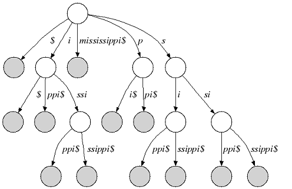
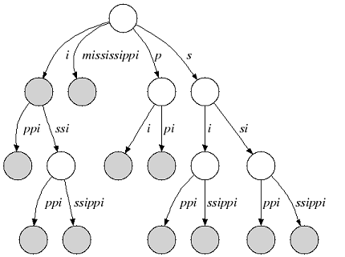

.. We create this roles for putting the "Introduction: etc. headings
    on this page without them displaying in the ToC.  This would break
    rendering the ToC correctly on readthedocs style.  The rubric
    headings are formatted using CSS.

.. role:: rubric-heading1
    :class: rubric-heading1
.. role:: rubric-heading2
    :class: rubric-heading2

.. _tutorial-datastructures-indices:

Indices
=======

.. toctree::
    :hidden:
    :titlesonly:

    FMIndex
    QgramIndex
    StringIndices
    IndexIterators

Indices in SeqAn allow efficient pattern queries in strings or sets of
strings. In contrast to, e.g., online-search algorithms that search
through the text in :math:`\mathcal{O}(n)`, substring indices find a
pattern in sublinear time :math:`o(n)`.

Indices store additional data structures that allow searching the text
using an iterator. Using the iterator can be thought of as traversing
a suffix tree. The following section gives you an introduction how
the suffix tree is built.

.. tip::

   The :dox:`Finder` interface allows searching indices without using the iterator.
   For more information check out the tutorial on :ref:`tutorial-algorithms-pattern-matching-indexed`.

Suffix Trees
------------

We consider an alphabet Σ and a sentinel character $ that is smaller
than every character of Σ. A suffix tree of a given non-empty string s
over Σ is a directed tree whose edges are labeled with non-empty
substrings of s$ with the following properties:

1. Each outgoing edge begins with a different letter and the outdegree
of an internal node is greater than 1.
2. Each suffix of s$ is the concatenation of edges from the root to a leaf node.
3. Each path from the root to a leaf node is a suffix of s$.

The following figure shows the suffix tree of the string s="mississippi" (suffix nodes are shaded):

**Figure 1:** Suffix tree of "mississippi"

Many suffix tree construction algorithms expect $ to be part of the
string alphabet which is undesirable for small bit-compressible
alphabets (e.g. DNA). In SeqAn there is no need to introduce a $. We
relax suffix tree criterion 2. and consider the relaxed suffix tree that
arises from the suffix tree of s by removing the $ character and all
empty edges. In the following, we only consider relaxed suffix trees and
simply call them suffix trees. In that tree a suffix can end in an inner
node as you can see in the next figure (suffix "i"):

**Figure 2:** Relaxed suffix tree of "mississippi"

.. raw:: mediawiki

    {{TracNotice|{{PAGENAME}}}}
