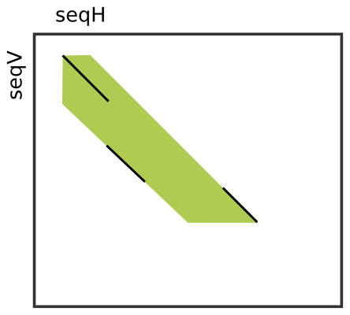

.. sidebar:: ToC

    .. contents::

.. _tutorial-datastructures-seeds:

Seeds
=====

Learning Objective
  In this tutorial, you will learn about the seeds-related SeqAn class.

Difficulty
  Basic 

Duration
  15 min 

Prerequisites
  :ref:`tutorial-datastructures-sequences`

Many efficient heuristics to find high scoring, but inexact, local alignments between two sequences start with small exact (or at least highly similar) segments, so called **seeds** and extend or combine them to get larger highly similar regions. Probably the most prominent tool of this kind is BLAST :cite:`Altschul1990`, but there are many other examples like FASTA :cite:`Pearson1990` or LAGAN :cite:`Brudno2003`. You will learn seed-and-extend and many applications including local and global chianing in :ref:`tutorial-algorithms-seed-extension`.

SeqAn's header file for all data structures and functions related to two-dimensional seeds is ``<seqan/seeds.h>``.

The Seed Class
--------------

The :dox:`Seed` class allows to store seeds. Seeds have a begin and end position in each sequence. Often, two or more close seeds are combined into a larger seed, possibly causing a shift in horizontal or vertical direction between the begin position of the upper left seed and the end position of the lower right seed. For this reason, the :dox:`Seed` class also stores an upper and a lower diagonal to reflect the expansion between those shifted seeds.

The image to the right shows an example where three smaller seeds (black diagonals) were combined (or "chained locally") into one larger seed (green area).

The :dox:`SimpleSeed Simple Seed` specialization only stores the begin and end positions of the seed (left-uppermost and right-lowermost corners of green surface) in both sequences and the upper and lower diagonal.
The initial diagonals are not stored. The :dox:`ChainedSeed` specialization additionally stores these information.
In most cases, the :dox:`SimpleSeed Simple Seed` class is sufficient since the best alignment around the seeds has to be determined using a banded alignment algorithm of the seed infixes anyway.

You can get/set the begin and end position in the horizontal/vertical sequences using the functions :dox:`Seed#beginPositionH`, :dox:`Seed#beginPositionV`, :dox:`Seed#setBeginPositionH`, and :dox:`Seed#setBeginPositionV`.
The band information can be queried and updated using :dox:`Seed#lowerDiagonal`, :dox:`Seed#upperDiagonal`, :dox:`Seed#setLowerDiagonal`, and :dox:`Seed#setUpperDiagonal`.
Note, we use the capital letters 'H' and 'V' to indicate horizontal direction and vertical direction, respectively, while the **subject sequence** is always considered as the **horizontal sequence** and the **query** as the **vertical sequence** in the context of sequence alignments.

The following program gives an example of creating seeds as well as setting and reading properties.

.. includefrags:: demos/tutorial/seeds/example1.cpp
   :fragment: example

The output to the console is as follows.

.. includefrags:: demos/tutorial/seeds/example1.cpp.stdout

Assignment 1
^^^^^^^^^^^^

.. container:: assignment

   Type
     Review

   Objective
     Extend the program above such that ``seed1`` is updated from ``seed2`` and all members (begin positions, end positions, diagonals) are equal to the corresponding member of ``seed`` times two.
     For example, the lower diagonal of ``seed2`` should be ``2 * lowerDiagonal(seed1)``.

   Solution
     .. container:: foldable

        .. includefrags:: demos/tutorial/seeds/solution1.cpp
