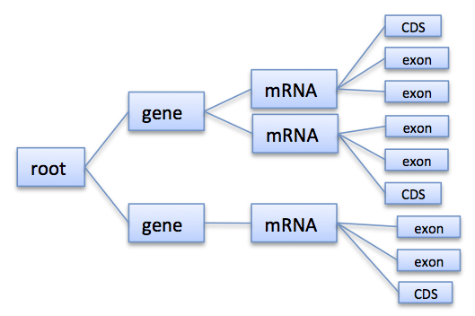

.. sidebar:: ToC

    .. contents::

.. _tutorial-datastructures-store-fragment-store:

Fragment Store
==============

Learning Objective
  You will learn about the SeqAn FragmentStore for handling fragments.
  The "fragments" are reads and the data structure is useful in the context of read mapping, genome assembly, and gene annotation.
  After completing this tutorial, you will be able to use the most relevant functionality of the FragmentStore class.

Difficulty
  Advanced

Duration
  1 h

Prerequisites
  :ref:`tutorial-getting-started`, :ref:`tutorial-datastructures-sequences`

Overview
--------

The :dox:`FragmentStore` is a data structure specifically designed for read mapping, genome assembly or gene annotation.
These tasks typically require lots of data structures that are related to each other like:

* reads, mate-pairs, reference genome
* pairwise alignments
* genome annotation

The Fragment Store subsumes all these data structures in an easy to use interface.
It represents a multiple alignment of millions of reads or mate-pairs against a reference genome consisting of multiple contigs.
Additionally, regions of the reference genome can be annotated with features like 'gene', 'mRNA', 'exon', 'intron' or custom features.
The Fragment Store supports I/O functions to read/write a read alignment in `SAM/BAM <http://samtools.sourceforge.net/>`_ or `AMOS <http://amos.sourceforge.net/wiki/index.php/AMOS>`_ format and to read/write annotations in `GFF <http://genome.ucsc.edu/FAQ/FAQformat.html#format3>`_ or `GTF <http://genome.ucsc.edu/FAQ/FAQformat.html#format4>`_ format.

The Fragment Store can be compared with a database where each table (called "store") is implemented as a :dox:`String` member of the :dox:`FragmentStore` class.
The rows of each table (implemented as structs) are referred by their ids which are their positions in the string and not stored explicitly (marked with ``*`` in the Figures 2 and 5).
The only exception is the alignedReadStore whose elements of type :dox:`AlignedReadStoreElement` contain an id-member as they may be rearranged in arbitrary order, e.g. by increasing genomic positions or by readId.
Many stores have an associated name store to store element names.
Each name store is a :dox:`StringSet` that stores the element name at the position of its id.
All stores are present in the Fragment Store and empty if unused.
The concrete types, e.g. the position types or read/contig alphabet, can be easily changed by defining a custom config struct which is a template parameter of the Fragment Store class.

Multiple Read Alignment
-----------------------

The Fragment Store can represent a multiple read alignment, i.e. is an alignment between the contigs and the set of reads, where one read can be aligned at zero, one or multiple positions of a contig.
In the multiple alignment the contig is represented by one line with gaps (``-``) and the remaining lines are to reads or read segments with gaps aligned to the contig.
The following figure shows one contig (the line at the top) and multiple reads aligned to it arranged as stairs (reads in lower-case align to the reverse strand):

::

    TGAAAACTATATTTATGCTATTCAGTTCTAAATATAGAAATTGAAACAGCTGTGTTTAGTGCCTTTGTTCA-----ACCCCCTTGCAACAACCTTGAGAACCCCAGGGAATTTGTCAATGTCAGGGAAGGAGCATTTTGTCAGTTACCAAATGTGTTTATTACCAG
    TGAAAACTATATT ATGCTATTCAGTTCTAAATATAGAAATTGAAACAG  GTGTTTAGTGCCTTTGTTCA-----ACCCCCTTGCAACAAC      aaccccagggaatttgtcaatgtcagggaaggagc ttttgtcagttaccaaatgtgtttattaccag
    tgaa  ctatatttatgctattcagttctaaatatagaaatt   acagctgtgtttagtgcctttgttca-----acccccttg aacaaccttgagaaccccagggaatttgtcaatgt   GGAAGGAGCATTTTGTCAGTTACCAAATGTGTTT  TACCAG
    TGAAAACTATAT TATGCTATTCAGTTCTAAATATAGAAATTGAAACA ctgtgtttagtgcctttgttca-----acccccttgcaac ACCTTGAGAACCCCAGGGAATTTGTCAATGTCAGG  aggagcattttgtcagttaccaaatgtgtttatta  at
    TGAAAACTATATTTA gctattcagttctaaatatagaaattgaaacagct  GTTTAGTGCCTTTGTTCACATAGACCCCCTTGCAA aaccttgagaaccccagggaatttgtcaatgtcag   aggagcattttgtcagttaccaaatgtgtttatta  AG
    TGAAAACTATATTTATGCTATTCAGT          GAAATTGAAACAGCTGTGTTTAGTGCCTTTGTTCA       ccccttacaacaaccttgagaaccccagggaattt        CAGGGAAGGAGCATTTTGTCAGTTACCAAATGTGT         G
    tgaaaactatatttatgctattcagt                                  GCCTTTGTTCACATAGACCCCCTTGCAACAACCTT        cagggaatttgtcaatgtcagggaaggagcatttt  CAGTTACCAAATGTGTTTATTACCAG
    tgaaaactatatttatgctattcagttcta                                       AG-----ACCCCCTTGCAACAACCTTGAGAACCCCAGGGA               ggaaggagcattttgtcagttaccaaatgtgttta
    TGAAAACTATATTTATGCTATTCAGTTCTAA                                       A-----ACCCCCTTGCAACAACCTTGAGAACCCCAGGGAA              gaaaggagcattttgtcagttaccaaatgtgttta
    TGAAAACTATATTTATGCTATTCAGTTCTAAA                                      A-----ACCCCCTTGCAACAACCTTGAGAACCCCAGGGAA                 AGGAGCATTTTGTCAGTTACCAAATGTGTTTATTA
    TGAAAACTATATTTATGCTATTCAGTTCTAAA                                                   TGCAACAACCTTGAGAACCCCAGGGAATTTGTCAA          ggagcattttgtcagttaccaaatgtgtttattac
    TGAAAACTATATTTATGCTATTCAGTTCTAAAT                                                  TGCAACAACCTTGAGAACCCCAGGGAATTTGTCAA          GGAGCATTTTGTCAGTTACCAAATGTGTTTATTAC
    TGAAAACTATATTTATGCTATTCAGTTCTAAAT                                                  TGCAACAACCTTGAGAACCCCAGGGAATTTGTCAA          GGAGCATTTTGTCAGTTACCAAATGTGTTTATTAT
          ctatatttatgctattcagttctaaatatagaaatt                                         tgcaacaaccttgagaaccccagggaatttgtcaa          GGAGCATTTTGTCAGTTACCAAATGTGTTTATTAC
          ctatatttatgctattcagttctaaatatagaaatt                                              CAACCTTGAGAACCCCAGGGAATTTGTCAATGTCA       agcattttgtcagttaccaaatgtgtttattacca
             TATTTATGCTATTCAGTTATAAATATAGAAATTGAAACAG                                          CCTTGAGAACCCCAGGGAATTTGTCAATGTCAGGG    agcattttgtcagttaccaaatgtgtttattacca
              atttatgctattcagttctaaatatagaaattgaa                                               CTTGAGAACCCCAGGGAATTTGTCAATGTCAGGGA    GCATTTTGTCAGTTACCAAATGTGTTTATTACCAG
               tttacgctattcagtactaaatatagaaattgaaa                                              CTTGAGAACCCCAGGGAATTTGTCAATGTCAGGGA    GCATTTTGTCAGTTACCAAATGTGTTTATTACCAG
                ttatgctattcagttctaaatatagaaattgaaac                                                          gggaatttgtcaatgtcagggaaggagcattttgt AGTTACCAAATGTGTTTATTACCAG

* ***Figure 1:*** Multiple read alignment

The following figure shows which tables represent the multiple read alignment:

   ***Figure 2:*** Stores used to represent a multiple read alignment

The main table is the :dox:`FragmentStore::alignedReadStore` which stores :dox:`AlignedReadStoreElement AlignedReadStoreElements`.
Each entry is an alignment of a read (``readId``) and a contig (``contigId``).
Introduced gaps are stored as a string of gap anchors in the ``gaps`` member of the alignedReadStore entry and the contigStore entry.
The begin and end positions of the alignment are given by the ``beginPos`` and ``endPos`` members which are 0-based positions on the forward strand in gap space, i.e. positions in the gapped contig sequence.
If the read is aligned to the reverse strand it holds ``endPos < beginPos``.
However, the gaps are always related to the forward strand.
Additional information, e.g. the number of errors, an alignment score or additional alignment tags, are stored in the tables :dox:`FragmentStore::alignQualityStore` and :dox:`FragmentStore::alignedReadTagStore` at position ``id``, where ``id`` is a unique id of the :dox:`AlignedReadStoreElement`.
Paired-end or mate pair alignments are represented by two entries in the :dox:`FragmentStore::alignedReadStore` that have the same ``pairMatchId`` value (unequal to ``INVALID_ID``).
For orphaned read alignments holds ``pairMatchId == INVALID_ID``.

::

           012345556789  sequence space
           012345678901       gap space
    contig ACCAC--GTTTG
     read1   ACACGGT        [2-9[
     read2     ACGGTT-G     [4-12[

The :dox:`FragmentStore::alignedReadStore` is the only store where the id (alignId in the figure) of an element is not implicitly given by its position.
The reason for this is that it is necessary in many cases to rearrange the elements of the alignedReadStore, e.g. increasingly by (contigId,beginPos), by readId or pairMatchId.
This can be done by :dox:`sortAlignedReads`.
If it is necessary to address an element by its id, the elements must be sorted by id first.
In the case that ids are not contiguously increasing, e.g. because some elements where removed, they must be renamed by a prior call of :dox:`FragmentStore#compactAlignedReads`.
Analogously the function :dox:`FragmentStore#compactPairMatchIds` renames ``pairMatchId`` values contiguously and replaces values that occur in only one alignment by ``INVALID_ID``.

Display Aligned Reads
^^^^^^^^^^^^^^^^^^^^^

The multiple read alignment can be displayed in text form or in a scalable graphics format (SVG).
Therefore first a stairs layout of the reads must be computed via :dox:`AlignedReadLayout#layoutAlignment` and stored in an :dox:`AlignedReadLayout`.
The function :dox:`AlignedReadLayout#printAlignment` can then be used to output a window (beginPos,endPos,firstLine,lastLine) of the read alignment against a contig either to a stream or ``SVGFile``.
The following small example demonstrates how to first load two contigs from a Fasta file and then import a read alignment given in SAM format:

.. includefrags:: demos/tutorial/fragment_store/display_aligned_reads.cpp
   :fragment: includes

Then we create a stairs layout of the aligned reads and output a window from gapped position 0 to 150 and line 0 to 36 of the multiple alignments below contig 1 to standard out.

.. includefrags:: demos/tutorial/fragment_store/display_aligned_reads.cpp
   :fragment: ascii

.. includefrags:: demos/tutorial/fragment_store/display_aligned_reads.cpp.stdout

The same window can also be exported as a scalable vector graphic in SVG format.

.. includefrags:: demos/tutorial/fragment_store/display_aligned_reads.cpp
   :fragment: svg

   '''Figure 3:''' SVG export of a multiple read alignment

Accessing Pairwise Alignments
^^^^^^^^^^^^^^^^^^^^^^^^^^^^^

In the next step, we want to access several pairwise alignments between reads and contig segments.
Therefore we first need to get the associated types that the Fragment Store uses to store contig and read sequences and gaps.
This can be done by the following typedefs:

.. includefrags:: demos/tutorial/fragment_store/access_aligned_reads.cpp
   :fragment: typedefs

Now we want to extract and output the alignments from the :dox:`FragmentStore::alignedReadStore` at position 140,144,...,156.
First we store a reference of the alignedRead in ar as we need to access it multiple times.
The read sequence is neither stored in the readStore or alignedReadStore as many short sequences can more efficiently be stored in a separate :dox:`StringSet` like the readSeqStore.
We copy the read sequence into a local variable (defined outside the loop to save allocations/deallocations) as we need to compute the reverse-complement for reads that align to the reverse strand.
Then we create a :dox:`Gaps gaps` object that represent the alignment rows of the contig and the aligned read in the multiple sequence alignment.
The :dox:`Gaps` object requires references of the sequence and the gap-anchor string stored in the contigStore and the alignedReadStore.
We need to limit the view of the contig alignment row to the interval the read aligns to, i.e. the gap position interval [beginPos,endPos[.
After that we output both alignment rows.

.. tip::

   The :dox:`Gaps` contains two :dox:`Holder` references to the sequence and the inserted gaps.
   In our example these Holders are dependent and changes made to the Gaps object like the insertion/deletion of gaps would immediatly be persistent in the Fragment Store.

.. includefrags:: demos/tutorial/fragment_store/access_aligned_reads.cpp
   :fragment: output

.. includefrags:: demos/tutorial/fragment_store/access_aligned_reads.cpp.stdout

Assignment 1
""""""""""""

.. container:: assignment

   Type
     Rview

   Objective
     Modify the example above, such that reads that align to the reverse strand are displayed in lower-case letters.

   Difficulty
     Easy

   Hint
     The Dna alphabet used in the fragment store doesn't support lower-case letters.
     You have to use a string of chars for readSeq.

   Solution
     .. container:: foldable

        As we copy the read sequence, it suffices to change the type of the target string readSeq and the sequence type of the read :dox:`Gaps` object into CharString, i.e. a :dox:`String` of ``char``.

        .. includefrags:: demos/tutorial/fragment_store/access_aligned_reads2.cpp
           :fragment: typedefs

        Then, we not only need to reverse-complement readSeq if the read aligns to the reverse strand (``endPos < beginPos``) but also need to convert its letters into lower-case.
        Therefor SeqAn provides the function :dox:`toLower`.
        Alternatively, we could iterate over readSeq and add ('a'-'A') to its elements.

        .. includefrags:: demos/tutorial/fragment_store/access_aligned_reads2.cpp
           :fragment: output

        Running this program results in the following output.

        .. includefrags:: demos/tutorial/fragment_store/access_aligned_reads2.cpp.stdout

Gene Annotation
---------------

Annotations are represented as a tree that at least contains a root node where all annotations of children or grandchildren of.
A typical annotation tree looks as follows:

   ***Figure 4:*** Annotation tree example

The following figure shows which tables represent the annotation tree:

.. figure:: AnnotationStore.png
   :width: 600px

   ***Figure 5:*** Stores involved in gene annotation

Traversing the Annotation Tree
^^^^^^^^^^^^^^^^^^^^^^^^^^^^^^

The annotation tree can be traversed and accessed with the :dox:`AnnotationTreeIterator AnnotationTree Iterator`.
A new iterator can be created with :dox:`ContainerConcept#begin` given a reference to the :dox:`FragmentStore` and the tag ``AnnotationTree``:

.. includefrags:: demos/tutorial/fragment_store/base.cpp
      :fragment: iterator

It starts at the root node and can be moved to adjacent tree nodes with the functions :dox:`AnnotationTreeIterator#goDown`, :dox:`AnnotationTreeIterator#goUp`, and :dox:`AnnotationTreeIterator#goRight`.
These functions return a boolean value that indicates whether the iterator could be moved.
The functions :dox:`AnnotationTreeIterator#isLeaf`, :dox:`AnnotationTreeIterator#isRoot`, :dox:`AnnotationTreeIterator#isLastChild` return the same boolean without moving the iterator.
With :dox:`AnnotationTreeIterator#goRoot` or :dox:`AnnotationTreeIterator#goTo` it can be moved to the root node or an arbitrary node given its annotationId.
If the iterator should not be moved but a new iterator at an adjacent nodes is required, the functions :dox:`AnnotationTreeIterator#nodeDown`, :dox:`AnnotationTreeIterator#nodeUp`, :dox:`AnnotationTreeIterator#nodeRight` can be used.

The AnnotationTree iterator supports a preorder DFS traversal and therefore can also be used in typical begin-end loops with the functions :dox:`RootedRandomAccessIteratorConcept#goBegin` (== :dox:`AnnotationTreeIterator#goRoot`), :dox:`RootedRandomAccessIteratorConcept#goEnd`, :dox:`InputIteratorConcept#goNext`, :dox:`RootedIteratorConcept#atBegin`, :dox:`RootedIteratorConcept#atEnd`.
During a preorder DFS, the descent into subtree can be skipped by :dox:`AnnotationTreeIterator#goNextRight`, or :dox:`AnnotationTreeIterator#goNextUp` which proceeds with the next sibling or returns to the parent node and proceeds with the next node in preorder DFS.

Accessing the Annotation Tree
^^^^^^^^^^^^^^^^^^^^^^^^^^^^^

To access or modify the node an iterator points at, the iterator returns the node's annotationId by the :dox:`IteratorAssociatedTypesConcept#value` function (== operator*).
With the annotationId the corresponding entry in the annotationStore could be modified manually or by using convenience functions.
The function :dox:`AnnotationTreeIterator#getAnnotation` returns a reference to the corresponding entry in the annotationStore.
:dox:`AnnotationTreeIterator#getName` and :dox:`AnnotationTreeIterator#setName` can be used to retrieve or change the identifier of the annotation element.
As some annotation file formats don't give every annotation a name, the function :dox:`AnnotationTreeIterator#getUniqueName` returns the name if non-empty or generates one using the type and id. The name of the parent node in the tree can be determined with :dox:`AnnotationTreeIterator#getParentName`.
The name of the annotation type, e.g. 'mRNA' or 'exon', can be determined and modified with :dox:`AnnotationTreeIterator#getType` and :dox:`AnnotationTreeIterator#setType`.

An annotation can not only reference a region of a contig but also contain additional information given as key-value pairs.
The value of a key can be retrieved or set by :dox:`AnnotationTreeIterator#getValueByKey` and :dox:`AnnotationTreeIterator#assignValueByKey assignValueByKeq`.
The values of a node can be cleared with :dox:`AnnotationTreeIterator#clearValues`.

A new node can be created as first child, last child, or right sibling of the current node with :dox:`AnnotationTreeIterator#createLeftChild createLeftChile`, :dox:`AnnotationTreeIterator#createRightChild`, or :dox:`AnnotationTreeIterator#createSibling`.
All three functions return an iterator to the newly created node.

The following tables summarizes the functions provided by the AnnotationTree iterator:

+----------------------------------------+--------------------------------------------------------+
| Function                               | Description                                            |
+========================================+========================================================+
| getAnnotation, value                   | Return annotation object/id of current node            |
+----------------------------------------+--------------------------------------------------------+
| [get/set]Name, [get/set]Type           | Access name or type of current annotation object       |
+----------------------------------------+--------------------------------------------------------+
| clearValues, [get/set]ValueByKey       | Access associated values                               |
+----------------------------------------+--------------------------------------------------------+
| goBegin, goEnd, atBegin, atEnd         | Go to or test for begin/end of DFS traversal           |
+----------------------------------------+--------------------------------------------------------+
| goNext, goNextRight, goNextUp          | go next, skip subtree or siblings during DFS traversal |
+----------------------------------------+--------------------------------------------------------+
| goRoot, goUp, goDown, goRight          | Navigate through annotation tree                       |
+----------------------------------------+--------------------------------------------------------+
| create[Left/Right]Child, createSibling | Create new annotation nodes                            |
+----------------------------------------+--------------------------------------------------------+
| isRoot, isLeaf                         | Test for root/leaf node                                |
+----------------------------------------+--------------------------------------------------------+

File I/O
--------

Reads and Contigs
^^^^^^^^^^^^^^^^^

To efficiently load reads, use the function :dox:`FragmentStore#loadReads` which auto-detects the file format, supporting Fasta, Fastq, QSeq and Raw (see :dox:`AutoSeqFormat`), and uses memory mapping to efficiently load millions of reads, their names and quality values.
If not only one but two file names are given, :dox:`FragmentStore#loadReads` loads mate pairs or paired-end reads stored in two separate files.
Both files are required to contain the same number or reads and reads stored at the same line in both files are interpreted as pairs.
The function internally uses :dox:`FragmentStore#appendRead` or :dox:`FragmentStore#appendMatePair` and reads distributed over multiple files can be loaded with consecutive calls of  :dox:`FragmentStore#loadReads`.

Contigs can be loaded with the function :dox:`FragmentStore#loadContigs`.
The function loads all contigs given in a single file or multiple files given a single file name or a :dox:`StringSet` of file names.
The function has an additional boolean parameter ``loadSeqs`` to load immediately load the contig sequence or if ``false`` load the sequence later with :dox:`FragmentStore#loadContig` to save memory, given the corresponding ``contigId``.
If the contig is accessed by multiple instances/threads the functions :dox:`FragmentStore#lockContig` and :dox:`FragmentStore#unlockContig` can be used to ensure that the contig is loaded and release it after use.
The function :dox:`FragmentStore#unlockAndFreeContig` can be used to clear the contig sequence and save memory if the contig is not locked by any instance.

To write all contigs to an open output stream use :dox:`FragmentStore#writeContigs`.

Multiple Read Alignments
^^^^^^^^^^^^^^^^^^^^^^^^

A multiple read alignment can be loaded from an open :dox:`BamFileIn` with :dox:`FragmentStore#readRecords`.
Similarly, it can be written to an open :dox:`BamFileOut` with :dox:`FragmentStore#writeRecords`.

As SAM supports a multiple read alignment (with padding operations in the CIGAR string) but does not enforce its use.
That means that a typical SAM file represents a set of pairwise (not multiple) alignments.
To convert all the pairwise alignments into a multiple alignments of all reads, :dox:`FragmentStore#read` internally calls the function :dox:`FragmentStore#convertPairWiseToGlobalAlignment`.
A prior call to :dox:`FragmentStore#loadReads` is not necessary (but possible) as SAM contains the read names, sequences and quality values.
Contigs can be loaded at any time.
If they are not loaded before reading a SAM file, empty sequences are created with the names referred in the SAM file.
A subsequent call of :dox:`FragmentStore#loadContigs` would load the sequences of these contigs, if they have the same identifier in the contig file.

Annotations
^^^^^^^^^^^

A annotation file can be read from an open :dox:`GffFileIn` or  :dox:`UcscFileIn` with :dox:`FragmentStore#readRecords`.
Similarly, it can be written to an open :dox:`GffFileOut` with :dox:`FragmentStore#writeRecords`.

The :dox:`GffFileIn` is also able to detect and read GTF files in addition to GFF files.
As the kownGene.txt and knownIsoforms.txt files are two seperate files used by the UCSC Genome Browser, they must be read by two consecutive calls of :dox:`FragmentStore#readRecords` (first knownGene.txt then knownIsoforms.txt).
An annotation can be loaded without loading the corresponding contigs.
In that case empty contigs are created in the contigStore with names given in the annonation.
A subsequent call of :dox:`FragmentStore#loadContigs` would load the sequences of these contigs, if they have the same identifier in the contig file.

Please note, that UCSC files cannot be written due to limitations of the file format.

Stores
------

The Fragment Store consists of the following tables:

Read Stores
^^^^^^^^^^^

+-------------------------------------+-----------------------------+--------------------------------------------------------------+
| Store                               | Description                 | Details                                                      |
+=====================================+=============================+==============================================================+
| :dox:`FragmentStore::readStore`     | Reads                       | String mapping from ``readId`` to ``matePairId``             |
+-------------------------------------+-----------------------------+--------------------------------------------------------------+
| :dox:`FragmentStore::readSeqStore`  | Read sequences              | String mapping from ``readId`` to ``readSeq``                |
+-------------------------------------+-----------------------------+--------------------------------------------------------------+
| :dox:`FragmentStore::matePairStore` | Mate-pairs / pairs of reads | String mapping from ``matePairId`` to ``<readId[2], libId>`` |
+-------------------------------------+-----------------------------+--------------------------------------------------------------+
| :dox:`FragmentStore::libraryStore`  | Mate-pair libraries         | String mapping from ``libId`` to ``<mean, std>``             |
+-------------------------------------+-----------------------------+--------------------------------------------------------------+

Contig Stores
^^^^^^^^^^^^^

+---------------------------------------+--------------------------------------------------+---------------------------------------------------------------------------------+
| Store                                 | Description                                      | Details                                                                         |
+=======================================+==================================================+=================================================================================+
| :dox:`FragmentStore::contigStore`     | Contig sequences with gaps                       | String that maps from ``contigId`` to ``<contigSeq, contigGaps, contigFileId>`` |
+---------------------------------------+--------------------------------------------------+---------------------------------------------------------------------------------+
| :dox:`FragmentStore::contigFileStore` | Stores information how to load contigs on-demand | String that maps from ``contigFileId`` to ``<fileName, firstContigId>``         |
+---------------------------------------+--------------------------------------------------+---------------------------------------------------------------------------------+

Read Alignment Stores
^^^^^^^^^^^^^^^^^^^^^

+-------------------------------------------+-----------------------------------------+-----------------------------------------------------------------------------------------+
| Store                                     | Description                             | Details                                                                                 |
+===========================================+=========================================+=========================================================================================+
| :dox:`FragmentStore::alignedReadStore`    | Alignments of reads against contigs     | String that stores ``<alignId, readId, contigId, pairMatchId, beginPos, endPos, gaps>`` |
+-------------------------------------------+-----------------------------------------+-----------------------------------------------------------------------------------------+
| :dox:`FragmentStore::alignedReadTagStore` | Additional alignment tags (used in SAM) | String that maps from ``alignId`` to ``alignTag``                                       |
+-------------------------------------------+-----------------------------------------+-----------------------------------------------------------------------------------------+
| :dox:`FragmentStore::alignQualityStore`   | Mapping quality of read alignments      | String that maps from ``alignId`` to ``<pairScore, score, errors>``                     |
+-------------------------------------------+-----------------------------------------+-----------------------------------------------------------------------------------------+

Annotation Stores
^^^^^^^^^^^^^^^^^

+---------------------------------------+-------------------------------+----------------------------------------------------------------------------------------------------------------------------+
| Store                                 | Description                   | Details                                                                                                                    |
+=======================================+===============================+============================================================================================================================+
| :dox:`FragmentStore::annotationStore` | Annotations of contig regions | String that maps from ``annoId`` to ``<contigId, typeId, beginPos, endPos, parentId, lastChildId, nextSiblingId, values>`` |
+---------------------------------------+-------------------------------+----------------------------------------------------------------------------------------------------------------------------+

Name Stores
^^^^^^^^^^^

+-------------------------------------------+-------------------------------+------------------------------------------------------+
| :dox:`FragmentStore::annotationNameStore` | Annotation names              | String that maps from ``annoId`` to ``annoName``     |
+===========================================+===============================+======================================================+
| :dox:`FragmentStore::readNameStore`       | Read identifiers (Fasta ID)   | String that maps from ``readId`` to ``readName``     |
+-------------------------------------------+-------------------------------+------------------------------------------------------+
| :dox:`FragmentStore::contigNameStore`     | Contig identifiers (Fasta ID) | String that maps from ``contigId`` to ``contigName`` |
+-------------------------------------------+-------------------------------+------------------------------------------------------+
| :dox:`FragmentStore::matePairNameStore`   | Mate-pair identifiers         | String that maps from ``contigId`` to ``contigName`` |
+-------------------------------------------+-------------------------------+------------------------------------------------------+
| :dox:`FragmentStore::libraryNameStore`    | Mate-pair library identifiers | String that maps from ``libId`` to ``libName``       |
+-------------------------------------------+-------------------------------+------------------------------------------------------+
