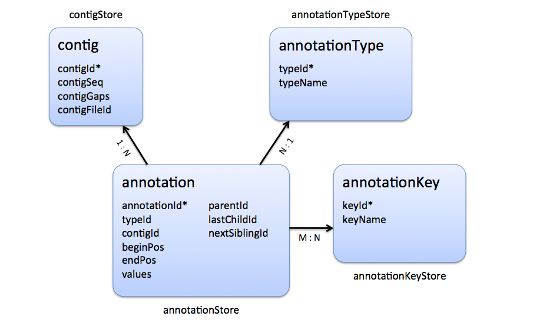

.. sidebar:: ToC

    .. contents::

.. _tutorial-datastructures-store-genome-annotations:

Genome Annotations
==================

Learning Objective
  You will learn how to work with annotations in SeqAn.
  After this tutorial, you will be able to write your own programs using annotations and analyzing them.
  You will be ready to continue with the :ref:`tutorial-datastructures-store-fragment-store` Tutorial, e.g. if you want to combine your annotations with information from alignments.

Difficulty
  Average

Duration
  1 h

Prerequisites
  :ref:`tutorial-datastructures-sequences`

This tutorial will present SeqAn's efficient and easy-to-use data structures to work with annotations.
They allow to annotate genome regions with features like 'gene', 'mRNA', 'exon', 'intron' and if required with custom features.
We will give you an understanding of how to load annotations from a `GFF <http://genome.ucsc.edu/FAQ/FAQformat.html#format3>`_ or `GTF <http://genome.ucsc.edu/FAQ/FAQformat.html#format4>`_ file, store them in efficient data structures, as well as how to traverse and access these information.

AnnotationStore as Part of the FragmentStore
--------------------------------------------

This section will give you a short introduction to data structures relevant for working with annotations.

In SeqAn, annotations are stored in the so-called :dox:`FragmentStore::annotationStore`, which is part of the :dox:`FragmentStore`.
The annotationStore can only be used together with the FragmentStore, because the latter stores additional information, e.g. the contig names or sequences.
The FragmentStore is a data structure specifically designed for read mapping, genome assembly or gene annotation.

The FragmentStore can be seen as a database, where each table (called "store") is implemented as a :dox:`String`.
Each row of the table corresponds to an element in the string.
The position of each element in the string implicitly represents the Id of such element in the table.
All such strings are members of the class :dox:`FragmentStore`, are always present and empty if unused.
For example, the member :dox:`FragmentStore::contigStore` is a string of elements, each one containing among others a contig sequence.

For detailed information about the :dox:`FragmentStore` read the :ref:`tutorial-datastructures-store-fragment-store` Tutorial.

Accordingly, the :dox:`FragmentStore::annotationStore` is a :dox:`String`, where each element represents one annotation.
Each element holds the necessary information, e.g. beginPos, endPos, parentId etc., as data members.

.. Like many other stores, the :dox:`FragmentStore::annotationStore` has an associated name store, namely the :dox:`FragmentStore::annotationNameStore`, to store its element names.
   The name store is a  StringSet that stores the element name at the position of its id.

AnnotationStore
---------------

In this section you will learn how to work with the :dox:`FragmentStore::annotationStore` itself.

Annotations are represented hierarchically by a tree having at least a root node.

A typical annotation tree looks as follows.

.. figure:: AnnotationTree.png
   :width: 400px

   Annotation tree example

The following entity-relationship diagram shows the tables holding store annotations, their relationships and cardinalities.

   Stores involved in gene annotation

The instantiation of an :dox:`FragmentStore::annotationStore` happens implicitly with the instantiation of a :dox:`FragmentStore`.
To access the FragmentStore definitions we'll need to include the correct header:

.. includefrags:: demos/tutorial/genome_annotations/base.cpp
    :fragment: INCLUDE

Now we can simply write:

.. includefrags:: demos/tutorial/genome_annotations/base.cpp
    :fragment: SIGNATURE

Loading an Annotation File
^^^^^^^^^^^^^^^^^^^^^^^^^^

Before we deal with the actual annotation tree, we will first describe how you can easily load annotations from a `GFF <http://genome.ucsc.edu/FAQ/FAQformat.html#format3>`_ or `GTF <http://genome.ucsc.edu/FAQ/FAQformat.html#format4>`_ file into the :dox:`FragmentStore`.

An annotation file can be read from an :dox:`GffFileIn` with the function :dox:`FragmentStore#readRecords`.
The file extension specifies if we want to read a GFF, GTF or UCSC file.
The following example shows how to read an GTF file:

.. includefrags:: demos/tutorial/genome_annotations/base.cpp
    :fragment: LOAD

The GFF-reader is also able to detect and read GTF files.
The UCSC Genome Browser uses two seperate files, the ``kownGene.txt`` and ``knownIsoforms.txt``.
They must be read by using two different :dox:`UcscFileIn` objects (one for ``knownGene.txt`` and one for ``knownIsoforms.txt``).
Finally you call :dox:`FragmentStore#readRecords` with both :dox:`UcscFileIn` objects.

.. tip::

    An annotation can be loaded without loading the corresponding contigs.

    In that case empty contigs are created in the contigStore with names given in the annonation.
    A subsequent call of :dox:`FragmentStore#loadContigs` would load the sequences of these contigs, if they have the same identifier in the contig file.

Traversing the Annotation Tree
^^^^^^^^^^^^^^^^^^^^^^^^^^^^^^

This section will illustrate how to use iterators to traverse the annotation tree.

The annotation tree can be traversed and accessed with the :dox:`AnnotationTreeIterator AnnotationTree Iterator`.
Again we use the metafunction `dox:ContainerConcept#Iterator Iterator` to determine the appropriate iterator type for our container.
A new AnnotationTree iterator can be obtained by calling :dox:`ContainerConcept#begin` with a reference to the :dox:`FragmentStore` and the ``AnnotationTree`` tag:

.. includefrags:: demos/tutorial/genome_annotations/base.cpp
    :fragment: ITERATOR

The AnnotationTree iterator starts at the root node and can be moved to adjacent tree nodes with the functions :dox:`AnnotationTreeIterator#goDown`, :dox:`AnnotationTreeIterator#goUp`, and :dox:`AnnotationTreeIterator#goRight`.
These functions return a boolean value that indicates whether the iterator could be moved.
The functions :dox:`AnnotationTreeIterator#isLeaf`, :dox:`AnnotationTreeIterator#isRoot`, :dox:`AnnotationTreeIterator#isLastChild` return the same boolean without moving the iterator.
With :dox:`AnnotationTreeIterator#goRoot` or :dox:`AnnotationTreeIterator#goTo` the iterator can be moved to the root node or an arbitrary node given its annotationId.
If the iterator should not be moved but a new iterator at an adjacent node is required, the functions :dox:`AnnotationTreeIterator#nodeDown`, :dox:`AnnotationTreeIterator#nodeUp`, :dox:`AnnotationTreeIterator#nodeRight` can be used.

.. includefrags:: demos/tutorial/genome_annotations/base.cpp
    :fragment: MOVE

The AnnotationTree iterator supports a preorder DFS traversal and therefore can also be used in typical begin-end loops with the functions :dox:`RootedRandomAccessIteratorConcept#goBegin` (== :dox:`AnnotationTreeIterator#goRoot`), :dox:`RootedRandomAccessIteratorConcept#goEnd`, :dox:`InputIteratorConcept#goNext`, :dox:`RootedIteratorConcept#atBegin`, :dox:`RootedIteratorConcept#atEnd`.
During a preorder DFS, the descent into subtree can be skipped by :dox:`AnnotationTreeIterator#goNextRight`, or :dox:`AnnotationTreeIterator#goNextUp` which proceeds with the next sibling or returns to the parent node and proceeds with the next node in preorder DFS.

.. includefrags:: demos/tutorial/genome_annotations/base.cpp
    :fragment: DFS

Asignment 1
"""""""""""

.. container:: assignment

   Type
     Review

   Objective
     Copy the code below, which loads the annotations from a given GTF file into the FragmentStore and initializes an iterator on the AnnotationTree.
     Download the GTF file :download:`assignment_annotations.gtf <assignment_annotations.gtf>`, whose annotations build an AnnotationTree of the typical structure with gene, mRNA and exon level.
     Adjust the code to go down to the exon level and iteratate over all children of the first mRNA and count them.
     Print the result.

     Click **more...** to see the code.

     .. container:: foldable

        .. includefrags:: demos/tutorial/genome_annotations/assignment_1_hint.cpp

     Hints
       In the given data the left-most leaf is a child of mRNA and has siblings.
       You can use the function :dox:`AnnotationTreeIterator#goRight` to traverse over all siblings.

     Solution
      Click **more...** to see one possible solution.

      .. container:: foldable

         .. includefrags:: demos/tutorial/genome_annotations/assignment_1_solution.cpp

         .. includefrags:: demos/tutorial/genome_annotations/assignment_1_solution.cpp.stdout

Assignment 2
""""""""""""

.. container:: assignment

   Type
     Review

   Objective
     Reuse the code and the GTF file from above.
     Instead of counting only the children of the first mRNA adjust the code to count the children for each given mRNA.
     Print the results.

   Hints
     After you reached the last child of the first mRNA you can use the functions :dox:`InputIteratorConcept#goNext` and :dox:`AnnotationTreeIterator#goDown` to traverse to the next leaf.

   Solution
     Click **more...** to see one possible solution.

     .. container:: foldable

        .. includefrags:: demos/tutorial/genome_annotations/assignment_2_solution.cpp

        .. includefrags:: demos/tutorial/genome_annotations/assignment_2_solution.cpp.stdout

Accessing the Annotation Tree
^^^^^^^^^^^^^^^^^^^^^^^^^^^^^

Let us now have a closer look how to access the information stored in the different stores representing the annotation tree.

To access or modify the node an iterator points at, the iterator returns the node's annotationId by the :dox:`IteratorAssociatedTypesConcept#value` function (== ``operator*``).
With the annotationId the corresponding entry in the annotationStore could be modified manually or by using convenience functions.
The function :dox:`AnnotationTreeIterator#getAnnotation` returns a reference to the corresponding entry in the annotationStore.
:dox:`AnnotationTreeIterator#getName` and :dox:`AnnotationTreeIterator#setName` can be used to retrieve or change the identifier of the annotation element.
As some annotation file formats don't give every annotation a name, the function :dox:`AnnotationTreeIterator#getUniqueName` returns the name if non-empty or generates one using the type and id.
The name of the parent node in the tree can be determined with :dox:`AnnotationTreeIterator#getParentName`.
The name of the annotation type, e.g. 'mRNA' or 'exon', can be determined and modified with :dox:`AnnotationTreeIterator#getType` and :dox:`AnnotationTreeIterator#setType`.

Assume we have loaded the file ``example.gtf`` with the following content to the :dox:`FragmentStore` *store* and instantiated the iterator *it* of the corresponding annotation tree.

.. includefrags:: demos/tutorial/genome_annotations/example.gtf

We now want to iterate to the first exon and output a few information:

.. includefrags:: demos/tutorial/genome_annotations/base.cpp
    :fragment: ACCESS

For our example the output would be:

.. includefrags:: demos/tutorial/genome_annotations/base.cpp.stdout
    :lines: 5-7

An annotation can not only refer to a region of a contig but also contain additional information given as key-value pairs.
The value of a key can be retrieved or set by :dox:`AnnotationTreeIterator#getValueByKey` and :dox:`AnnotationTreeIterator#assignValueByKey`.
The values of a node can be cleared with :dox:`AnnotationTreeIterator#clearValues`.

A new node can be created as first child, last child, or right sibling of the current node with :dox:`AnnotationTreeIterator#createLeftChild`, :dox:`AnnotationTreeIterator#createRightChild`, or :dox:`AnnotationTreeIterator#createSibling`.
All three functions return an iterator to the newly created node.

.. includefrags:: demos/tutorial/genome_annotations/base.cpp
    :fragment: CREATE

The following list summarizes the functions provided by the AnnotationTree iterator.

:dox:`AnnotationTreeIterator#getAnnotation`, :dox:`IteratorAssociatedTypesConcept#value`
  Return annotation object/id of current node
:dox:`AnnotationTreeIterator#getName`, :dox:`AnnotationTreeIterator#setName`, :dox:`AnnotationTreeIterator#getType`, :dox:`AnnotationTreeIterator#setType`
  Access name or type of current annotation object
:dox:`AnnotationTreeIterator#getParentName`
  Access parent name of current annotation object
:dox:`AnnotationTreeIterator#clearValues clearValue`, :dox:`AnnotationTreeIterator#getValueByKey`, :dox:`AnnotationTreeIterator#assignValueByKey`
  Access associated values
:dox:`RootedRandomAccessIteratorConcept#goBegin`, :dox:`RootedRandomAccessIteratorConcept#goEnd`, :dox:`RootedIteratorConcept#atBegin`, :dox:`RootedIteratorConcept#atEnd`
  Go to or test for begin/end of DFS traversal
:dox:`InputIteratorConcept#goNext`, :dox:`AnnotationTreeIterator#goNextRight`, :dox:`AnnotationTreeIterator#goNextUp`
  go next, skip subtree or siblings during DFS traversal
:dox:`AnnotationTreeIterator#goRoot`, :dox:`AnnotationTreeIterator#goUp`, :dox:`AnnotationTreeIterator#goDown`, :dox:`AnnotationTreeIterator#goRight`
  Navigate through annotation tree
:dox:`AnnotationTreeIterator#createLeftChild`, :dox:`AnnotationTreeIterator#createRightChild`, :dox:`AnnotationTreeIterator#createSibling`
  Create new annotation nodes
:dox:`AnnotationTreeIterator#isRoot`, :dox:`AnnotationTreeIterator#isLeaf`
  Test for root/leaf node

Assignment 3
""""""""""""

.. container:: assignment

   Type
     Application

   Objective
     Again use the given GTF file :download:`assignment_annotations.gtf <assignment_annotations.gtf>` and create an iterator on the annotation tree.
     Now iterate to the first node of type "exon" and output the following features:

     #. type
     #. begin position
     #. end position
     #. its Id
     #. the Id of its parent
     #. the name of its parent

   Solution
    Click **more...** to see one possible solution.

    .. container:: foldable

       .. includefrags:: demos/tutorial/genome_annotations/assignment_3_solution.cpp

       .. includefrags:: demos/tutorial/genome_annotations/assignment_3_solution.cpp.stdout

Assignment 4
""""""""""""

.. container:: assignment
     Type
       Transfer

     Objective
       Write a small statistic tool to analyse a given set of annotations.

       #. Load the annotations given in the GTF file :download:`assignment_annotations.gtf <assignment_annotations.gtf>`.
       #. Output the average number of mRNAs for genes.
       #. Output the average number of exons for mRNAs.
       #. Additionally output the average exon length.
       #. Test your program also on large data, e.g. the annotation of the mouse genome `Mus_musculus.NCBIM37.61.gtf.zip <http://ftp.seqan.de/manual_files/seqan-1.4/Mus_musculus.NCBIM37.61.gtf.zip>`_ (don't forget to unzip first).

     Solution
      Click **more...** to see one possible solution.

      .. container:: foldable

         .. includefrags:: demos/tutorial/genome_annotations/assignment_4_solution.cpp

         .. includefrags:: demos/tutorial/genome_annotations/assignment_4_solution.cpp.stdout

Write an Annotation File
^^^^^^^^^^^^^^^^^^^^^^^^

To write an annotation to a file use the function :dox:`FragmentStore#writeRecords`. Note that the format (``Gff()`` or ``Gtf()``) is specified by the file extension.

.. includefrags:: demos/tutorial/genome_annotations/base.cpp
    :fragment: OUT
