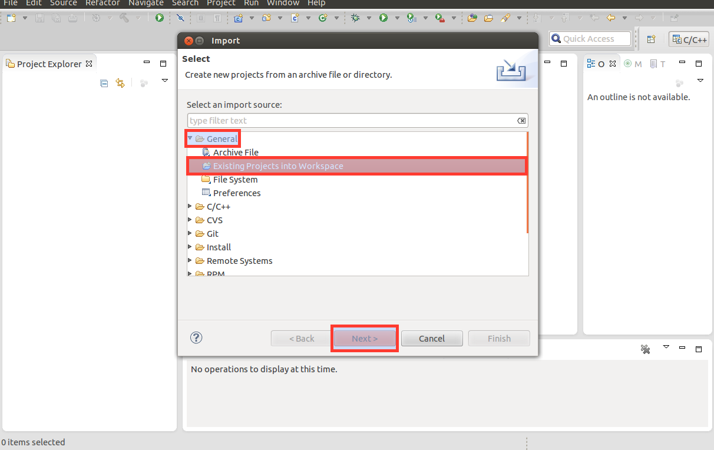
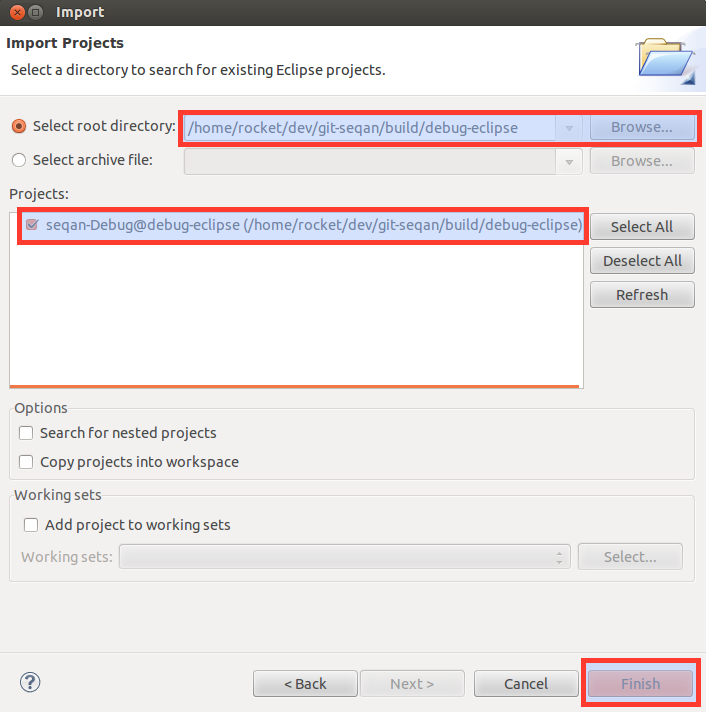
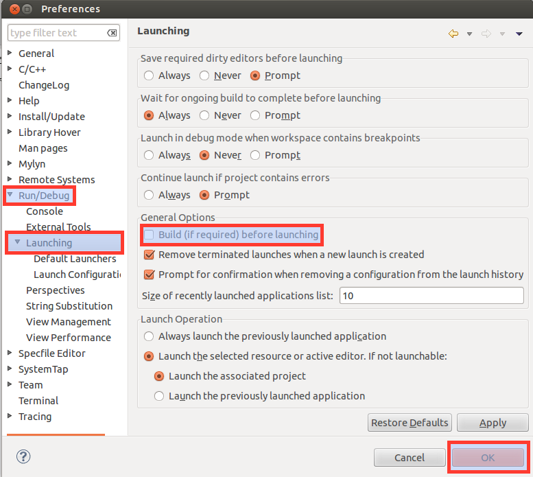
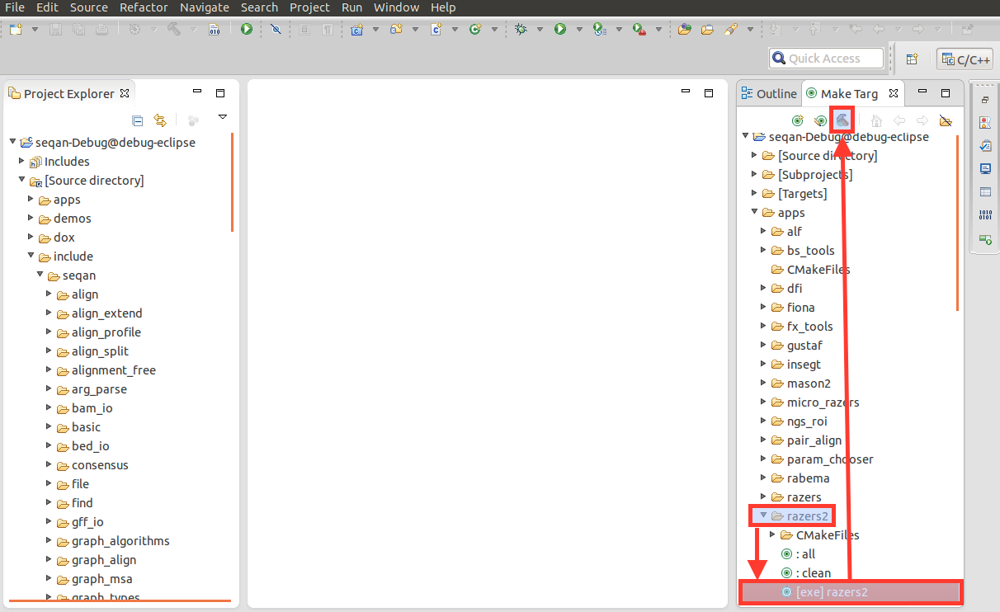
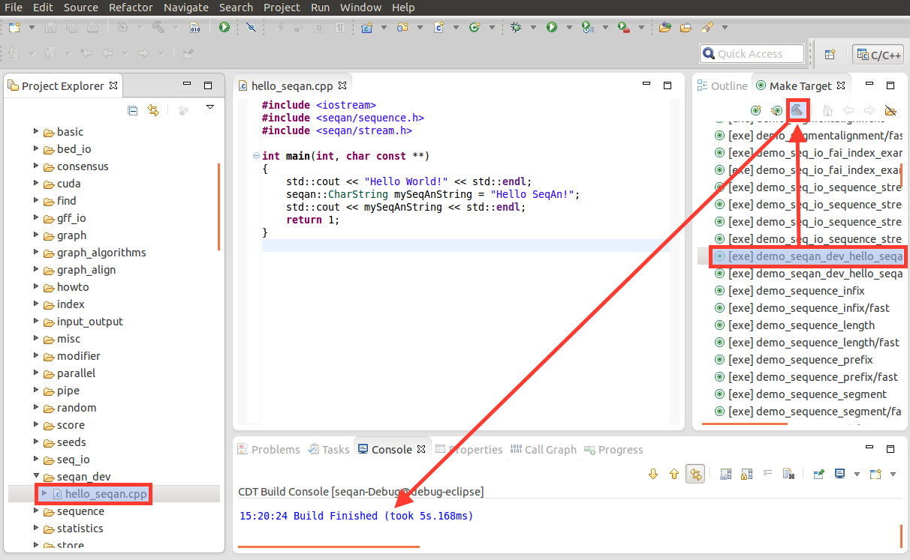
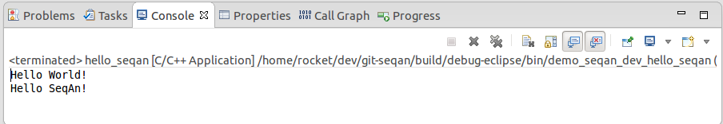

.. sidebar:: ToC

   .. contents::

.. _tutorial-getting-started-linux-eclipse:

Getting Started With SeqAn On Linux Using Eclipse CDT
-----------------------------------------------------

This article describes how to get started with SeqAn on Linux using Eclipse CDT.

We assume that you are using the Debian or a Debian-like Linux distributions such as Ubuntu.
The only difference to other distributions is the name of the packages and the package management system in the Prerequisites section.
It should be very simple for you to tailor these instructions to your requirements.

Prerequisites
~~~~~~~~~~~~~

Use the following command line to install the required dependencies: the `Git`__ client, the `GNU C++ compiler <http://gcc.gnu.org/>`_, `CMake <http://cmake.org>`_ for the build system, the `Python <http://python.org>`_ script interpreter for running helper scripts, and `Eclipse <http://www.eclipse.org>`_ with the `CDT plugin <http://www.eclipse.org/cdt/>`_ for C++ development.

.. __: http://git-scm.com/

.. code-block:: console

    ~ # sudo apt-get install git g++ cmake python eclipse-cdt

The following command line installs optional dependencies: developer versions of `zlib <http://zlib.org>`_ and `libbzip2 <http://bzip.org>`_ (for compressed I/O support) and the `Boost <http://boost.org>`_ library (required by a few apps).

.. code-block:: console

    ~ # sudo apt-get install zlib1g-dev libbz2-dev libboost-dev

Install
~~~~~~~

.. important::
	
	In the following we describe the easiest way to get up and running with SeqAn.
	This is especially recommended for novel users working through the tutorials in the beginning.
	If you are planning to contribute to SeqAn at any point, you need to read the :ref:`infrastructure-seqan-git-workflow` instructions first. 
	This manual will guide you through the SeqAn workflow required to submit bug-fixes and new features.

Go to the directory you want to keep your SeqAn install in (e.g. ``Development`` in your home folder).

.. code-block:: console

    ~ # cd $HOME/Development

Then, use git to retrieve the current SeqAn source-base:

.. code-block:: console

    # Development # git clone https://github.com/seqan/seqan.git seqan-src

You can now find the whole tree with the SeqAn library and applications in ``$HOME/Development/seqan-src``.

.. tip::

    By default git creates a local branch pointing to the stable master branch.
    This branch is only updated when hot fixes are applied or a new release is published.
    
    If you want to have access to regular updates and new features you can switch to the ``develop`` branch of SeqAn:
    
    .. code-block:: console

		# Development # cd seqan-src
		# Development/seqan-src # git checkout -b develop origin/develop
	
    For more help on git, please read the documentation ``git help`` and consult the homepage `Git`__.

.. __: http://git-scm.com/

.. warning::

    Note that the state of develop is not guaranteed to be stable at any time.

A First Build
~~~~~~~~~~~~~

We will now use CMake to create Eclipse CDT project files.
For this, we create a separate folder ``seqan-build`` on the same level as the folder ``seqan-src``.

.. code-block:: console

    # Development # mkdir seqan-build

When using Eclipse CDT, we have to create separate project files for debug builds (including debug symbols with no optimization) and release builds (debug symbols are stripped, optimization is high).
Thus, we create a subdirectory for each build type.
We start with debug builds since this is best for learning: debug symbols are enabled and assertions are active

.. warning::

    Compiling **debug mode yields very slow binaries** since optimizations are disabled.
    Compile your programs in release mode if you want to run them on large data sets.

    The reason for disabling optimizations in debug mode is that the compiler performs less inlining and does not optimize variables away.
    This way, debugging your programs in a debugger becomes much easier.

.. code-block:: console

    # Development # mkdir seqan-build/debug-eclipse
    # Development # cd seqan-build/debug-eclipse

The resulting directory structure will look as follows.

::

       ~/Development
         ├─ seqan-src          source directory
         └─ seqan-build
            └─ debug-eclipse   build directory with debug symbols

Within the **build directory** ``debug-eclipse``, we call CMake to generate The Eclipse CDT project in the debug mode.

.. code-block:: console

    # debug-eclipse # cmake ../../seqan-src -G "Eclipse CDT4 - Unix Makefiles" -DCMAKE_BUILD_TYPE=Debug

Now, open Eclipse.
If this is your first Eclipse start then you have to select a workspace.
This is unrelated to the SeqAn project files generated earlier and you can pick any directory, e.g. use the default.

We will now import the generated CDT project: Select the ``Project Explorer`` in Eclipse (**C++** perspective) and right click somewhere into the view.
Select ``Import...`` and choose ``Existing Project into Workspace`` in the current dialog.
Select ``Next`` and browse to your build directory in your workspace.
Eclipse recognizes that there is a project file and selects it automatically.
Confirm the selection with ``Finish``.

Before you build any target you should change the launch preferences of Eclipse.
In the menu select ``Window > Preferences`` Go to the menu ``Run/Debug > Launching`` and uncheck ``Build (if required) before launching``.
This prevents the project for building the target **all** (default preference), which can take quite a while depending on the system you are using.
This can happen if, e.g. you accidentally run a binary before building the target after you changed some code.

Now you have successfully setup Eclipse and can build your targets using the ``Make Target`` view (usually on the right hand side of the workbench).
To build RazerS 2, open the folder ``apps > razers2`` in the ``Make Target`` view.
Then, double-click on ``exe] razers2`` and or mark it and then push the ``Build Make Target`` icon in the top.
This will build the program **razers2**.

The last line you see on the console at the bottom of the screen should be

::

    Built target razers2
    make[2]: Leaving directory `/home/USER/Development/seqan-build/debug-eclipse'
    /usr/bin/cmake -E cmake_progress_start /home/USER/Development/seqan-build/debug-eclipse/CMakeFiles 0
    make[1]: Leaving directory `/home/USER/Development/seqan-build/debug-eclipse'

Hello World!
~~~~~~~~~~~~

Now it is time to write your first little application in SeqAn.
Go to the demos folder in the ``seqan-src`` directory and create a new folder with the same name as your username.
In this tutorial we use ``seqan_dev`` as the username.
Create a new cpp file called ``hello_seqan.cpp``

.. code-block:: console
	
    # debug-eclipse # cd ../../seqan-src/demos
    # demos # mkdir seqan_dev; cd seqan_dev
    # seqan_dev # echo "" > hello_seqan.cpp

Now, we go back into the build directory and call CMake again to make it detect the new source file.

.. code-block:: console

    # seqan_dev # cd ../../../seqan-build/debug-eclipse
    # debug # cmake .

.. tip::

    When and where do you have to call CMake?

    CMake is a cross-platform tool for creating and updating build files (IDE projects or Makefiles).
    When you first create the build files, you can configure things such as the build mode or the type of the project files.

    Whenever you add a new application, a demo or a test or whenever you make changes to ``CMakeLists.txt`` you need to call CMake again.
    Since CMake remembers the settings you chose the first time you called CMake in a file named ``CMakeCache.txt``, all you have to do is to switch to your ``debug`` or ``release`` build directory and call "``cmake .``" in there.

    .. code-block:: console

       ~ # cd $HOME/Development/seqan-build/debug-eclipse
       # debug # cmake .

    Do not try to call "``cmake .``" from within the ``seqan-src`` directory **but only from your build directory**.

After CMake is done with building the project files you can simply refresh the imported build project in Eclipse in order to make the applied changes working: In the ``Project Explorer`` view, right-click on ``seqan-Debug@debug-eclipse`` and select ``Refresh (F5)``.

.. tip::

    In some cases the refresh does not work.
    In this case simply close and reopen Eclipse.
    
Open the file under ``seqan-Debug@debug-eclipse > [Source directory] > demos > seqan_dev > hello_seqan.cpp`` and copy the following source code to it:

.. code-block:: cpp

    #include <iostream>
    #include <seqan/sequence.h>  // CharString, ...
    #include <seqan/stream.h>    // to stream a CharString into cout

    int main(int, char const **)
    {
        std::cout << "Hello World!" << std::endl;
        seqan::CharString mySeqAnString = "Hello SeqAn!";
        std::cout << mySeqAnString << std::endl;
        return 1;
    }

Then, browse to your target in the ``Make Target`` view.
Double-click on the target of your application and the binary is built immediately.

After the build is complete go into the menu and select ``Run > Run Configurations``.
Add a new ``C/C++ Application``.
Under ``Project`` select the seqan-build project.
Then you can select your recently built binary under ``C/C++ Application:``.
Finally, you can give your application a name.
Confirm your selection with ``Apply`` and hit the ``Run`` button in the bottom of the dialog.
Done!

.. image:: eclipse_linux_run_configurations.png

If everything went well, you will see something similar to this:

Congratulations, you have successfully created your first application within the SeqAn build system using Eclipse and CDT.

Further Steps
~~~~~~~~~~~~~

As a next step, we suggest the following:

* :ref:`Continue with the Tutorials <tutorial>`
* For the tutorial, using the SeqAn build system is great!
  If you later want to use SeqAn as a library, have a look at :ref:`build-manual-integration-with-your-own-build-system`.
* If you plan to contribute to SeqAn, please read the following document: :ref:`infrastructure-seqan-git-workflow`.

