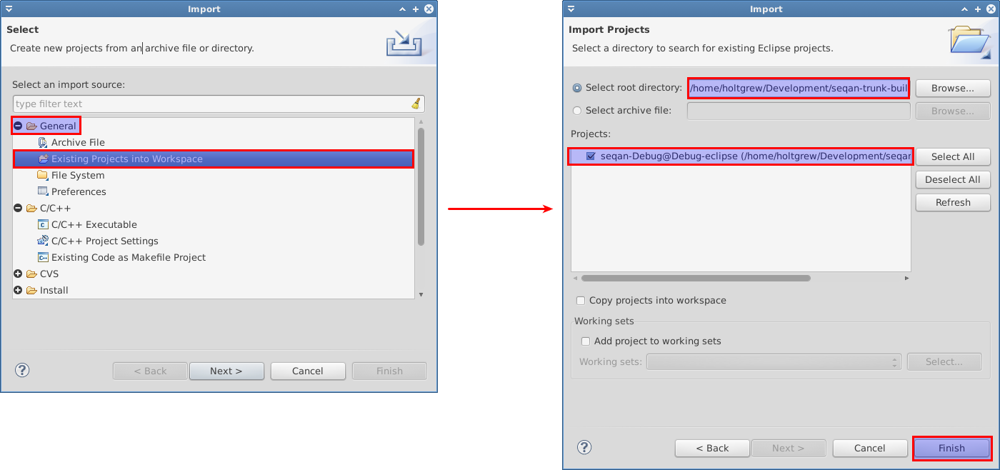
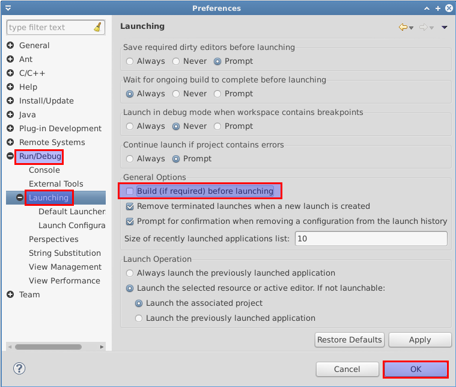
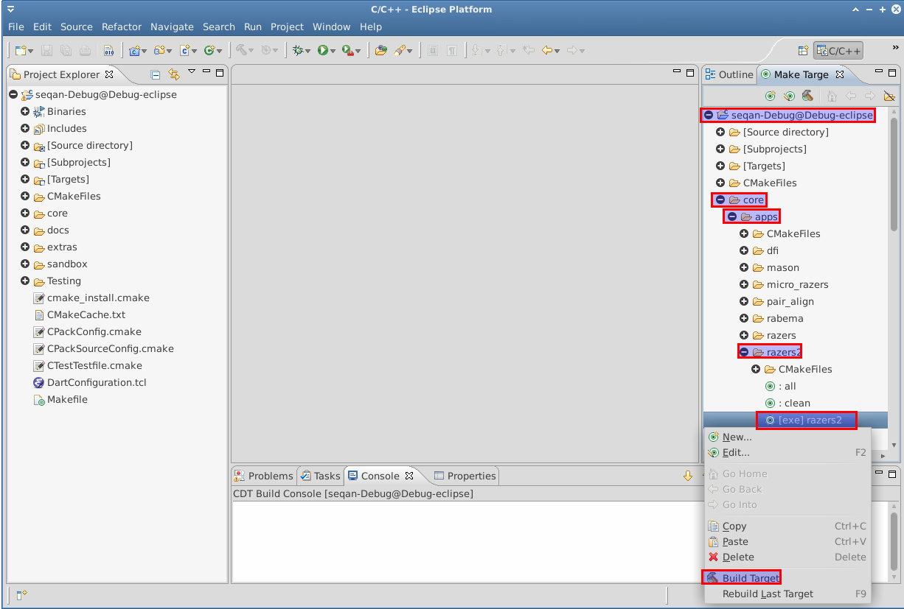
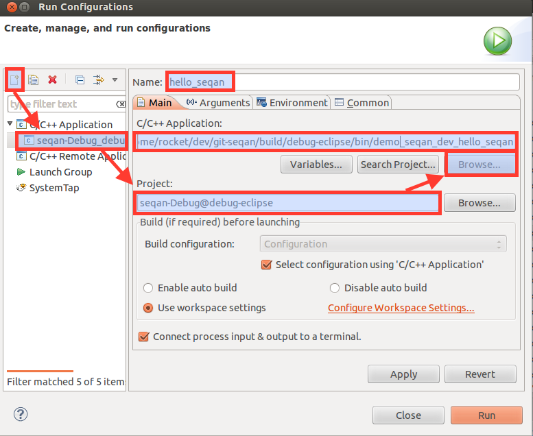
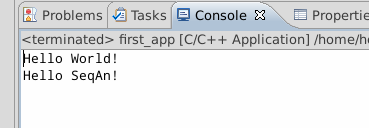

.. sidebar:: ToC

   .. contents::

.. _tutorial-getting-started-linux-eclipse:

Getting Started With SeqAn On Linux Using Eclipse CDT
-----------------------------------------------------

This article describes how to get started with SeqAn on Linux using Eclipse CDT.

We assume that you are using the Debian or a Debian-like Linux distributions such as Ubuntu.
The only difference to other distributions is the name of the packages and the package management system in the Prerequisites section.
It should be very simple for you to tailor these instructions to your requirements.

Prerequisites
~~~~~~~~~~~~~

Use the following command line to install the required dependencies: the `Subversion <http://subversion.apache.org/>`_ client, the `GNU C++ compiler <http://gcc.gnu.org/>`_, `CMake <http://cmake.org>`_ for the build system, the `Python <http://python.org>`_ script interpreter for running helper scripts, and `Eclipse <http://www.eclipse.org>`_ with the `CDT plugin <http://www.eclipse.org/cdt/>`_ for C++ development.

.. code-block:: console

    ~ # sudo apt-get install subversion g++ cmake python eclipse-cdt

The following command line installs optional dependencies: developer versions of `zlib <http://zlib.org>`_ and `libbzip2 <http://bzip.org>`_ (for compressed I/O support) and the `Boost <http://boost.org>`_ library (required by a few apps).

.. code-block:: console

    ~ # sudo apt-get install zlib1g-dev libbz2-dev libboost-dev

Install
~~~~~~~

Now, go to the directory you want to keep your SeqAn install in (e.g. ``Development`` in your home folder).

.. code-block:: console

    ~ # cd $HOME/Development

Then, use Subversion to retrieve the current SeqAn trunk:

.. code-block:: console

    Development # svn co https://github.com/seqan/seqan/branches/master seqan-trunk

You can now find the whole tree with the SeqAn library and applications in ``seqan-trunk``.

A First Build
~~~~~~~~~~~~~

We will now use CMake to create Eclipse CDT project files.
For this, we create a separate folder ``seqan-trunk-build`` on the same level as the folder ``seqan-trunk``.

.. code-block:: console

    Development # mkdir seqan-trunk-build

When using Eclipse CDT, we have to create separate project files for debug builds (including debug symbols with no optimization) and release builds (debug symbols are stripped, optimization is high).
Thus, we create a subdirectory for each build type.
We start with debug builds since this is best for learning: debug symbols are enabled and assertions are active

.. warning::

    Compiling **debug mode yields very slow binaries** since optimizations are disabled.
    Compile your programs in release mode if you want to run them on large data sets.

    The reason for disabling optimizations in debug mode is that the compiler performs less inlining and does not optimize variables away.
    This way, debugging your programs in a debugger becomes much easier.

.. code-block:: console

    Development # mkdir seqan-trunk-build/debug-eclipse
    Development # cd seqan-trunk-build/debug-eclipse

The resulting directory structure will look as follows.

::

       ~/Development
         +-- seqan-trunk        source directory
         `-- seqan-trunk-build
             `-- debug-eclipse  build directory with debug symbols

Within the **build directory** ``debug-eclipse``, we call CMake to generate The Eclipse CDT project in the debug mode.

.. code-block:: console

    debug-eclipse # cmake ../../seqan-trunk -G "Eclipse CDT4 - Unix Makefiles" -DCMAKE_BUILD_TYPE=Debug

Now, open Eclipse.
If this is your first Eclipse start then you have to select a workspace.
This is unrelated to the SeqAn project files generated earlier and you can pick any directory, e.g. use the default.

We will now import the generated CDT project: Select the ``Project Explorer`` in Eclipse (**C++** perspective) and right click somewhere into the view.
Select ``Import...`` and choose ``Existing Project into Workspace`` in the current dialog.
Select ``Next`` and browse to your build directory in your workspace.
Eclipse recognizes that there is a project file and selects it automatically.
Confirm the selection with ``Finish``.

Before you build any target you should change the launch preferences of Eclipse.
In the menu select ``Window > Preferences`` Go to the menu ``Run/Debug > Launching`` and uncheck ``Build (if required) before launching``.
This prevents the project for building the target **all** (default preference), which can take quite a while depending on the system you are using.
This can happen if, e.g. you accidentally run a binary before building the target after you changed some code.

Now you have successfully setup Eclipse and can build your targets using the ``Make Target`` view (usually on the right hand side of the workbench).
To build RazerS 2, open the folder ``core > apps > razers2`` in the ``Make Target`` view.
Then, right-click on ``exe] razers2`` and select ``Build Target``.
This will build the program **razers2**.

The last line you see on the console at the bottom of the screen should be

::

    Built target razers2
    make[2]: Leaving directory `/home/USER/Development/seqan-trunk-build/debug-eclipse'
    /usr/bin/cmake -E cmake_progress_start /home/USER/Development/seqan-trunk-build/debug-eclipse/CMakeFiles 0
    make[1]: Leaving directory `/home/USER/Development/seqan-trunk-build/debug-eclipse'

Hello World!
~~~~~~~~~~~~

Now, let us create a **sandbox** for you.
This sandbox will be your local workspace and you might want to have it versionized on your own Subversion repository at a later point.
All of your development will happen in your sandbox.

We go back to the source directory and then use the SeqAn code generator to create a new sandbox.

.. code-block:: console

    debug-eclipse # cd ../../seqan-trunk
    seqan-trunk # ./util/bin/skel.py repository sandbox/my_sandbox

Now that you have your own working space, we create a new application ``first_app``.

.. code-block:: console

    seqan-trunk # ./util/bin/skel.py app first_app sandbox/my_sandbox

Details about the code generator are explained in :ref:`how-to-use-the-code-generator`.

Now, we go back into the build directory and call CMake again to make it detect the added app.

.. code-block:: console

    seqan-trunk # cd ../seqan-trunk-build/debug-eclipse
    debug # cmake .

.. tip::

    When and where do you have to call CMake?

    CMake is a cross-platform tool for creating and updating build files (IDE projects or Makefiles).
    When you first create the build files, you can configure things such as the build mode or the type of the project files.

    Whenever you add a new application, a demo or a test or whenever you make changes to ``CMakeLists.txt`` you need to call CMake again.
    Since CMake remembers the settings you chose the first time you called CMake in a file named ``CMakeCache.txt``, all you have to do is to switch to your ``debug`` or ``release`` build directory and call "``cmake .``" in there.

    .. code-block:: console

       ~ # cd $HOME/Development/seqan-trunk-build/debug
       debug # cmake .

    Do not try to call "``cmake .``" from within the ``seqan-trunk`` directory **but only from your build directory**.

The step above creates the starting point for a real-world application, including an argument parser and several other things that are a bit too complicated to fit into the Getting Started tutorial.
Therefore, we will replace the program of the app *first\_app* with a very simple example program.

Open the file ``sandbox/my_sandbox/apps/first_app/first_app.cpp`` (in ``seqan-trunk``) with a text editor and replace its contents with the following:

.. code-block:: cpp

    #include <iostream>
    #include <seqan/sequence.h>  // CharString, ...
    #include <seqan/file.h>      // to stream a CharString into cout

    int main(int, char const **)
    {
        std::cout << "Hello World!" << std::endl;
        seqan::CharString mySeqAnString = "Hello SeqAn!";
        std::cout << mySeqAnString << std::endl;
        return 1;
    }

After CMake is done with building the project files you can simply refresh the imported build project in Eclipse in order to make the applied changes working: In the ``Project Explorer`` view, right-click on ``seqan-Debug@debug-eclipse`` and select ``Refresh (F5)``.

.. tip::

    In some cases the refresh does not work.
    In this case simply close and reopen Eclipse.

Then, browse to your target in the ``Make Target`` view.
Double-click on the target of your application and the binary is built immediately.

After the build is complete go into the menu and select ``Run > Run Configurations``.
Add a new ``C/C++ Application``.
Under ``Project`` select the seqan-build project.
Then you can select your recently built binary under ``C/C++ Application:``.
Finally, you can give your application a name.
Confirm your selection with ``Apply`` and hit the ``Run`` button in the bottom of the dialog.
Done!

If everything went well, you will see something similar to this:

Congratulations, you have successfully created your first application within the SeqAn build system using Eclipse and CDT.

Further Steps
~~~~~~~~~~~~~

As a next step, we suggest the following:

* :ref:`Continue with the Tutorials <tutorial>`
* Look around in the files in ``sandbox/my_sandbox/apps/first_app`` or the demos in ``core/demos`` and ``extras/demos``.
* For the tutorial, using the SeqAn build system is great!
  If you later want to use SeqAn as a library, have a look at :ref:`build-manual-integration-with-your-own-build-system`.

