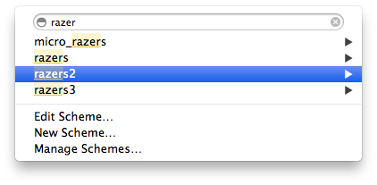
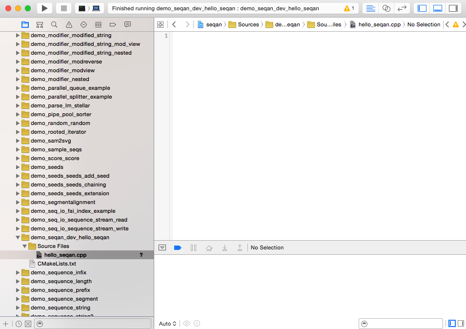
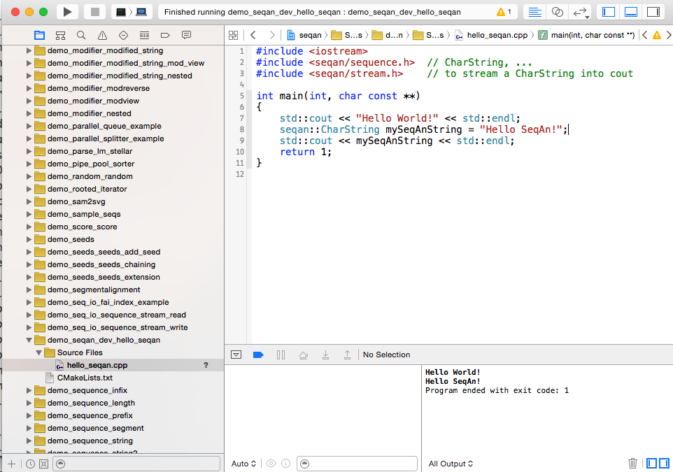

.. sidebar:: ToC

   .. contents::

.. _tutorial-getting-started-mac-xcode:

Getting Started With SeqAn On Mac OS X Using Xcode
--------------------------------------------------

This article describes how to get started with SeqAn on Mac OS X using XCode.

We assume that you want to use `MacPorts <http://www.macports.org/>`_ for installing some dependencies (MacPorts is a package management system that easily allows you to install Unix software on OS X).
Of course, if you want to use a different way for installing the dependencies (e.g. using Homebrew) then you are free to do so.

Prerequisites
~~~~~~~~~~~~~

First, you have to install the Apple `Xcode via Apple Developer <https://developer.apple.com/downloads/index.action>`_ or preferably `Xcode via the Mac App Store <http://itunes.apple.com/de/app/xcode/id497799835?mt=12>`_.

After having done so you also need to install the **Command Line Tools**.
Open Xcode, go to ``Xcode > Preferences...`` or simply press ``⌘`` to open the preferences. Switch to the ``Downloads`` tab.
In the shown table you will find the Command Line Tools.
Click on ``Install`` to install them.

.. image:: download-command-line-tools.png

.. warning::

   If you already had Xcode installed and you **updated to Xcode 4.3** it is likely that ``xcode-select`` is not pointing to the new Xcode location.

   To make sure you can properly work with Xcode 4.3 please open your ``Terminal`` and type:

   .. code-block:: console

      ~ # xcode-select -print-path

The command should output ``/Applications/Xcode.app/Contents/Developer``.
If it doesn't please note down the actual output (for backup purpose) and type in:

.. code-block:: console

    ~ # sudo xcode-select -switch /Applications/Xcode.app/Contents/Developer

This will configure ``xcode-select`` properly and make it work with SeqAn.

.. warning::

    .. todo:: Put patched version somewhere.

    With the current MacPort version of CMake it is no more possible to open sub projects.
    Either open only the root project ``seqan.xcodeproj`` or install our `patched version of CMake <http://ftp.seqan.de/manual_files/seqan-1.4/cmake-2.8.9.20120903-g6ef858-dirty-Darwin-i386.dmg>`_ instead.

    Note: The package installs the binary at ``/usr/usr/bin/cmake``.
    Please add the following line to your ``~/.profile`` file:

    .. code-block:: console

       export PATH=/usr/usr/bin:$PATH

After installing the Xcode SDK, please install MacPorts following `these instructions <http://www.macports.org/install.php>`_.
To check that the MacPorts install was successful, enter the following on your shell.
If the ``port`` program is found then you can go on.

.. code-block:: console

    ~ # port info

Next, install `Git <http://git-scm.com/>`_ using the ``port`` command.

.. code-block:: console

    ~ # sudo port install git

There is a problem with the current version of CMake. Please read
**Problem with CMake** box above and either install our patched version
of CMake (see attachments) or the current MacPort version which has a
problem with sub projects:

.. code-block:: console

    ~ # sudo port install cmake

Install
~~~~~~~

.. important::
	
	In the following we describe the easiest way to get up and running with SeqAn.
	This is especially recommended for novel users working through the tutorials in the beginning.
	If you are planning to contribute to SeqAn at any point, you need to read the :ref:`infrastructure-seqan-git-workflow` instructions first. 
	This manual will guide you through the SeqAn workflow required to submit bug-fixes and new features.

Go to the directory you want to keep your SeqAn install in (e.g. ``Development`` in your home folder).

.. code-block:: console

    ~ # cd $HOME/Development

Then, use git to retrieve the current SeqAn source-base:

.. code-block:: console

    # Development # git clone https://github.com/seqan/seqan.git seqan-src

You can now find the whole tree with the SeqAn library and applications in ``$HOME/Development/seqan-src``.

.. tip::

    By default git creates a local branch pointing to the stable master branch.
    This branch is only updated when hot fixes are applied or a new release is published.
    
    If you want to have access to regular updates and new features you can switch to the ``develop`` branch of SeqAn:
    
    .. code-block:: console

		# Development # cd seqan-src
		# seqan-src # git checkout -b develop origin/develop
	
    For more help on git, please read the documentation ``git help`` and consult the homepage `Git <http://git-scm.com/>`_.

.. warning::

    Note that the state of develop is not guaranteed to be stable at any time.

A First Build
~~~~~~~~~~~~~

Next, we will use CMake to create an Xcode project for building the
applications, demo programs (short: demos), and tests. For this, we
create a separate folder ``seqan-build`` on the same level as the
folder ``seqan-src``.

.. code-block:: console

    # Development # mkdir -p seqan-build/xcode

The resulting directory structure will look as follows.

::

       ~/Development
         ├─ seqan-src             source directory
         └┬ seqan-build
          └─ xcode                  build directory

Within the **build directory** ``xcode``, we call CMake to generate
Xcode project files.

.. code-block:: console

    # Development # cd seqan-build/xcode
    # xcode # cmake ../../seqan-src -G Xcode

This will generate several Xcode project files in ``xcode``, namely for
the SeqAn applications, demos, and tests.

Now, open the project for the applications:

.. code-block:: console

    # xcode # open seqan.xcodeproj

Xcode starts and will look like this:

.. image:: xcode_startup.png

Now we are ready to compile and run our first application. 
For this, please choose the target ``razers2`` in the top left corner of your Xcode application. 
When selected click on ``Run`` just left to where you chose the target.

Optionally, we could also use "``ALL_BUILD``" instead of "``razers2``".
However, this **can take a long time and is not really necessary**.

After having compiled and run ``razers2`` your Xcode should display ``razers2``'s output in the bottom right area.

.. image:: razers2_built.png

Hello World!
~~~~~~~~~~~~

Now it is time to write your first little application in SeqAn.
Go to the demos folder in the ``seqan-src`` directory and create a new folder with the same name as your username.
In this tutorial we use ``seqan_dev`` as the username.
Create a new cpp file called ``hello_seqan.cpp``

.. code-block:: console
	
    # xcode # cd ../../seqan-src/demos
    # demos # mkdir seqan_dev; cd seqan_dev
    # seqan_dev # echo "" > hello_seqan.cpp

Now, we go back into the build directory and call CMake again to make it detect the added app.

.. code-block:: console

    # seqan-src # cd ../../../seqan-build/xcode
    # xcode # cmake .

.. tip::

    When and where do you have to call CMake?

    CMake is a cross-platform tool for creating and updating build files (IDE projects or Makefiles).
    When you first create the build files, you can configure things such as the build mode or the type of the project files.

    Whenever you add a new application, a demo or a test or whenever you make changes to ``CMakeLists.txt`` you need to call CMake again.
    Since CMake remembers the settings you chose the first time you called CMake in a file named ``CMakeCache.txt``, all you have to do is to switch to your ``debug`` or ``release`` build directory and call "``cmake .``" in there.

   .. code-block:: console

       ~ # cd $HOME/Development/seqan-build/xcode
       debug # cmake .

   Do not try to call "``cmake .``" from within the ``seqan-src`` directory **but only from your build directory**.

Select the file ``/Sources/demo_seqan_dev_hello_seqan/Source Files/hello_seqan.cpp`` in Xcode and open it:

Replace its contents with the following:

.. code-block:: cpp

    #include <iostream>
    #include <seqan/sequence.h>  // CharString, ...
    #include <seqan/stream.h>    // to stream a CharString into cout

    int main(int, char const **)
    {
        std::cout << "Hello World!" << std::endl;
        seqan::CharString mySeqAnString = "Hello SeqAn!";
        std::cout << mySeqAnString << std::endl;
        return 1;
    }

Afterwards, you select the run target accordingly and compile and run your application by clicking on the ``Run`` button on the very top left corner in Xcode.

On completion, you should see the following output:

Congratulations, you have successfully created your first application within the SeqAn build system with Xcode!

Further Steps
~~~~~~~~~~~~~

As a next step, we suggest the following:

* :ref:`Continue with the Tutorials <tutorial>`
* For the tutorial, using the SeqAn build system is great!
  If you later want to use SeqAn as a library, have a look at :ref:`build-manual-integration-with-your-own-build-system`.
* If you plan to contribute to SeqAn, please read the following document: :ref:`infrastructure-seqan-git-workflow`.