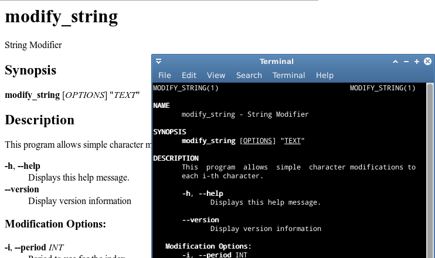

.. sidebar:: ToC

    .. contents::

.. _tutorial-getting-started-parsing-command-line-arguments:

Parsing Command Line Arguments
==============================

Learning Objective
  You will learn how to use the :dox:`ArgumentParser` class to parse command line arguments.
  This tutorial is a walk-through with links into the API documentation and also meant as a source for copy-and-paste code.

Difficulty
  Easy

Duration
  30-60 min

Prerequisites
  :ref:`tutorial-getting-started-first-steps-in-seqan`, :ref:`tutorial-datastructures-sequences`, familiarity with building SeqAn apps

The simplest possible and also most flexible interface to a program is through the command line. This tutorial explains how to parse the command line using the SeqAn library's :dox:`ArgumentParser` class.

Using this class will give you the following functionality:

* Robust parsing of command line arguments.
* Simple verification of arguments (e.g. within a range, one of a list of allowed values).
* Automatically generated and nicely formatted help screens when called with ``--help``.
  You can also export this help to HTML and man pages.
* You are able to automatically generate nodes for
  workflow engines such as `KNIME <http://knime.org/>`_ or
  `Galaxy <http://en.wikipedia.org/wiki/Galaxy_(computational_biology)>`_.

As a continuous example, we will write a little program that is given strings on the command line and applies an operation to every i-th character:

.. code-block:: console

    # modify_string --uppercase -i 2 "This is some text!"
    ThIs iS SoMe TeXt!
    # modify_string "This is some text!" --lowercase -i 1
    this is some text!

The program has three types of command line options/arguments:

* Two **flag options** ``--uppercase`` and ``--lowercase`` that select the operation.
* One **(value) option** ``-i`` that selects the period of the characters that the operation is to be applied to and is given a
  value (``2`` in the first call above, ``1`` in the second).
* One **(positional) argument** with the text to modify (``"This is some text!"`` in both calls above.
  In contrast to options, arguments are not identified by their names but by their position.

Command line options can have a **long name** (e.g. ``--lowercase``)
and/or a **short name** (e.g. ``-i``).

A First Working Example
-----------------------

The following small program will (1) setup a :dox:`ArgumentParser` object named ``parser``, (2) parse the command line, (3) exit the program if there were errors or the user requested a functionality that is already built into the command line parser, and (4) printing the settings given from the command line.
Such functionality is printing the help, for example.

.. includefrags:: demos/tutorial/parsing_command_line_arguments/example1.cpp

Let us first play a bit around with the program before looking at it in detail.

For example, we can already let the program generate an online help:

.. code-block:: console

   # modify_string -h
   modify_string
   =============

   SYNOPSIS

   DESCRIPTION

   REQUIRED ARGUMENTS
       TEXT STRING

   OPTIONS
       -h, --help
             Display the help message.
       -i, --period INTEGER
             Period to use for the index.
       -U, --uppercase
             Select to-uppercase as operation.

   VERSION
       Last update:
       modify_string version:
       SeqAn version: 2.3.1

While already informative, the help screen looks like there is something missing.
For example, there is no synopsis, no version and no date of the last update given.
We will fill this in later.

When we pass some parameters, the settings are printed:

.. code-block:: console

   # modify_string "This is a test." -i 1 -U
   period     1
   uppercase  1
   text       This is a test.

When we try to use the ``--lowercase``/``-L`` option, we get an error.
This is not surprising since we did not tell the argument parser about this option yet.

.. code-block:: console

   # modify_string "This is a test." -i 1 -L
   modify_string: illegal option -- L

A Detailed Look
---------------

Let us look at this program in detail now. The required SeqAn module is ``seqan/arg_parse.h``.
After inclusion, we can create an :dox:`ArgumentParser` object:

.. includefrags:: demos/tutorial/parsing_command_line_arguments/example1_detailed.cpp
   :fragment: object

Then, we define a positional argument using the function :dox:`ArgumentParser#addArgument`.
The function accepts the parser and an :dox:`ArgParseArgument` object.
We call the :dox:`ArgParseArgument` constructor with two parameters: the type of the argument (a string), and a label for the documentation.

.. includefrags:: demos/tutorial/parsing_command_line_arguments/example1_detailed.cpp
   :fragment: argument

Then, we add options to the parser using :dox:`ArgumentParser#addOption`.
We pass the parser and an :dox:`ArgParseOption` object.

.. includefrags:: demos/tutorial/parsing_command_line_arguments/example1_detailed.cpp
   :fragment: option

The :dox:`ArgParseOption` constructor is called in two different variants.
Within the first :dox:`ArgumentParser#addOption` call, we construct an integer option with a short and long name, a documentation string, and give it the label "INT".
The second option is a flag (indicated by not giving a type) with a short and a long name and a description.

Next, we parse the command line using :dox:`ArgumentParser#parse`.

.. includefrags:: demos/tutorial/parsing_command_line_arguments/example1_detailed.cpp
   :fragment: parse

We then check the result of the parsing operation.
The result is ``seqan::ArgumentParser::PARSE_ERROR`` if there was a problem with the parsing.
Otherwise, it is ``seqan::ArgumentParser::PARSE_OK`` if there was no problem and no special functionality of the argument parser was triggered.
The command line parser automatically adds some arguments, such as ``--help``.
If such built-in functionality is triggered, it will return a value that is neither ``PARSE_ERROR`` nor ``PARSE_OK``.

The following two lines have the following behaviour.
If the parsing went through and no special functionality was triggered then the branch is not taken.
Otherwise, the method ``main()`` is left with ``1`` in case of errors and with ``0`` in case special behaviour was triggered (e.g. the help was printed).

.. includefrags:: demos/tutorial/parsing_command_line_arguments/example1_detailed.cpp
   :fragment: check

Finally, we access the values from the command line using the :dox:`ArgumentParser`.
The function :dox:`ArgumentParser#getOptionValue` allows us to access the values from the command line after casting into C++ types.
The function :dox:`ArgumentParser#isSet` allows us to query whether a given argument was set on the command line.

.. includefrags:: demos/tutorial/parsing_command_line_arguments/example1_detailed.cpp
   :fragment: print

.. tip::

    List Arguments and Options.

    You have to mark an option to be a list if you want to be able to collect multiple values for it from the command line.
    Consider the following program call:

    .. code-block:: console

       # program -a 1 -a 2 -a 3

If the option ``a`` is not a list then the occurence ``-a 3`` overwrites all previous settings.

However, if ``a`` is marked to be a list, then all values (``1``, ``2``, and ``3``) are stored as its values.
We can get the number of elements using the function :dox:`ArgumentParser#getOptionValueCount` and then access the individual arguments using the function :dox:`ArgumentParser#getOptionValue`.
You can mark an option and arguments to be lists by using the ``isList`` parameter to the :dox:`ArgParseArgument` and :dox:`ArgParseOption` constructors.

For arguments, only the first or the last argument or none can be a list but not both.
Consider this program call:

.. code-block:: console

   # program arg0 arg1 arg2 arg3

For example, if the program has three arguments and the first one is a list then ``arg0`` and ``arg1`` would be the content of the first argument.
If it has two arguments and the last one is a list then ``arg1``, ``arg2``, and ``arg3`` would be the content of the last argument.

Assignment 1
""""""""""""

.. container:: assignment
   Getting a first working version

   Type
     Reproduction

   Objective
     Copy the source code of the full First Working Example above into a demo.
     Compile it and test printing the help screen and calling it with the two command lines above.

   Solution
     You can do it!

Assignment 2
""""""""""""

.. container:: assignment
   Adding a lowercase option

   Type
     Reproduction

   Objective
     Adjust the program from above to also accept an option to convert characters to lower case, just as it accepts options to convert characters to upper case.
     The long name should be ``--lowercase``, the short name should be ``-L``.
     As for the ``--uppercase`` option, the program should print whether the flag was set or not.

   Hint
     Copy the two lines for defining the ``--uppercase`` option and replace the strings appropriately.

   Solution
     .. container:: foldable

        .. includefrags:: demos/tutorial/parsing_command_line_arguments/assignment2_solution.cpp

Using Default Values
--------------------

Would it not be nice if we could specify a default value for ``--period``, so it is ``1`` if not specified and simply each character is modified?
We can do this by using the function :dox:`ArgumentParser#setDefaultValue`:

.. code-block:: cpp

   setDefaultValue(parser, "period", "1");

Note that we are giving the default value as a string.
The :dox:`ArgumentParser` object will simply interpret it as if it was given on the command line.
There, of course, each argument is a string.

Assignment 3
""""""""""""

.. container:: assignment

    Setting a default value

    Type
      Reproduction

    Objective
      Adjust the previous program to accept default values by adding the ``setDefaultValue()`` line from above into your program.

    Solution
      .. container:: foldable

          .. includefrags:: demos/tutorial/parsing_command_line_arguments/assignment3_solution.cpp

Best Practice: Using Option Structs
-----------------------------------

Instead of just printing the options back to the user, we should actually store them.
To follow best practice, we should not use global variables for this but instead pass them as parameters.

We will thus create a ``ModifyStringOptions`` struct that encapsulates the settings the user can give to the ``modify_string`` program.
Note that we initialize the variables of the struct with initializer lists, as it is best practice in modern C++.

The ``ModifyStringOptions`` struct's looks as follows:

.. includefrags:: demos/tutorial/parsing_command_line_arguments/example_with_struct.cpp
      :fragment: struct

Click **more...** to see the whole updated program.

.. container:: foldable

   .. includefrags:: demos/tutorial/parsing_command_line_arguments/example_with_struct.cpp
          :fragment: full

Best Practice: Wrapping Parsing In Its Own Function
---------------------------------------------------

As a next step towards a cleaner program, we should extract the argument parsing into its own function, e.g. call it ``parseCommandLine()``.
Following the style guide (:ref:`infra-contribute-style-cpp`), we first pass the output parameter, then the input parameters.
The return value of our function is a ``seqan::ArgumentParser::ParseResult`` such that we can differentiate whether the program can go on, the help was printed and the program is to exit with success, or there was a problem with the passed argument and the program is to exit with an error code.

Also, note that we should check that the user cannot specify both to-lowercase and to-uppercase.
This check cannot be performed by the :dox:`ArgumentParser` by itself but we can easily add this check.
We add this functionality to the ``parseCommandLine()`` function.

Click **more...** to see the updated program.

.. container:: foldable

   .. includefrags:: demos/tutorial/parsing_command_line_arguments/example_with_own_function.cpp

Feature-Complete Example Program
--------------------------------

The command line parsing part of our program is done now.
Let us now add a function ``modifyString()`` that is given a ``ModifyStringOptions`` object and text and modifies the text.
We simply use the C standard library functios ``toupper()`` and ``tolower()`` from the header ``<cctype>`` for converting to upper and lower case.

.. includefrags:: demos/tutorial/parsing_command_line_arguments/example_with_modifyString.cpp

Setting Restrictions
--------------------

One nice feature of the :dox:`ArgumentParser` is that it is able to perform some simple checks on the parameters.
We can:

* check numbers for whether they are greater/smaller than some limits,
* mark options as being required, and
* setting lists of valid values for each option.

In this section, we will give some examples.

Setting Minimum and Maximum Values
""""""""""""""""""""""""""""""""""

The functions :dox:`ArgParseArgument#setMinValue` and :dox:`ArgParseArgument#setMaxValue` allow to give a smallest and/or largest value for a given option.
Of course, this only works with integer- and double-typed command line options.

We can pass both the short and the long option name to these functions.
The value is given as a string and parsed the same as parameters on the command line.

.. includefrags:: demos/tutorial/parsing_command_line_arguments/base.cpp
      :fragment: setMinMax

Assignment 4
""""""""""""

.. container:: assignment

    Setting min-value on ``--period``

    Type
      Reproduction

    Objective
       Use the function :dox:`ArgParseArgument#setMinValue` to set a minimal value of ``1`` for the parameter ``--period``.

    Solution
      .. container:: foldable

         .. includefrags:: demos/tutorial/parsing_command_line_arguments/assignment4_solution.cpp

Marking Options as Required
"""""""""""""""""""""""""""

We can mark options as being required using the function :dox:`ArgumentParser#setRequired`:

.. includefrags:: demos/tutorial/parsing_command_line_arguments/base.cpp
      :fragment: setRequired

Setting List of Valid Values
""""""""""""""""""""""""""""

Sometimes, it is useful to give a list of valid values for a command line option.
You can give it as a space-separated list in a string to :dox:`ArgumentParser#setValidValues`.
The check whether the value from the command line is valid is case sensitive.

.. includefrags:: demos/tutorial/parsing_command_line_arguments/base.cpp
      :fragment: setValidValues

More Option and Argument Types
------------------------------

There are two slightly more special option and argument types: paths to input/output files and tuple values.

Input/Output File Names
"""""""""""""""""""""""

We could use ``ArgParseArgument::STRING`` to specify input and output files.
However, there are two special argument/option types ``ArgParseArgument::INPUT_FILE`` and ``ArgParseArgument::OUTPUT_FILE`` that are more suitable:

#. In the near future, we plan to add basic checks for whether input files exist and are readable by the user.
   You will still have to check whether opening was successful when actually doing this but the program will fail earlier if the source file or target location are not accessible.
   The user will not have to wait for the program to run through to see that he mistyped the output directory name, for example, and you do not have to write this check.
#. For workflow engine integration, the input and output file options and arguments will be converted into appropriate input and output ports of the nodes.
#. You can use the previously introduced restrictions to specify what kind of files you expect and the :dox:`ArgumentParser` will check while parsing if the correct file type was provided.

Here is an example for defining input and output file arguments:

.. includefrags:: demos/tutorial/parsing_command_line_arguments/base.cpp
      :fragment: addFileOption

The restrictions are added by defining the expected file extension.

.. includefrags:: demos/tutorial/parsing_command_line_arguments/base.cpp
      :fragment: addFileExtension

Again multiple values are provided as space-separated list.
Note that the file ending check is case insensitive, so you do not need to provide ``txt`` and ``TXT``.

You can simply read the values of these options as you would read string options:

.. includefrags:: demos/tutorial/parsing_command_line_arguments/base.cpp
      :fragment: readFile

Assignment 5
""""""""""""

.. container:: assignment

    Using File Command Line Options

    Type
      Reproduction
    Objective
      Replace the argument ``TEXT`` by a command line option ``-I``/``--input-file`` in the program above.
      The program should then read in the text instead of using the command line argument.

    Hint
       We will also replace the ``text`` member of ``ModifyStringOptions``, you might wish to do the same.

    Solution
      .. container:: foldable

         .. includefrags:: demos/tutorial/parsing_command_line_arguments/assignment5_solution.cpp

Tuples
""""""

We can define an :dox:`ArgParseArgument` and :dox:`ArgParseOption` to be a tuple with a fixed number of arguments.
For example, an integer pair (tuple with two entries) could describe a range:

.. includefrags:: demos/tutorial/parsing_command_line_arguments/base.cpp
      :fragment: tupleOption

We add two parameters after the label ``"BEGIN END"`` for the documentation.
First, we specify that the option is not a list option (``false``) and second, that we need exactly two numbers for it.

The user can now use the parameter as follows:

.. code-block:: console

   # modify_string -r 5 10 ...

We use the four-parameter variant with an integer index of :dox:`ArgumentParser#getOptionValue` to access the entries in the tuple given on the command line.

.. includefrags:: demos/tutorial/parsing_command_line_arguments/base.cpp
      :fragment: getTupleValue

Assignment 6
""""""""""""

.. container:: assignment

    Using Tuple Command Line Options

    Type
      Reproduction

    Objective
      Add a command line option ``--range`` to the :dox:`ArgumentParser` in the program above.
      Modify the function ``modifyString()`` such that only parameters in the given range are changed.

    Hint
      We will add two ``unsigned`` members ``rangeBegin`` and ``rangeEnd`` to the ``ModifyStringOptions`` struct, you might wish to do the same.

    Solution
      .. container:: foldable

         .. includefrags:: demos/tutorial/parsing_command_line_arguments/assignment6_solution.cpp

Embedding Rich Documentation
----------------------------

Another very useful feature of :dox:`ArgumentParser` is that you can embed rich documentation into your programs.
You can set the short description, the version string, date, synopsis and add text documentation settings.

Let us first set the **short description**, **version string**, and **date** in our program from above.
We insert the following lines just after the declaration of the variable ``parser``.

.. includefrags:: demos/tutorial/parsing_command_line_arguments/base.cpp
      :fragment: setVersion

After the line with ``setDate()``, we give a usage line and add to the description.
This information will go to the Synopsis section of the program help.

.. includefrags:: demos/tutorial/parsing_command_line_arguments/base.cpp
      :fragment: addUsageLine

.. tip::

    Formatting Command Line Documentation

    The formatting of command line parameters might seem strange, at first:
    **Font operators** start with ``\f`` (which means that they start with ``"\\f"`` in in C++ string literals).
    The ``\\f`` is followed by the **format specifier**.
    The format specifier can be one of ``I``, ``B``, and ``P``.
    ``I`` selects italic text (underlined on the shell), ``B`` selects bold and ``P`` resets the formatting to normal text.
    These font operators are legacies of man pages from Unix and offered a simple-to-implement solution to text formatting.

    For example, ``"Words \\fBwere\\fP made for \\fIbeing\\fP written!"`` would result in the formatted string "Words **were** made for *being* written!".

    Note that formatting the command line relies on `ANSI escape codes <http://en.wikipedia.org/wiki/ANSI_escape_code>`_ which is not supported by modern Windows versions.
    If you are using Windows, you will not see bold or underlined text.

The argument parser will add some options of its own, for example for printing the help and displaying version information.
To separate our arguments from the autogenerated ones, we add the following line.
This line will introduce the section "Modification Options" in the Description section of the output.

.. includefrags:: demos/tutorial/parsing_command_line_arguments/base.cpp
      :fragment: addSection

Finally, we will add a section with examples.
Add the following lines just before the line with the ``parse()`` function call.

.. includefrags:: demos/tutorial/parsing_command_line_arguments/base.cpp
      :fragment: addListItem

That were a lot of changes!
Click **more...** to see the complete program.

.. container:: foldable

   .. includefrags:: demos/tutorial/parsing_command_line_arguments/final_solution.cpp

Let us look at the resulting documentation.
Simply call the new program with the ``--help`` option.

.. code-block:: console

   # modify_string --help
   modify_string - String Modifier
   ===============================

   SYNOPSIS
       modify_string [OPTIONS] "TEXT"

   DESCRIPTION
       This program allows simple character modifications to each
       i-th character.

   REQUIRED ARGUMENTS
       TEXT STRING

   OPTIONS
       -h, --help
             Display the help message.
       --version
             Display version information.

     Modification Options:
       -i, --period INTEGER
             Period to use for the index. Default: 1.
       -U, --uppercase
             Select to-uppercase as operation.
       -L, --lowercase
             Select to-lowercase as operation.

   EXAMPLES
       modify_string -U veryverylongword
             Print upper case version of "veryverylongword"
       modify_string -L -i 3 veryverylongword
             Print "veryverylongword" with every third character converted to upper case.

   VERSION
       Last update: July 2012
       modify_string version: 1.0
       SeqAn version: 2.3.1

Also, there is an undocumented option called ``--export-help`` that is automatically added by :dox:`ArgumentParser`.
You can call it with the values ``html`` and ``man``.
If the option is set then the argument parser will print the documentation as HTML or man format (man pages are a widely used format for Unix documentation).

You can pipe the output to a file:

.. code-block:: console

   # modify_string --export-help html > modify_string.html
   # modify_string --export-help man > modify_string.man

HTML can be displayed by any web browser, man pages can be displayed using the program ``man``.
Note that when opening a file using ``man``, you have to give the file name either as an absolute or a relative path.
Otherwise, it would try to look up the topic ``modify_string.man``.
To view the generated man page use:

.. code-block:: console

   # man ./modify_string.man

Below, you can see a part of the rendered HTML and man pages generated by the commands above.

For further deading, have a look at the :dox:`ArgumentParser` class.

The Version Update Feature
--------------------------

With the seqan-2.3.0 release applications, using the :dox:`ArgumentParser`, check SeqAn servers for version updates. The functionality helps getting new versions out to users faster. It is also used to inform application developers of new versions of the SeqAn library which means that applications ship with less bugs.

Customized Messages
"""""""""""""""""""
The version information you receive depends on whether you are an application user or developer.
We differentiate this by inquiring the ``NDEBUG`` (no debug) macro.

#. Case: ``NDEBUG`` **is set**. Its the default in our application and represents that you ara a user.
The only message you will eventually encounter is the following:

.. code-block:: console

    [APP INFO] :: There is a newer version of this application available.
    [APP INFO] :: If this app is developed by SeqAn, visit www.seqan.de for updates.
    [APP INFO] :: If you don't want to recieve this message again set --version_check OFF

#. Case: ``NDEBUG`` **is NOT set**. If you build one of our application or your own one in debug mode, we will consider you as a developer.
Therefore we will inform you whenever a new library version is available:

.. code-block:: console

    [SEQAN INFO] :: There is a newer SeqAn version available!
    [SEQAN INFO] :: Please visit www.seqan.de for an update or inform the developer of this app.
    [SEQAN INFO] :: If you don't want to recieve this message again set --version-check OFF

  If you are working on your own application, using the SeqAn ArgumentParser, we will inform you about the possibility to register your application with us. This will make the distribution of your application version simple and convenient.

.. code-block:: console

    [SEQAN INFO] :: Thank you for using SeqAn!
    [SEQAN INFO] :: You might want to regsiter you app for support and version check features?
    [SEQAN INFO] :: Just send us an email to seqan@team.fu-berlin.de with your app name and version number.
    [SEQAN INFO] :: If you don't want to recieve this message anymore set --version_check OFF
  

The information we do (not) collect
"""""""""""""""""""""""""""""""""""
The process of checking for a new version happens at most once a day and takes at most three seconds enforced by an internal timeout.

.. note::

    The runtime of your application might be slightly affected by the process of checkng the version. 
    You might want to temporarily switch off the option while doing sensible performance measurements (``--version-check OFF``).

The following information is transmitted to the servers solely via the URL:

  * The application name and its version
  * The SeqAn version that the application was built with
  * The operating system type (Linux, macOS, Windows or BSD)
  * The CPU type (32 or 64bit)

The purpose of this transmission is to provide accurate update data for your app.
Beyond the update information, we may count the total number of version requests and may also resolve them to geographical regions.
This may be used for anonymized analysis by the SeqAn team, but raw data is never shared with third parties.

.. attention::

    There is no form of user identification and no tracking. 
    IP-Addresses are never stored permanently. 
    SeqAn collects no information regarding your use of the application, like selected options or arguments provided, and of course no information on your files!

Disable this feature any time you want
""""""""""""""""""""""""""""""""""""""
If you still feel uncomfortable with the version check, you may

  * disable it at run-time simply by setting ``--version-check OFF`` or
  * rebuild the application and specify ``-DCMAKE_CXX_ARGS="-DSEQAN_VERSION_CHECK_OPT_IN=YES"`` to change the default value of ``--version-check to OFF`` or even
  * rebuild the application and specify ``-DCMAKE_CXX_ARGS="-DSEQAN_DISABLE_VERSION_CHECK=YES"`` to completely remove all codepaths related to this feature.
