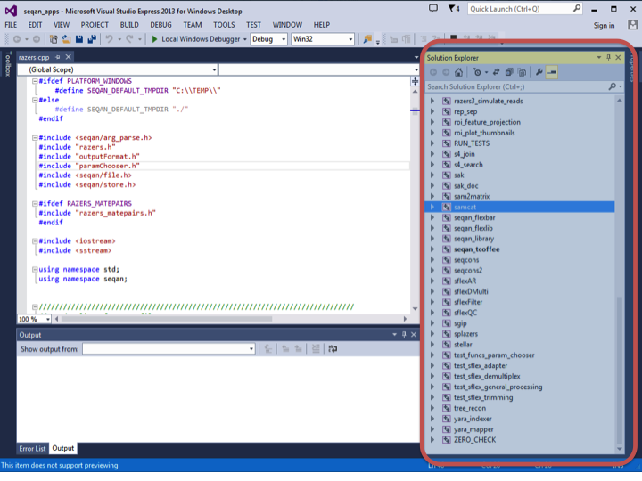
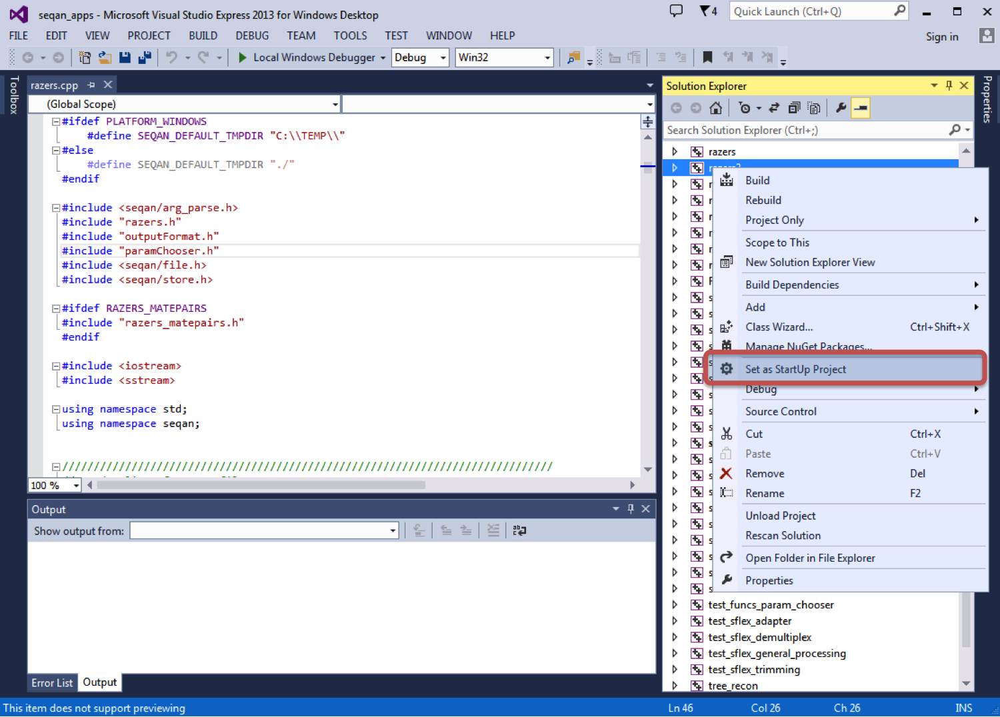

.. sidebar:: ToC

   .. contents::

.. _tutorial-getting-started-windows-visual-studio:

Getting Started With SeqAn On Windows Using Visual Studio
---------------------------------------------------------

This tutorial explains how to get started with SeqAn on Windows using Visual Studio.

We use Visual Studio 12 here, but you should be able to easily follow the tutorial if you are using any other supported version (9, 10, 11).

Prerequisites
~~~~~~~~~~~~~

We assume that you have the following software installed:

* `GitHub for Windows <https://windows.github.com>`_ for version control and retrieving
* Microsoft Visual Studio for compiling C++ code.
  If you do not have Visual Studio yet, you can download the `free Visual Studio Express Edition from Microsoft <http://www.microsoft.com/express/>`_.
  Note that at some point, you can pick between the Express Edition and a demo of the full version.
  Pick the Express Edition here for a smaller and continuously free version.
* `CMake <http://www.cmake.org/cmake/resources/software.html>`_ for generating project files
* `Python 2.x <http://python.org/download/>`_ for the code generator.
  Note that Python 3 will not work, thus use a Python 2 version.

Also, we assume that your user name is ``seqan_dev``.
Replace ``seqan_dev`` by your actual user name in the steps below.

.. warning::

    When installing CMake and Python, make sure to let the installers add the paths to the ``cmake.exe`` and ``python.exe`` binaries to your ``PATH`` environment variable.

Install
~~~~~~~

.. important::
	
	In the following we describe the easiest way to get up and running with SeqAn.
	This is especially recommended for novel users working through the tutorials in the beginning.
	If you are planning to contribute to SeqAn at any point, you need to read the :ref:`infrastructure-seqan-git-workflow` instructions first. 
	This manual will guide you through the SeqAn workflow required to submit bug-fixes and new features.

Open a new Git Shell (``Start > All Programs > GitHub, Inc > Git Shell``).
Note that within in the shell you can use the common unix commands to operate within the filesystem and more.
Go to the directory you want to keep your SeqAn install in (e.g. ``Development`` in your home folder).

.. code-block:: console

    ~ # cd Development

Then, use git to retrieve the current SeqAn source-base:

.. code-block:: console

    # Development # git clone https://github.com/seqan/seqan.git seqan-src

You can now find the whole tree with the SeqAn library and applications in the explorer in the following path ``C:\Users\seqan_dev\Development\seqan-src``.

.. tip::

    By default git creates a local branch pointing to the stable master branch.
    This branch is only updated when hot fixes are applied or a new release is published.
    
    If you want to have access to regular updates and new features you can switch to the ``develop`` branch of SeqAn:
    
    .. code-block:: console

		# Development # cd seqan-src
		# seqan-src # git checkout -b develop origin/develop
	
    For more help on git, please read the documentation ``git help`` and consult the homepage `Git`__.

.. __: http://git-scm.com/

A First Build
~~~~~~~~~~~~~

Next, we will use CMake to create a Visual Studio 12 project for building the applications, demo programs (short: demos), and tests.

Within the Git Shell go back to the parent directory of ``seqan-src``.
There, we create a separate folder ``seqan-build``:

.. code-block:: console

    # seqan-src # cd ../
    # Development # mkdir seqan-build

In the future, we might create a different set of project files (e.g. when we upgrade our Visual Studio version or switch to 64 bit builds).
Thus, we create a subdirectory called ``release`` for release builds and within this folder we create a subfolder called ``vs12`` for our Visual Studio 12 project.

.. code-block:: console

    # Development # cd seqan-build
    # seqan-build # mkdir -p debug-vs12

The resulting directory structure will look as follows.

::

       ~/Development
         ├─ seqan-src                    source directory
         └─ seqan-build
            └─ debug-vs12                Visual Studio 12 project

Within the **build directory** ``debug-vs12``, we call CMake to generate the Visual Studio 12 project:

.. code-block:: console

    # debug-vs12 # cmake ../../seqan-src -G "Visual Studio 12 2013" -DCMAKE_BUILD_TYPE=Debug

.. tip::

   It is possible to use a different version or multiple versions of Visual Studio and different build types.

   To build a release version for Visual Studio 10 project files follow the subsequent steps:
   
   .. code-block:: console
       
       # Development # cd seqan-build
       # seqan-build # mkdir release-vs10
       # seqan-build # cd release-vs10
       
   Then, use the appropriate generator:

   .. code-block:: console

      # release-vs10 # cmake ../../seqan-src -G "Visual Studio 10 2010"

   Also, if you want to create 64 bit builds, you need to use another generator.
   Changing generators in an existing project directory is not possible.

    * If you use another version of Visual Studio, you can find out the correct parameter by typing ``cmake --help``.
    * If you plan to use different versions of Visual Studio then follow :ref:`how-to-use-parallel-build-directories`.
    *  Note that you have to choose the `Win64` variants of the `Visual Studio` generators if you want to build 64 bit binaries.

Now, you can open the project file from the Windows explorer: go to the ``C:\Users\seqan_dev\Development\seqan-build\debug-vs12\apps`` directory and double click on the file ``seqan_apps.sln``.
In the ``Solution Explorer`` you will find all applications of the SeqAn core.

As an example you can open, compile, and execute the program RazerS 2.  
Click on the ``+``/``▷`` in front of ``razers2`` in the Solution Explorer and also on the ``+``/``▷`` in front of ``Source Files``.
Double click on the file ``razers.cpp`` to open it in the main window.
Right click on ``razers2`` in the Solution Explorer and choose ``Set as StartUp Project`` from the context menu.

To compile and execute RazerS 2, choose ``Debug > Start Without Debugging`` from the main menu or press ``Ctrl`` + ``F5``.
On successful compilation and execution, a terminal windows should pop up and display:

.. code-block:: console

    ***********************************************************
    *** RazerS - Fast Read Mapping with Sensitivity Control ***
    ***          (c) Copyright 2009 by David Weese          ***
    ***********************************************************
    Usage: razers2.exe [OPTION]... <GENOME FILE> <READS FILE>
           razers2.exe [OPTION]... <GENOME FILE> <MP-READS FILE1> <MP-READS FILE2>
    Try 'razers2.exe --help' for more information.
    Press any key to continue . . .

.. tip ::

    Starting with and without Debugging in Visual Studio

    Starting a program without debugger in Visual Studio will make the program wait for the user pressing a key.
    This is very useful for inspecting the output.
    In Debug mode, the program does not wait when executed and the window simply disappears.
    The reason for this is that when using the debugger, the user is expected to set a breakpoint.

Hello World!
~~~~~~~~~~~~

Now it is time to write your first little application within SeqAn.
Go to the demos folder in the ``seqan-src`` directory and create a new folder with the same name as your username.
In this tutorial we use ``seqan_dev``.
Create a new cpp file called ``hello_seqan.cpp``

.. code-block:: console
	
    # debug-vs12 # cd ../../seqan-src/demos
    # demos # mkdir seqan_dev; cd seqan_dev
    # seqan_dev # echo "" > hello_seqan.cpp

Now, we go back into the build directory and call CMake again to make it detect the new source file.

.. code-block:: console

    # seqan-src # cd ../../../seqan-build/debug-vs12
    # debug-vs12 # cmake .

.. tip::

    When and where do you have to call CMake?

    CMake is a cross-platform tool for creating and updating build files (IDE projects or Makefiles).
    When you first create the build files, you can configure things such as the build mode or the type of the project files.

    Whenever you add a new application, a demo or a test or whenever you make changes to ``CMakeLists.txt`` you need to call CMake again.
    Since CMake remembers the settings you chose the first time you called CMake in a file named ``CMakeCache.txt``, all you have to do is to switch to your ``debug`` or ``release`` build directory and call "``cmake .``" in there.

    .. code-block:: console

       ~ # cd Development/seqan-build/debug-vs12
       # debug-vs12 # cmake .

    Do not try to call "``cmake .``" from within the ``seqan-src`` directory **but only from your build directory**.

Now, you can open the project file ``C:\Users\seqan_dev\Development\seqan-build\debug-vs12\demos\seqan_demos.sln`` using Visual Studio.
Right-click ``demo_seqan_dev_hello_seqan`` in the ``Solution Explorer`` and click ``Set as StartUp Project``.
Open the source file ``hello_seqan.cpp`` and replace its contents with the following:

.. code-block:: cpp

    #include <iostream>
    #include <seqan/sequence.h>  // CharString, ...
    #include <seqan/stream.h>    // to stream a CharString into cout

    int main(int, char const **)
    {
        std::cout << "Hello World!" << std::endl;
        seqan::CharString mySeqAnString = "Hello SeqAn!";
        std::cout << mySeqAnString << std::endl;
        return 1;
    }

Now, start the program without debugging using ``Debug > Start Without Debugging``.
Visual Studio will now compile your program and execute it. 
A command line window will pop up and should display the following.

.. code-block:: console

    Hello World!
    Hello SeqAn!
    Press any key to continue . . .

Congratulations, you have successfully created your first application within the SeqAn build system using Visual studio.

Further Steps
~~~~~~~~~~~~~

As a next step, we suggest the following:

* :ref:`Continue with the Tutorials <tutorial>`
* If you have not done so, install optional dependencies of SeqAn.
  To read and write compressed files, follow :ref:`how-to-install-contribs-on-windows`.
* For the tutorial, using the SeqAn build system is great!
  If you later want to use SeqAn as a library, have a look at :ref:`build-manual-integration-with-your-own-build-system`.
* If you plan to contribute to SeqAn, please read the following document: :ref:`infrastructure-seqan-git-workflow`.