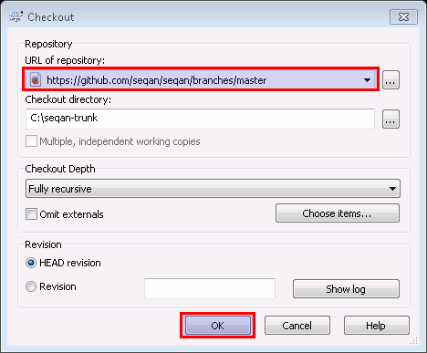
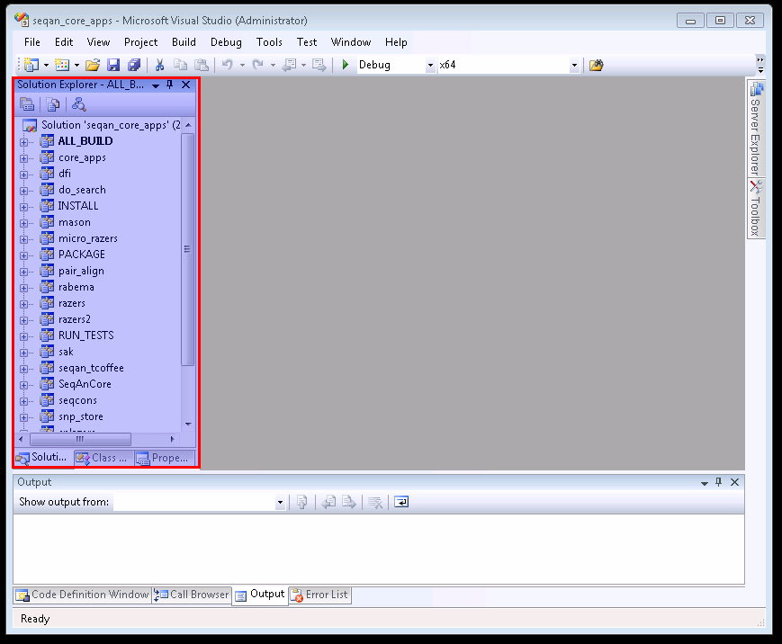

.. sidebar:: ToC

   .. contents::

.. _tutorial-getting-started-windows-visual-studio:

Getting Started With SeqAn On Windows Using Visual Studio
---------------------------------------------------------

This tutorial explains how to get started with SeqAn on Windows using Visual Studio.

We use Visual Studio 9 here, but you should be able to easily follow the tutorial if you are using any other supported version (8, 9, 10).

Prerequisites
~~~~~~~~~~~~~

We assume that you have the following software installed:

* `TortoiseSVN <http://tortoisesvn.net/downloads.html>`_ for version
  control and retrieving
* Microsoft Visual Studio for compiling C++ code.
  If you do not have Visual Studio yet, you can download the `free Visual Studio Express Edition from Microsoft <http://www.microsoft.com/express/>`_.
  Note that at some point, you can pick between the Express Edition and a demo of the full version.
  Pick the Express Edition here for a smaller and continuously free version.
* `CMake <http://www.cmake.org/cmake/resources/software.html>`_ for generating project files
* `Python 2.x <http://python.org/download/>`_ for the code generator.
  Note that Python 3 will not work, thus use a Python 2 version.

Also, we assume that your user name is ``seqan_dev``.
Replace ``seqan_dev`` by your actual user name in the steps below.

.. warning::

    When installing CMake and Python, make sure to let the installers add the paths to the ``cmake.exe`` and ``python.exe`` binaries to your ``PATH`` environment variable.

Install
~~~~~~~

First, create a new folder in your Windows Explorer for the SeqAn files (e.g. ``C:\Users\seqan_dev\Development\seqan-trunk``).
Right click on this folder and choose ``SVN Checkout...`` from the context menu.

Type the following in the field ``URL of repository``

::

    https://github.com/seqan/seqan/branches/master

The ``Checkout repository`` should be the folder you just created.
Leave the other settings set to their default (``fully recursive``, ``HEAD revision``) and click ``OK``.

A First Build
~~~~~~~~~~~~~

Next, we will use CMake to create a Visual Studio 9 project for building the applications, demo programs (short: demos), and tests.

We will do this using the command prompt. Start a Windows command prompt (``Start > All Programs > Accessories > Command Prompt``).
Then, go to the parent directory of ``seqan-trunk``.
There, we create a separate folder ``seqan-trunk-build``:

.. code-block:: console

    C:\Users\seqan_dev> C:
    C:\Users\seqan_dev> cd C:\Users\seqan_dev\Development
    C:\Users\seqan_dev\Development\> mkdir seqan-trunk-build

In the future, we might create a different set of project files (e.g. when we upgrade our Visual Studio version or switch to 64 bit builds).
Thus, we create a subdirectory called ``vs9`` for our Visual Studio 9 project.

.. code-block:: console

    C:\Users\seqan_dev\Development> mkdir seqan-trunk-build\vs9
    C:\Users\seqan_dev\Development> cd seqan-trunk-build\vs9

The resulting directory structure will look as follows.

::

       ~/Development
         ├─ seqan-trunk                 source directory
         └─ seqan-trunk-build
            └─ vs9                      Visual Studio 9 project

Within the **build directory** ``vs9``, we call CMake to generate the Visual Studio 9 project:

.. code-block:: console

    C:\Users\seqan_dev\Development\seqan-trunk-build\vs9> cmake ..\..\seqan-trunk -G "Visual Studio 9 2008"

.. tip::

   Using a different version or multiple versions of Visual Studio.

   Using a different Visual Studio version is easy:
   Simply use the appropriate generator.
   For example, here is how to use the Visual Studio 10 generator:

   .. code-block:: console

      C:\...\seqan-trunk-build\vs10> cmake ..\..\seqan-trunk -G "Visual Studio 10"

   Also, if you want to create 64 bit builds, you need to use another generator.
   Changing generators in an existing project directory is not possible.

    * If you use another version of Visual Studio, you can find out the correct parameter by typing ``cmake --help``.
    * If you plan to use different versions of Visual Studio then follow :ref:`how-to-use-parallel-build-directories`.
    *  Note that you have to choose the `Win64` variants of the `Visual Studio` generators if you want to build 64 bit binaries.

Now, you can open the project file from the Windows explorer: go to the ``C:\Users\seqan_dev\Development\seqan-trunk-build\vs9\core\apps`` directory and double click on the file ``seqan_core_apps.sln``.
In the ``Solution Explorer`` to the left you will find all applications of the SeqAn core.

As an example you can open, compile, and execute the program RazerS 2.  Click on the ``+``/``▷`` in front of ``razers2`` in the Solution Explorer and also on the ``+``/``▷`` in front of ``Source Files``.
Double click on the file ``razers.cpp`` to open it in the main window.
Right click on ``razers2`` in the Solution Explorer and choose ``Set as StartUp Project`` from the context menu.

.. image:: win_start_up_project.png

To compile and execute RazerS 2, choose ``Debug > Start Without Debugging`` from the main menu or press ``Ctrl`` + ``F5``.

On successful compilation and execution, a terminal windows should pop up and display:

.. code-block:: console

    ***********************************************************
    *** RazerS - Fast Read Mapping with Sensitivity Control ***
    ***          (c) Copyright 2009 by David Weese          ***
    ***********************************************************
    Usage: razers2.exe [OPTION]... <GENOME FILE> <READS FILE>
           razers2.exe [OPTION]... <GENOME FILE> <MP-READS FILE1> <MP-READS FILE2>
    Try 'razers2.exe --help' for more information.
    Press any key to continue . . .

.. tip ::

    'Starting with and without Debugging in Visual Studio

    Starting a program without debugger in Visual Studio will make the program wait for the user pressing a key.
    This is very useful for inspecting the output.
    In Debug mode, the program does not wait when executed and the window simply disappears.
    The reason for this is that when using the debugger, the user is expected to set a breakpoint.

Hello World!
~~~~~~~~~~~~

Now, let us create a **sandbox** for you.
This sandbox will be your local workspace and you might want to have it versionized on your own Subversion repository at a later point.
All of your development will happen in your sandbox.

We go back to the source directory and then use the SeqAn code generator to create a new sandbox.

.. code-block:: console

    C:\Users\seqan_dev\Development\seqan-trunk-build\vs9> cd ..\..\seqan-trunk
    C:\Users\seqan_dev\Development\seqan-trunk> python util\bin\skel.py repository sandbox\my_sandbox

Within this sandbox, we can now create a new application using the code generator.

.. code-block:: console

    C:\Users\seqan_dev\Development\seqan-trunk> python util\bin\skel.py app first_app sandbox\my_sandbox

Details about the code generator are explained in :ref:`how-to-use-the-code-generator`.

.. tip::

    When and where do you have to call CMake?

    CMake is a cross-platform tool for creating and updating build files (IDE projects or Makefiles).
    When you first create the build files, you can configure things such as the build mode or the type of the project files.

    Whenever you add a new application, a demo or a test or whenever you make changes to ``CMakeLists.txt`` you need to call CMake again.
    Since CMake remembers the settings you chose the first time you called CMake in a file named ``CMakeCache.txt``, all you have to do is to switch to your ``debug`` or ``release`` build directory and call "``cmake .``" in there.

    .. code-block:: console

       C:\ # cd C:\Users\seqan_dev\Development\seqan-trunk-build\vs9
       vs9 # cmake .

Do not try to call "``cmake .``" from within the ``seqan-trunk`` directory **but only from your build directory**.

The step above creates the starting point for a real-world application, including an argument parser and several other things that are a bit too complicated to fit into the Getting Started tutorial.
Therefore, we will replace the program of the app ``first_app`` with a very simple example program.

Open the file ``C:\Users\seqan_dev\Development\seqan-trunk\sandbox\my_sandbox\first_app\first_app.cpp`` with the Visual Studio text editor and replace its contents with the following:

.. code-block:: cpp

    #include <iostream>
    #include <seqan/sequence.h>  // CharString, ...
    #include <seqan/file.h>      // to stream a CharString into cout

    int main(int, char const **)
    {
        std::cout << "Hello World!" << std::endl;
        seqan::CharString mySeqAnString = "Hello SeqAn!";
        std::cout << mySeqAnString << std::endl;
        return 1;
    }

Now, we go back into the build directory and call CMake again to make it detect the added app.

::

    C:\Users\seqan_dev\Development\seqan-trunk> cd ..\seqan-trunk-build\vs9
    C:\Users\seqan_dev\Development\seqan-trunk-build\vs9> cmake .

Now, you can open the project file ``C:\Users\seqan_dev\Development\seqan-trunk-build\vs9\sandbox\my_sandbox\seqan_sandbox_my_sandbox.sln`` for your sandbox using Visual Studio.
Right-click ``first_app`` in the ``Solution Explorer`` and click ``Set as StartUp Project``.
Now, start the program without debugging using ``Debug > Start Without Debugging``.

Visual Studio will now compile your program and execute it. A command
line window will pop up and should display the following.

.. code-block:: console

    Hello World!
    Hello SeqAn!
    Press any key to continue . . .

Congratulations, you have successfully created your first application within the SeqAn build system using Visual studio.

Further Steps
~~~~~~~~~~~~~

As a next step, we suggest the following:

* :ref:`Continue with the Tutorials <tutorial>`
* If you have not done so, install optional dependencies of SeqAn.
  To read and write compressed files, follow :ref:`how-to-install-contribs-on-windows`.
* Look around in the files in ``sandbox/my_sandbox/apps/first_app`` or the demos in ``core/demos`` and ``extras/demos``.
* For the tutorial, using the SeqAn build system is great!
  If you later want to use SeqAn as a library, have a look at :ref:`build-manual-integration-with-your-own-build-system`.
