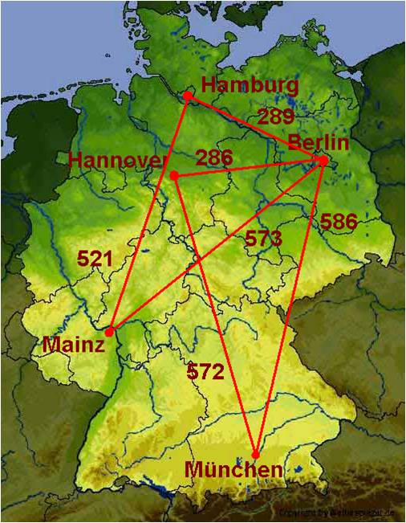

.. sidebar:: ToC

   .. contents::

.. _tutorial-graphs:

Graphs
------

Learning Objective
  This tutorial shows how to use graphs in SeqAn and their functionality.

Difficulty
  Average

Duration
  1 h

Prerequisites
  :ref:`tutorial-sequences`, :ref:`tutorial-alignment-representation`, :ref:`tutorial-pairwise-sequence-alignment`

A graph in computer science is an ordered pair :math:`G = (V, E)` of a set of vertices V and a set of edges E.
SeqAn provides different :dox:`Graph Graph types of graphs` and the most well-known graph algorithms as well as some specialized alignment graph algorithms.
In this part of the tutorial, we demonstrate how to construct a graph in SeqAn and show the usage of some algorithms.
Alignment graphs are described in the tutorial :ref:`tutorial-alignment-representation`.

Let us follow a simple example.
We have given the following network of five cities and in this network we want to compute the shortest path from Hannover to any other city.

In the section `Graph Basics`_, we will create the network and write the graph to a `.dot` file.
The section `Property Maps and Iterators`_ assigns city names to the vertices and demonstrates the usage of a vertex iterator.
Finally, in `Graph Algorithms`_ we will compute the shortest path by calling a single function.

After having worked through these sections you should be familiar with the general usage of graphs in SeqAn.

Graph Basics
~~~~~~~~~~~~

The general header file for all types of graphs is ``<seqan/graph_types.h>``.
It comprises the class :dox:`Graph` and its specializations, all functions for basic graph operations, and different iterators.
Later, for computing the shortest path we will also need ``<seqan/graph_algorithms.h>`` which includes the implementations of most of SeqAn's graph algorithms.

.. includefrags:: core/demos/tutorial/graph/graph_dijkstra.cpp
   :fragment: includes

We want to model the network of cities as an undirected graph and label the edges with distances.
Before we start creating edges and vertices, we need some typedefs to specify the graph type.

SeqAn offers different specializations of the class :dox:`Graph`:, :dox:`UndirectedGraph Undirected Graph`, :dox:`DirectedGraph`, :dox:`Tree`, :dox:`Automaton`, :dox:`HmmGraph`, and :dox:`AlignmentGraph Alignment Graph`.
For our example, an undirected graph will be sufficient, so we define our own graph type ``TGraph`` with the specialization :dox:`UndirectedGraph Undirected Graph` of the class :dox:`Graph`.
Luckily, this specialization has an optional cargo template argument, which attaches any kind of object to the edges of the graph.
This enables us to store the distances between the cities, our edge labels, using the cargo type ``TCargo`` defined as ``unsigned int``.
Using the cargo argument, we have to provide a distance when adding an edge.
And when we remove an edge we also remove the distance.

.. includefrags:: core/demos/tutorial/graph/graph_dijkstra.cpp
   :fragment: main-typedefs

Each vertex and each edge in a graph is identified by a so-called descriptor.
The type of the descriptors is returned by the metafunction :dox:`VertexDescriptor`.
In our example, we define a type ``TVertexDescriptor`` by calling :dox:`VertexDescriptor` on our graph type.
Analogously, there is the metafunction :dox:`Graph#EdgeDescriptor` for edge descriptors.

We can now create the graph ``g`` of our type ``TGraph``.

.. code-block:: cpp

   TGraph g;

For our example, we add five vertices for the five cities, and six edges connecting the cities.

Vertices can be added to ``g`` by a call to the function :dox:`Graph#addVertex`.
The function returns the descriptor of the created vertex.
These descriptors are needed to add the edges afterwards.

.. includefrags:: core/demos/tutorial/graph/graph_dijkstra.cpp
   :fragment: create-vertices

The function :dox:`Graph#addEdge` adds an edge to the graph.
The arguments of this function are the graph to which the edge is added, the vertices that it connects, and the cargo (which is in our case the distance between the two cities).

.. includefrags:: core/demos/tutorial/graph/graph_dijkstra.cpp
   :fragment: create-edges

Once we have created the graph we may want to have a look at it.
SeqAn offers the possibility to write a graph to a dot file.
With a tool like `Graphviz <http://www.graphviz.org/>`_ you can then visualize the graph.

The only thing that we have to do is to call the function :dox:`Graph#write` on a file stream with the tag ``DotDrawing()`` and pass over our graph ``g``.

.. includefrags:: core/demos/tutorial/graph/graph_dijkstra.cpp
   :fragment: main-graph-io

After executing this example, there should be a file ``graph.dot`` in your directory.

Alternatively, you can use the standard output to print the graph to the screen:

.. code-block:: cpp

   std::cout << g << '\n';

Assignment 1
""""""""""""

.. container:: assignment

   Type
     Review

   Objective
     Copy the code from above and adjust it such that a road trip from Berlin via Hamburg and Hannover to Munich is simulated.

   Hints
     Use directed Edges

   Solution
     Click **more...** to see the solution.

     .. container:: foldable

	.. includefrags:: core/demos/tutorial/graph/solution_1.cpp

Assignment 2
""""""""""""

.. container:: assignment

   Type
     Application

   Objective
      Write a program which creates a directed graph with the following edges:
      ``(1,0), (0,4), (2,1), (4,1), (5,1), (6,2), (3,2), (2,3), (7,3), (5,4), (6,5), (5,6), (7,6), (7,7)``
      Use the function :dox:`Graph#addEdges` instead of adding each edge separately.
      Output the graph to the screen.

   Solution
     Click **more...** to see the solution.

     .. container:: foldable

	We first have to include the corresponding header file for graphs.
	Instead of ``<seqan/graph_types.h>``, we can also include ``<seqan/graph_algorithms.h>`` as it already includes ``<seqan/graph_types.h>``.

	.. includefrags:: core/demos/tutorial/graph/graph_algo_scc.cpp
	   :fragment: includes

	This time we define a :dox:`DirectedGraph` without cargo at the edges.

	.. includefrags:: core/demos/tutorial/graph/graph_algo_scc.cpp
	   :fragment: typedefs

	The function :dox:`Graph#addEdges` takes as parameters an array of vertex descriptors and the number of edges.
	The array of vertex descriptors is sorted in the way predecessor1, successor1, predecessor2, successor2, ...

	.. includefrags:: core/demos/tutorial/graph/graph_algo_scc.cpp
	   :fragment: main-graph-construction

	The screen output of the graph consists of an adjacency list for the vertices and an edge list:

	.. code-block:: console

	   Adjacency list:
	   0 -> 4,
	   1 -> 0,
	   2 -> 3,1,
	   3 -> 2,
	   4 -> 1,
	   5 -> 6,4,1,
	   6 -> 5,2,
	   7 -> 7,6,3,
	   Edge list:
	   Source: 0,Target: 4 (Id: 1)
	   Source: 1,Target: 0 (Id: 0)
	   Source: 2,Target: 3 (Id: 7)
	   Source: 2,Target: 1 (Id: 2)
	   Source: 3,Target: 2 (Id: 6)
	   Source: 4,Target: 1 (Id: 3)
	   Source: 5,Target: 6 (Id: 11)
	   Source: 5,Target: 4 (Id: 9)
	   Source: 5,Target: 1 (Id: 4)
	   Source: 6,Target: 5 (Id: 10)
	   Source: 6,Target: 2 (Id: 5)
	   Source: 7,Target: 7 (Id: 13)
	   Source: 7,Target: 6 (Id: 12)
	   Source: 7,Target: 3 (Id: 8)

Assignment 3
""""""""""""

.. container:: assignment

   Type
     Transfer

   Objective
     Write a program which defines an HMM for DNA sequences:

     * Define an exon, splice, and intron state.
     * Consider to use the type ``LogProb<>`` from ``<seqan/basic/basic_logvalue.h>`` for the transition probabilities.
       Sequences always start in the exon state.
       The probability to stay in an exon or intron state is 0.9.
       There is exactly one switch from exon to intron.
       Between the switch from exon to intron state, the HMM generates exactly one letter in the splice state.
       The sequence ends in the intron state with a probability of 0.1.
     * Output the HMM to the screen.
     * Use the follwing emission probabilities.

       +------------------+------+------+------+------+
       |                  | A    | C    | G    | T    |
       +==================+======+======+======+======+
       | **exon state**   | 0.25 | 0.25 | 0.25 | 0.25 |
       +------------------+------+------+------+------+
       | **splice state** | 0.05 | 0.0  | 0.95 | 0.0  |
       +------------------+------+------+------+------+
       | **intron state** | 0.4  | 0.1  | 0.1  | 0.4  |
       +------------------+------+------+------+------+

   Solution
     .. container:: foldable

	The program starts with the inclusion of ``<seqan/graph_algorithms.h>`` and ``<seqan/basic/basic_logvalue.h>``.
	In this example you could include ``<seqan/graph_types.h>`` instead of the algorithms header file.
	However, it is likely that if you define a graph, you will call a graph algorithm as well.

	.. includefrags:: core/demos/tutorial/graph/graph_hmm.cpp
	   :fragment: includes

	Next, we define our types.
	The most interesting type here is ``THmm``.
	It is a :dox:`Graph` with the specialization :dox:`HmmGraph`.
	The specialization takes itself three template arguments: the alphabet of the sequence that the HMM generates, the type of the transitions, and again a specialization.
	In our case, we define the transitions to be the logarithm of the probilities (:dox:`LogProb`) and hereby simplify multiplications to summations.
	For the specialization we explicitly use the ``Default`` tag.

	.. includefrags:: core/demos/tutorial/graph/graph_hmm.cpp
	   :fragment: typedefs

	After that, we define some variables, especially one of our type ``THmm``.

	.. includefrags:: core/demos/tutorial/graph/graph_hmm.cpp
	   :fragment: variables

	Now we can start with defining the states.
	States are represented by the vertices of the HMM-specialized graph.

	The initial and terminating states of an HMM in SeqAn are always silent, i.e. they do not generate characters.
	That is why we have to define an extra begin state and tell the program that this is the initial state of the HMM.
	The latter is done by calling the function :dox:`HmmGraph#assignBeginState`.

	.. includefrags:: core/demos/tutorial/graph/graph_hmm.cpp
	   :fragment: begin-state

	For our three main states we also add a vertex to the HMM with :dox:`Graph#addVertex`.
	Additionally, we assign the emission probabilities for all possible characters of our alphabet using :dox:`HmmGraph#emissionProbability`.

	.. includefrags:: core/demos/tutorial/graph/graph_hmm.cpp
	   :fragment: main-states-emissions

	Finally, we need to define the end state and call :dox:`HmmGraph#assignEndState`.

	.. includefrags:: core/demos/tutorial/graph/graph_hmm.cpp
	   :fragment: end-state

	For the HMM, only the transition probabilities are still missing.
	A transition is represented by an edge of our HMM graph type.
	The cargo on these edges correspond to the transition probabilities.

	Since the sequences always start with an exon, we set the transition probability from the begin state to the exon state to 1.0 calling the already well-known function :dox:`Graph#addEdge`.
	And also the other transitions can be defined in the same way.

	.. includefrags:: core/demos/tutorial/graph/graph_hmm.cpp
	   :fragment: transitions

	To check the HMM we can simply output it to the screen:

	.. code-block:: cpp

	   std::cout << hmm << '\n';

	This should yield the following:

	.. code-block:: console

	   Alphabet:
	   {A,C,G,T}
	   States:
	   {0 (Silent),1,2,3,4 (Silent)}
	   Begin state: 0
	   End state: 4
	   Transition probabilities:
	   0 -> 1 (1.000000)
	   1 -> 2 (0.100000) ,1 (0.900000)
	   2 -> 3 (1.000000)
	   3 -> 4 (0.100000) ,3 (0.900000)
	   4 ->
	   Emission probabilities:
	   1: A (0.250000) ,C (0.250000) ,G (0.250000) ,T (0.250000)
	   2: A (0.050000) ,C (0.000000) ,G (0.950000) ,T (0.000000)
	   3: A (0.400000) ,C (0.100000) ,G (0.100000) ,T (0.400000)

Property Maps And Iterators
~~~~~~~~~~~~~~~~~~~~~~~~~~~

So far, the vertices in our graph can only be distinguished by their vertex descriptor.
We will now see how to associate the city names with the vertices.

SeqAn uses :dox:`ExternalPropertyMap External Property Map` to attach auxiliary information to the vertices and edges of a graph.
The cargo parameter that we used above associated distances to the edges.
In most scenarios you should use an external property map to attach information to a graph.
Be aware that the word external is a hint that the information is stored independently of the graph and functions like :dox:`Graph#removeVertex` do not affect the property map.
Property maps are simply :dox:`String Strings` of a property type and are indexed via the already well-known vertex and edge descriptors.

Lets see how we can define a vertex property map for the city names.
Our property type is a :dox:`String` of a city name type, a char string.
We only have to create and :dox:`Graph#resizeVertexMap resize` this map so that it can hold information on all vertices.

.. includefrags:: core/demos/tutorial/graph/graph_dijkstra.cpp
   :fragment: definition-property-map

Next, we can enter the city names for each vertex.
Note that this is completely independent from our graph object ``g``.

.. includefrags:: core/demos/tutorial/graph/graph_dijkstra.cpp
   :fragment: enter-properties

If we now want to output all vertices including their associated information we can iterate through the graph and use the iterators value to access the information in the property map.

But let us first have a quick look at iterators for graph types.
SeqAn provides six different specializations for graph iterators: :dox:`VertexIterator Vertex Iterator`, :dox:`AdjacencyIterator Adjacency Iterator`, :dox:`DfsPreorderIterator Dfs Preorder Iterator`, and :dox:`BfsIterator Bfs Iterator` for traversing vertices, and :dox:`EdgeIterator Edge Iterator` and :dox:`OutEdgeIterator Out-edge Iterator` for traversing edges.
Except for the :dox:`VertexIterator Vertex Iterator` and the :dox:`EdgeIterator Edge Iterator` they depend additionally to the graph on a specified edge or vertex.

To output all vertices of our graph in an arbitrary order, we can define an iterator of the specialization :dox:`VertexIterator Vertex Iterator` and determine its type with the metafunction :dox:`ContainerConcept#Iterator`.
The functions :dox:`RootedIteratorConcept#atEnd` and :dox:`InputIteratorConcept#goNext` also work for graph iterators as for all other iterators in SeqAn.

The :dox:`IteratorAssociatedTypesConcept#value` of any type of vertex iterator is the vertex descriptor.
To print out all city names we have to call the function :dox:`ExternalPropertyMap#getProperty` on our property map ``cityNames`` with the corresponding vertex descriptor that is returned by the value function.

.. includefrags:: core/demos/tutorial/graph/graph_dijkstra.cpp
   :fragment: iterate-and-output-properties

The output of this piece of code should look as follows:

.. code-block:: console

   0:Berlin
   1:Hamburg
   2:Hannover
   3:Mainz
   4:Munich

Assignment 4
""""""""""""

.. container:: assignment

   Type
     Application

   Objective
     Add a vertex map to the program from task 2:

     #. The map shall assign a lower-case letter to each of the seven vertices.
        Find a way to assign the properties to all vertices at once in a single function call (*without* using the function :dox:`ExternalPropertyMap#assignProperty` for each vertex separately).
     #. Show that the graph is not connected by iterating through the graph in depth-first-search ordering.
        Output the properties of the reached vertices.

   Solution
     .. container:: foldable

	Our aim is not to assign all properties at once to the vertices.
	Therefore, we create an array containing all the properties, the letters `'a'` through `'h'`.

	The function :dox:`Graph#assignVertexMap` does not only resize the vertex map (as :dox:`Graph#resizeVertexMap` does) but also initializes it.
	If we specify the optional parameter ``prop``, the values from the array ``prop`` are assigned to the items in the property map.

	.. includefrags:: core/demos/tutorial/graph/graph_algo_scc.cpp
	   :fragment: vertex-map

	To iterate through the graph in depth-first-search ordering we have to define an :dox:`Container#Iterator` with the specialization :dox:`DfsPreorderIterator`.

	The vertex descriptor of the first vertex is ``0`` and we choose this vertex as a starting point for the depth-first-search through our graph ``g`` with the iterator ``dfsIt``:

	.. includefrags:: core/demos/tutorial/graph/graph_algo_scc.cpp
	   :fragment: iterate-dfs

	For the chosen starting point, only two other vertices can be reached:

	.. code-block:: console

	   Iterate from 'a' in depth-first-search ordering: a, e, b,

Graph Algorithms
~~~~~~~~~~~~~~~~

Now that we completed creating the graph we can address the graph algorithms.
Here is an overview of some graph algorithms currently available in SeqAn:

Elementary Graph Algorithms
  * Breadth-First Search (:dox:`breadthFirstSearch`)
  * Depth-First Search (:dox:`depthFirstSearch`)
  * Topological Sort (:dox:`topologicalSort`)
  * Strongly Connected Components (:dox:`stronglyConnectedComponents`)

Minimum Spanning Tree
  * Prim's Algorithm  (:dox:`primsAlgorithm`)
  * Kruskal's Algorithm (:dox:`kruskalsAlgorithm`)

Single-Source Shortest Path
  * DAG Shortest Path (:dox:`dagShortestPath`)
  * Bellman-Ford (:dox:`bellmanFordAlgorithm`)
  * Dijkstra (:dox:`dijkstra`)

All-Pairs Shortest Path
 * All-Pairs Shortest Path (:dox:`allPairsShortestPath`)
 * Floyd Warshall (:dox:`floydWarshallAlgorithm`)

Maximum Flow
 * Ford-Fulkerson (:dox:`fordFulkersonAlgorithm`)

Transitive Closure
 * Transitive Closure (:dox:`transitiveClosure`)

Bioinformatics Algorithms
 * Needleman-Wunsch (:dox:`globalAlignment`)
 * Gotoh (:dox:`globalAlignment`)
 * Hirschberg with Gotoh (:dox:`globalAlignment`)
 * Smith-Waterman (:dox:`localAlignment`)
 * Multiple Sequence Alignment (:dox:`globalMsaAlignment`)
 * UPGMA (:dox:`upgmaTree`)
 * Neighbor Joining (:dox:`njTree`)

The biological algorithms use heavily the alignment graph.
Most of them are covered in the tutorial :ref:`tutorial-alignment-representation`.
All others use the appropriate standard graph.
All algorithms require some kind of additional input, e.g., the Dijkstra algorithm requires a distance property map, alignment algorithms sequences and a score type and the network flow algorithm capacities on the edges.

Generally, only a single function call is sufficient to carry out all the calculations of a graph algorithm.
In most cases you will have to define containers that store the algorithms results prior to the function call.

In our example, we apply the shortest-path algorithm of Dijkstra. It is implemented in the function :dox:`dijkstra`.

Let's have a look at the input parameters.
The first parameter is of course the graph, ``g``.
Second, you will have to specify a vertex descriptor.
The function will compute the distance from this vertex to all vertices in the graph.
The last input parameter is an edge map containing the distances between the vertices.
One may think that the distance map is already contained in the graph.
Indeed this is the case for our graph type but it is not in general.
The cargo of a graph might as well be a string of characters or any other type.
So, we first have to find out how to access our internal edge map.
We do not need to copy the information to a new map.
Instead we can define an object of the type :dox:`InternalMap` of our type ``TCargo``.
It will automatically find the edge labels in the graph when the function :dox:`ExternalPropertyMap#property` or :dox:`ExternalPropertyMap#getProperty` is called on it with the corresponding edge descriptor.

The output containers of the shortest-path algorithm are two property maps, ``predMap`` and ``distMap``.
The ``predMap`` is a vertex map that determines a shortest-paths-tree by mapping the predecessor to each vertex.
Even though we are not interested in this information, we have to define it and pass it to the function.
The ``distMap`` indicates the length of the shortest path to each vertex.

.. includefrags:: core/demos/tutorial/graph/graph_dijkstra.cpp
   :fragment: dijkstra-containers

Having defined all these property maps, we can then call the function :dox:`dijkstra`:

.. code-block:: cpp

   dijkstra(g,vertHannover,cargoMap,predMap,distMap);

Finally, we have to output the result.
Therefore, we define a second vertex iterator ``itV2`` and access the distances just like the city names with the function :dox:`ExternalPropertyMap#property` on the corresponding property map.

.. includefrags:: core/demos/tutorial/graph/graph_dijkstra.cpp
   :fragment: dijkstra-output

Assignments 5
"""""""""""""

.. container:: assignment

   Type
     Application

   Objective
     Write a program which calculates the connected components of the graph defined in task 1.
     Output the component for each vertex.

   Solution
     .. container:: foldable

	SeqAn provides the function :dox:`stronglyConnectedComponents` to compute the connected components of a directed graph.
	The first parameter of this function is of course the graph.
	The second parameter is an output parameter.
	It is a vertex map that will map a component id to each vertex. Vertices that share the same id are in the same component.

	.. includefrags:: core/demos/tutorial/graph/graph_algo_scc.cpp
	   :fragment: connected-components

	Now, the only thing left to do is to walk through our graph and ouput each vertex and the corresponding component using the function :dox:`ExternalPropertyMap#getProperty`.
	One way of doing so is to define a :dox:`VertexIterator`.

	.. includefrags:: core/demos/tutorial/graph/graph_algo_scc.cpp
	   :fragment: output-connected-components

	The output for the graph defined in the `Assignment 4`_ looks as follows:

	.. code-block:: console

	   Strongly Connected Components:
	   Vertex a: Component = 3
	   Vertex b: Component = 3
	   Vertex c: Component = 2
	   Vertex d: Component = 2
	   Vertex e: Component = 3
	   Vertex f: Component = 1
	   Vertex g: Component = 1
	   Vertex h: Component = 0

	The graph consists of four components.
	The first contains vertex ``a``, ``b``, and ``e``, the second contains vertex ``c`` and ``d``, the third
	contains vertex ``f`` and ``g`` and the last contains only vertex ``h``.

Assignment 6
""""""""""""

.. container:: assignment

   Type
     Application

   Objective
      Extend the program from the `Assignment 5`.
      Given the sequence ``s = "CTTCATGTGAAAGCAGACGTAAGTCA"``.

      #. calculate the Viterbi path of ``s`` and output the path as well as the probability of the path and
      #. calculate the probability that the HMM generated ``s`` with the forward and backward algorithm.

   Solution
     .. container:: foldable

	In `Assignment 3`_ we defined an HMM with three states: exon, splice, and intron.

	The Viterbi path is the sequence of states that is most likely to produce a given output.
	In SeqAn, it can be calculated with the function :dox:`HmmAlgorithms#viterbiAlgorithm`.
	The produced output for this assignment is the DNA sequence ``s``.

	The first parameter of the function :dox:`HmmAlgorithms#viterbiAlgorithm` is of course the HMM, and the second parameter is the sequence ``s``.
	The third parameter is an output parameter that will be filled by the function.
	Since we want to compute a sequence of states, this third parameter is a :dox:`String` of :dox:`VertexDescriptor VertexDescriptors` which assigns a state to each character of the sequence ``s``.

	The return value of the function :dox:`HmmAlgorithms#viterbiAlgorithm` is the overall probability of this sequence of states, the Viterbi path.

	The only thing left is to output the path.
	The path is usually longer than the given sequence.
	This is because the HMM may have silent states, e.g. the begin and end state.
	To check if a state is silent SeqAn provides the function :dox:`HmmGraph#isSilent`.

	.. includefrags:: core/demos/tutorial/graph/graph_hmm.cpp
	   :fragment: viterbi

	The output of the above piece of code is:

	.. code-block:: console

	   Viterbi algorithm
	   Probability of best path: 1.25465e-18
	   Sequence:
	   C,T,T,C,A,T,G,T,G,A,A,A,G,C,A,G,A,C,G,T,A,A,G,T,C,A,
	   State path:
	   0 (Silent),1,1,1,1,1,1,1,1,1,1,1,1,1,1,1,1,1,1,2,3,3,3,3,3,3,3,4 (Silent)

	It is even simpler to use the forward algorithm in SeqAn since it needs only the HMM and the sequence as parameters and returns a single probability.
	This is the probability of the HMM to generate the given sequence. The corresponding function is named :dox:`HmmAlgorithms#forwardAlgorithm`.

	.. includefrags:: core/demos/tutorial/graph/graph_hmm.cpp
	   :fragment: forward-algorithm

	Analogously, the function :dox:`HmmAlgorithms#backwardAlgorithm` implements the backward algorithm in SeqAn.

	.. includefrags:: core/demos/tutorial/graph/graph_hmm.cpp
	   :fragment: backward-algorithm

	The output of these two code fragments is:

	.. code-block:: console

	    Forward algorithm
	    Probability that the HMM generated the sequence: 2.71585e-18
	    Backward algorithm
	    Probability that the HMM generated the sequence: 2.71585e-18
