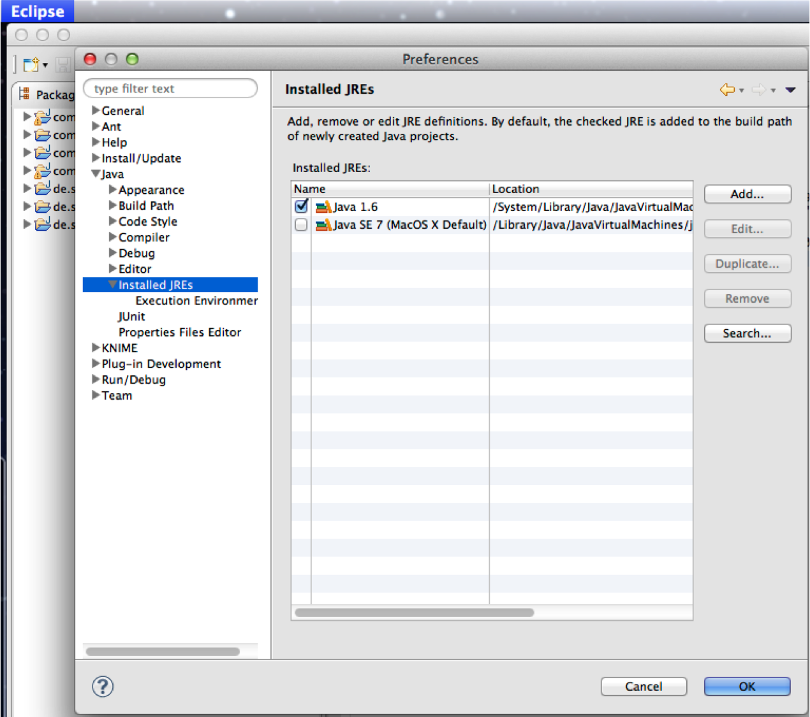
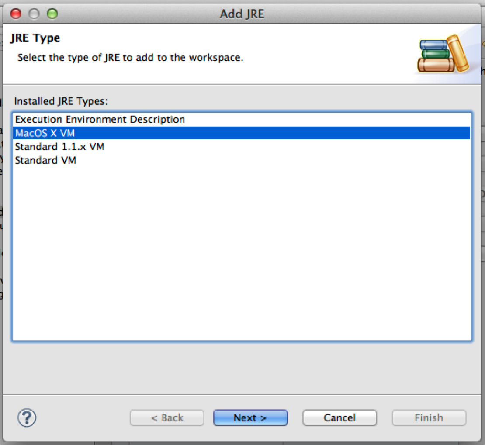
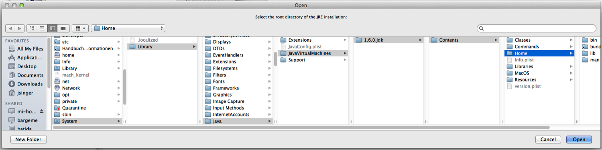
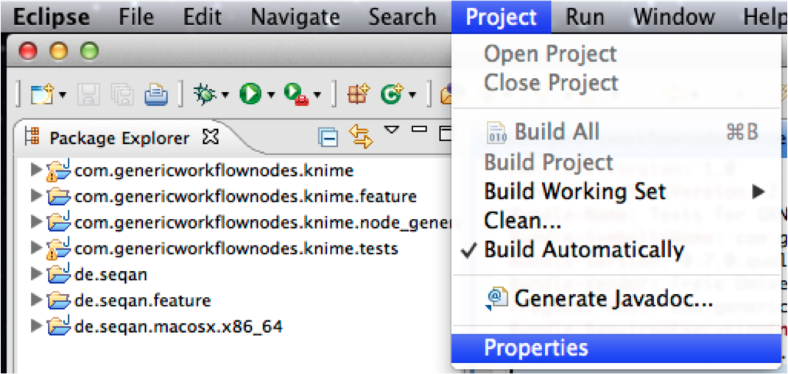
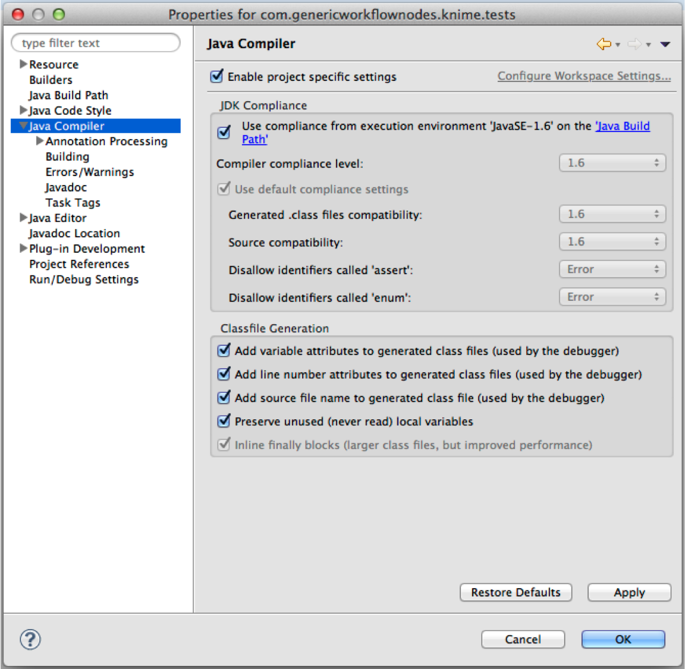

.. sidebar:: ToC

    .. contents::

.. _how-to-recipes-choose-the-jre-version:

Choosing The JRE Version
========================

In order to change the JRE to be used by KNIME go to Eclipse ``Preferences`` and select the ``Java`` menu.

Afterwards you can add the right JRE. Under MacOs you choose the entry ``MacOS X VM``

then press next and select the right path, which should be ``/System/Library/Java/JavaVirtualMachines/1.6.0.jdk/Contents/Home`` as shown here:

Press ``Finish`` and the right JRE will be added.

Afterwards you have to set the compiler options.
In order to do so go to ``Project`` and select ``Properties``.

Now select ``Java Compiler`` and select the correct JRE at the ``Compiler compliance level:``

If you run the project now KNIME should start without problems.
