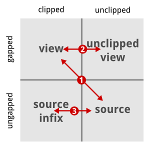

.. sidebar:: ToC

    .. contents::

.. _how-to-recipes-clip-alignments:

Computing Positions In Clipped Alignments
=========================================

This page describes how to compute view and source positions in an unclipped and clipped :dox:`Align`.

Position Computation Overview
-----------------------------

There are four coordinate systems related to each gap object.
One can consider the positions with and without gaps, both with and without clipping.
The following picture and list show the easiest transformations between the coordinate systems.

#. Translate between view (gapped clipped) position and source (ungaped unclipped) position using the functions :dox:`Gaps#toSourcePosition` and :dox:`Gaps#toViewPosition`.
#. Translate between clipped and unclipped gapped position by adding/subtracting :dox:`Gaps#clippedBeginPosition` of the gaps object.
#. Translate between clipped ungapped and unclipped ungapped position by adding/subtracting :dox:`Gaps#beginPosition` of the gaps object.

All other transformations are most easily done following one of the paths from the picture above.

An Example
----------

The following extensive example shows how to practically translate between the coordinate systems.

.. includefrags:: demos/howto/align_gaps_clipping.cpp

The output looks as follows:

.. includefrags:: demos/howto/align_gaps_clipping.cpp.stdout
