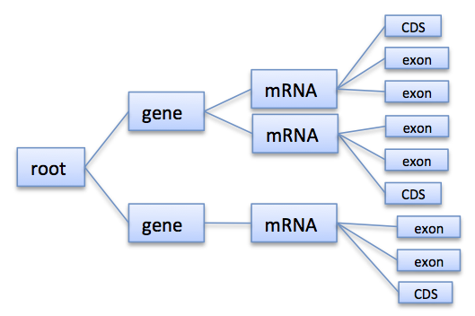

.. sidebar:: ToC

    .. contents::

.. _how-to-use-cases-simple-rna-seq:

Simple RNA-Seq
==============

Learning Objective
 You will learn how to write a simple gene quantification tool based on RNA-Seq data.

Difficulty
  Hard

Duration
  2h

Prerequisites
  :ref:`tutorial-datastructures-store-genome-annotations`, :ref:`tutorial-datastructures-store-fragment-store`, experience with OpenMP (optional)

RNA-Seq refers to high-throughput sequencing of cDNA in order to get information about the RNA molecules available in a sample.
Knowing the sequence and abundance of mRNA allows to determine the (differential) expression of genes, to detect alternative splicing variants, or to annotate yet unknown genes.

In the following tutorial you will develop a simple gene quantification tool.
It will load a file containing gene annotations and a file with RNA-Seq read alignments, compute abundances, and output RPKM values for each expressed gene.

Albeit its simplicity, this example can be seen as a starting point for more complex applications, e.g. to extend the tool from quantification of genes to the quantification of (alternatively spliced) isoforms, or to de-novo detect yet unannotated isoforms/genes.

You will learn how to use the :dox:`FragmentStore` to access gene annotations and alignments and how to use the :dox:`IntervalTree` to efficiently determine which genes overlap a read alignment.

Introduction to the used Data Structures
----------------------------------------

This section introduces the :dox:`FragmentStore` and the :dox:`IntervalTree`, which are the fundamental data structures used in this tutorial to represent annotations and read alignments and to efficiently find overlaps between them.
You may skip one or both subsections if you are already familiar with one or both data structures.

Fragment Store
^^^^^^^^^^^^^^

The :dox:`FragmentStore` is a data structure specifically designed for read mapping, genome assembly or gene annotation.
These tasks typically require lots of data structures that are related to each other such as

* reads, mate-pairs, reference genome
* pairwise alignments, and
* genome annotation.

The Fragment Store subsumes all these data structures in an easy to use interface.
It represents a multiple alignment of millions of reads or mate-pairs against a reference genome consisting of multiple contigs.
Additionally, regions of the reference genome can be annotated with features like 'gene', 'mRNA', 'exon', 'intron' (see :dox:`FragmentStore::PredefinedAnnotationTypes`) or custom features.
The Fragment Store supports I/O functionality to read/write a read alignment in `SAM <http://samtools.sourceforge.net/>`_ or `AMOS <http://amos.sourceforge.net/wiki/index.php/AMOS>`_ format and to read/write annotations in `GFF <http://genome.ucsc.edu/FAQ/FAQformat.html#format3>`_ or `GTF <http://genome.ucsc.edu/FAQ/FAQformat.html#format4>`_ format.

The Fragment Store can be compared with a database where each table (called "store") is implemented as a :dox:`String` member of the :dox:`FragmentStore` class.
The rows of each table (implemented as structs) are referred by their ids which are their positions in the string and not stored explicitly.
The only exception is the alignedReadStore whose elements of type :dox:`AlignedReadStoreElement` contain an id-member as they may be rearranged in arbitrary order, e.g. by increasing genomic positions or by readId.
Many stores have an associated name store to store element names.
Each name store is a :dox:`StringSet` that stores the element name at the position of its id.
All stores are present in the Fragment Store and empty if unused.
The concrete types, e.g. the position types or read/contig alphabet, can be easily changed by defining a custom config struct which is a template parameter of the Fragment Store class.

Annotation Tree
^^^^^^^^^^^^^^^

Annotations are represented as a tree that at least contains a root node where all annotations are children or grandchildren of.
A typical annotation tree looks as follows:

   Annotation tree example

In the Fragment Store the tree is represented by :dox:`FragmentStore::annotationStore`, :dox:`FragmentStore::annotationTypeStore`, :dox:`FragmentStore::annotationKeyStore`, and others.
Instead of accessing these tables directly, the :dox:`AnnotationTreeIterator AnnotationTree Iterator` provides a high-level interface to traverse and access the annotation tree.

Interval Tree
^^^^^^^^^^^^^

The :dox:`IntervalTree` is a data structure that stores one-dimensional intervals in a balanced tree and efficiently answers `range queries <http://en.wikipedia.org/wiki/Range_query>`_.
A range query is an operation that returns all tree intervals that overlap a given query point or interval.

The interval tree implementation provided in SeqAn is based on a :dox:`Tree` which is balanced if all intervals are given at construction time.
Interval tree nodes are objects of the :dox:`IntervalAndCargo` class and consist of 2 interval boundaries and additional user-defined information, called cargo.
To construct the tree on a set of given interval nodes use the function :dox:`IntervalTree#createIntervalTree`.
The functions :dox:`IntervalTree#addInterval` and :dox:`IntervalTree#removeInterval` should only be used if the interval tree needs to be changed dynamically (as they not yet balance the tree).

Import Alignments and Gene Annotations from File
^^^^^^^^^^^^^^^^^^^^^^^^^^^^^^^^^^^^^^^^^^^^^^^^

At first, our application should create an empty ``FragmentStore`` object into which we import a gene annotation file and a file with RNA-Seq alignments.
An empty ``FragmentStore`` can simply be created with:

.. includefrags:: demos/tutorial/simple_rna_seq/base.cpp
      :fragment: store

Files can be read from disk with the function :dox:`File#read` that expects an open stream (e.g. a STL `ifstream <http://www.cplusplus.com/reference/iostream/ifstream>`_), a ``FragmentStore`` object, and a :dox:`FileFormats File Format` tag.
The contents of different files can be loaded with subsequent calls of ``read``.
As we want the user to specify the files via command line, our application will parse them using the :dox:`ArgumentParser` and store them in an option object.

In your first assignment you need to complete a given code template and implement a function that loads a SAM file and a GTF file into the ``FragmentStore``.

Assignment 1
""""""""""""

.. container:: assignment

   Type
     Application

   Objective
     Use the code template below (click **more...**) and implement the function ``loadFiles`` to load the annotation and alignment files.
     Use the file paths given in the options object and report an error if the files could not be opened.

     .. container:: foldable

        .. includefrags:: demos/tutorial/simple_rna_seq/genequant_assignment1.cpp

   Hint
     * Open STL `std::fstream <http://www.cplusplus.com/reference/iostream/ifstream>`_ objects and use the function :dox:`File#read` with a SAM or GTF tag.
     * `ifstream::open <http://www.cplusplus.com/reference/iostream/ifstream/open>`_ requires the file path to be given as a C-style string (``const char *``).
     * Use `string::c_str <http://www.cplusplus.com/reference/string/string/c_str>`_ to convert the option strings into C-style strings.
     * The function :dox:`File#read` expects a stream, a :dox:`FragmentStore` and a tag, i.e. ``Sam()`` or ``Gtf()``.

   Solution
     .. container:: foldable

        .. includefrags:: demos/tutorial/simple_rna_seq/genequant_solution1.cpp
           :fragment: solution

Extract Gene Intervals
^^^^^^^^^^^^^^^^^^^^^^

Now that the Fragment Store contains the whole annotation tree, we want to traverse the genes and extract the genomic ranges they span.
In the annotation tree, genes are (the only) children of the root node.
To efficiently retrieve the genes that overlap read alignments later, we want to use interval trees, one for each contig.
To construct an interval tree, we first need to collect :dox:`IntervalAndCargo` objects in a string and pass them to :dox:`IntervalTree#createIntervalTree`.
See the interval tree demo in ``demos/interval_tree.cpp`` for more details.
As cargo we use the gene's annotation id to later retrieve all gene specific information.
The strings of ``IntervalAndCargo`` objects should be grouped by ``contigId`` and stored in an (outer) string of strings.
For the sake of simplicity we don't differ between genes on the forward or reverse strand and instead always consider the corresponding intervals on the forward strand.

To define this string of strings of ``IntervalAndCargo`` objects, we first need to determine the types used to represent an annotation.
All annotations are stored in the :dox:`FragmentStore::annotationStore` which is a Fragment Store member and whose type is :dox:`FragmentStore::TAnnotationStore`.
The value type of the annotation store is the class :dox:`AnnotationStoreElement`.
Its member typedefs :dox:`AnnotationStoreElement::TPos` and :dox:`AnnotationStoreElement::TId` define the types it uses to represent a genomic position or the annotation or contig id:

.. includefrags:: demos/tutorial/simple_rna_seq/base.cpp
      :fragment: typedefs

The string of strings of intervals can now be defined as:

.. includefrags:: demos/tutorial/simple_rna_seq/base.cpp
      :fragment: interval

In your second assignment you should use an :dox:`AnnotationTreeIterator AnnotationTree Iterator` to traverse all genes in the annotation tree.
For each gene, determine its genomic range (projected to the forward strand) and add a new ``TInterval`` object to the ``intervals[contigId]`` string, where ``contigId`` is the id of the contig containing that gene.

Assignment 2
""""""""""""

.. container:: assignment

   Type
     Application

   Objective
     Use the code template below (click **more..**).
     Implement the function ``extractGeneIntervals`` that should extract genes from the annotation tree (see :dox:`AnnotationTreeIterator AnnotationTree Iterator`) and create strings of :dox:`IntervalAndCargo` objects - one for each config - that contains the interval on the forward contig strand and the gene's annotation id.

     .. container:: foldable

        Extend the definitions:

        .. includefrags:: demos/tutorial/simple_rna_seq/genequant_assignment2.cpp
           :fragment: definitions

        Add a function:

        .. includefrags:: demos/tutorial/simple_rna_seq/genequant_assignment2.cpp
           :fragment: yourcode

        Extend the ``main`` function:

        .. includefrags:: demos/tutorial/simple_rna_seq/genequant_assignment2.cpp
           :fragment: main

        and

        .. includefrags:: demos/tutorial/simple_rna_seq/genequant_assignment2.cpp
           :fragment: main2

   Hint
     .. container:: foldable

        You can assume that all genes are children of the root node, i.e. create an :dox:`AnnotationTreeIterator AnnotationTree Iterator`, :dox:`AnnotationTreeIterator#goDown go down` to the first gene and :dox:`AnnotationTreeIterator#goRight go right` to visit all other genes.
        Use :dox:`AnnotationTreeIterator#getAnnotation` to access the gene annotation and :dox:`IteratorAssociatedTypesConcept#value` to get the annotation id.

     .. container:: foldable

        Make sure that you append :dox:`IntervalAndCargo` objects, where ``i1`` < ``i2`` holds, as opposed to annotations where ``beginPos`` > ``endPos`` is possible.
        Remember to ensure that ``intervals`` is of appropriate size, e.g. with

        .. includefrags:: demos/tutorial/simple_rna_seq/base.cpp
              :fragment: resize

        Use :dox:`StringConcept#appendValue` to add a new ``TInverval`` object to the inner string, see :dox:`IntervalAndCargo::IntervalAndCargo IntervalAndCargo constructor` for the constructor.

   Solution
     .. container:: foldable

        .. includefrags:: demos/tutorial/simple_rna_seq/genequant_solution2.cpp
           :fragment: solution

Construct Interval Trees
^^^^^^^^^^^^^^^^^^^^^^^^

With the strings of gene intervals - one for each contig - we now can construct interval trees.
Therefore, we specialize an :dox:`IntervalTree` with the same position and cargo types as used for the :dox:`IntervalAndCargo` objects.
As we need an interval tree for each contig, we instantiate a string of interval trees:

.. includefrags:: demos/tutorial/simple_rna_seq/base.cpp
      :fragment: tree

Your third assignment is to implement a function that constructs the interval trees for all contigs given the string of interval strings.

Assignment 3
""""""""""""

.. container:: assignment

   Type
     Application

   Objective
     Use the code template below (click **more...**).
     Implement the function ``constructIntervalTrees`` that uses the interval strings to construct for each contig an interval tree.
     **Optional:** Use OpenMP to parallelize the construction over the contigs, see :dox:`SEQAN_OMP_PRAGMA`.

     .. container:: foldable

        Extend the definitions:

        .. includefrags:: demos/tutorial/simple_rna_seq/genequant_assignment3.cpp
           :fragment: definitions

        Add a function:

        .. includefrags:: demos/tutorial/simple_rna_seq/genequant_assignment3.cpp
           :fragment: yourcode

        Extend the ``main`` function:

        .. includefrags:: demos/tutorial/simple_rna_seq/genequant_assignment3.cpp
           :fragment: main

        and

        .. includefrags:: demos/tutorial/simple_rna_seq/genequant_assignment3.cpp
           :fragment: main2

   Hint
     .. container:: foldable

        First, resize the string of interval trees accordingly:

        .. includefrags:: demos/tutorial/simple_rna_seq/base.cpp
              :fragment: resize_tree

   Hint
     .. container:: foldable

        Use the function :dox:`IntervalTree#createIntervalTree`.

        **Optional:** Construct the trees in parallel over all contigs with an OpenMP parallel for-loop, see `here <http://developers.sun.com/solaris/articles/openmp.html>`_ for more information about OpenMP.

   Solution
     .. container:: foldable

        .. includefrags:: demos/tutorial/simple_rna_seq/genequant_solution3.cpp
           :fragment: solution

Compute Gene Coverage
^^^^^^^^^^^^^^^^^^^^^

To determine gene expression levels, we first need to compute the read coverage, i.e. the total number of reads overlapping a gene.
Therefore we use a string of counters addressed by the annotation id.

.. includefrags:: demos/tutorial/simple_rna_seq/base.cpp
      :fragment: reads

For each read alignment we want to determine the overlapping genes by conducting a range query via :dox:`IntervalTree#findIntervals` and then increment their counters by 1.
To address the counter of a gene, we use its annotation id stored as cargo in the interval tree.

Read alignments are stored in the :dox:`FragmentStore::alignedReadStore`, a string of :dox:`AlignedReadStoreElement AlignedReadStoreElements` objects.
Their actual type can simply be determined as follows:

.. includefrags:: demos/tutorial/simple_rna_seq/base.cpp
      :fragment: read_alignment_type

Given the :dox:`AlignedReadStoreElement::contigId`, :dox:`AlignedReadStoreElement::beginPos`, and :dox:`AlignedReadStoreElement::endPos` we will retrieve the annotation ids of overlapping genes from the corresponding interval tree.

Your fourth assignment is to implement the count function that performs all the above described steps.
Optionally, use OpenMP to parallelize the counting.

Assignment 4
""""""""""""

.. container:: assignment

   Type
     Application

   Objective
     Use the code template below (click **more...**).
     Implement the function ``countReadsPerGene`` that counts for each gene the number of overlapping reads.
     Therefore determine for each :dox:`AlignedReadStoreElement` begin and end positions (on forward strand) of the alignment and increment the ``readsPerGene`` counter for each overlapping gene.

     **Optional:** Use OpenMP to parallelize the function, see :dox:`SEQAN_OMP_PRAGMA`.

     .. container:: foldable

        Extend the definitions:

        .. includefrags:: demos/tutorial/simple_rna_seq/genequant_assignment4.cpp
           :fragment: definitions

        Add a function:

        .. includefrags:: demos/tutorial/simple_rna_seq/genequant_assignment4.cpp
           :fragment: yourcode

        Extend the ``main`` function:

        .. includefrags:: demos/tutorial/simple_rna_seq/genequant_assignment4.cpp
           :fragment: main

        and

        .. includefrags:: demos/tutorial/simple_rna_seq/genequant_assignment4.cpp
           :fragment: main2

   Hint
     .. container:: foldable
        First, resize and zero the string of counters accordingly:

        .. includefrags:: demos/tutorial/simple_rna_seq/base.cpp
              :fragment: resize_reads

        Make sure that you search with :dox:`IntervalTree#findIntervals` where ``query_begin < query_end`` holds, as opposed to read alignments where ``beginPos`` > ``endPos`` is possible.

   Hint
     .. container:: foldable

        The result of a range query is a string of annotation ids given to :dox:`IntervalTree#findIntervals` by-reference:

        .. includefrags:: demos/tutorial/simple_rna_seq/base.cpp
              :fragment: result

        Reuse the result string for multiple queries (of the same thread, use ``private(result)`` for OpenMP).

   Solution
     .. container:: foldable

        .. includefrags:: demos/tutorial/simple_rna_seq/genequant_solution4.cpp
           :fragment: solution

Output RPKM Values
^^^^^^^^^^^^^^^^^^

In the final step, we want to output the gene expression levels in a normalized measure.
We therefore use **RPKM** values, i.e. the number of **r**\ eads **p**\ er **k**\ ilobase of exon model per **m**\ illion mapped reads (1).
One advantage of RPKM values is their independence of the sequencing throughput (normalized by total mapped reads), and that they allow to compare the expression of short with long transcripts (normalized by exon length).

The exon length of an mRNA is the sum of lengths of all its exons.
As a gene may have multiple mRNA, we will simply use the maximum of all their exon lengths.

Your final assignment is to output the RPKM value for genes with a read counter ``> 0``.
To compute the exon length of the gene (maximal exon length of all mRNA) use an :dox:`AnnotationTreeIterator AnnotationTree Iterator` and iterate over all mRNA (children of the gene) and all exons (children of mRNA).
For the number of total mapped reads simply use the number of alignments in the :dox:`FragmentStore::alignedReadStore`.
Output the gene names and their RPKM values separated by tabs as follows:

.. includefrags:: demos/tutorial/simple_rna_seq/genequant_solution5.cpp.stdout

.. todo: Move the files to somewhere else.

Download and decompress the attached mouse annotation (`Mus_musculus.NCBIM37.61.gtf.zip <http://ftp.seqan.de/manual_files/seqan-1.4/Mus_musculus.NCBIM37.61.gtf.zip>`_ and the alignment file of RNA-Seq reads aligned to chromosome Y (`sim40mio_onlyY.sam.zip <http://ftp.seqan.de/manual_files/seqan-1.4/sim40mio_onlyY.sam.zip>`_).
Test your program and compare your output with the output above.

Assignment 5
""""""""""""

.. container:: assignment

   Type
     Application

   Objective
     Use the code template below (click **more...**).
     Implement the function ``outputGeneCoverage`` that outputs for each expressed gene the gene name and the expression level as RPKM as tab-separated values.

     .. container:: foldable

        Add a function:

        .. includefrags:: demos/tutorial/simple_rna_seq/genequant_assignment5.cpp
           :fragment: yourcode

        Extend the ``main`` function:

        .. includefrags:: demos/tutorial/simple_rna_seq/genequant_assignment5.cpp
           :fragment: main

   Hint
     .. container:: foldable

        To compute the maximal exon length use three nested loops: (1) enumerate all genes, (2) enumerate all mRNA of the gene, and (3) enumerate all exons of the mRNA and sum up their lengths.

   Hint
     .. container:: foldable

        Remember that exons are not the only children of mRNA.

   Solution
     .. container:: foldable

        .. includefrags:: demos/tutorial/simple_rna_seq/genequant_solution5.cpp
           :fragment: solution

Next Steps
----------

* See :cite:`Mortazavi2008` for further reading.
* Read the :ref:`tutorial-io-sam-bam-io` Tutorial and change your program to stream a SAM file instead of loading it as a whole.
* Change the program such that it attaches the RPKM value as a key-value pair (see :dox:`AnnotationTreeIterator#assignValueByKey`) to the annotation of each gene and output a GFF file.
* Continue with the :ref:`tutorial` rest of the tutorials]].
