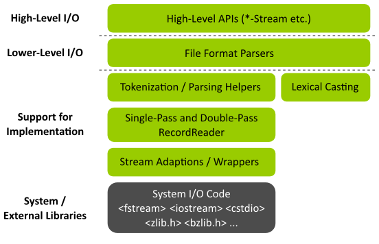

.. sidebar:: ToC

   .. contents::

.. _tutorial-input-output-overview:

I/O Overview
============

Learning Objective
  This article will give you an overview of the I/O infrastruction in SeqAn.
  You will learn how the different pieces work together and how to open files for reading/writing and create ``RecordReader`` objects for reading.

Difficulty
  Advanced

Duration
  20 min

Prerequisites
  :ref:`tutorial-basic-sequence-io`, :ref:`tutorial-indexed-fasta-io`, :ref:`tutorial-basic-sam-bam-io`

This article is not a real tutorial but more of a survey of the I/O functionality in SeqAn.
It is targeted at more advanced developers that want to learn more about how I/O works in SeqAn and get background information.

The article first gives a rough overview of the I/O functionality in SeqAn.
This is then followed by an overview of the :dox:`StreamConcept` concept, the :dox:`StreamConcept` class and adaptions to the :dox:`StreamConcept` concept.
Finally, the :dox:`RecordReader` class is introduced and you learn about the record and document reading API.
After reading this tutorial, you will have an overview about the I/O layers in SeqAn.
You can then proceed to read the :ref:`tutorial-file-io` and the :ref:`tutorial-parsing` tutorials to learn more about Streams and RecordReaders.

Overview
--------

The following picture shows an overview of the I/O and parsing related Layers in SeqAn.
Note that the aim of this tutorial is not explaining each detail of the I/O system in SeqAn but giving you a good first impression of the I/O layers.
These impression should give you a good overview of the I/O system.

   Layers of the I/O system

High-Level I/O
^^^^^^^^^^^^^^

The topmost layer High-Level I/O provides easy-to-use APIs for reading and writing files.
This comes at the potential cost of some performance and genericity.
The reason for this cost is that programming techniques such as virtual function calls have to be used that may inflict performance costs.
The loss of genericity is caused by the simpler APIs having fewer configuration options.
Usually, code on this layer wraps the layer Lower-Level I/O which is one level lower and simplifies its usage.
The API on this layer consists of one (or very few) classes and few functions for each supported file type.

Here is an example for using the high-level I/O:

.. code-block:: cpp

   // Open file and automatically guess that it is gzip-compressed FASTA.
   seqan::SequenceStream seqStream("filename.fasta.gz");
   if (isGood(seqStream))
       std::cerr << "Could not open filename.fasta.gz\n";

   // Read one record.
   seqan::CharString id;
   seqan::Dna5String seq;
   if (readRecord(id, seq, seqStream) != 0)
       std::cerr << "There was an error reading filename.fasta.gz\n";

We use the :dox:`SequenceStream` class to open a gzip-compressed FASTA file.
If this succeeds, we read one record (identifier and sequence) from the sequence stream. The exact usage is explained in the :ref:`tutorial-basic-sequence-io` Tutorial.

Lower-Level I/O
^^^^^^^^^^^^^^^

The second-highest layer Lower-Level I/O provides a more basic and verbose API for reading and writing files.
Usually, the main logic of the I/O code is implemented on this layer and this code uses templates and no virtual functions to implement functionality in a generic way.
This leads to code that can be highly optimized by the compiler.

One characteristic of this layer is using tags such as ``Fasta()`` for ``Fastq()`` in function calls to distinguish between formats.
In contrast, the format selection is hidden in the high-level API.

For many formats, we can simply write to a Stream (a concept from the Implementation Support Layer introduced below) but for reading, we need a :dox:`RecordReader` object.

In the following example we open a FASTA file directly using ``std::fstream``.
Then, we write one FASTA record to the stream.
The example below looks similar to the example above that used :dox:`SequenceStream`.
The main difference is that the file format is not detected automatically but the code is fixed to read FASTA only.
Also, the code below does not allow reading from compressed files.

Note that it would be possible to change the code to also read FASTQ by first detecting the file format manually and then calling ``readRecord()`` with the tag ``seqan::Fastq()`` instead of ``seqan::Fasta()`` if the file format is FASTQ.
It would also be possible to first manually detect whether the file is compressed and use :dox:`GzFileStream` to read from a gzip compressed stream.
In this case, the user has full control about the code and thus the performance but the code gets much more verbose.

.. code-block:: cpp

   // Open file for writing using the standard C++ IOStreams library.
   std::fstream outStream("filename.fasta", std::ios::out | std::ios::binary);
   if (outStream.good())
       std::cerr << "Could not open filename.fasta\n";

   // Write one record.
   seqan::CharString id = "seq1";
   seqan::Dna5String seq = "CGATCCAGATGT";
   if (writeRecord(seqStream, id, seq, seqan::Fasta()) != 0)
       std::cerr << "There was an error writing to filename.fasta\n";

The :dox:`RecordReader` class provides important wrapping functionality for underlying file representations (let us stick to streams for now).
You usually open a stream and then create a :dox:`SinglePassRecordReader Single-Pass RecordReader`.
You then read using this reader:

.. code-block:: cpp

   // Open file for reading using the standard C++ IOStreams library.
   std::fstream inStream("filename.fasta", std::ios::in | std::ios::binary);
   if (inStream.good())
       std::cerr << "Could not open filename.fasta\n";

   // Create record reader.
   seqan::RecordReader<std::fstream, seqan::SinglePass<> > reader(inStream);

   // Read one record from the reader.
   seqan::CharString id;
   seqan::Dna5String seq;
   if (readRecord(id, seq, reader, Fasta()))
       std::cerr << "There was an error reading from filename.fasta\n";

These two layers are meant to be used by SeqAn library users directly.
The layers below are used by the high-level I/O and lower level I/O routines.
Library users only get in contact with them when they initiate reading or writing files using the lower-level API: When *writing*, users open a stream and then use the SeqAn I/O routines to write records to the stream.
When *reading*, users open a stream, create a :dox:`RecordReader` and then read records from the stream via the :dox:`RecordReader`.

Implementation Support
^^^^^^^^^^^^^^^^^^^^^^

The Implementation Support layers contain:

#. Adaptions of system library provided file and stream routines to the
   SeqAn :dox:`StreamConcept` concept.
#. The :dox:`RecordReader` hierarchy for wrapping streams.
   They provide functionality that is important for the efficient implementation of I/O code.
#. Code for tokenization and parsing, based on :dox:`RecordReader` objects.
#. Conversion from textual number representations to numeric values (aka "lexical casting").

The Implementation Support Layers will be described in detail in the :ref:`tutorial-parsing` Tutorial.

System / External Libraries
^^^^^^^^^^^^^^^^^^^^^^^^^^^

The System / External Libraries layer contains libraries provided by the operating system or third-party libraries such as `zlib <http://zlib.net>` for compression.
These libraries are used by the layers above to actually access the files on disk.

Streams
-------

Most data formats in bioinformatics simply contain a series of records, often preceded by a header.
The most important use case if reading sequentially over such a data stream, with the occasional jump.
In computer science, it is common to call the abstraction to such data sources **streams**.
In SeqAn, the concept :dox:`StreamConcept` provides an interface for such stream data types.

SeqAn provides adaptions from the standardized C and C++ file interfaces to the :dox:`StreamConcept` concept.
You can use the I/O streams from the ``<iostream>`` library, the string buffer streams from the ``<sstream>`` library as well as the ``FILE *`` type from the ``<cstdio>`` library.
Furthermore, SeqAn provides the :dox:`Stream` class and specializations for accessing ``char`` arrays and zlib and bzip compressed files as streams.
The :ref:`tutorial-input-output-overview` tutorial gives a more detailed introduction into this topic.

You already saw above how the streams from the ``<iostream>`` library can be used for reading and writing.
Using the adaption in the SeqAn library, we can simply use ``FILE *`` instead of ``std::fstream``.
The following example uses ``std::fstream``.

.. code-block:: cpp

   // Open file for writing using the standard C++ IOStreams library.
   std::fstream outStream("filename.fasta", std::ios::binary | std::ios::out);
   if (outStream.good())
       std::cerr << "Could not open filename.fasta\n";

   // Write one record, this will write the following to filename.fasta:
   // >id1
   // CGATTTTT
   if (write2(outStream, "id1", "CGATTTTT", Fasta()) != 0)
       std::cerr << "There was an error writing to filename.fasta\n";

   fclose(outStream);

Now, we simply replace the constructor of ``std::fstream`` by calls to ``fopen()`` and of course have to close the file again manually using ``fclose()``.
We use ``ferror()`` instead of the member function ``good()``. The modified example looks as follows.

.. code-block:: cpp

   // Open file for reading using the standard C++ IOStreams library.
   FILE * inStream = fopen("filename.fasta", "rb");
   if (ferror(inStream))
       std::cerr << "Could not open filename.fasta\n";

   // Create record reader.
   seqan::RecordReader<FILE *, seqan::SinglePass<> > reader(inStream);

   // Read one record from the reader.
   seqan::CharString id;
   seqan::Dna5String seq;
   if (readRecord(id, seq, reader, Fasta()))
       std::cerr << "There was an error reading from filename.fasta\n";

   fclose(inStream);

.. important::

   Always Use Binary File Open Mode

   Note that we open the files in binary mode above in all cases.
   On Unix, it makes no difference whether binary mode is used or not:
   You always read exactly what is written on the disk and you write to the disk exactly what you have in memory.

   On Windows, however, there is a difference.
   When opening a file in non-binary, and thus "text" mode, all line endings will automatically be converted into Windows style.
   If your file contains ``"\n"``, you will actually read ``"\r\n"``.
   '''This wreaks havoc when getting or setting the position in the current file.'''

   Thus: '''Always open your file in binary mode.'''
   This will avoid weird crashes and malfunction on Windows.

Record Readers
--------------

The :dox:`RecordReader` class is a wrapper around file-like objects, such as Streams.
However, as you will learn in the :ref:`tutorial-file-io` tutorial, it also provides a generalized interface for memory mapped files that are accessed as :dox:`MMapString MMap String` objects.
Depending on the actual specialization, [:dox:`RecordReader` RecordReaders] also add a buffer which allows to re-read the first several thousand characters of a file which is very useful for automatic file type detection.

When using the :dox:`RecordReader` class in the Lower-Level I/O layer, you only have to know how to create a :dox:`RecordReader` for reading.
You do not have to know how to implement parsing functionality with them.

Constructing :dox:`RecordReader` objects is easy.
You parametrize the class template with the underlying stream type (e.g. ``FILE *`` or ``std::fstream``) and choose the specialization ``SinglePass<>``.
To the constructor, you pass the stream object as the only argument.
Note that the file already has to be opened for reading.

.. code-block:: cpp

   std::fstream inputFile("filename.fasta", std::ios::input | std::ios::binary);
   seqan::RecordReader<std::fstream, seqan::SinglePass<> > reader(inputFile);

You can learn about how to implement parsers using the :dox:`RecordReader` API in the :ref:`tutorial-parsing` Tutorial.

Record vs. Document I/O
-----------------------

Most file formats in bioinformatics are structured as lists of records.
Often, they start out with a header that itself contains different header records.
For example, the SAM format starts with an optional header where users can specify the contigs of their reference sequence.
This header is then followed by a list of records storing the same type of information.
In the case of SAM, for example, each record contains the information of a read alignment, in the case of FASTQ, each record contains a sequence identifier, the sequence itself, and base qualities.

Generally, there are two important use cases for I/O in bioinformatics.
(1) Processing a file record by record, such that only one or a few records are stored in memory.
This approach is useful when dealing with large files such as NGS read files or whole SAM or BAM alignment files.
(2) Reading all of a file into main memory.
This approach is useful for reading a smaller file into main memory, for example for multiple sequence alignment of proteins or for leading a chunk of a NGS read file to build a q-gram index of the reads.

This leads to the two types of APIs in SeqAn.
Record-reading and document reading of files.

When reading a file record-by-record, the function ``readRecord()`` is overloaded.
The function overloads are structured as follows:

* The first parameters are the output parameters where the read data is written to.
* Where applicable, this is followed by a state or context object for the given file type (see below for more detail).
* This is followed by the :dox:`RecordReader` object to read from.
* Where applicable, a tag is used to indicate the file format.
* The function returns an integer status code.
  ``0`` is returned to indicate that no error occured while ``1`` is returned to indicate an error.

This is best explained with an example.
When reading FASTQ, the first three parameters are the strings to store the identifier, sequence characters, and base qualities into.
The fourth parameter is the :dox:`RecordReader` object to read the data from.
The last parameter ``seqan::Fastq()`` is a tag indicating the file format.

.. code-block:: cpp

   std::fstream in("file.fq", std::ios::binary | std::ios::in);
   seqan::RecordReader<std::fstream, seqan::SinglePass<> > reader(in);

   seqan::CharString id;
   seqan::Dna5String seq;
   seqan::CharString qual;
   int res = readRecord(id, seq, qual, reader, seqan::Fastq());

When reading SAM, we first have to read the header.
Then, we can read a record from the file which is passed as the first parameter.
For reading the record, we have to pass a :dox:`BamIOContext` object that is necessary for translating the reference name to its numeric id.
This is then followed by the :dox:`RecordReader` object to read from and the tag ``seqan::Sam()`` to specify the format.
The full initialization of the :dox:`BamAlignmentRecord` is a bit complex and omitted below.

.. code-block:: cpp

   std::fstream in("file.sam", std::ios::binary | std::ios::in);
   seqan::RecordReader<std::fstream, seqan::SinglePass<> > reader(in);

   seqan::BamIOContext<TNameStore> context(refNameStore, refNameStoreCache);
   seqan::BamHeader header;
   int res1 = readRecord(header, context, reader, seqan::Sam());

   seqan::BamAlignmentRecord record;
   int res2 = readRecord(record, context, reader, seqan::Sam());

When reading a whole file into main memory, an overload of the function ``read()`` is used.
The parameter order is the same as in case of ``readRecord()`` but the types are :dox:`String Strings` or :dox:`StringSet StringSets` of the types of the ``readRecord()`` variant.
For example, consider the following example of reading a whole FASTA file into main memory.

.. code-block:: cpp

   std::fstream in("file.fa", std::ios::binary | std::ios::in);
   seqan::RecordReader<std::fstream, seqan::SinglePass<> > reader(in);

   seqan::StringSet<seqan::CharString> ids;
   seqan::StringSet<seqan::Dna5String> seqs;
   int res = read2(ids, seqs, reader, seqan::Fasta());

For writing files, SeqAn provides overloads of the function ``write()`` and ``writeRecord()``.
Their usage is similar.
However, the parameter order is different, accordingly to the SeqAn coding style guide:

* The first parameter is the output stream to write the data to.
* This is followed by the data to write out.
* Where applicable, this is followed by a context object.
* Where applicable, a tag is used to indicate the file format.
* The function returns an integer status code.
  ``0`` is returned to indicate that no error occured while ``1`` is returned to indicate an error.

Next Steps
----------

If you want, you can now have a look at the API documentation of the :dox:`StreamConcept` concept and its implementations as well as the documentation of the :dox:`RecordReader` class.

There are two "tracks" in this section of the tutorials which you can follow.
First, you can now read the tutorials for **specific already supported file formats**.

* :ref:`tutorial-sequence-file-io`
* :ref:`tutorial-sam-bam-io`

Second, if you want to learn how to write **support for new file formats** then read the following articles in order.

* :ref:`tutorial-file-io`
* :ref:`tutorial-lexical-casting`
* :ref:`tutorial-parsing`
