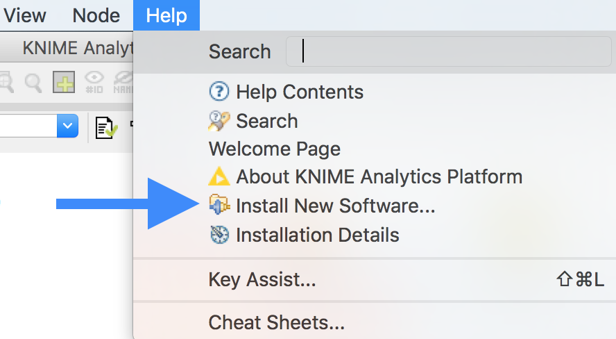
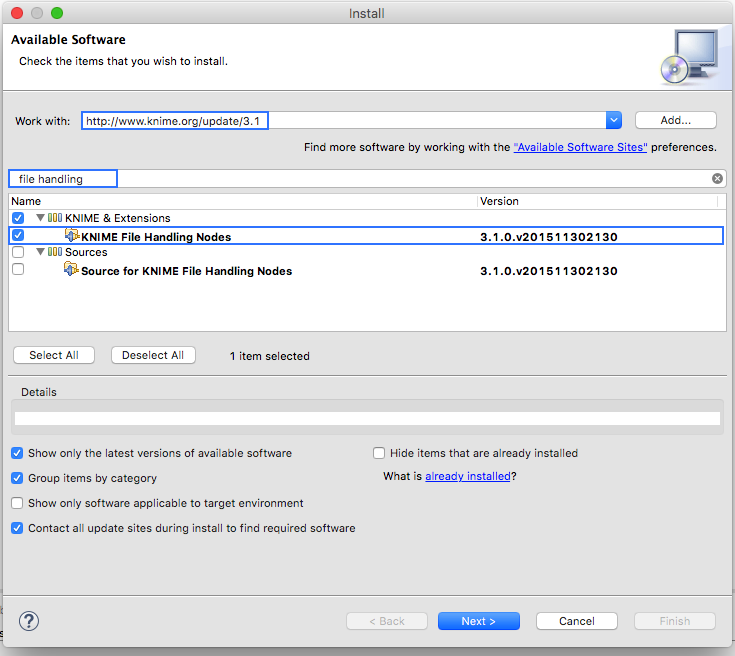
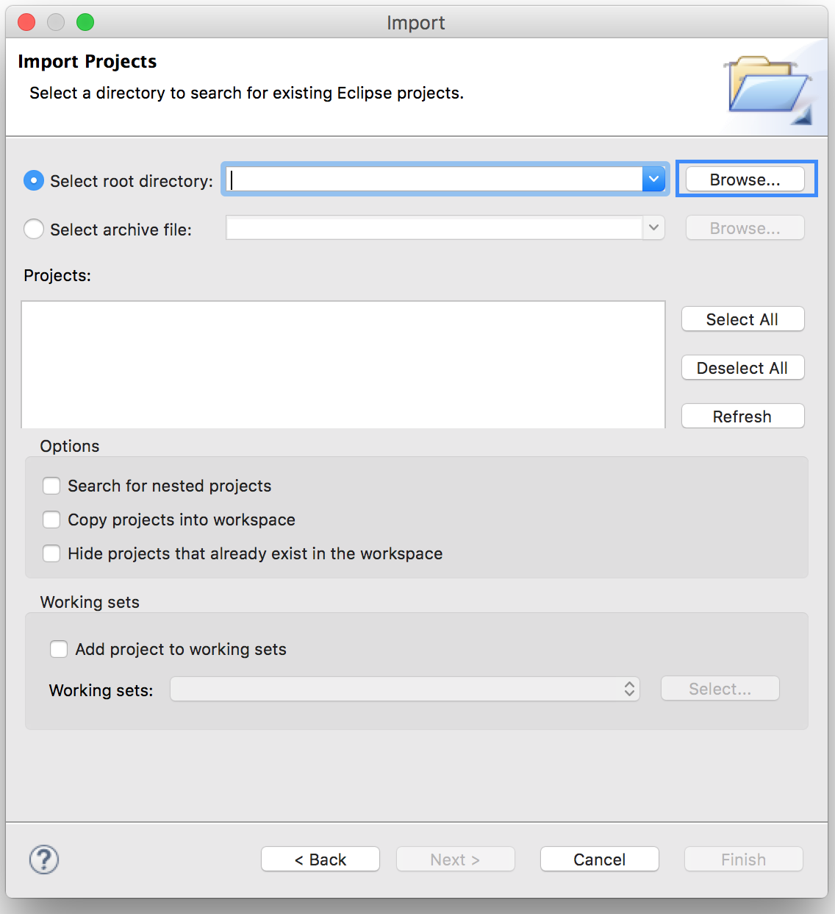
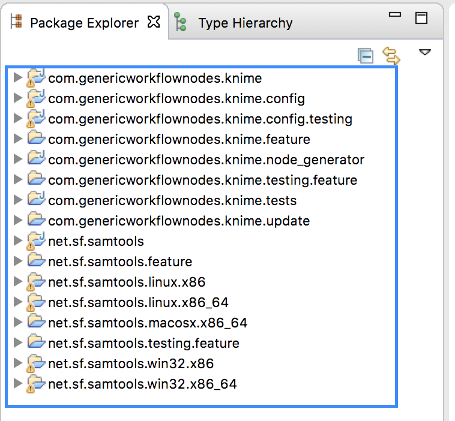
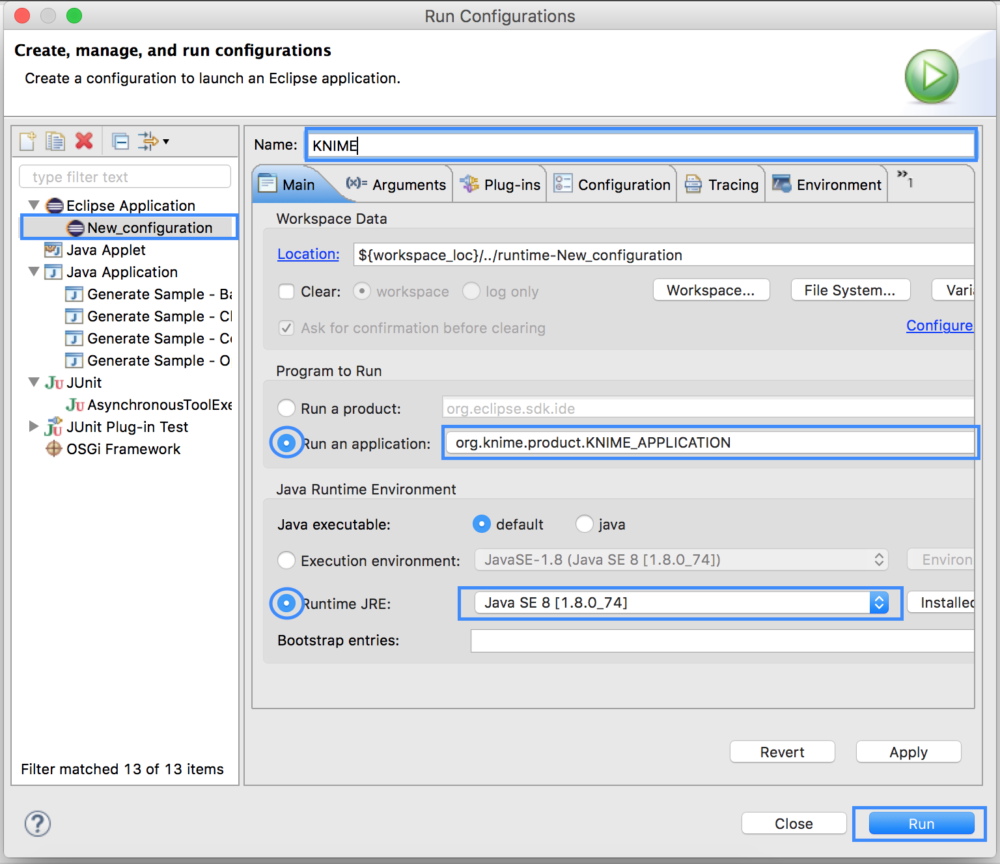

.. sidebar:: ToC

    .. contents::

.. |br| raw:: html

    

.. _tutorial-workflows-generating-knime-nodes:

Generating KNIME Nodes
======================

With the help of GenericWorkflowNodes one can make his/her command line applications available in KNIME as nodes that can be included as parts of a bigger workflow. In this tutorial you will learn how to make your command line application available as a KNIME node.

Prerequisites
-------------

| ** Eclipse KNIME SDK**
|   You can download it from the `KNIME Download Site <http://www.knime.org/downloads/overview>`_ (at the end of the page). We will use Version 3.1.
| **git**
|   For Downloading the latest samtools and GenericKnimeNodes.
| **Apache Ant**
|   The Generic KNIME Plugins project uses `Apache Ant <http://ant.apache.org/>`_ as the build system.
   On Linux and Mac, you should be able to install it through your package manager.
   For Windows, see the `Apache Ant Downloads <http://ant.apache.org/bindownload.cgi>`_ (note that samtools does not work on Windows so you will not be able to follow through with this tutorial on Windows).

|br|

.. _tutorial-workflows-generating-knime-nodes-overview:

Overview
--------
KNIME nodes are shipped as Eclipse plugins. The **GenericKnimeNodes** (GWN) package provides the infrastructure to automatically generate such nodes from the description of their command line.
The description of the command line is kept in XML files called :ref:`Common Tool Descriptor (CTD) files <tutorial-workflows-generating-knime-nodes-ctd>`.

  .. tip::

    *For SeqAn Apps*, 
    thanks to the seqan::ArgumentParser class generating a plugin directory is completely automatic if you are using the SeqAn build infrastructure. All you have to do is run make with target prepare_workflow_plugin. Read the tutorial :ref:`Generating SeqAn KNIME Nodes <tutorial-workflows-generating-seqan-knime-nodes>` for more details.

The input of the GWN package is a directory tree with the following structure:

::

    plugin_dir
      │
      ├── plugin.properties
      │
      ├── descriptors (place your ctd files and mime.types here)
      ├    ├── app1_name.ctd
      ├    ├── app2_name.ctd
      ├    ├── ...
      ├    ├── mime.types
      │
      ├── payload (place your binaries here)
      │
      ├── icons (the icons to be used must be here)
      │
      ├── DESCRIPTION (A short description of the project)
      │
      ├── LICENSE (Licensing information of the project)
      │
      └── COPYRIGHT (Copyright information of the project)

The file plugin.properties
^^^^^^^^^^^^^^^^^^^^^^^^^^

This file contains the plugin configuration. Look at the following ``plugin.properties`` file as an example:

::

    # the package of the plugin
    pluginPackage=net.sf.samtools

    # the name of the plugin
    pluginName=SamTools

    # the version of the plugin
    pluginVersion=0.1.17

    # the path (starting from KNIMEs Community Nodes node)
    nodeRepositoyRoot=community

    executor=com.genericworkflownodes.knime.execution.impl.LocalToolExecutor
    commandGenerator=com.genericworkflownodes.knime.execution.impl.CLICommandGenerator

When creating your own plugin directory, you only have to update the first three properties:

| **pluginPackage**
|   A Java package path to use for the Eclipse package.
| **pluginName**
|   A CamelCase name of the plugin.
| **pluginVersion**
|   Version of the Eclipse plugin.

|br|

The Directory descriptors 
^^^^^^^^^^^^^^^^^^^^^^^^^

The descriptors directory contains two types of files i.e. the *CTD files* for each application in our plugin and a *mime.types* file.
    
MIME Types
^^^^^^^^^^
*mime.types*  file is a text file that contains a mapping between MIME types and file extensions. Every file extension, to be either used or produced by the applications in the plugin, has to be registered here. Each line contains the definition of a `MIME type <http://en.wikipedia.org/wiki/Internet_media_type>`_.
The name of the mime type is followed (separated by a space) by the file extensions associated with the file type.  The following example shows how the content of a *mime.types* file looks like.

::

    application/x-fasta fa fasta
    application/x-fastq fq fastq
    application/x-sam sam
    application/x-bam bam

.. important::

  There may be no ambiguous mappings, like giving a single extension for both *application/x-fasta* and *application/x-fastq* in the example shown above. An extension should be mapped to a single application. 

.. _tutorial-workflows-generating-knime-nodes-ctd:

The CTD (Common Tool descriptor) files
^^^^^^^^^^^^^^^^^^^^^^^^^^^^^^^^^^^^^^
For every application with the name ``app_name``, there is one CTD file called *${app_name}.ctd*. These files contain the command line description of an application in XML format. They also decide which command-line arguments will be input/output ports or configuration entries in the node to be generated.

.. Tip::
  
  For applications developed in SeqAn or applications using the seqan::ArgumentParser for parsing their command-line arguments a CTD file can be generated using a hidden parameter ``-write-ctd``.

  for example:

  .. code-block:: console

    ./seqan_app_name -write-ctd seqan_app_name.ctd

  Look at the tutorials :ref:`Make Your SeqAn App KNIME Ready <tutorial-workflows-knime-ready-seqan-app>` and :ref:`Generating SeqAn KNIME Nodes <tutorial-workflows-generating-seqan-knime-nodes>` .

Below is an example of a CTD file for a SortBam tool for sorting BAM files.

.. code-block:: xml

    <?xml version="1.0" encoding="UTF-8"?>
    <tool name="SortBam" version="0.1.17" category="SAM and BAM"
          docurl="http://samtools.sourceforge.net/samtools.shtml">
        <executableName>samtools</executableName>
        <description><![CDATA[SAMtools BAM Sorting.]]></description>
        <manual><![CDATA[samtools sort]]></manual>
        <docurl>Direct links in docs</docurl>
        <cli>
            <clielement optionIdentifier="sort" isList="false" />
            <clielement optionIdentifier="-f" isList="false" />

            <!-- Following clielements are arguments. You should consider
                 providing a help text to ease understanding. -->
            <clielement optionIdentifier="" isList="false">
                <mapping referenceName="bam_to_sam.argument-0" />
            </clielement>
            <clielement optionIdentifier="" isList="false">
                <mapping referenceName="bam_to_sam.argument-1" />
            </clielement>

            <clielement optionIdentifier="" isList="false">
                <mapping referenceName="bam_to_sam.argument-2" />
            </clielement>
        </cli>
        <PARAMETERS version="1.4"
                    xsi:noNamespaceSchemaLocation="http://open-ms.sourceforge.net/schemas/Param_1_4.xsd"
                    xmlns:xsi="http://www.w3.org/2001/XMLSchema-instance">
            <NODE name="bam_to_sam" description="SAMtools BAM to SAM conversion">
                <ITEM name="argument-0" value="" type="input-file" required="true"
                      description="Input BAM file." supported_formats="*.bam" />
                <ITEM name="argument-1" value="" type="output-file" required="true"
                      description="Output BAM file." supported_formats="*.bam" />
                <ITEM name="argument-2" value="" type="string" required="true"
                      description="Sort by query name (-n) instead of position (default)" restrictions=",-n" />
            </NODE>
        </PARAMETERS>
    </tool>

.. hint::

    If a ``<clielement>`` does provides an empty ``optionIdentifier`` then it is a positional argument without a flag (examples for parameters with flags are ``-n 1``, ``--number 1``).

    If a ``<clielement>`` does not provide a ``<mapping>`` then it is passed regardless of whether has been configured or not.

The ``samtools_sort_bam`` tool from above does not provide any configurable options but only two arguments.
These are by convention called ``argument-0`` and ``argument-1`` but could have any name.

Also, we always call the program with ``sort -f`` as the first two command line arguments since we do not provide a mapping for these arguments.

Click **more...** to see the description of the tags and the attributes in the CTD XML file:

.. container:: foldable

  **CTD Tags attributes:**

  | **/tool**
  |    The root tag.
  | **/tool@name**
  |    The CamelCase name of the tool as shown in KNIME and part of the class name.
  | **/tool@version**
  |    The version of the tool.
  | **/tool@category**
  |    The path to the tool's category.
  | **/tool/executableName**
  |    The name of the executable in the payload ZIP's *bin* dir.
  | **/tool/description**
  |    Description of the tool.
  | **/tool/manual**
  |    Long description for the tool.
  | **/tool/docurl**
  |    URL to the tool's documentation.
  | **/tool/cli**
  |    Container for the ``<clielement>`` tags.
      These tags describe the command line options and arguments of the tool.
      The command line options and arguments can be mapped to parameters which are configurable through the UI.
      The parameters are stored in **tool/PARAMETERS**
  | **/tool/cli/clielement**
  |    There is one entry for each command line argument and option.
  | **/tool/cli/clielement@optionIdentifier**
  |    The identifier of the option on the command line.
      For example, for the ``-l`` option of ``ls``, this is ``-l``.
  | **/tool/cli/clielement@isList**
  |    Whether or not the parameter is a list and multiple values are possible.
      One of ``true`` and ``false``.
  | **/tool/cli/clielement/mapping**
  |    Provides the mapping between a CLI element and a PARAMETER.
  | **/tool/cli/clielement/mapping@referenceName**
  |    The path of the parameter.
      The parameters ``<ITEM>`` s in **tool/PARAMETERS** are stored in nested ``<NODE>`` tags and this gives the path to the specific parameter.
  | **/tool/PARAMETERS**
  |    Container for the ``<NODE>`` and ``<ITEM>`` tags.
      The ``<PARAMETERS>`` tag is in a diferent namespace and provides its own XSI.
  | **/tool/PARAMETERS@version**
  |    Format version of the ``<PARAMETERS>`` section.
  | **/tool/PARAMETERS/.../NODE**
  |    A node in the parameter tree.
      You can use such nodes to organize the parameters in a hierarchical fashion.
  | **/tool/PARAMETERS/.../NODE@advanced**
  |    Boolean that marks an option as advanced.
  | **/tool/PARAMETERS/.../NODE@name**
  |    Name of the parameter section.
  | **/tool/PARAMETERS/.../NODE@description**
  |    Documentation of the parameter section.
  | **/tool/PARAMETERS/.../ITEM**
  |    Description of one command line option or argument.
  | **/tool/PARAMETERS/.../ITEM@name**
  |    Name of the option.
  | **/tool/PARAMETERS/.../ITEM@value**
  |    Default value of the option.
      When a default value is given, it is passed to the program, regardless of whether the user touched the default value or not.
  | **/tool/PARAMETERS/.../ITEM@type**
  |    Type of the parameter.
      Can be one of ``string``, ``int``, ``double``, ``input-file``, ``output-path``, ``input-prefix``, or ``output-prefix``.
      Booleans are encoded as ``string`` with the ``restrictions`` attribute set to ``"true,false"``.
  | **/tool/PARAMETERS/.../ITEM@required**
  |    Boolean that states whether the parameter is required or not.
  | **/tool/PARAMETERS/.../ITEM@description**
  |    Documentation for the user.
  | **/tool/PARAMETERS/.../ITEM@supported_formats**
  |    A list of supported file formats.
      Example: ``"*.bam,*.sam"``.
  | **/tool/PARAMETERS/.../ITEM@restrictions**
  |    In case of ``int`` or ``double`` types, the restrictions have the form ``min:``, ``:max``, ``min:max`` and give the smallest and/or largest number a value can have.
      In the case of ``string`` types, restrictions gives the list of allowed values, e.g. ``one,two,three``.
      If the type is ``string`` and the restriction field equals ``"true,false"``, then the parameter is a boolean and set in case ``true`` is selected in the GUI.
      A good example for this would be the ``-l`` flag of the ``ls`` program.

The Directory payload 
^^^^^^^^^^^^^^^^^^^^^^

The directory ``payload`` contains ZIP files with the executable tool binaries. Usually there is one ZIP file for each platform ``(Linux, Windows, and Mac Os X)`` architecture ``(32Bit or 64Bit)``combination. The names of the files are ``binaries_${plat}_${arch}.zip`` where ``${plat}`` is one of ``lnx``, ``win``, or ``mac``, and ``${arch}`` is one of ``32`` and ``64``. In this way the appropriate binaries will be used based on the system that KNIME is running on. Some, even all, of the zip files representing different architectures can be missing. That means the node will not be functional on a KNIME instance installed on the architecture(s) corresponding to missing zip file(s). Nevertheless the payload directory has to be present even if it is empty.

Each ZIP file contains a directory ``/bin`` which is used as the search path for the binary given by ``<executableName>`` and an INI file ``/binaries.ini`` which can be used to set environment variables before executing any of tools.

The Directory icons 
^^^^^^^^^^^^^^^^^^^

Here we put icons for different purposes.

  - An image file with a name *category.png* (15x15 px): an icon for categories in the KNIME node explorer tree.
  - An image file with a name *splash.png* (50x50 px):  an icon to be displayed in the KNIME splash screen.
  - An image file with a name *app_name.png* (15x15 px):  an icon to be displayed with the corresponding node of the application ``app_name``. This is done once for each app but it's optional.

The files DESCRIPTION, LICENSE, COPYRIGHT 
^^^^^^^^^^^^^^^^^^^^^^^^^^^^^^^^^^^^^^^^^

- **DESCRIPTION**:
  A text file with your project's description.
- **LICENSE**:
  A file with the license of the project.
- **COPYRIGHT**:
  A file with copyright information for the project.

|br|

The GWN project provides tools to convert such a plugin directory into an Eclipse plugin.
This plugin can then be launched together with KNIME.
The following picture illustrates the process.

Running Example
---------------

We will adapt some functions from the `samtools <http://samtools.sf.net>`_ package to KNIME:

| **BamToSam**
|   This tool will execute ``samtools view -o ${OUT} ${IN}``.
| **SamToBam**
|   This tool will execute ``samtools view -Sb -o ${OUT} ${IN}``.
| **SortBam**
|   This tool will execute ``samtools sort -o ${OUT} ${IN}``.

|br|

Preparation: Building samtools and Downloading GenericKnimeNodes
----------------------------------------------------------------

We will work in a new directory *knime\_samtools* (we will assume that the directory is directly in your *$HOME* for the rest of the tutorial.
First we need to download samtools-1.3 from http://www.htslib.org/download/. Alternatively you can also use this `direct link <https://github.com/samtools/samtools/releases/download/1.3/samtools-1.3.tar.bz2>`_ or use either of `wget` or `curl` utilities from your command line as follows.

wget

.. code-block:: console

    knime_samtools # wget https://github.com/samtools/samtools/releases/download/1.3/samtools-1.3.tar.bz2
    
curl 

.. code-block:: console

    knime_samtools # curl -OL https://github.com/samtools/samtools/releases/download/1.3/samtools-1.3.tar.bz2
    
Now let us extract and build samtools 

.. code-block:: console

    knime_samtools # tar -jxvf samtools-1.3.tar.bz2 
    ...
    knime_samtools # cd samtools-1.3
    samtools-1.3 # ./configure
    samtools-1.3 # make
    ...
    samtools # ls -l samtools
    -rwxr-xr-x 1 user group 1952339 May  7 16:36 samtools
    samtools # cd ..
    knime_samtools #

Then, we need to download GenericKnimeNodes:

.. code-block:: console

    knime_samtools # git clone git://github.com/genericworkflownodes/GenericKnimeNodes.git

Preparation: Installing KNIME File Handling
-------------------------------------------
We need to install support for file handling nodes in KNIME. In order to do that 
- Launch your Eclipse-KNIME-SDK
  
  .. tip::

    **Launching Eclipse-KNIME-SDK**

    - If you are on a linux system you should browse to your knime_eclipse_3.1 installation double click on ``eclipse`` executable.
    - If you are using MacOS X then you can launch the KNIME SDK 3.1 as you would launch any other application.

- Open the window for installing Eclipse plugins; in the program's main menu: ``Help > Install New Software...``.

- On the install window enter ``http://www.knime.org/update/3.1`` into the ``Work with:`` field, enter ``file`` into the search box, and finally select ``KNIME File Handling Nodes`` in the list.

- Then, click ``Next`` and follow through with the installation of the plugin. When done, Eclipse must be restarted.; in the program's main menu: ``Help > Install New Software...``.

Obtaining the Demo Workflow Plugin Directory
--------------------------------------------

Please download the file :download:`workflow_plugin_dir.zip <workflow_plugin_dir.zip>` to your ``knime_samtools`` directory and look around in the archive. Also have a look into ``binaries_*_*.zip`` files in *payload*. The structure of this ZIP file is similar to the one explained in the Overview section at the beginning of this tutorial.

Creating an Exclipse Plugin from the Plugin Directory
-----------------------------------------------------

The next step is to use GKN to create an Eclipse plugin from the workflow plugin directory.
For this, change to the directory GenericKnimeNodes that we cloned using git earlier.
We then execute ant and pass the variables *knime.sdk* with the path to the KNIME SDK that you downloaded earlier and *plugin.dir* with the path of our extracted ``workflow_plugin_dir`` directory.

  .. tip::

    **Path to Eclipse-KNIME-SDK**
    - If you are on a linux system the path to *knime.sdk* is the path to your ``knime_eclipse_3.1.0``
    - If you are using MacOS X then the default path to *knime.sdk*  is ``/Applications/KNIME\ SDK\ 3.1.0.app/``

.. code-block:: console

    knime_samtools # cd GenericKnimeNodes
    GenericKnimeNodes # ant -Dknime.sdk=${HOME}/eclipse_knime_3.1 \
                          -Dplugin.dir=$HOME/knime_samtools/workflow_plugin_dir

This generates an Eclipse plugin with wrapper classes for our nodes.
The generated files are within the *generated\_plugin* directory of the directory *GenericKnimeNodes*.

Importing the Generated Projects into Eclipse
---------------------------------------------

On the KNIME Eclipse SDK window go to the menu ``File > Import...``. In the ``Import`` window, select ``General > Existing Project Into Workspace``

.. figure:: gkn-import-1.png

On the pop-up dialog, click ``Browse...`` next to ``Select root directory``.

Then, select the directory of your "GenericWorkflowNodes" checkout. The final dialog should then look as follows.

Clicking finish will import (1) the GKN classes themselves and (2) your generated plugin's classes.

.. figure:: gkn-import-3.png

Now, the packages of the GKN classes and your plugin show up in the left ``Package Explorer`` pane of Eclipse.

.. hint::

    **Information:** Synchronizing ``ant`` build result with Eclipse.

    Since the code generation happens outside of Eclipse, there are often problems caused by Eclipse not recognizing updates in generated *java* files.
    After each call to ``ant``, you should clean all built files in all projects by selecting the menu entries ``Project > Clean...``, selecting ``Clean all projects``, and then clicking ``OK``.

    Then, select all projects in the ``Package Explorer``, right-click and select ``Refresh``.

Launching Eclipse with our Nodes
--------------------------------

Finally, we have to launch KNIME with our plugin. We have to create a run configuration for this. Select ``Run > Run Configurations...``.

In the ``Run Configurations`` window, select ``Eclipse Application`` on the left, then create the small ``New launch configuration`` icon on the top left (both marked in the following screenshot).
Now, set the ``Name`` field to "KNIME", select ``Run an application`` and select ``org.knime.product.KNIME_APPLICATION`` in the drop down menu.
Finally, click ``Run``.

Your tool will show up in the tool selector in ``community/SAM and BAM``.

Here is an example KNIME workflow with the nodes that we just created.

