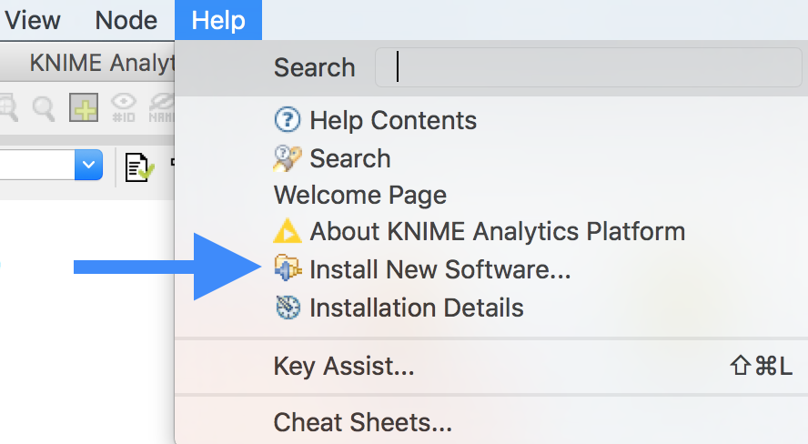
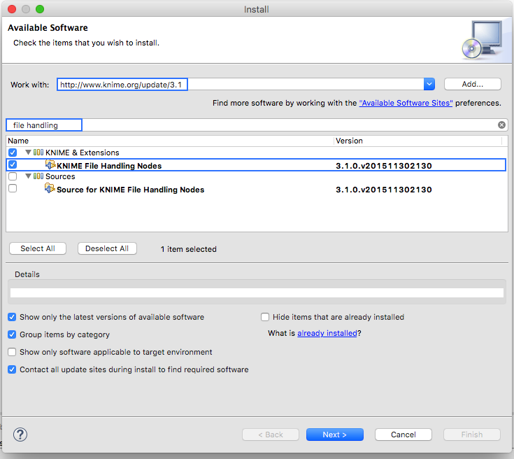
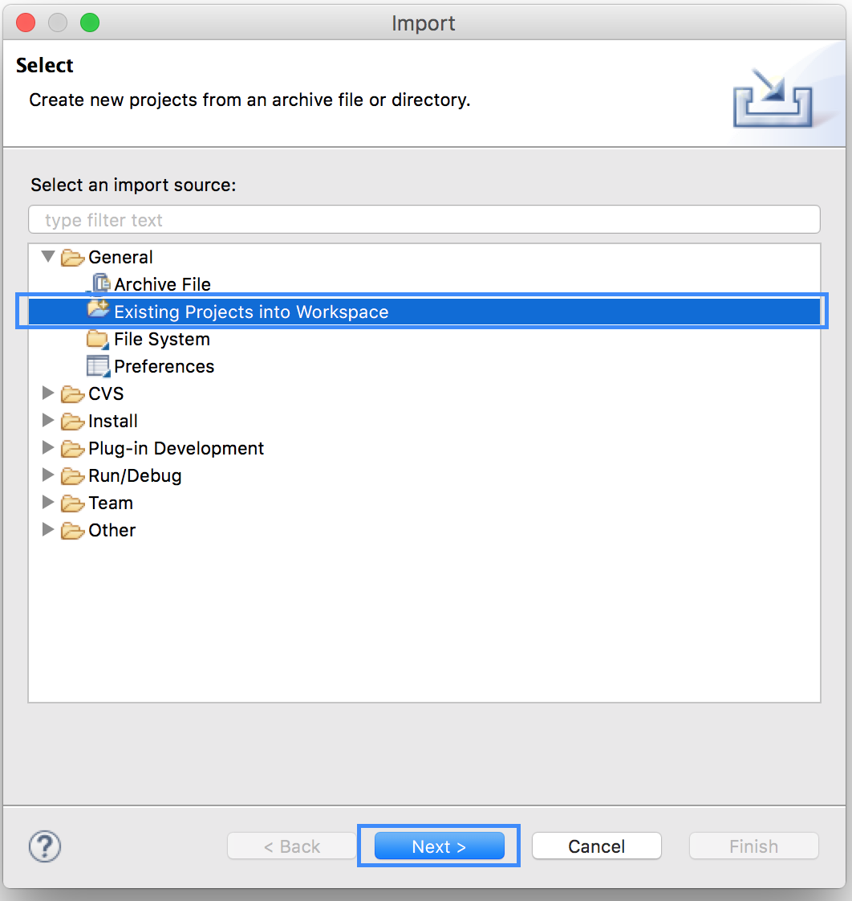
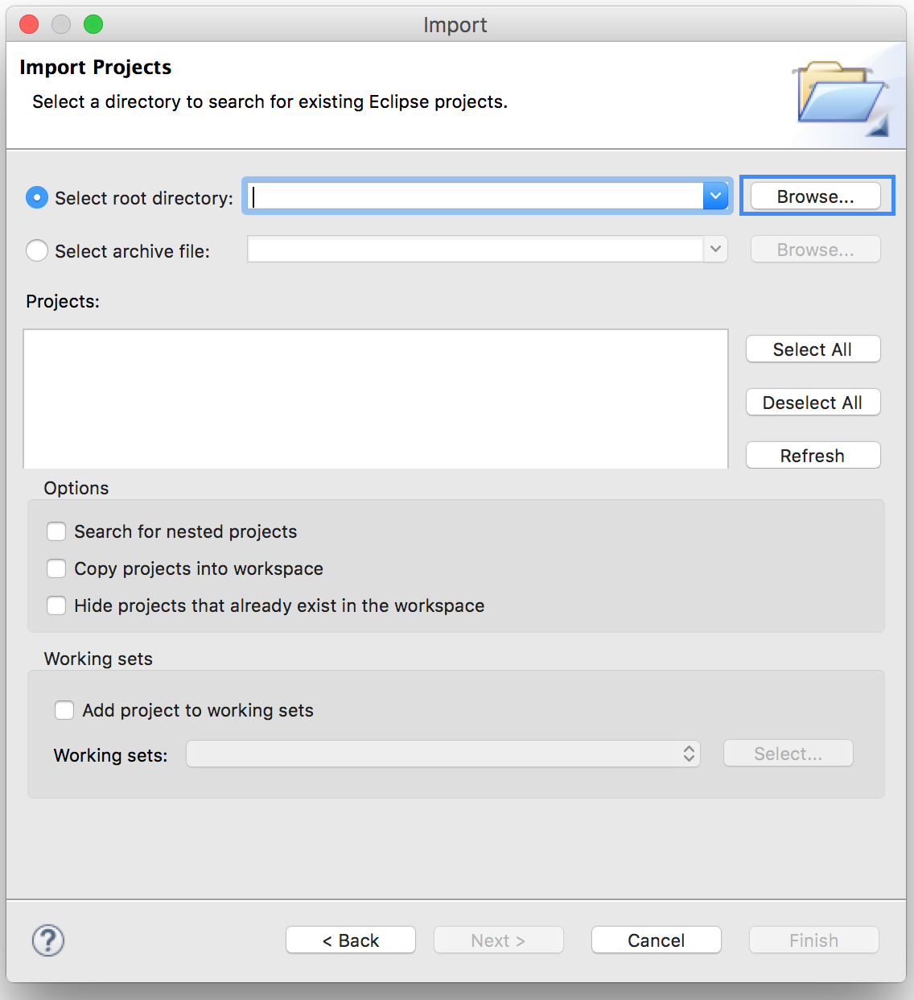
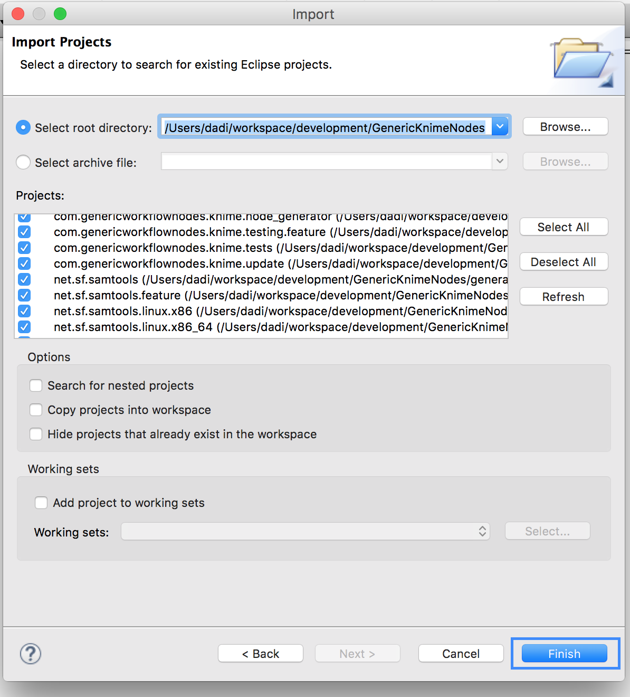
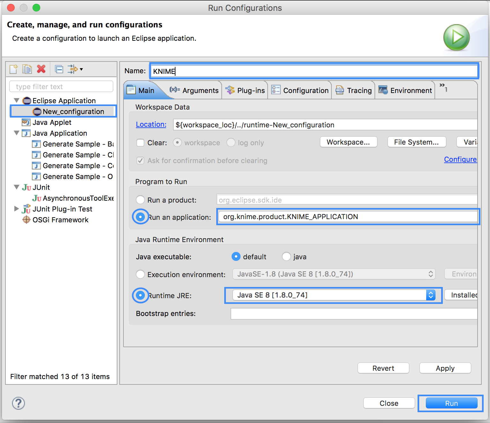

.. sidebar:: ToC

    .. contents::

.. _tutorial-workflows-generating-seqan-knime-nodes:

Generating SeqAn KNIME Nodes
============================

Learning Objective
  You will learn how to import applications written in SeqAn into the KNIME Eclipse plugin.
  After completing this tutorial, you will be able to use self-made applications in KNIME workflows.

Difficulty
  Very basic

Duration
  1 h

Prerequisites
  Eclipse KNIME SDK
    You can download it from the `KNIME Download Site <http://www.knime.org/downloads/overview>`_ (at the end of the page). We will use Version 3.1.
  git
    For downloading the latest GenericKnimeNodes.
  Apache Ant
   The Generic KNIME Plugins project uses `Apache Ant <http://ant.apache.org/>`_ as the build system.
   On Linux and Mac, you should be able to install it through your package manager.
   For Windows, see the `Apache Ant Downloads <http://ant.apache.org/bindownload.cgi>`_.

.. important::

   The steps described here are necessary if you want to develop and test new SeqAn apps in KNIME.
   If you only want to use existing SeqAn apps in KNIME follow :ref:`tutorial-workflows-use-seqan-nodes-in-knime`.

We will generate a simple SeqAn KNIME node from a SeqAn app that reads a fastq file from disk and just writes it back.
We start by installing the necessary software.
Afterwards, we explain which steps are required in order to prepare a SeqAn app to be used in KNIME, and finally, we show how to import the app into KNIME.
The following section provides some more information on the plugin structure and where the necessary information is stored.
Note that this tutorial is mainly written for MacOS and Linux users, but Windows users should also be able to follow through.

Preparation: Downloading GenericKnimeNodes
-------------------------------------------

We will work in a new directory *knime_node* (we will assume that the directory is directly in your *$HOME* for the rest of the tutorial).

.. code-block:: console

   knime_node # git clone git://github.com/genericworkflownodes/GenericKnimeNodes.git

Preparation: Installing KNIME File Handling
-------------------------------------------
We need to install support for file handling nodes in KNIME. In order to do that 
- Launch your Eclipse-KNIME-SDK
  
  .. tip::

    **Launching Eclipse-KNIME-SDK**

    - If you are on a linux system you should browse to your knime_eclipse_3.1 installation double click on ``eclipse`` executable.
    - If you are using MacOS X then you can launch the KNIME SDK 3.1 as you would launch any other application.

- Open the window for installing Eclipse plugins; in the program's main menu: ``Help > Install New Software...``.

- On the install window enter ``http://www.knime.org/update/3.1`` into the ``Work with:`` field, enter ``file`` into the search box, and finally select ``KNIME File Handling Nodes`` in the list.

- Then, click ``Next`` and follow through with the installation of the plugin. When done, Eclipse must be restarted.; in the program's main menu: ``Help > Install New Software...``.

Generating KNIME Nodes for SeqAn Apps
-------------------------------------

You can generate a workflow plugin directory for the SeqAn apps using the ``prepare_workflow_plugin`` target.

In order for your application to turn into a KNIME node, you have to add the line:

.. code-block:: cmake

    set (SEQAN_CTD_EXECUTABLES ${SEQAN_CTD_EXECUTABLES} <my_app> CACHE INTERNAL "")

to the end of the *CMakeList.txt* file of your application.

The following example will demonstrate the creation of a SeqAn app and its registration as a KNIME node.

.. code-block:: console

   ~ # git clone http://github.com/seqan/seqan seqan-src
   ~ # cd seqan-src
   ~ # ./util/bin/skel.py app knime_node .

Now open the file *seqan-src/apps/knime_node/knime_node.cpp* and replace its content with the one found in *seqan-src/demos/knime_node.cpp*.
The code implements the reading of a read file and its storage somewhere on the disk.

In order to register the app ``knime_node``, you simply add the line

.. code-block:: cmake

    set (SEQAN_CTD_EXECUTABLES ${SEQAN_CTD_EXECUTABLES} knime_node CACHE INTERNAL "")

to *seqan-trunk/apps/knime_node/CMakeList.txt*.

Then, you can generate the Knime Nodes/Eclipse plugin.
First, change to the directory GenericKnimeNodes that we cloned using git earlier.
We then execute ant and pass the variables ``knime.sdk`` with the path to the KNIME SDK that you downloaded earlier and ``plugin.dir`` with the path of our plugin directory.

.. code-block:: console

   ~ # mkdir -p seqan-build/release
   ~ # seqan-build/release
   ~ # cd seqan-build/release
   release # cmake ../../seqan-src
   release # make prepare_workflow_plugin
   release # cd ~/knime_node/GenericKnimeNodes
   GenericKnimeNodes # ant -Dknime.sdk=${HOME}/eclipse_knime_2.8.0 \
                         -Dplugin.dir=${HOME}/seqan-build/release/workflow_plugin_dir

The generated files are within the *generated_plugin* directory of the directory *GenericKnimeNodes*.

If you ran into problems, you may copy the file `knime_node_app.zip <https://github.com/seqan/knime_node_template/archive/master.zip>`_, which contains the ``knime_node`` app and the adjusted *CMakeList.txt* file.
Unpack this file in the ``apps`` directory.
You still have to call *ant* though.

Importing the Generated Projects into Eclipse
---------------------------------------------

In the main menu, go to ``File > Import...``.
In the ``Import`` window, select ``General > Existing Project Into Workspace``.

In the next dialog, click ``Browse...`` next to ``Select root directory``.

Then, select the directory of your "GenericWorkflowNodes" checkout.
The final dialog should then look as follows.

Clicking finish will import (1) the GKN classes themselves and (2) your generated plugin's classes.

Now, the packages of the GKN classes and your plugin show up in the left ``Package Explorer`` pane of Eclipse.

.. figure:: gkn-import-done.png
   :align: center
   :width: 75%

.. tip::

    Synchronizing ``ant`` build result with Eclipse.

    Since the code generation happens outside of Eclipse, there are often problems caused by Eclipse not recognizing updates in generated ''.java'' files.
    After each call to ``ant``, you should clean all built files in all projects by selecting the menu entries ``Project > Clean...``, selecting ``Clean all projects``, and then clicking ``OK``.

    Then, select all projects in the ``Package Explorer``, right-click and select ``Refresh``.

.. tip::

    You might get a warning with in one of the KNIME files. In order to remove it you need to download the KNIME's test environment, but you can just ignore the error in our case.

Launching Eclipse with our Nodes
--------------------------------

Finally, we have to launch KNIME with our plugin.
We have to create a run configuration for this.
Select ``Run > Run Configurations...``.

In the ``Run Configurations`` window, select ``Eclipse Application`` on the left, then click the small ``New launch configuration`` icon on the top left (both marked in the following screenshot).
Now, set the ``Name`` field to "KNIME", select ``Run an application`` and select ``org.knime.product.KNIME_APPLICATION`` in the drop down menu.
Finally, click ``Run``.

Your tool will show up in the tool selector in ``Community Nodes``.

.. important::

   Sometimes KNIME complains about the Java version you are using.
   In that case, you can use Java 1.6. as shown in :ref:`how-to-recipes-choose-the-jre-version`.

.. important::

   If you are running a MacOS you might need to add *-Xms40m -Xmx512M -XX:MaxPermSize=256m -Xdock:icon=../Resources/Eclipse.icns -XstartOnFirstThread -Dorg.eclipse.swt.internal.carbon.smallFonts -server* to the ``VM argument`` box of your ``Run Configuration``.

You should now be able to use the created node in a KNIME workflow. 

If you would like to learn more about the structure of the plugin and where the crucial information is stored you can read the :ref:`tutorial-workflows-generating-knime-nodes-overview` section of the tutorial Generating KNIME Nodes.
