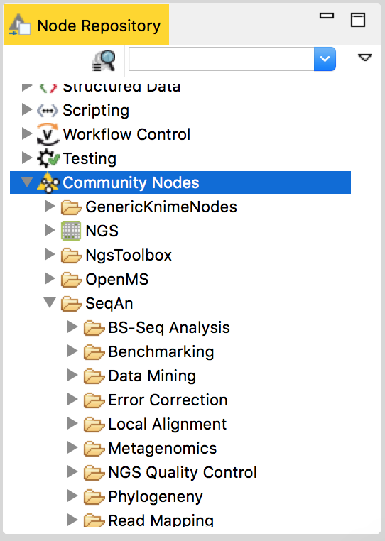

.. sidebar:: ToC

    .. contents::

.. _tutorial-workflows-use-seqan-nodes-in-knime :

Creating Workflows with SeqAn Nodes in KNIME
============================================

`KNIME <http://www.knime.org>`_ is a well-established data analysis framework which supports the generation of workflows for data analysis.
In this tutorial, we describe how to use SeqAn applications in KNIME.

Install SeqAn in KNIME
----------------------

The Installation of the SeqAn NGS Toolbox in KNIME is very easy.
Download the latest KNIME release from the KNIME website `download <https://www.knime.org/downloads/overview>`_ page. You might be asked for registration but that is optional.
In the KNIME window, click on the menu ``Help > Install new Software``.

.. figure:: install-knime-1.png
   :align: center
   :width: 75%

In the opening dialog choose ``Add...``.

.. figure:: install-knime-2.png

In the opening dialog fill-in the following Information:

``Name``
  ``Trusted Community Contributions (3.1)``
``Location``
  ``http://update.knime.org/community-contributions/trusted/3.1``

If you are, by chance, still using an  older KNIME version and you do not want to update to the latest version you can find the corresponding update site location at the `community-contributions <https://tech.knime.org/community>`_ page of the KNIME website.

After pressing OK, KNIME will show you all the contents of the added Update Site, containing also the SeqAn nodes.

Select the SeqAn NGS Toolbox and click Next.
Follow the instructions.
After the installation is done, KNIME will prompt you to restart. Click OK and KNIME will restart with the newly installed SeqAn nodes available under the ``Community Nodes`` category. The installation also includes GenericKnimeNodes which are very useful for using SeqAn nodes in KNIME. This includes file input/output nodes.

Now you can drag and drop the installed SeqAn nodes to make your desired workflow together with the other KNIME nodes. 

A variant calling workflow (An example)
-----------------------------------------
In this example we will use a read mapper (yara) to map short reads against a reference genome. Then we will use SnpStore to call variants and store the variants as ``vcf`` and ``gff`` files. We will also do error correction of Illumina reads before we map them to the reference. In this way we can identify SNP's more clearly.

1. Download this zipped :download:`example data<example_data.zip>` and extract it somewhere appropriate. It contains three files. The file ``NC_008253_1K.fa`` is a small toy reference genome. Files ``sim_reads_l.fq`` and ``sim_reads_r.fq`` are short sequencing paired reads. For each read in one file its mate is contained in the other file. 

2. On the left side of the opened KNIME window under KNIME Explorer right click on ``LOCAL (Local Workspace)`` and chose the menu item ``New KNIME Workflow``. You will be presented with a dialog to enter the name and location of the workflow to be created. Give your workflow an appropriate name, perhaps something like 'Variant Calling Workflow', and click finish.

3. Drag and drop the nodes shown in the following picture from the ``Node Repository`` panel on the left bottom side of the KNIME window and arrange/connect them as they are shown in the picture bellow. You can also rename the node from nodeXX to a meaningful name like ``INPUT: Reference``. The node name is the text below the node. The Node type, which is displayed above the node, cannot be edited.

4. Now it's time to configure our nodes. To configure a node just double-click on it. A configuration dialog will pop up. Let us configure our nodes on our workflow one by one.

|  **a. InputFile Node** (``INPUT: Reference``): 
|      - browse and select the file ``NC_008253_1K.fa`` under Selected file field.
|      - click OK.
|  **b. InputFiles Node** (``READS L&R``):
|      - click ``add`` and select both ``sim_reads_l.fq`` and ``sim_reads_r.fq`` files.
|      - click OK.
|  **c. FionaIllumina Node** (``Error Correction``):
|      - set genome-length to 1000
|  **d. SnpStore Node** (``Variant Calling``):
|      - set only-successful-candidates to true.

5. Run the workflow. Right-click on the File Viewer (``OUTPUT: SNP's``) node at the right end of our configured workflow and choose Execute from the menu. As the preceding nodes execute they change their indicator color from yellow to green. When the last node finishes executing do the same to execute the File Viewer (``OUTPUT: indels``)

6. See the results. You can take a look at the results (SNPs/IndDels) by  Right-clicking on the corresponding File Viewer node and choose ``View: (data view)`` from the menu.

Congratulations you have just created a working KNIME workflow using SeqAn nodes!

Use existing workflows and contribute new ones
----------------------------------------------
The git repository https://github.com/seqan/knime_seqan_workflows has several workflows ready to run. Each workflow is contained in a directory. The directory for a workflow contains an example data and a README file in it. This makes it easier to download and execute the workflow. You can either clone the repository or download individual workflows and execute them with the data provided or with your own data.

With the steps described above you will be able to set up your own workflows in KNIME.
If you want to contribute a workflow to the SeqAn community  you are encouraged to do so.
You can do it as follows: 

- Simply clone the workflow git repository into your own github repository and add a new folder ``WORKFLOWNAME_workflow``.
- In KNIME export your workflow without the data files as a ``.zip`` file into that folder.
- Provide a README, a screenshot and some example input data as well.

To get a more clear idea just take a look at the existing workflow folders.

After everything is ready, add...commit and push the new folder into your github repository and make a github pull request to the original workflow repository (https://github.com/seqan/knime\_seqan\_workflows) and - voila - it will be shared with the community.
